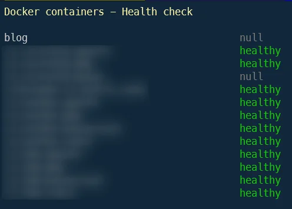

<TLDR>
This article shares a Bash script that loops over all Docker containers (`docker container list --all`) and reports each one's health status via `docker inspect`'s `State.Health` field, giving a quick overview of which containers are healthy, unhealthy, or have no healthcheck configured (`null`).
</TLDR>

When you've a few runnings containers on your machine, you can quickly retrieve the health information using `docker ps` and its `State.Health` response.

In this article, we'll look at how to create a bash script that can be used as a basis for other needs.

<!-- truncate -->

## The one-glance overview

Here is what I get on my machine, in one command:

I've a few containers running, a lot are `healthy` meaning that they're running and without any issue, I've two containers in a `null` state i.e. they are sleeping and none are stopped due to an error.

That's the whole point: one screen, and you know which container needs your attention.

## The script that produces it

Please create somewhere on your disk, in a Linux console, a script f.i. called `health.sh` with this content:

<Snippet filename="health.sh" source="./files/health.sh" />

Make sure to make the script executable: `chmod +x health.sh`, then run it with `./health.sh`.

<AlertBox variant="info" title="Get the list of all containers">
`docker container list --all --format "{{.Names}}"` return the list of all containers and only echo the column `Name` on the console.

</AlertBox>

## Conclusion

A few lines of Bash, and the question *"is everything still fine on this machine?"* gets an answer in one look instead of a `docker inspect` per container. Don't hesitate to fine-tune the script to fit your needs.

This script gives you a snapshot, on demand. If you'd rather be **notified** when a service goes down, have a look at <Link to="/blog/docker_uptime_kuma">Self-hosted monitoring tool</Link>. And when a container is up but still unreachable from another one, <Link to="/blog/docker-networking-troubleshooting">Troubleshooting for Docker containers - Accessing the other one</Link> walks through the diagnosis, layer by layer.
