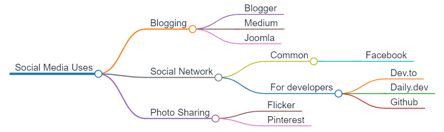

As a markdown lover, I always enjoy finding a little tool that lets me write a text and have it converted into another format.

For this article, we're going to write, in plain text, a mind map, which means that our text will be converted into a mind map image.

<!-- truncate -->

The tool we'll use is called `Markmap` and can be used online: see the demo and the editor on [https://markmap.js.org/repl](https://markmap.js.org/repl)

Below an example, just copy/paste it into the [editor](https://markmap.js.org/repl) to see it in action.

```markdown
# Social Media Uses

## Blogging

- Blogger
- Medium
- Joomla

## Social Network

### Common

- Facebook

### For developers

- Dev.to
- Daily.dev
- Github


## Photo Sharing

- Flicker
- Pinterest
```

## Let's get an image directly

For the demo, please start a Linux shell and run `mkdir -p /tmp/markmap && cd $_` to create a folder called `markmap` in your Linux temporary folder and jump in it.

Please create a new file called `mindmap.md` with this markdown content about *Social Media Uses* provided just here above.

```bash
❯ ls -alh

total 920K
drwxr-xr-x  2 christophe christophe 4.0K Dec 16 14:05 .
drwxrwxrwt 19 christophe christophe 908K Dec 16 14:05 ..
-rw-r--r--  1 christophe christophe  198 Dec 16 14:05 mindmap.md
```

And now run `docker run -it --rm -v ${PWD}:/project -w /project -u $(id -u):$(id -g) leopoul/markmap:1.0.0 mindmap.md --output mindmap.html` to convert the markdown document into an HTML page. The image is automatically created as a SVG content in the `.html` file.

```bash
❯ ls -alh

total 920K
drwxr-xr-x  2 christophe christophe 4.0K Dec 16 14:05 .
drwxrwxrwt 19 christophe christophe 908K Dec 16 14:05 ..
-rw-r--r--  1 christophe christophe 2.2K Dec 16 14:10 mindmap.html
-rw-r--r--  1 christophe christophe  198 Dec 16 14:05 mindmap.md
```

:::tip WSL User
If you're running under Windows and WSL2, to open the `mindmap.html` file, one way is to run `explorer.exe .` in your Linux console (see [this article](/blog/wsl-windows-explorer) to learn more). Windows Explorer will be started then just double-click on the `mindmap.html` file.
:::

The generated HTML will display your mind map using the full-screen width and you can open/close some branches, use zoom features, ... Really cool.

## Go further

You can add some configuration item in your markdown document, see [https://markmap.js.org/docs/json-options](https://markmap.js.org/docs/json-options) to get a list of all supported JSON options.
