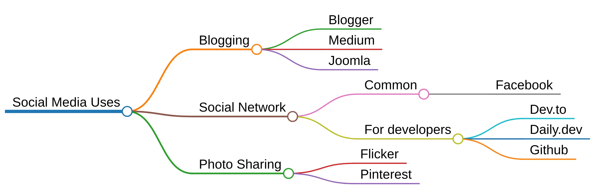

<TLDR>
This article shows how to turn a plain Markdown outline (headings and bullet lists) into an interactive, zoomable SVG mind map using Markmap, either via its online editor or with zero install through the `leopoul/markmap` Docker image (`docker run ... mindmap.md --output mindmap.html`).
</TLDR>

As a markdown lover, I always enjoy finding a little tool that lets me write a text and have it converted into another format.

For this article, we're going to write, in plain text, a mind map, which means that our text will be converted into a mind map image.

<!-- truncate -->

## What comes out

Here is the mind map you'll get at the end of this article:



It's an SVG in an HTML page: branches can be folded and unfolded, and you can zoom in and out. And here is the single command that produced it, from a plain Markdown file:

```bash
docker run -it --rm -v ${PWD}:/project -w /project -u $(id -u):$(id -g) \
  leopoul/markmap:1.0.0 mindmap.md --output mindmap.html
```

Nothing installed on the machine; the tool we're using is called `Markmap` and it stays in its container.

## And here is the text that produced it

<Snippet filename="mindmap.md">

```markdown
# Social Media Uses

## Blogging

- Blogger
- Medium
- Joomla

## Social Network

### Common

- Facebook

### For developers

- Dev.to
- Daily.dev
- Github

## Photo Sharing

- Flicker
- Pinterest

```

</Snippet>

Headings become branches, bullet lists become leaves. That's the entire syntax; you already know it.

## Doing it on your machine

For the demo, please start a Linux shell and run `mkdir -p /tmp/markmap && cd $_` to create a folder called `markmap` in your Linux temporary folder and jump in it.

Please create a new file called `mindmap.md` with the markdown content about *Social Media Uses* provided just here above. You should have this:

<Terminal typewriter source="./files/terminal-2.txt" />

And now run the `docker run` command shown at the top of this article to convert the markdown document into an HTML page. The image is automatically created as a SVG content in the `.html` file:

<Terminal typewriter source="./files/terminal-1.txt" />

Open `mindmap.html` in your browser and you'll get the map displayed using the full-screen width.

<AlertBox variant="info" title="WSL User">
If you're running under Windows and WSL2, to open the `mindmap.html` file, one way is to run `explorer.exe .` in your Linux console (see <Link to="/blog/wsl-windows-explorer">this article</Link> to learn more). Windows Explorer will be started then just double-click on the `mindmap.html` file.

</AlertBox>

## Without Docker, in your browser

`Markmap` can also be used online: see the demo and the editor on [https://markmap.js.org/repl](https://markmap.js.org/repl). Copy/paste the markdown above into the [editor](https://markmap.js.org/repl) to see it in action, without creating a single file.

## Go further

You can add some configuration items in your markdown document, see [https://markmap.js.org/docs/json-options](https://markmap.js.org/docs/json-options) to get a list of all supported JSON options.

## Conclusion

A mind map you can version, diff and edit in any text editor, produced by one `docker run` — and nothing to uninstall afterwards.

Two follow-ups: <Link to="/blog/vscode-docker-markmap">Getting a more attractive mindmap with Markmap and Quarto</Link>, which polishes the rendering, and <Link to="/blog/json-crack">Rendering a JSON file as a mind map</Link> when the source is a JSON file rather than Markdown.
