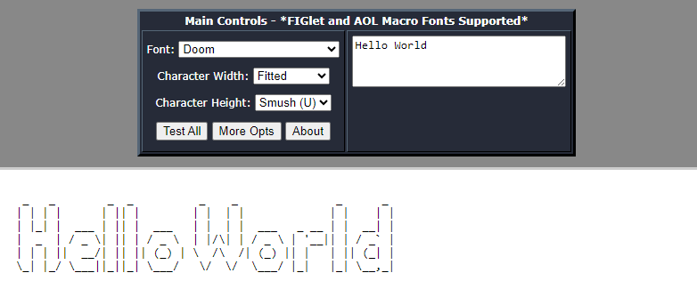
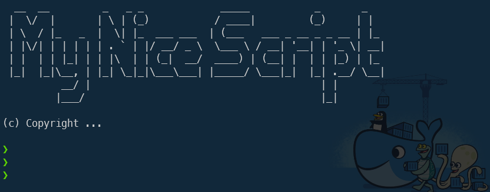

I write a lot of Bash scripts, and I like to have a similar approach for each one. One of the things I always do is to include a good old-fashioned *ASCII Art* banner, perhaps for the geek factor, but mostly to make a bigger visual impact.

I use [https://patorjk.com/software/taag](https://patorjk.com/software/taag) to create my banners, so let's take a closer look.



<!-- truncate -->

On my hand, I'm implementing the banner like this:

<Snippets filename="script.sh">

```bash
#!/usr/bin/env bash

function __main() {

    clear

    # http://patorjk.com/software/taag/#p=display&f=Big&t=My%20Nice%20Script
    cat <<\EOF
  __  __         _   _ _             _____           _       _
 |  \/  |       | \ | (_)           / ____|         (_)     | |
 | \  / |_   _  |  \| |_  ___ ___  | (___   ___ _ __ _ _ __ | |_
 | |\/| | | | | | . ` | |/ __/ _ \  \___ \ / __| '__| | '_ \| __|
 | |  | | |_| | | |\  | | (_|  __/  ____) | (__| |  | | |_) | |_
 |_|  |_|\__, | |_| \_|_|\___\___| |_____/ \___|_|  |_| .__/ \__|
          __/ |                                       | |
         |___/                                        |_|

EOF
    printf "%s\n\n" "(c) Copyright ..."

    # Program the functions of your script here,
    # such as calling your functions

    return 0
}

__main $*
```

</Snippets>

And this is how it'll look like in my bash terminal:


