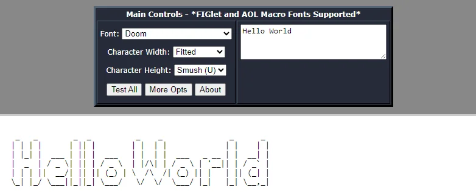
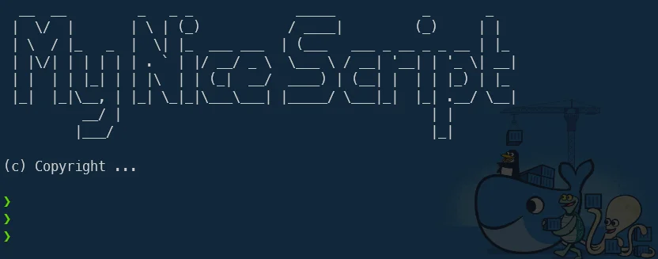

<TLDR>
This short article shows how to add an ASCII-art banner to Bash scripts for a bit of visual flair, generated with the free patorjk.com/software/taag tool and echoed at the top of the script.
</TLDR>

I write a lot of Bash scripts, and I like to have a similar approach for each one: a banner, <Link to="/blog/bash-logging">a logging function</Link>, <Link to="/blog/linux-generate-documentation-from-bash-scripts">doc blocks above each function</Link>. One of the things I always do is to include a good old-fashioned *ASCII Art* banner, perhaps for the geek factor, but mostly to make a bigger visual impact.

I use [https://patorjk.com/software/taag](https://patorjk.com/software/taag) to create my banners, so let's take a closer look. *The same idea, applied to a website instead of a console: <Link to="/blog/docusaurus-ascii-art">Inject ASCII Art in any HTML pages rendered by Docusaurus</Link>.*

<!-- truncate -->

For my part, I'm implementing the banner like this:

<Snippet filename="script.sh" source="./files/script.sh" />

And this is how it'll look in my bash terminal:

