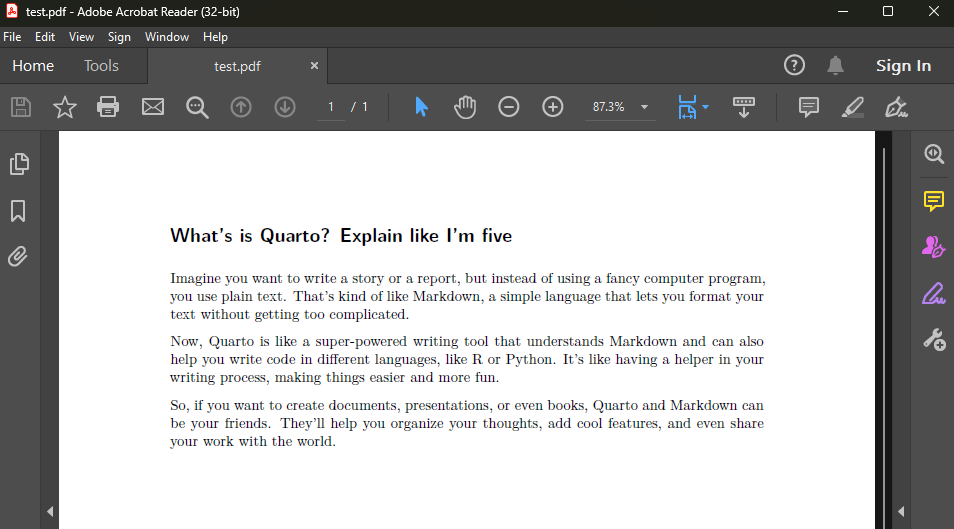
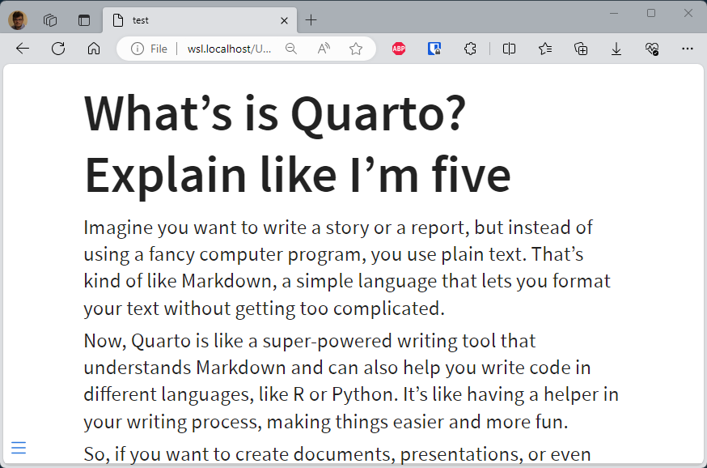
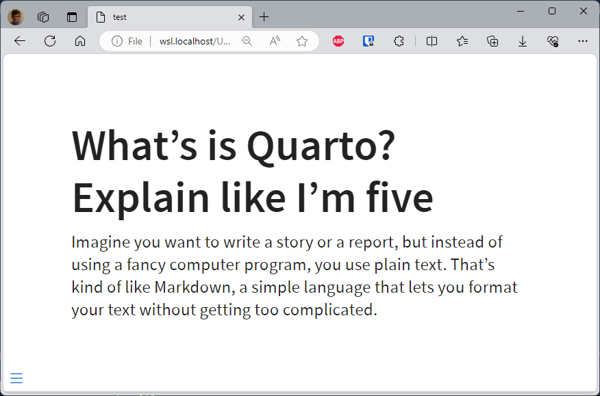
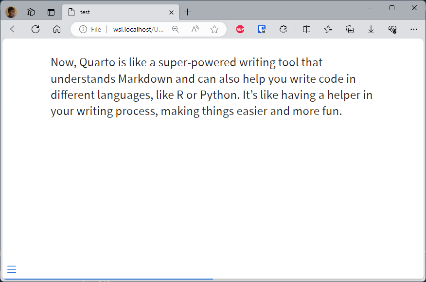
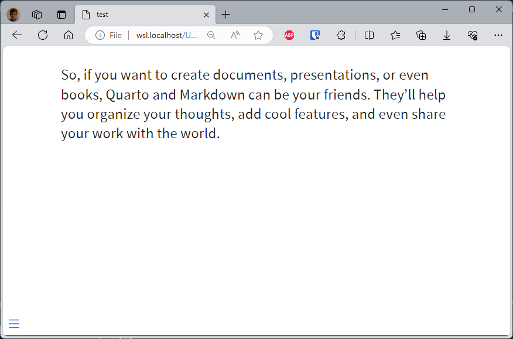

<!-- cspell:ignore rsvg,ggplot2,gdebi,renv,tlmgr,fvextra,footnotebackref,pagecolor,sourcesanspro,sourcecodepro,Aoption -->


<UpdateAt
  title="Recent Changes"
  updates={[
    { date: "2024-11-19", content: "review Dockerfile, use Quarto 1.6.36." },
  ]}
/>

[Quarto](https://quarto.org/) is a tool for producing PDF, Word document, HTML web pages, ePub files, slideshows and many, many more output based on a Markdown file.

Using Quarto, you can render any markdown content to a new PDF f.i.

Quarto supports a very large number of features, to which are added extensions from its community, making it a really practical tool for anyone wishing to produce documentation.

Personally, I haven't used a Word-type word processor for several years; nor have I used PowerPoint since, I don't even know when the last time was.

And yet, I produce a great deal of documentation and slideshows. I write everything in markdown and generate pdf or slideshows from the same content.

Until recently, I'd been using [pandoc](https://pandoc.org/) but, having taken the time to look around Quarto, it's a hell of a lot more powerful.

<!-- truncate -->

Like always on this blog, you will not install Quarto the old-fashioned way. Instead, you'll create our own Docker image.

## Let's play

As usual, you will now create a temporary folder for your experiments. Please start a Linux shell and run `mkdir -p /tmp/docker-quarto && cd $_`.

### Create your own Docker image

:::info Optional step
If you prefer to use an existing prebuilt image; jump to the next chapter.
:::

Create a new file called `Dockerfile` (there is no extension) with this content:

<Snippet filename="Dockerfile">

```dockerfile
# Version number of Quarto to download and use
# See https://github.com/quarto-dev/quarto-cli/pkgs/container/quarto for existing versions
ARG QUARTO_VERSION=1.6.36

ARG OS_USERNAME=quarto
ARG UID=1000
ARG GID=1000

FROM ghcr.io/quarto-dev/quarto:${QUARTO_VERSION}

# librsvg2-bin is to allow SVG conversion when rendering a PDF file
# (will install the rsvg-view binary)
RUN --mount=type=cache,target=/var/cache/apt,rw \
    set -e -x && \
    apt-get update -y \
    && apt-get install -y --no-install-recommends \
        ca-certificates \
        git \
        pandoc \
        pandoc-citeproc \
        curl \
        gdebi-core \
        librsvg2-bin \
    && apt-get clean \
    && rm -rf /var/lib/apt/lists/*

USER root

# The input folder will be the one where we'll put our files before the conversion.
# We should do this as root since it's a folder under /
RUN set -e -x && \
    mkdir -p /input

# Should be done for the user; won't work if done for root
# (quarto will say that "tinytex is not installed")
ARG OS_USERNAME
ARG UID
ARG GID

RUN set -e -x && \
    groupadd -g ${GID} -o "${OS_USERNAME}" && \
    useradd -l -m -u ${UID} -g ${GID} -o -s /bin/bash "${OS_USERNAME}"

USER "${OS_USERNAME}"

WORKDIR /

# Install tools like tinytex to allow conversion to PDF
RUN set -e -x && \
    quarto install tool tinytex --update-path && \
    ~/.TinyTeX/bin/x86_64-linux/tlmgr update --self --all && \
    ~/.TinyTeX/bin/x86_64-linux/fmtutil-sys --all && \
    # See https://github.com/rstudio/tinytex/issues/426 for explanation
    # Run tlmgr install for a few tinyText packages (needed for PDF conversion)
    ~/.TinyTeX/bin/x86_64-linux/tlmgr install fvextra footnotebackref pagecolor sourcesanspro sourcecodepro titling
```

</Snippet>

This done, please run `docker build -t cavo789/quarto .` and after something like three minutes the first time, you'll get your own Docker image:

<Terminal wrap={false} >
$ docker build -t cavo789/quarto .
[+] Building 183.3s (9/9) FINISHED                                                docker:default
 => [internal] load build definition from Dockerfile                                        0.1s
 => => transferring dockerfile: 1.80kB                                                      0.0s
 => [internal] load metadata for ghcr.io/quarto-dev/quarto:1.6.36                           0.7s
 => [internal] load .dockerignore                                                           0.0s
 => => transferring context: 2B                                                             0.0s
 => [stage-0 1/6] FROM ghcr.io/quarto-dev/quarto:1.6.36@sha256:7c800f23602e532de8d2e35de8  19.6s
 => => resolve ghcr.io/quarto-dev/quarto:1.6.36@sha256:7c800f23602e532de8d2e35de838e9f5331  0.0s
 => => sha256:7c800f23602e532de8d2e35de838e9f53310af381daa34cf3d733c05fd7dec72 955B / 955B  0.0s
 => => sha256:a9220a0c1eb7e69d971f705b026870f03e511a0c6a95ae0d1140d45089c2 1.73kB / 1.73kB  0.0s
 => => sha256:7478e0ac0f23f94b2f27848fbcdf804a670fbf8d4bab26df842d40a10c 30.44MB / 30.44MB  3.2s
 => => sha256:14a397168681603ca2ef7ec883ab375f79cc39ed6abfc602de3d16d 126.00MB / 126.00MB  13.0s
 => => sha256:682f5bc1f33ef91c217708dbd0f9c287f896d05632b47cdeb1ced02 130.07MB / 130.07MB  16.1s
 => => extracting sha256:7478e0ac0f23f94b2f27848fbcdf804a670fbf8d4bab26df842d40a10cd33059   1.8s
 => => extracting sha256:14a397168681603ca2ef7ec883ab375f79cc39ed6abfc602de3d16dc40197b37   0.7s
 => => extracting sha256:682f5bc1f33ef91c217708dbd0f9c287f896d05632b47cdeb1ced02166e3aa8d   3.2s
 => [stage-0 2/6] RUN --mount=type=cache,target=/var/cache/apt,rw     set -e -x &&     ap  79.5s
 => [stage-0 3/6] RUN set -e -x &&     mkdir -p /input                                      0.4s
 => [stage-0 4/6] RUN set -e -x &&     groupadd -g 1000 -o "quarto" &&     useradd -l -m -  0.6s
 => [stage-0 5/6] RUN set -e -x &&     quarto install tool tinytex --update-path &&     ~  80.4s
 => exporting to image                                                                      1.9s
 => => exporting layers                                                                     1.9s
 => => writing image sha256:f7222fdd5856beb8fb209a609fc9271a0f8f3a586449bc5d90a6b338e54453  0.0s
 => => naming to docker.io/cavo789/quarto                                                   0.0s
</Terminal>

:::tip Choose your own name
The previous instruction `docker build -t cavo789/quarto .` has created an image called `cavo789/quarto`. You can for sure choose a different name without any impact on the image.
:::

You can quickly check the size of your image; quite huge but except you're very low in memory / disk space; this is really not a big deal.

<Terminal>
$ docker image list | grep quarto
cavo789/quarto  latest  fe1d20bd71a6  1 minute ago  1.55GB
</Terminal>

### Use an existing image

There are a number of images on the Internet to suit your needs. You'll find them at [https://gitlab.com/quarto-forge/docker](https://gitlab.com/quarto-forge/docker). The so-called `Tier 0` image is suitable for generating html / revealjs output.

If you use the `Tier 0` image, here is the command to use: `docker run -it --rm -v .:/public -w /public -u $(id -u):$(id -g) ghcr.io/quarto-dev/quarto:latest quarto render xxx`

### Using Quarto and generate a PDF file

Create a new `test.md` file in your `/tmp/docker-quarto` folder with this content:

<Snippet filename="/tmp/docker-quarto/test.md">

```markdown
# What's is Quarto? Explain like I'm five

Imagine you want to write a story or a report, but instead of using a fancy computer program, you use plain text. That's kind of like Markdown, a simple language that lets you format your text without getting too complicated.

Now, Quarto is like a super-powered writing tool that understands Markdown and can also help you write code in different languages, like R or Python. It's like having a helper in your writing process, making things easier and more fun.

So, if you want to create documents, presentations, or even books, Quarto and Markdown can be your friends. They'll help you organize your thoughts, add cool features, and even share your work with the world.
```

</Snippet>

Now, back to your Linux console and you'll convert that file to a pdf. **Please refers to the official documentation of [Quarto](https://quarto.org/) to get in-depth information about it.**

To convert to a PDF, the instruction to fire is `quarto render test.md --to pdf`. But since you're using Quarto from a Docker image, the instruction becomes `docker run -it --rm -v .:/input -w /input -u $(id -u):$(id -g) cavo789/quarto quarto render test.md --to pdf`.

:::tip Docker CLI reminder
As a reminder, the used Docker run command are (almost always the same):

* `-it` to start Docker interactively, this will allow the script running in the container to ask you for some prompts f.i.,
* `--rm` to ask Docker to kill and remove the container as soon as the script has been executed (otherwise you'll have a lot of exited but not removed Docker containers; you can check this by not using the `--rm` flag then running `docker container list` on the console),
* `-v .:/input` to share your current folder with a folder called `/input` in the Docker container,
* `-w /input` to tell Docker that the current directory, in the container, will be the `/app` folder,
* `-u $(id -u):$(id -g)` ask Docker to reuse our local credentials so when a file is updated/created in the container, the file will be owned by you,
* then `cavo789/quarto` which is the name of your Quarto Docker image, and, finally,
* `quarto render test.md --to pdf` i.e. the command line to start within the container.
:::

So, let's convert to PDF and run `docker run -it --rm -v .:/input -w /input -u $(id -u):$(id -g) cavo789/quarto quarto render test.md --to pdf` in your console.

<Terminal>
$ docker run -it --rm -v .:/input -w /input -u $(id -u):$(id -g) cavo789/quarto quarto render test.md --to pdf
pandoc
  to: latex
  output-file: test.tex
  standalone: true
  pdf-engine: xelatex
  variables:
    graphics: true
    tables: true
  default-image-extension: pdf

metadata
  documentclass: scrartcl
  classoption:
    - DIV=11
    - numbers=noendperiod
  papersize: letter
  header-includes:
    - \KOMAoption\{captions}\{tableheading}
  block-headings: true

Rendering PDF
running xelatex - 1
  This is XeTeX, Version 3.141592653-2.6-0.999996 (TeX Live 2024) (preloaded format=xelatex)
   restricted \write18 enabled.
  entering extended mode

running xelatex - 2
  This is XeTeX, Version 3.141592653-2.6-0.999996 (TeX Live 2024) (preloaded format=xelatex)
   restricted \write18 enabled.
  entering extended mode

Output created: test.pdf
</Terminal>



:::tip Hide non-essential information
Add the `--log-level warning` CLI argument to Quarto to ask him to show only warning (and error) messages. Non-essential output will be hidden and you'll keep a clean console. The new command to use is thus `docker run -it --rm -v .:/input -w /input -u $(id -u):$(id -g) cavo789/quarto quarto render test.md --to pdf --log-level warning`
:::

### Using Quarto and generate a HTML file

Simply modify the `--to` argument and replace `pdf` by `html` and run the command: `docker run -it --rm -v .:/input -w /input -u $(id -u):$(id -g) cavo789/quarto quarto render test.md --to html --log-level warning`

Now, you've a `test.html` file in your directory.

### Using Quarto and generate a revealjs slideshow

This time, the `--to` argument should be set to `revealjs`: `docker run -it --rm -v .:/input -w /input -u $(id -u):$(id -g) cavo789/quarto quarto render test.md --to revealjs --log-level warning`

Open the `test.html` file and you'll get this:



Ok, you've just one slide now. Reopen the `test.md` file and you'll insert *slide breaks*. This can be done using the `----` syntax:

<Snippet filename="/tmp/docker-quarto/test.md">

```markdown
# What's is Quarto? Explain like I'm five

Imagine you want to write a story or a report, but instead of using a fancy computer program, you use plain text. That's kind of like Markdown, a simple language that lets you format your text without getting too complicated.

----

Now, Quarto is like a super-powered writing tool that understands Markdown and can also help you write code in different languages, like R or Python. It's like having a helper in your writing process, making things easier and more fun.

----

So, if you want to create documents, presentations, or even books, Quarto and Markdown can be your friends. They'll help you organize your thoughts, add cool features, and even share your work with the world.
```

</Snippet>

Rerun `docker run -it --rm -v .:/input -w /input -u $(id -u):$(id -g) cavo789/quarto quarto render test.md --to revealjs --log-level warning` to generate the slideshow as a `test.html` file.

:::tip
Just run `docker run -d --name static-site -p 8080:80 -v .:/usr/local/apache2/htdocs/ httpd:alpine` then surf to `http://127.0.0.1:8080/test.html` to see your slideshow.
:::

Now your slideshow will have three slides (press <kbd>space</kbd> or arrow keys for navigation):







:::tip Just deploy your slideshow online
The nice thing now is that your slideshow is ready to be deployed on your remote server. Copy the html file and the associated folder (in our use case here, file `test.html` and folder `test_files`) to your FTP server f.i. and your website can be publicly accessed. Nice, isn't it?
:::
