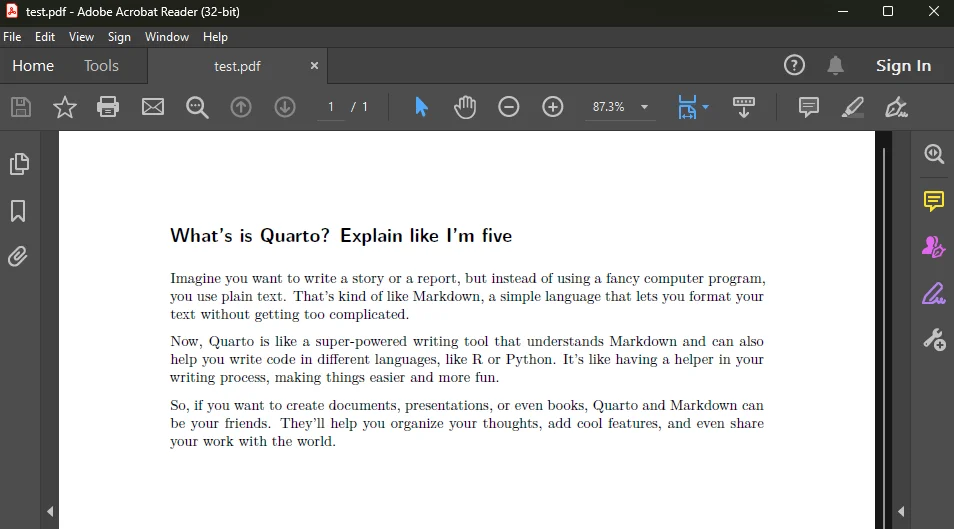
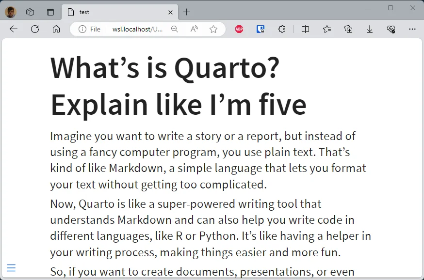
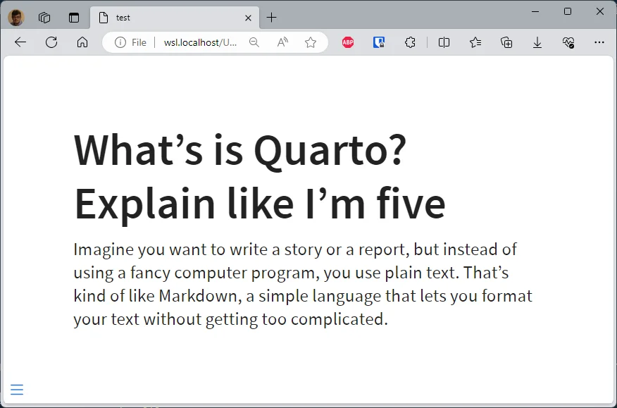
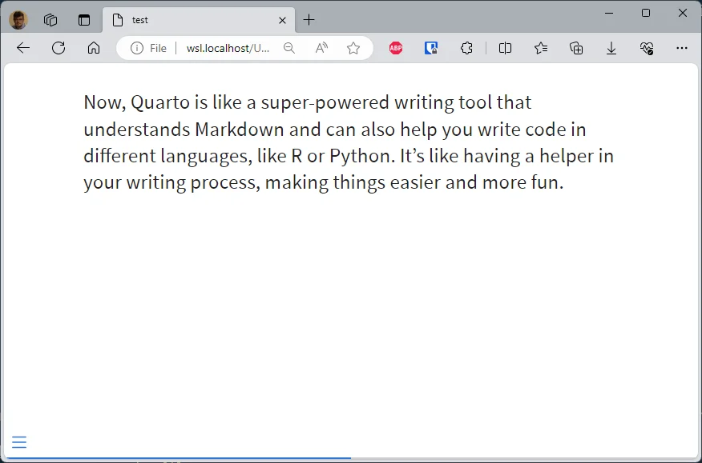
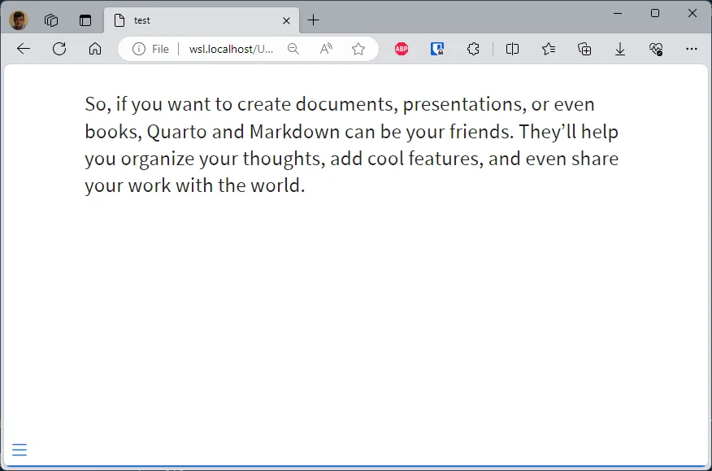

<!-- cspell:ignore rsvg,ggplot2,gdebi,renv,tlmgr,fvextra,footnotebackref,pagecolor,sourcesanspro,sourcecodepro,Aoption -->


[Quarto](https://quarto.org/) is a tool for producing PDF, Word document, HTML web pages, ePub files, slideshows and many, many more outputs based on a Markdown file.

Using Quarto, you can render any markdown content to a new PDF f.i.

Quarto supports a very large number of features, to which are added extensions from its community, making it a really practical tool for anyone wishing to produce documentation.

Personally, I haven't used a Word-type word processor for several years; nor have I used PowerPoint since, I don't even know when the last time was.

And yet, I produce a great deal of documentation and slideshows. I write everything in Markdown and generate PDF or slideshows from the same content.

Until recently, I'd been using [pandoc](https://pandoc.org/) but, having taken the time to look around Quarto, it's a hell of a lot more powerful.

<!-- truncate -->

Like always on this blog, you will not install Quarto the old-fashioned way. Instead, you'll create our own Docker image.

## Let's play

As usual, you will now create a temporary folder for your experiments. Please start a Linux shell and run `mkdir -p /tmp/docker-quarto && cd $_`.

### Create your own Docker image

<AlertBox variant="info" title="Optional step">
If you prefer to use an existing prebuilt image; jump to the next chapter.

</AlertBox>

Create a new file called `Dockerfile` (there is no extension) with this content:

<Snippet filename="Dockerfile" source="./files/Dockerfile" />

This done, please run `docker build -t cavo789/quarto .` and after something like three minutes the first time, you'll get your own Docker image:

<Terminal typewriter wrap={false}  source="./files/terminal-2.txt" />

<AlertBox variant="info" title="Choose your own name">
The previous instruction `docker build -t cavo789/quarto .` has created an image called `cavo789/quarto`. You can for sure choose a different name without any impact on the image.

</AlertBox>

You can quickly check the size of your image; quite huge but except you're very low in memory / disk space; this is really not a big deal.

<Terminal typewriter>
$ docker image list | grep quarto
cavo789/quarto  latest  fe1d20bd71a6  1 minute ago  1.55GB
</Terminal>

### Use an existing image

There are a number of images on the Internet to suit your needs. You'll find them at [https://gitlab.com/quarto-forge/docker](https://gitlab.com/quarto-forge/docker). The so-called `Tier 0` image is suitable for generating html / revealjs output.

If you use the `Tier 0` image, here is the command to use: `docker run -it --rm -v .:/public -w /public -u $(id -u):$(id -g) ghcr.io/quarto-dev/quarto:latest quarto render xxx`

### Using Quarto and generate a PDF file

Create a new `test.md` file in your `/tmp/docker-quarto` folder with this content:

<Snippet filename="/tmp/docker-quarto/test.md">

```markdown
# What is Quarto? Explain like I'm five

Imagine you want to write a story or a report, but instead of using a fancy computer program, you use plain text. That's kind of like Markdown, a simple language that lets you format your text without getting too complicated.

Now, Quarto is like a super-powered writing tool that understands Markdown and can also help you write code in different languages, like R or Python. It's like having a helper in your writing process, making things easier and more fun.

So, if you want to create documents, presentations, or even books, Quarto and Markdown can be your friends. They'll help you organize your thoughts, add cool features, and even share your work with the world.
```

</Snippet>

Now, back to your Linux console and you'll convert that file to a pdf. **Please refers to the official documentation of [Quarto](https://quarto.org/) to get in-depth information about it.**

To convert to a PDF, the instruction to fire is `quarto render test.md --to pdf`. But since you're using Quarto from a Docker image, the instruction becomes `docker run -it --rm -v .:/input -w /input -u $(id -u):$(id -g) cavo789/quarto quarto render test.md --to pdf`.

<AlertBox variant="info" title="Docker CLI reminder">
As a reminder, the used Docker run command are (almost always the same):

* `-it` to start Docker interactively, this will allow the script running in the container to ask you for some prompts f.i.,
* `--rm` to ask Docker to kill and remove the container as soon as the script has been executed (otherwise you'll have a lot of exited but not removed Docker containers; you can check this by not using the `--rm` flag then running `docker container list` on the console),
* `-v .:/input` to share your current folder with a folder called `/input` in the Docker container,
* `-w /input` to tell Docker that the current directory, in the container, will be the `/input` folder,
* `-u $(id -u):$(id -g)` ask Docker to reuse our local credentials so when a file is updated/created in the container, the file will be owned by you,
* then `cavo789/quarto` which is the name of your Quarto Docker image, and, finally,
* `quarto render test.md --to pdf` i.e. the command line to start within the container.

</AlertBox>

So, let's convert to PDF and run `docker run -it --rm -v .:/input -w /input -u $(id -u):$(id -g) cavo789/quarto quarto render test.md --to pdf` in your console.

<Terminal typewriter source="./files/terminal-1.txt" />



<AlertBox variant="info" title="Hide non-essential information">
Add the `--log-level warning` CLI argument to Quarto to ask him to show only warning (and error) messages. Non-essential output will be hidden and you'll keep a clean console. The new command to use is thus `docker run -it --rm -v .:/input -w /input -u $(id -u):$(id -g) cavo789/quarto quarto render test.md --to pdf --log-level warning`

</AlertBox>

### Using Quarto and generate a HTML file

Simply modify the `--to` argument and replace `pdf` by `html` and run the command: `docker run -it --rm -v .:/input -w /input -u $(id -u):$(id -g) cavo789/quarto quarto render test.md --to html --log-level warning`

Now, you've a `test.html` file in your directory.

### Using Quarto and generate a revealjs slideshow

This time, the `--to` argument should be set to `revealjs`: `docker run -it --rm -v .:/input -w /input -u $(id -u):$(id -g) cavo789/quarto quarto render test.md --to revealjs --log-level warning`

Open the `test.html` file and you'll get this:



Ok, you've just one slide now. Reopen the `test.md` file and you'll insert *slide breaks*. This can be done using the `----` syntax:

<Snippet filename="/tmp/docker-quarto/test.md">

```markdown
# What is Quarto? Explain like I'm five

Imagine you want to write a story or a report, but instead of using a fancy computer program, you use plain text. That's kind of like Markdown, a simple language that lets you format your text without getting too complicated.

----

Now, Quarto is like a super-powered writing tool that understands Markdown and can also help you write code in different languages, like R or Python. It's like having a helper in your writing process, making things easier and more fun.

----

So, if you want to create documents, presentations, or even books, Quarto and Markdown can be your friends. They'll help you organize your thoughts, add cool features, and even share your work with the world.
```

</Snippet>

Rerun `docker run -it --rm -v .:/input -w /input -u $(id -u):$(id -g) cavo789/quarto quarto render test.md --to revealjs --log-level warning` to generate the slideshow as a `test.html` file.

<AlertBox variant="info" title="">
Just run `docker run -d --name static-site -p 8080:80 -v .:/usr/local/apache2/htdocs/ httpd:alpine` then surf to `http://127.0.0.1:8080/test.html` to see your slideshow.

</AlertBox>

Now your slideshow will have three slides (press <kbd>space</kbd> or arrow keys for navigation):







<AlertBox variant="info" title="Just deploy your slideshow online">
The nice thing now is that your slideshow is ready to be deployed on your remote server. Copy the html file and the associated folder (in our use case here, file `test.html` and folder `test_files`) to your FTP server f.i. and your website can be publicly accessed. Nice, isn't it?

</AlertBox>
