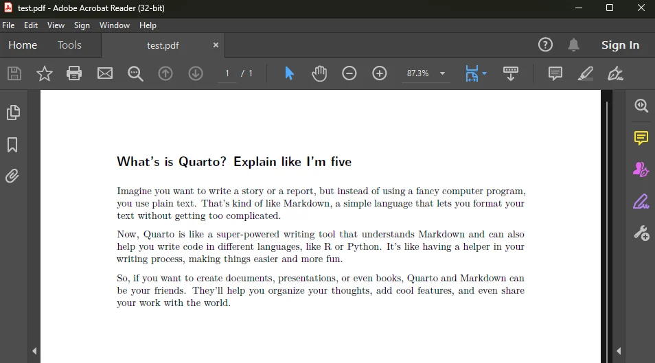
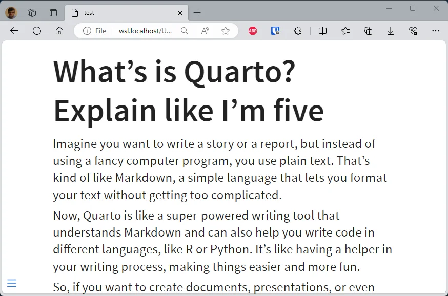
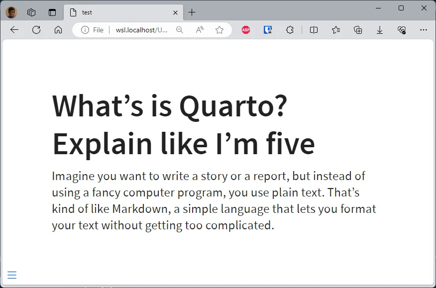
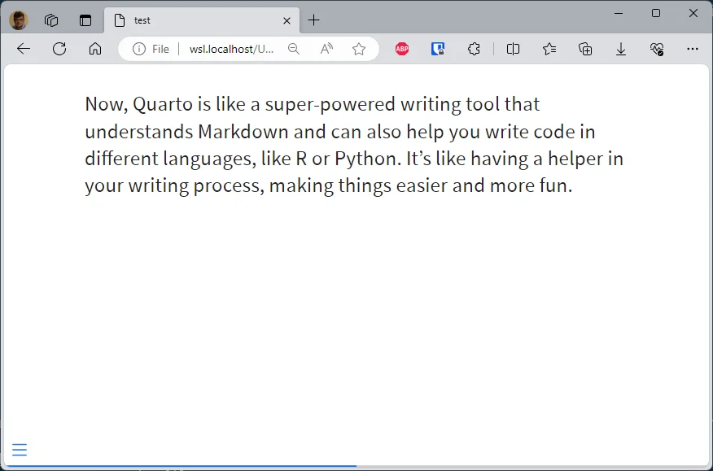
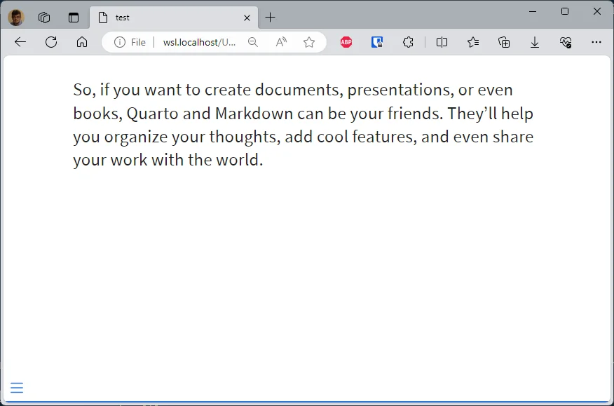

<!-- cspell:ignore rsvg,ggplot2,gdebi,renv,tlmgr,fvextra,footnotebackref,pagecolor,sourcesanspro,sourcecodepro,Aoption -->


<TLDR>
This article shows how to run Quarto (a Pandoc-based tool for converting Markdown into PDF, HTML, Word, ePub, or reveal.js slideshows) via Docker, either building a custom image from a `Dockerfile` or using a prebuilt `ghcr.io/quarto-dev/quarto` one. It walks through rendering the same Markdown file to PDF, HTML, and a multi-slide reveal.js presentation with `quarto render test.md --to <format>`.
</TLDR>

[Quarto](https://quarto.org/) is a tool for producing PDF, Word document, HTML web pages, ePub files, slideshows and many, many more outputs based on a Markdown file.

Using Quarto, you can render any markdown content to a new PDF f.i.

Quarto supports a very large number of features, to which are added extensions from its community, making it a really practical tool for anyone wishing to produce documentation.

Personally, I haven't used a Word-type word processor for several years; nor have I used PowerPoint — I don't even know when the last time was.

And yet, I produce a great deal of documentation and slideshows. I write everything in Markdown and generate PDF or slideshows from the same content.

Until recently, I'd been using [pandoc](https://pandoc.org/) but, having taken the time to look around Quarto, it's a hell of a lot more powerful.

<!-- truncate -->

Like always on this blog, you will not install Quarto the old-fashioned way. You'll run it from a Docker image — and you don't even have to build that image yourself.

## Render your first PDF, without installing anything

Create a temporary folder (`mkdir -p /tmp/docker-quarto && cd $_`), drop a Markdown file called `test.md` in it, and run:

<Terminal typewriter>
$ docker run -it --rm -v .:/input -w /input -u $(id -u):$(id -g) ghcr.io/quarto-dev/quarto:latest quarto render test.md --to pdf
</Terminal>

<Terminal typewriter source="./files/terminal-1.txt" />

A `test.pdf` file is now sitting next to your Markdown, owned by you, and it looks like this:



That image is the official Quarto one — nothing to build, nothing installed on your machine, and the container removes itself when the render is done.

<AlertBox variant="info" title="Docker CLI reminder">
As a reminder, the used Docker run command are (almost always the same):

- `-it` to start Docker interactively, this will allow the script running in the container to ask you for some prompts f.i.,
- `--rm` to ask Docker to kill and remove the container as soon as the script has been executed (otherwise you'll have a lot of exited but not removed Docker containers; you can check this by not using the `--rm` flag then running `docker container list` on the console),
- `-v .:/input` to share your current folder with a folder called `/input` in the Docker container,
- `-w /input` to tell Docker that the current directory, in the container, will be the `/input` folder,
- `-u $(id -u):$(id -g)` asks Docker to reuse your local credentials so when a file is updated/created in the container, the file will be owned by you,
- then the name of the Quarto Docker image, and, finally,
- `quarto render test.md --to pdf` i.e. the command line to start within the container.

</AlertBox>

<AlertBox variant="info" title="Hide non-essential information">
Add the `--log-level warning` CLI argument to Quarto to ask it to show only warning (and error) messages. Non-essential output will be hidden and you'll keep a clean console.

</AlertBox>

## The source file

Here is the `test.md` used above:

<Snippet filename="/tmp/docker-quarto/test.md">

```markdown
# What is Quarto? Explain like I'm five

Imagine you want to write a story or a report, but instead of using a fancy computer program, you use plain text. That's kind of like Markdown, a simple language that lets you format your text without getting too complicated.

Now, Quarto is like a super-powered writing tool that understands Markdown and can also help you write code in different languages, like R or Python. It's like having a helper in your writing process, making things easier and more fun.

So, if you want to create documents, presentations, or even books, Quarto and Markdown can be your friends. They'll help you organize your thoughts, add cool features, and even share your work with the world.
```

</Snippet>

**Please refer to the official documentation of [Quarto](https://quarto.org/) to get in-depth information about the Markdown it accepts.**

The only thing that changes from one output format to the next is the `--to` argument.

## The same file, as HTML and as a slideshow

Simply modify the `--to` argument and replace `pdf` by `html`: `docker run -it --rm -v .:/input -w /input -u $(id -u):$(id -g) ghcr.io/quarto-dev/quarto:latest quarto render test.md --to html --log-level warning`

Now, you've a `test.html` file in your directory.

For a slideshow, the `--to` argument should be set to `revealjs`: `docker run -it --rm -v .:/input -w /input -u $(id -u):$(id -g) ghcr.io/quarto-dev/quarto:latest quarto render test.md --to revealjs --log-level warning`

Open the `test.html` file and you'll get this:



Ok, you've just one slide now. Reopen the `test.md` file and you'll insert *slide breaks*. This can be done using the `----` syntax:

<Snippet filename="/tmp/docker-quarto/test.md">

```markdown
# What is Quarto? Explain like I'm five

Imagine you want to write a story or a report, but instead of using a fancy computer program, you use plain text. That's kind of like Markdown, a simple language that lets you format your text without getting too complicated.

----

Now, Quarto is like a super-powered writing tool that understands Markdown and can also help you write code in different languages, like R or Python. It's like having a helper in your writing process, making things easier and more fun.

----

So, if you want to create documents, presentations, or even books, Quarto and Markdown can be your friends. They'll help you organize your thoughts, add cool features, and even share your work with the world.
```

</Snippet>

Rerun the `--to revealjs` command to regenerate the slideshow as a `test.html` file.

<AlertBox variant="info">
Just run `docker run -d --name static-site -p 8080:80 -v .:/usr/local/apache2/htdocs/ httpd:alpine` then surf to `http://127.0.0.1:8080/test.html` to see your slideshow.

</AlertBox>

Now your slideshow will have three slides (press <kbd>space</kbd> or arrow keys for navigation):







<AlertBox variant="info" title="Just deploy your slideshow online">
The nice thing now is that your slideshow is ready to be deployed on your remote server. Copy the html file and the associated folder (in our use case here, file `test.html` and folder `test_files`) to your FTP server f.i. and your website can be publicly accessed. Nice, isn't it?

</AlertBox>

## Build your own image (optional — skip it if the official one is enough)

There are a number of prebuilt images on the Internet to suit your needs. You'll find them at [https://gitlab.com/quarto-forge/docker](https://gitlab.com/quarto-forge/docker). The so-called `Tier 0` image — the `ghcr.io/quarto-dev/quarto:latest` one used above — is suitable for generating html / revealjs output.

You'll want your own image the day you need something it doesn't ship: a LaTeX package for a specific PDF layout, R or Python for executable code cells, a font, a Quarto extension baked in.

Create a new file called `Dockerfile` (there is no extension) with this content:

<Snippet filename="Dockerfile" source="./files/Dockerfile" />

This done, please run `docker build -t cavo789/quarto .` and after something like three minutes the first time, you'll get your own Docker image:

<Terminal typewriter wrap={false}  source="./files/terminal-2.txt" />

<AlertBox variant="info" title="Choose your own name">
The previous instruction `docker build -t cavo789/quarto .` has created an image called `cavo789/quarto`. You can for sure choose a different name without any impact on the image.

</AlertBox>

From then on, every command of this article works the same: just replace `ghcr.io/quarto-dev/quarto:latest` by `cavo789/quarto`.

You can quickly check the size of your image; quite huge but except you're very low in memory / disk space; this is really not a big deal.

<Terminal typewriter>
$ docker image list | grep quarto
cavo789/quarto  latest  fe1d20bd71a6  1 minute ago  1.55GB
</Terminal>

## Going further

One Markdown file, three `--to` values, three completely different deliverables — and not a single application installed on your machine. That's the part I still find remarkable: the source of my PDF, my web page and my slideshow is the same text file, so they can never drift apart.

Once you're comfortable running Quarto in a plain Docker container, two natural next steps are turning that setup into a proper VSCode <Link to="/blog/quarto-devcontainer">devcontainer</Link> (open the project, everything is preinstalled and hot-reload works out of the box), and browsing <Link to="/blog/quarto-extensions">my favorite Quarto extensions</Link> to enhance your documentation. For the slideshow side in depth, see <Link to="/blog/running-revealjs-with-docker">Level Up Your Presentations with Quarto, reveal.js, Decktape, Docker and DevContainers</Link>.
