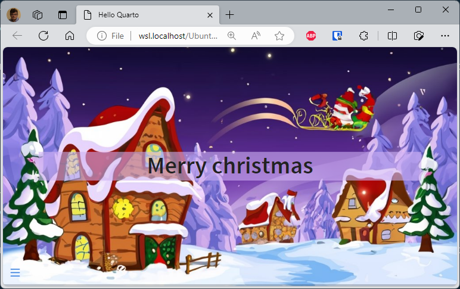
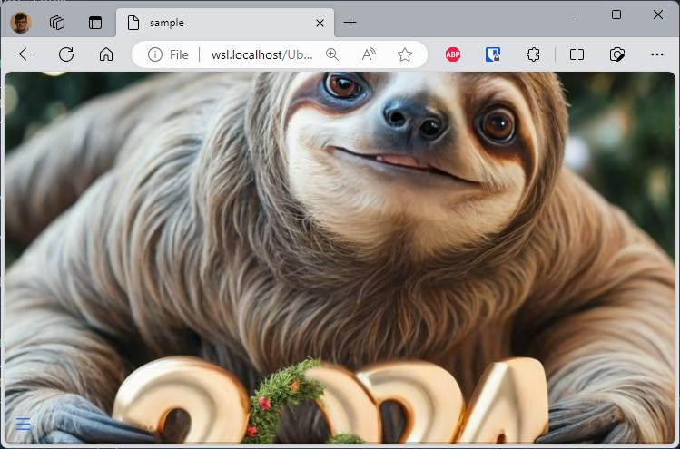
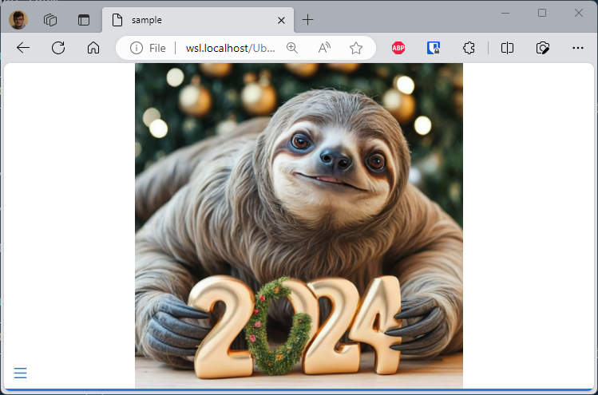
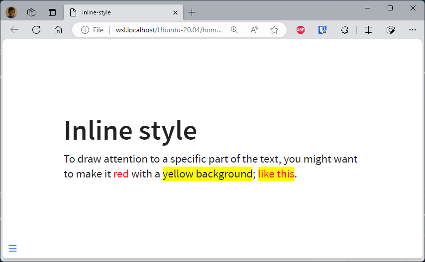
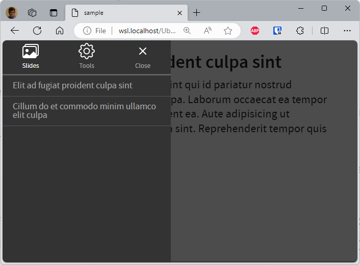

# Some tips and tricks for Quarto when rendering as a reveal.js slideshow


The [Quarto reveal.js documentation](https://quarto.org/docs/reference/formats/presentations/revealjs.html) is the best place to find instructions for creating impeccable reveal.js presentations.

In this article, we'll take a quick look at a few tips and tricks to make your reveal.js presentations even better.

<!-- truncate -->

## Adding a background image to a slide

A background, a title and some style:

```markdown
# Merry Christmas {background-image="images/winter.jpg" style="text-align: center; background-color: #cfb0f399; color: #210753;"}
```



### Background-size contain or cover

Sometimes the image display isn't what you'd like; this is the case when the image is too large and/or the slide too narrow.

The illustration below shows this: the photo of the sloth is far too large and you can't see the whole thing.

This can be corrected by using the attribute `background-size`. When not mentioned (as for the first slide below), the default value is `cover` (see [https://developer.mozilla.org/en-US/docs/Web/CSS/background-size](https://developer.mozilla.org/en-US/docs/Web/CSS/background-size) to get more information).

You can ask the browser to resize the image so it's fully displayed. This is the behavior when `background-size` is set to `contain`.

```markdown
## {background-image="images/2024.jpg"}

## {background-image="images/2024.jpg" background-size="contain"}
```

The slide below is using `cover` and, no, not really attractive.



The second slide is using `contain` and, at least, we can see what the lazy man was trying to tell us.



## Using inline css

You can apply styles to inline text by creating spans using `[]` to surround the text you want to style and `{}` to define the style you want to apply.

```markdown
# Inline style

To draw attention to a specific part of the text, you might want to make it [red]{style="color: red;"} with a [yellow background]{style="background-color: yellow;"}; [like this]{style="color: red; background-color: yellow;"}.
```

This is correctly rendered in HTML:



## Show an image on key press

Using `::: {.fragment .fade-up}` to define a content area, you are asking reveal.js to show its content only the next key sequence.

```markdown
# It's a candy dog

::: {style="font-size: 2em; color: #75AADB;"}
Would you like to see a candy dog?
:::

::: {.fragment .fade-up}

:::
```


## Use a custom css

Use the YAML header block for this.

```markdown
---
pagetitle: "Using my custom css"
format:
  revealjs:
    theme: custom.css
---
##

{style="width:400px;"}
```

Now, create the `custom.css` file in the same folder as your markdown one and, for instance, set the slide background to yellow:

```css
/*-- scss:defaults --*/
.reveal {
    background-color: rgb(224, 226, 98);
}
```


## Creating columns

You can use `columns` to divide your slide:

```markdown
##

::: columns
::: {.column width="70%"}

:::

::: {.column width="30%"}


:::
:::
```


### Four quadrants

The example below comes from [https://mine.quarto.pub/hello-quarto/#/quarto-highlights](https://mine.quarto.pub/hello-quarto/#/quarto-highlights), a reveal.js slideshow made using Quarto.

The idea is to split the slides in four parts and display content clockwise, starting with the top-left dial.

```markdown
::: columns
::: {.column width="5%"}
:::

::: {.column width="40%"}
::: bulletbox
::: {.fragment .fade-in-then-semi-out}
{width="450px"} 
:::
:::
::: 

::: {.column width="5%"}
:::

::: {.column width="40%"}
::: bulletbox
::: {.fragment .fade-in-then-semi-out}
{width="450px"}
:::
:::
:::

::: {.column width="5%"}
:::
:::

::: columns
::: {.column width="5%"}
:::

::: {.column width="40%"}
::: bulletbox
::: {.fragment .fade-in-then-semi-out}
{width="450px"}
:::
:::
:::

::: {.column width="5%"}
:::

::: {.column width="40%"}
::: bulletbox
::: {.fragment .fade-in-then-semi-out}
{width="450px"}
:::
:::
:::

::: {.column width="5%"}
:::
:::
```


## Using speaker notes

You can write messages in your presentation that will not be displayed when the slideshow is played, but only as a second screen when the presenter wishes.

The example below illustrate this. The way to insert such presenter's notes is by using the `::: notes` block.

```markdown
##

::: columns
::: {.column width="70%"}

:::

::: {.column width="30%"}


:::
:::

::: notes
On the left side, you have ... and, on the right side, the first image is ....

The second image has been ...
:::

##


```

So, in the example above, we'll have two slides. By pressing the <kbd>s</kbd> touch on the keyboard (<span style={{color: 'blue'}}>s for speakers</span>) a new window will be displayed.

When you have two screens, on the first you'll display your presentation without the notes (left screen below) and on the second you'll display the notes (right screen below).

If you share your screen through a tool like Teams or Zoom, same thing; you share the screen where the presentation is displayed (the first one) and keep the notes only for you.


As you can see on the image above, the speaker notes are displaying valuable information as the elapsed time since the start of the presentation, the current time and the next slide to make your transition easier.

## Define a name for your slide

By default, reveal.js will generate a slug from the title so you can reference the slide in a URL.

Consider the following example:

```markdown
## Elit ad fugiat proident culpa sint

Elit ad fugiat proident culpa sint qui id pariatur nostrud ullamco velit irure tempor culpa. Laborum occaecat ea tempor voluptate duis pariatur proident ea. Aute adipisicing ut ullamco exercitation nisi nulla sint. Reprehenderit tempor quis non cupidatat.

## Cillum do et commodo minim ullamco elit culpa

Occaecat minim eu veniam laborumanim. Nostrud duis eiusmod ut amet velit commodo. Aliqua laborum cillum officia culpa quis duis enim cillum esse duis excepteur cillum do qui. Veniam dolore enim qui labore proident. Minim ipsum nisi Lorem cillum proident labore cupidatat aliqua pariatur. Nisi id magna incididunt et culpa.
```

The generated URL for the first slide will be `http://[...]index.html#/elit-ad-fugiat-proident-culpa-sint` and, for the second slide, `http://[...]index.html#/cillum-do-et-commodo-minim-ullamco-elit-culpa`.

To define the name yourself, just add `{#}` followed by the slug you desire.

```markdown
<!-- highlight-next-line -->
## Elit ad fugiat proident culpa sint {#intro}

Elit ad fugiat proident culpa sint qui id pariatur nostrud ullamco velit irure tempor culpa. Laborum occaecat ea tempor voluptate duis pariatur proident ea. Aute adipisicing ut ullamco exercitation nisi nulla sint. Reprehenderit tempor quis non cupidatat.

<!-- highlight-next-line -->
## Cillum do et commodo minim ullamco elit culpa {#chapter1}

Occaecat minim eu veniam laborumanim. Nostrud duis eiusmod ut amet velit commodo. Aliqua laborum cillum officia culpa quis duis enim cillum esse duis excepteur cillum do qui. Veniam dolore enim qui labore proident. Minim ipsum nisi Lorem cillum proident labore cupidatat aliqua pariatur. Nisi id magna incididunt et culpa.
```


But, pay attention to the slide's menu (bottom left): perhaps it's also good to define a suitable name there.



To do this, set the `data-menu-title` attribute; f.i.:

```markdown
<!-- highlight-next-line -->
## Elit ad fugiat proident culpa sint {#intro data-menu-title="Introduction"}

<!-- highlight-next-line -->
## Cillum do et commodo minim ullamco elit culpa {#chapter1 data-menu-title="Chapter 1"}
```
