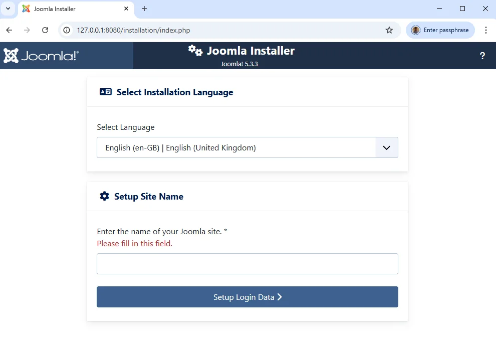
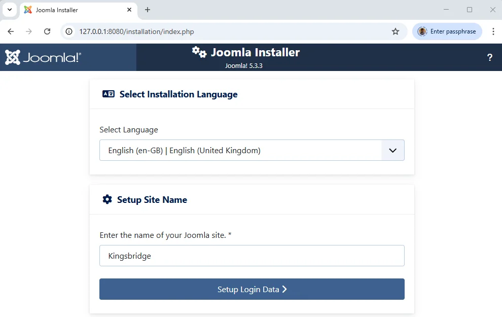
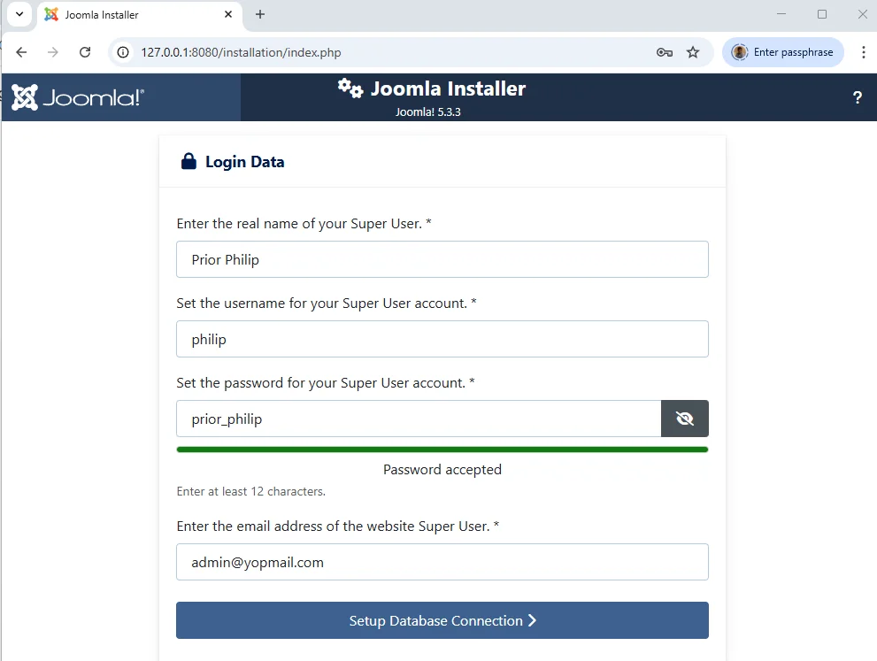
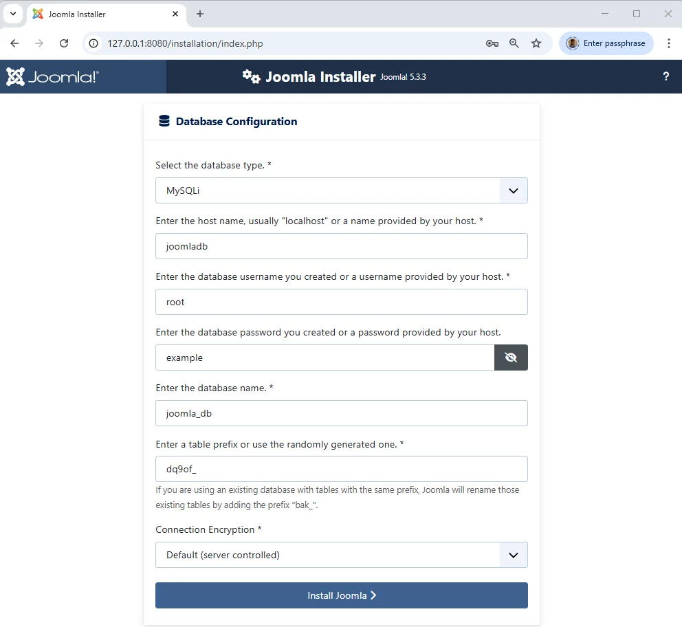
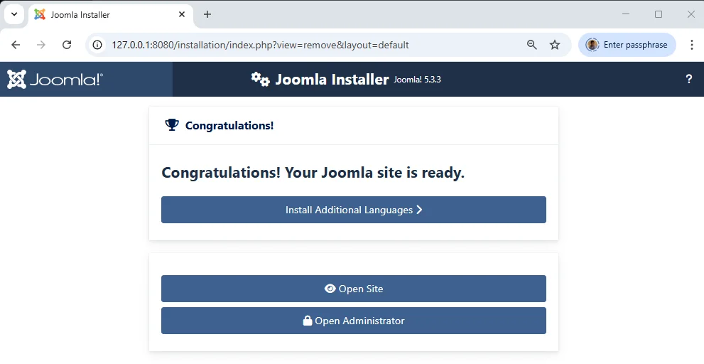
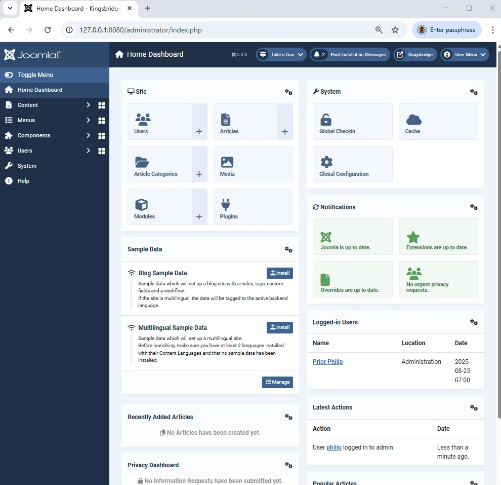
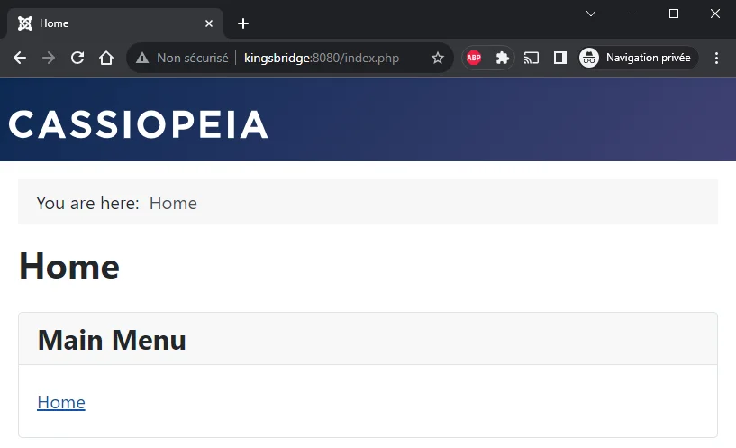

<TLDR>
  This article details how to rapidly set up a local Joomla website using Docker
  by configuring a `compose.yaml` file to orchestrate the application and
  database services. It explains critical steps for ensuring data persistence
  through volume synchronization, managing ports for multiple projects, and
  customizing database connections. The tutorial concludes with a CLI one-liner
  to deploy the entire environment in seconds.
</TLDR>

<!-- cspell:ignore apac, ibdata, ibtmp -->

In this article, we will learn how to use Docker to install Joomla on your localhost and start a new website **in seconds** _(don't want to wait? Jump to the <a href="#bonus---install-joomla-with-a-cli-one-liner">Bonus - Install Joomla with a CLI one-liner</a>" chapter)_.

I will use a Linux console _(I'm running WSL on my Windows computer and I have chosen Ubuntu for my distribution)_ but since Docker can also be used on Windows, you can perfectly run, exactly, the same commands in an MS-DOS / Powershell console.

<!-- truncate -->

If you don't have Docker yet, please consult my "[Install Docker and play with PHP](/blog/install-docker)" article to get more information about Docker and an easy introduction guide.

**We will assume in this article that you have Docker, and you're working under Linux or using WSL.**

## Before starting

<StepsCard
  title="As you know, to be able to run a CMS like Joomla we need three things + 1:"
  variant="prerequisites"
  steps={[
    "We need a web server like **Apache** or **nginx**",
    "We need a database service like **MySQL**, **MariaDB** or **PostgreSQL** or any other supported databases and",
    "We need **PHP** and",
    "Of course, we need **Joomla**",
  ]}
/>

In terms of Docker: we need three services.

## Docker compose

When you need many services (Apache should be able to communicate with PHP and PHP should be able to request data from MySQL), you need to configure a special file called `compose.yaml`. That file should be placed in the root of the project and will define the list of services required and how they will collaborate together.

You will find an example of the `compose.yaml` file on the Joomla image description page: [https://hub.docker.com/\_/joomla](https://hub.docker.com/_/joomla) _search for `docker-compose` on this page._

<AlertBox
  variant="info"
  title="The Docker Joomla image is built on PHP and Apache"
>
  It's for sure too technical now but if you click on the
  [https://github.com/joomla-docker/docker-joomla/blob/master/6.0/php8.3/apache/Dockerfile#L8](https://github.com/joomla-docker/docker-joomla/blob/master/6.0/php8.3/apache/Dockerfile#L8)
  link, you can see that the Docker image for Joomla 6.0 is built on a
  `php:8.3-apache` image. This means that using this image, you will get PHP,
  Apache and Joomla, altogether in a single image.
</AlertBox>

## Download images

Click on the `Generate install script` below and copy/paste the script in a terminal.

<ProjectSetup folderName="/tmp/joomla" createFolder={true}>
  <Snippet
    filename="compose.yaml"
    source="./files/compose_joomla_latest.yaml"
  />
  <Guideline>
    Now, simply run 'docker compose up -d' to start the project then open your
    browser and surf to http://localhost:8080
  </Guideline>
</ProjectSetup>

To make things as clear as possible, here is my temporary folder content once I've run the generation script:

<Terminal>
cd /tmp/joomla

$ ls -alh
total 12K
drwxr-xr-x 2 christophe christophe 4.0K Jan 4 15:31 .
drwxrwxrwt 12 root root 4.0K Jan 4 15:31 ..
-rw-r--r-- 1 christophe christophe 279 Jan 4 15:31 compose.yaml

</Terminal>

So, I just have one file, and this is the newly, created, `compose.yaml` file.

In your terminal, please run the following command:

<Terminal>$ docker compose up --detach</Terminal>

<AlertBox
  variant="info"
  title="That command is one of the most important to know. It asks Docker to proceed the `compose.yaml` file and run services. In short: run your website."
/>

Docker will start downloading `joomla` and `joomladb`, the two services mentioned in the `compose.yaml` file.

<Snippet
  filename="compose.yaml"
  source="./files/compose.yaml"
  defaultOpen={true}
/>

You will obtain something like this, please wait until everything is downloaded.

<Terminal>
$ docker compose up --detach

[+] Running 16/35
⠹ joomladb 12 layers [⠀⠀⠀⠀⠀⠀⠀⠀⠀⠀⠀⠀] 0B/0B Pulling 19.3s
⠧ 177e7ef0df69 Waiting 15.8s
⠧ cac25352c4c8 Waiting 15.8s
⠧ 8585afabb40a Waiting 15.8s
[...]
⠹ joomla 21 layers [⣿⣿⣦⣿⣿⣿⣿⣿⣿⣿⣿⣿⣿⣦⣿⣿⣿⣿⣀⠀⠀] 94.59MB/155.9MB Pulling 19.3s
✔ 578acb154839 Pull complete 11.3s
✔ c053f6f43c12 Pull complete 11.9s
⠋ 65cebbf4d847 Downloading [==============> ] 68.41MB/104.4MB 16.1s
✔ 34045bc93960 Download complete 1.0s
[...]

</Terminal>

At the end, once images have been downloaded, the console will show something like this:

<Terminal>
$ docker compose up --detach

[+] Running 35/35
✔ joomladb 12 layers [⣿⣿⣿⣿⣿⣿⣿⣿⣿⣿⣿⣿] 0B/0B Pulled 84.9s
✔ 177e7ef0df69 Pull complete 26.9s
✔ cac25352c4c8 Pull complete 27.5s
✔ 8585afabb40a Pull complete 28.2s
[...]
✔ joomla 21 layers [⣿⣿⣿⣿⣿⣿⣿⣿⣿⣿⣿⣿⣿⣿⣿⣿⣿⣿⣿⣿⣿] 0B/0B Pulled 146.4s
✔ 578acb154839 Pull complete 11.3s
✔ c053f6f43c12 Pull complete 11.9s
✔ 65cebbf4d847 Pull complete 31.2s
[...]
[+] Running 3/3
✔ Network joomla_default Created 0.3s
✔ Container joomla-joomladb-1 Started 52.9s
✔ Container joomla-joomla-1 Started 38.8s

</Terminal>

So, the two images have been downloaded then,

1. a `joomla_default` network is created,
2. the `joomla-joomladb-1` container is created (this is your database server) and
3. the `joomla-joomla-1` container is created too (this is your Joomla service).

At this stage, your site is already being installed. Go to the URL `http://127.0.0.1:8080` to view it (make sure to use the `http` protocol and not `https`).

<AlertBox variant="note" title="Not yet ready">
  You may get an error page `ERR_EMPTY_RESPONSE`; this is because, for example,
  MySQL is not yet fully loaded and Joomla has to wait for it before it can
  display the installation page. In this case, please wait a little longer ...
  or read the rest of this article.
</AlertBox>

<AlertBox variant="info" title="Solve it by adding a depends_on condition">
So Joomla can be ready before the database and that's not fun. Indeed, Joomla should be able to create his database, add tables and records but if MySQL is not yet ready, we'll have a problem.

The solution provided by Docker is the notion of `healthcheck`. We have to define how Docker can _know_ that MySQL is _healthy_. Then we'll ask Joomla to wait until the database layer is _healthy_.

<Snippet
  filename="compose.yaml"
  source="./files/compose_depends_on.yaml"
  defaultOpen={true}
/>

</AlertBox>

### Why joomla-joomlaxxx names

We didn't give your project a name, we just created a `compose.yaml` file in your `/tmp/joomla` folder. So, Docker has named your project using the folder name (`joomla`) concatenated to service name (refers to the `compose.yaml` file, we have two services, one called `joomladb` and one called `joomla`). That is why...

Let us introduce a minor, optional, change, we will give a name to your Docker project and containers: edit the `compose.yaml` file and add a line with `name: xxxx` where `xxxx` is the name of your choice. Do the same but using `container_name` this time for the two services; for instance:

<Snippet
  filename="compose.yaml"
  source="./files/compose_project_name.yaml"
  defaultOpen={true}
/>

We won't be restarting your Docker containers yet. For now, the `kingsbridge` name won't be considered. For this to be the case, we would need to launch `docker compose down` followed by `docker compose up --detach`, but let us wait a little longer before doing so.

## Docker images

If you're curious, you can run the `docker image list` command to get the list of Docker images already downloaded on your machine.

<Terminal>
$ docker image list

REPOSITORY TAG IMAGE ID CREATED SIZE
joomla latest 882b2151d890 2 days ago 663MB
mysql 8.0.13 102816b1ee7d 4 years ago 486MB

</Terminal>

Ok, so, Docker has downloaded Joomla (in its _latest_ version) and MySQL (version 8.0.13).

By default, when we don't specify any version number (which isn't recommended for production), Docker will download the version known as `latest`. `latest` is what Docker calls a "tag".

To ensure your setup is stable and predictable, it's best to use a specific version tag. You can find all available tags on the [official Joomla Docker Hub page](https://hub.docker.com/_/joomla/tags).

For example, to use Joomla version 5.3.3 with PHP 8.2, you would change the `image` line in your `compose.yaml` like this:

<Snippet filename="compose.yaml" source="./files/compose_joomla_5.3.3.yaml" />

## Docker containers

We're almost done. Please run `docker container list` to get the list of containers created by Docker:

<Terminal>
$ docker container list

CONTAINER ID IMAGE COMMAND CREATED STATUS PORTS NAMES
0798f8f25d2b joomla "/entrypoint.sh apac…" 8 minutes ago Up 5 minutes 0.0.0.0:8080->80/tcp joomla-joomla-1
7b7fcd3809b0 mysql:8.0.13 "docker-entrypoint.s…" 8 minutes ago Up 7 minutes 3306/tcp, 33060/tcp joomla-joomladb-1

</Terminal>

We have two running containers (your two services). Pay attention to the `PORTS` column: your `joomla` container is listening on the port `8080` and your `mysql` container is listening on port `3306`.

Hey, port `8080`, does that mean anything to you? That is a port for a web page, isn't it?

Let us try by starting your favorite browser and navigating to `http://localhost:8080` (_or `http://127.0.0.1:8080`, it's strictly the same_) and... Wow!

## Install Joomla

Back to `http://localhost:8080` and we will continue the installation.

On the first screen, just select your preferred language then enter a name for your Joomla site:

When Joomla will ask for your admin credentials, just fill in the value of your choice:

<StepsCard
  title="But, for the database configuration, here you need to be strict:"
  variant="remember"
  steps={[
    "The database type should be `MySQLi` (since we're using MySQL),",
    "The name of the host should be `joomladb` (the name we have chosen for the database service),",
    "The username should be `root` (default value) and",
    "The password for that user should be `example`",
  ]}
/>

<AlertBox variant="caution" title="Why these values?">
These values can be retrieved inside the `compose.yaml` file. If you have named your database service something other than `joomladb`, then please use the name you have chosen.

</AlertBox>

<Snippet
  filename="compose.yaml"
  source="./files/compose_mysql_root.yaml"
  defaultOpen={true}
/>

And, after a few seconds, tadaaa...

The administrator page:

And the administrator dashboard:

**Congratulations, you have successfully installed a fresh Joomla website using Docker!**

## Everything is done in RAM

Let us leave a few minutes the browser and go back to your Linux console.

In the previous chapter, we have installed Joomla so we should have Joomla on your computer, right?

Let us verify by returning to our Linux console:

<Terminal>
$ pwd
/tmp/joomla

$ ls -alh
total 12K
drwxr-xr-x 2 christophe christophe 4.0K Jan 4 15:31 .
drwxrwxrwt 12 root root 4.0K Jan 4 15:31 ..
-rw-r--r-- 1 christophe christophe 279 Jan 4 15:31 compose.yaml

</Terminal>

Oh? Nothing... **Nothing has been downloaded in your folder.** You don't have Joomla on your computer. How is this possible?

We will discuss this later but yes, by default with Docker, everything happens in memory, nothing on the disk. If you can't wait, please read my "[Share data between your running Docker container and your computer](/blog/docker-volume)" article to better understand why and how.

## Play with containers

Still on your console, type again `docker container list`:

<Terminal>
$ docker container list

CONTAINER ID IMAGE COMMAND CREATED STATUS PORTS NAMES
0798f8f25d2b joomla "/entrypoint.sh apac…" 8 minutes ago Up 5 minutes 0.0.0.0:8080->80/tcp joomla-joomla-1
7b7fcd3809b0 mysql:8.0.13 "docker-entrypoint.s…" 8 minutes ago Up 7 minutes 3306/tcp, 33060/tcp joomla-joomladb-1

</Terminal>

Pay attention this time to the last column, called `NAMES`.

We have thus two containers, one named `joomla-joomla-1` and one name `joomla-joomladb-1`.

We will stop them by running `docker compose down`:

<Terminal>
$ docker compose down

[+] Running 3/3
✔ Container joomla-joomla-1 Removed 2.6s
✔ Container joomla-joomladb-1 Removed 4.2s
✔ Network joomla Removed

</Terminal>

If you go back to `http://localhost:8080` with your browser and refresh the page; the site didn't exist anymore.

Run `docker compose up --detach` again.

<Terminal>$ docker compose up --detach</Terminal>

Surf to the site again, refresh the page and the site are, oh? not yet responding. Wait a few... a few more... and after a certain period, the site will be there. Why?

Docker must (re)start two services, the Joomla one and the database server. Initialization of both services may take a few seconds, and the database service must be up so that Joomla can continue its initialization.

You can see this by running `docker compose logs --follow` (press <kbd>CTRL</kbd>+<kbd>C</kbd> to quit).

<Terminal>$ docker compose logs --follow the_output</Terminal>

Once Joomla will be ready, you will get the installation wizard of Joomla... just like the first time. So, by running `docker compose down` you have lost your work.

<Terminal>$ docker compose down</Terminal>

<AlertBox variant="danger" title="">
As mentioned earlier, everything is done in RAM. By stopping a Docker container, you will lose everything not saved on your computer. It's great for playing/learning but not what you expect when you're developing a real site.

</AlertBox>

<AlertBox variant="info" title="">
Remember the change we made earlier. We had added the name `kingsbridge` as the project name in your `compose.yaml` file, and we've named the two containers. You can see that after relaunching `docker compose up`, this time it's no longer `joomla-joomlaxxxx` but `kingsbridge-app` and `kingsbridge-db`. This because changes made to the yaml file are processed only after a `down / up` command. If you modify the yaml file, you should restart Docker containers.

</AlertBox>

## Synchronize with your computer

We will now require that Docker store files/folders on your computer.

<StepsCard
  title="We wish two things:"
  variant="remember"
  steps={[
    "We want the entire website to be saved on your hard disk and",
    "we want the database to be saved on the hard disk as well.",
  ]}
/>

To do this, please edit the `compose.yaml` file and add the highlighted lines below:

<Snippet
  filename="compose.yaml"
  source="./files/compose_with_synchronization.yaml"
/>

The `/var/www/html` folder of the Joomla service should be synchronized with the `site_joomla` subfolder on your computer. This is for the Joomla website.

And the `/var/lib/mysql` folder of the MySQL service should be synchronized with your local `db` subfolder.

<AlertBox variant="caution" title="Please create folders first">
Make sure to, first, create these two directories on your computer, so folder's permissions will be correct!

<Terminal>$ mkdir site_joomla db</Terminal>

</AlertBox>

The two lines `user: ${UID:-1000}:${GID:-1000}` are really important and inform Docker to reuse your local user (the one used on your Linux session).

<AlertBox variant="highlyImportant" title="The user UID/GID">
This part is crucial: if you type `id -u` and `id -g` on Linux, you'll get your own user_id and group_id (aka UID and GID). Most of the time, it'll be `1000` for both but ... sometimes not.

The syntax `user: ${UID:-1000}:${GID:-1000}` means to use `1000` as default value except if OS variables `UID` and `GID` exists and in that case, use their values.

</AlertBox>

Just check your folder's content:

<Terminal>
$ pwd
/tmp/joomla

$ ls -alh
total 20K
drwxr-xr-x 4 christophe christophe 4.0K Jan 4 15:57 .
drwxrwxrwt 12 root root 4.0K Jan 4 15:31 ..
-rw-r--r-- 1 christophe christophe 279 Jan 4 15:31 compose.yaml
drwxr-xr-x 2 christophe christophe 4.0K Jan 4 15:57 db
drwxr-xr-x 2 christophe christophe 4.0K Jan 4 15:57 site_joomla

</Terminal>

Run Docker again but first, make sure the previous containers are removed (not only stopped): `docker compose kill`.

<Terminal>
$ docker compose kill

[+] Killing 2/2
✔ Container kingsbridge-db Killed 2.1s
✔ Container kingsbridge-app Killed 1.5s

</Terminal>

Please now run the following command and, as you can see, we'll first initialize UID and GID variables so we'll not meet permissions issues:

<Terminal>
$ UID=$(id -u) GID=$(id -g) docker compose up --detach

[+] Running 3/3
✔ Network kingsbridge_default Created 0.3s
✔ Container kingsbridge-db Started 3.3s
✔ Container kingsbridge-app Started

</Terminal>

And you can, already, run `ls` again to see that, yes, your local `site_joomla` and `db` folders are populated now. This is the result of the `volumes` entry we have added in your `compose.yaml` file.

<Terminal>
$ pwd
/tmp/joomla

$ ls -alh site_joomla
total 132K
drwxr-xr-x 19 christophe christophe 4.0K Jan 4 15:59 .
drwxr-xr-x 4 christophe christophe 4.0K Jan 4 15:57 ..
-rw-r--r-- 1 christophe christophe 6.8K Jan 4 15:59 .htaccess
-rw-r--r-- 1 christophe christophe 18K Nov 19 19:54 LICENSE.txt
-rw-r--r-- 1 christophe christophe 5.2K Nov 19 19:54 README.txt
drwxr-xr-x 11 christophe christophe 4.0K Nov 19 19:54 administrator
drwxr-xr-x 5 christophe christophe 4.0K Nov 19 19:54 api
drwxr-xr-x 2 christophe christophe 4.0K Nov 19 19:54 cache
drwxr-xr-x 2 christophe christophe 4.0K Nov 19 19:54 cli
drwxr-xr-x 18 christophe christophe 4.0K Nov 19 19:54 components
drwxr-xr-x 2 christophe christophe 4.0K Nov 19 19:54 files
-rw-r--r-- 1 christophe christophe 6.8K Nov 19 19:54 htaccess.txt
drwxr-xr-x 5 christophe christophe 4.0K Nov 19 19:54 images
drwxr-xr-x 2 christophe christophe 4.0K Nov 19 19:54 includes
-rw-r--r-- 1 christophe christophe 1.6K Nov 19 19:54 index.php
drwxr-xr-x 10 christophe christophe 4.0K Nov 19 19:54 installation
drwxr-xr-x 4 christophe christophe 4.0K Nov 19 19:54 language
drwxr-xr-x 6 christophe christophe 4.0K Nov 19 19:54 layouts
drwxr-xr-x 6 christophe christophe 4.0K Nov 19 19:57 libraries
drwxr-xr-x 75 christophe christophe 4.0K Nov 19 19:58 media
drwxr-xr-x 27 christophe christophe 4.0K Nov 19 19:54 modules
drwxr-xr-x 26 christophe christophe 4.0K Nov 19 19:54 plugins
-rw-r--r-- 1 christophe christophe 764 Nov 19 19:54 robots.txt.dist
drwxr-xr-x 5 christophe christophe 4.0K Nov 19 19:54 templates
drwxr-xr-x 2 christophe christophe 4.0K Nov 19 19:54 tmp
-rw-r--r-- 1 christophe christophe 3.0K Nov 19 19:54 web.config.txt

$ ls -alh db
total 176M
drwxr-x--- 2 christophe christophe 4.0K Jan 4 15:59 '#innodb_temp'
drwxr-xr-x 7 christophe christophe 4.0K Jan 4 15:59 .
drwxr-xr-x 4 christophe christophe 4.0K Jan 4 15:57 ..
-rw-r----- 1 christophe christophe 56 Jan 4 15:59 auto.cnf
-rw-r----- 1 christophe christophe 3.0M Jan 4 15:59 binlog.000001
-rw-r----- 1 christophe christophe 358 Jan 4 15:59 binlog.000002
-rw-r----- 1 christophe christophe 32 Jan 4 15:59 binlog.index
-rw------- 1 christophe christophe 1.7K Jan 4 15:59 ca-key.pem
-rw-r--r-- 1 christophe christophe 1.1K Jan 4 15:59 ca.pem
-rw-r--r-- 1 christophe christophe 1.1K Jan 4 15:59 client-cert.pem
-rw------- 1 christophe christophe 1.7K Jan 4 15:59 client-key.pem
-rw-r----- 1 christophe christophe 5.9K Jan 4 15:59 ib_buffer_pool
-rw-r----- 1 christophe christophe 48M Jan 4 15:59 ib_logfile0
-rw-r----- 1 christophe christophe 48M Jan 4 15:59 ib_logfile1
-rw-r----- 1 christophe christophe 12M Jan 4 15:59 ibdata1
-rw-r----- 1 christophe christophe 12M Jan 4 15:59 ibtmp1
drwxr-x--- 2 christophe christophe 4.0K Jan 4 15:59 joomla
drwxr-x--- 2 christophe christophe 4.0K Jan 4 15:59 mysql
-rw-r----- 1 christophe christophe 30M Jan 4 15:59 mysql.ibd
drwxr-x--- 2 christophe christophe 4.0K Jan 4 15:59 performance_schema
-rw------- 1 christophe christophe 1.7K Jan 4 15:59 private_key.pem
-rw-r--r-- 1 christophe christophe 452 Jan 4 15:59 public_key.pem
-rw-r--r-- 1 christophe christophe 1.1K Jan 4 15:59 server-cert.pem
-rw------- 1 christophe christophe 1.7K Jan 4 15:59 server-key.pem
drwxr-x--- 2 christophe christophe 4.0K Jan 4 15:59 sys
-rw-r----- 1 christophe christophe 12M Jan 4 15:59 undo_001
-rw-r----- 1 christophe christophe 10M Jan 4 15:59 undo_002

</Terminal>

Back to your browser and continue the installation of Joomla like we did in the previous chapter.

When the installation wizard has finished successfully, return to your Linux console and check if you can see the `configuration.php` file now.

<Terminal>
$ pwd
/tmp/joomla

$ ls site_joomla/configuration.php
.rw-r--r-- 2.0k christophe christophe 6.8K Jan 4 15:59 .htaccess

$ head -n 10 site_joomla/configuration.php
{`<?php
class JConfig \{
        public \$offline = false;
        public \$offline_message = 'Ce site est en maintenance. Merci de revenir ultérieurement.';
        public \$display_offline_message = 1;
        public \$offline_image = '';
        public \$sitename = 'Kingsbridge';
        public \$editor = 'tinymce';
        public \$captcha = '0';
        public \$list_limit = 20;
`}

</Terminal>

Yes! This time we have stored your Joomla website on your computer.

For the exercise, we can kill your containers by running `docker compose kill` and run `docker compose up --detach` again to start your containers again and, this time, we will retrieve your Joomla site as we just leave it. Nothing is lost now.

<Terminal>$ docker compose kill && docker compose up --detach</Terminal>

And since files/folders are now on your computer, you can do everything you want with your website like committing it on a GitHub repository f.i.

<AlertBox variant="info" title="Synchronization has a cost">
When using one or more volumes, Docker must constantly check whether the files/folders on your computer are synchronized with the containers. This has a cost in terms of performance. Similarly, if Docker needs to write to a file (or to your Joomla database); if this is only in memory, it will be faster than if you also had to write the database to your disk. However, the difference in speed is not obvious under normal circumstances. If you're a developer writing hundreds or even thousands of records, you'll observe a noticeable difference.

</AlertBox>

## Start a CLI command

When working with a Joomla website, sometimes you need to run some PHP command like `php joomla.php`.

To be able to do this, you will need to start a _interactive shell session_ in the Joomla container.

Did you remember the name of your Joomla service? If no, just open the `compose.yaml` file again.

<Snippet
  filename="compose.yaml"
  source="./files/compose_service_joomla.yaml"
  defaultOpen={true}
/>

The name of your Joomla service is `joomla` (and `joomladb` is the name of your database service).

Now we know everything we need: to run an interactive shell session in the Joomla container, just run `docker compose exec joomla /bin/sh` to _jump_ into the Joomla container (_and `docker compose exec joomladb /bin/sh` for the database container_).

<Terminal>$ docker compose exec joomla /bin/sh</Terminal>

Let us rewind for a few seconds because it's complicated to understand.

On your computer, in your Linux console, if you type `pwd` to get the current folder, you will see `/tmp/joomla` since it's the directory we have used in the tutorial.

Then, we jump in the Joomla Docker container by running `docker compose exec joomla /bin/sh` and, you can see it, we don't have any longer a prompt starting with `>` but with `$` but that isn't the only difference. If now, we run `pwd` again, we're no more in your `/tmp/joomla` folder but in `/var/www/html`.

It can drive you mad but ... when entering in the Docker container, you're _no more_ on your computer, you're virtually in another computer, the container. In that _computer_, the current folder is thus `/var/www/html`. By typing `exit`, you will leave the container, go back to your computer and back in the `/tmp/joomla` folder.

<Terminal>
$ pwd
/tmp/joomla

$ docker compose exec joomla /bin/sh

$ pwd
/var/www/html

$ exit

$ pwd
/tmp/joomla

</Terminal>

Something else to try:

<Terminal>
$ php --version
command not found: php

$ docker compose exec joomla /bin/sh

$ php --version
PHP 8.3.29 (cli) (built: Dec 29 2025 23:29:22) (NTS)
Copyright (c) The PHP Group
Zend Engine v4.3.29, Copyright (c) Zend Technologies
with Zend OPcache v8.3.29, Copyright (c), by Zend Technologies

$ exit

</Terminal>

So, on my computer (and probably on yours), by typing `php --version`, I got an error. That is correct. I don't have PHP on my computer. _I work daily with PHP for years and I don't have it on my machine._ 😄

Then I jump in the Joomla container and type the same command again and, yes, inside the Docker container of Joomla, yes, PHP is installed and here, It's the version 8.3.29.

## Using alias

Docker will always start your project on your localhost and on a port like `http://127.0.0.1:8080`.

Instead of using the IP address, it would be much nicer to use an alias like `http://kingsbridge:8080`.

For this, on Windows, edit the file `C:\Windows\System32\Drivers\etc\hosts` and add the `kingsbridge` line as below illustrated:

<Snippet
  filename="C:\Windows\System32\Drivers\etc\hosts"
  source="./files/windows_hosts.txt"
/>

Save the file. Now you can surf to `http://kingsbridge:8080`

<AlertBox variant="note" title="">
  When creating an alias in the host file, some people prefer to use the
  `.local` suffix like in `127.0.0.1 kingsbridge.local` to make clear it's a
  localhost site. If you prefer this, so the URL will be
  `http://kingsbridge.local:8080`
</AlertBox>

## Using another port

Imagine you have another project, no more the `Kingsbridge` one. Can you have many Docker projects running at the same time? Yes! of course.

You just need to make sure to use another, unused, port.

Consider the `Shiring` project `compose.yaml` file

<Snippet filename="compose.yaml" source="./files/compose_shiring.yaml" />

We will use the port `8081` for that project and, in your host file, we will add `127.0.0.1 shiring`.

So, now and at the same time, we can access to `http://kingsbridge:8080` and to `http://shiring:8081` without conflicts since we have used a separate port number.

Kingsbridge can be a Joomla 4.4 / PHP 7.4 website while Shiring is on Joomla 5.0 / PHP 8.2 without any conflict. **And that's just astonishingly simple, if you think back to the way you worked before Docker.**

<AlertBox variant="info" title="">
Using another port isn't mandatory. You can have several websites on the same port as `8080`. But, in that case, we won't be able to use these websites at the same time. You can start the first one and when trying to start the second one, Docker will say *port already in use*. This isn't a problem; you can just run `docker compose stop` for the first one so free the port then start the second one.

<Terminal>$ docker compose stop</Terminal>

</AlertBox>

<AlertBox variant="note" title="">
  In this article, I'm using port `8080` because Joomla has used it in his
  default `compose.yaml` file. You're not forced to use that one, you can
  perfectly use `80` and not `8080`. In my daily work, I'm using ports `80`,
  `81`, `82`, `83`, ... varying the second figures for my projects.
</AlertBox>

## Did you prefer PostgreSQL or MariaDB

So far, we've chosen to use MySQL as our database manager. Our `compose.yaml` file is the one, slightly modified, that can be found on [https://hub.docker.com/\_/joomla](https://hub.docker.com/_/joomla).

Could you opt for something other than MySQL? Of course, as long as Joomla supports this system (see [https://manual.joomla.org/docs/next/get-started/technical-requirements/](https://manual.joomla.org/docs/next/get-started/technical-requirements/)).

We just need to replace the `joomladb` service, don't use anymore `mysql` but the one we wish.

Let's try PostgreSQL... We'll replace `mysql`. The official PostgreSQL Docker image can be retrieved on [https://hub.docker.com/\_/postgres](https://hub.docker.com/_/postgres). The documentation tell us which `image` we should use and how to define variables like the default password (`POSTGRES_PASSWORD`).

We also need to change a few variables:

- The default database user should be specified, and it will be f.i. `postgres`,
- We should define too the name of the database in both services; we'll name our db `joomla_db` and
- We need to inform Joomla that we'll use PostgreSQL so we need to set `JOOMLA_DB_TYPE` to `pgsql` (can be either `mysql` or `pgsql`).

<AlertBox variant="note" title="">
  This information has been retrieved from this Pull requests:
  [https://github.com/joomla-docker/docker-joomla/pull/156](https://github.com/joomla-docker/docker-joomla/pull/156).
</AlertBox>

Our `compose.yaml` will become:

<Snippet filename="compose.yaml" source="./files/compose_postgres.yaml" />

Now, during the configuration of Joomla, make sure to choose `PostgreSQL (PDO)` for the database type and fill in the database wizard with the correct values.

<AlertBox variant="info" title="Use alpine images wherever possible">
For the first time during this tutorial, we're using an `alpine` image (`postgres:16.0-alpine` here). These images are lighter than the *not* alpine image. They contain the bare essentials for running the service, whereas a *traditional* image contains additional tools, binaries, ... that you may need but are not certain to use.

</AlertBox>

If you plan to use MariaDB, here is the Docker Official Image: [https://hub.docker.com/\_/mariadb](https://hub.docker.com/_/mariadb).

<Snippet filename="compose.yaml" source="./files/compose_mariadb.yaml" />

For MariaDB, please select `MySQLi` during the installation wizard.

## Extra information

### The container will be restarted by Windows

If you shut down your computer, if one or more containers are still running, Docker will run them again on the next startup.

This means that the next time you start your computer, your website will still be accessible, and you won't have to run a single command. It's so easy!

### Working with Windows

Imagine you're in your console (f.i. run `cd /tmp/joomla` in the Linux console) and you wish to open the site with Visual Studio Code, already installed on your Windows machine.

It's easy: just run `code .` to open the current folder so your project within vscode.

Another use case, you wish to start the Windows Explorer program and navigate in your project's structure. Here too, it's possible, just run `explorer.exe .` to open it and load the current directory. See my "[Open your Linux folder in Windows Explorer](/blog/wsl-windows-explorer)" article to read more about this feature.

## Bonus - Install Joomla with a CLI one-liner

In the introduction of this article, I have said \*we will learn how to use Docker to install Joomla and start a new website **in seconds**\*.

And here is the promise. Just clic on the `Generate install script` below, copy/paste the script in your console, run it and follow the instruction. After a few seconds, you'll have a running Joomla website.

<ProjectSetup folderName="/tmp/joomla">
  <Guideline>
    Now, please run 'UID=$(id -u) GID=$(id -g) docker compose up --detach' to
    create your Joomla site. Wait a few and open your browser, surf to
    http://localhost:8080 to open your Joomla site. The database type should be
    `MySQLi`, the name of the host should be `joomladb`, the username should be
    `root` and the password for that user should be `example`.
  </Guideline>
  <Snippet filename="compose.yaml" source="./files/final_compose.yaml" />
  <EmptyFolder name="site_joomla" />
  <EmptyFolder name="db" />
</ProjectSetup>

<!-- markdownlint-disable MD029 -->

<AlertBox variant="caution" title="">
Make sure, for each project, to update the `name:` line and if you plan to be able to run your Joomla sites concurrently, make sure to update the port number for Joomla and chose a new one every time (can be `80`, `81`, `82` and so on).

</AlertBox>
