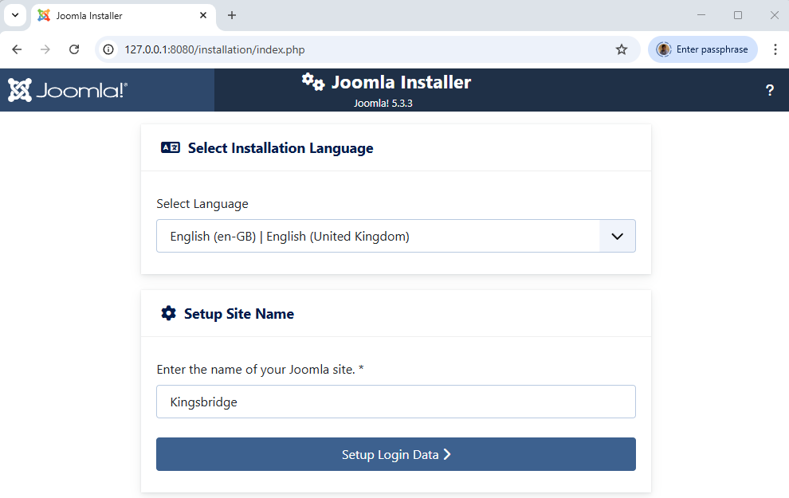
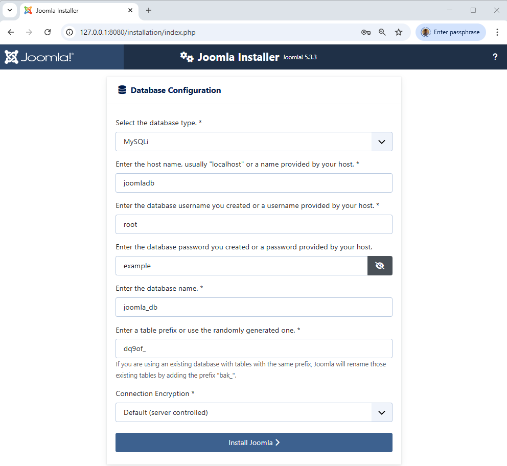

<!-- cspell:ignore apac,ibdata,ibtmp -->

* *Updated 2024-03-23, adding health condition in yml and update Joomla tag to 5.1-php8.2-apache.*

In this article, we will learn how to use Docker to install Joomla on your localhost and start a new website **in seconds** *(don't want to wait? Jump to the "Final compose.yaml" chapter)*.

I will use a Linux console *(I'm running WSL on my Windows computer and I have chosen Ubuntu for my distribution)* but since Docker can also be used on Windows, you can perfectly run, exactly, the same commands in an MS-DOS / Powershell console.

<!-- truncate -->

If you don't have Docker yet, please consult my "[Install Docker and play with PHP](/blog/install-docker)" article to get more information about Docker and an easy introduction guide.

**We will assume in this article that you have Docker, and you're working under Linux or using WSL.**

## Before starting

As you know, to be able to run a CMS like Joomla we need three things + 1:

1. We need a web server like **Apache** or **nginx**,
2. We need a database service like **MySQL**, **MariaDB** or **PostgreSQL** or any other supported databases and
3. We need **PHP**.

And, of course, we need **Joomla**.

In terms of Docker: we need three services.

## Docker compose

When you need many services (Apache should be able to communicate with PHP and PHP should be able to request data from MySQL), you need to configure a special file called `compose.yaml`. That file should be placed in the root of the project and will define the list of services required and how they will collaborate together.

You will find an example of the `compose.yaml` file on the Joomla image description page: [https://hub.docker.com/_/joomla](https://hub.docker.com/_/joomla) *search for `docker-compose` on this page.*

:::info The Docker Joomla image is built on PHP and Apache
It's for sure too technical now but if you click on the
[https://github.com/joomla-docker/docker-joomla/blob/8cac4ff7ae88b9274870a95f5e22ea3c32f01fd7/5.0/php8.1/apache/Dockerfile#L8](https://github.com/joomla-docker/docker-joomla/blob/8cac4ff7ae88b9274870a95f5e22ea3c32f01fd7/5.0/php8.1/apache/Dockerfile#L8) link, you can see that the Docker image for Joomla 5.0.0 is built on a `php:8.1-apache` image. This means that using this image, you will get PHP, Apache and Joomla, altogether in a single image.
:::

## Download images

Please create on your disk, let us say in the `/tmp/joomla` folder a file called `compose.yaml` with this content (you can retrieve that file on [https://hub.docker.com/_/joomla](https://hub.docker.com/_/joomla)):

<Snippet filename="compose.yaml">

```yaml
services:
  joomla:
    image: joomla
    restart: always
    ports:
      - 8080:80
    environment:
      - JOOMLA_DB_HOST=joomladb
      - JOOMLA_DB_PASSWORD=example

  joomladb:
    image: mysql:8.0.13
    restart: always
    environment:
      - MYSQL_ROOT_PASSWORD=example
```

</Snippet>

:::tip You want MariaDB, not MySQL?
Nothing could be simpler! In the `compose.yaml` file, replace the line `image: mysql:8.0.13` with `image: mariadb:11.1.2` and save your change. That's it. It's piece of cake no?
:::

To make things as clear as possible, here is my temporary folder content:

```bash
❯ pwd
/tmp/joomla

❯ ls -alh
Permissions Size User       Group      Date Modified    Name
drwxr-xr-x     - christophe christophe 2023-11-04 09:32  .
drwxrwxrwt     - christophe christophe 2023-11-04 09:32 ..
.rw-r--r--   325 christophe christophe 2023-11-04 09:32 compose.yaml
```

So, I just have one file, and this is the newly, created, `compose.yaml` file.

Now, if needed, please start a Linux console, and go to your joomla folder (i.e. `cd /tmp/joomla`). From there, run the command below:

```bash
docker compose up --detach
```

:::tip `docker compose up --detach`
That command is one of the most important to know. It asks Docker to proceed the `compose.yaml` file and run services. **In short: run your website**.
:::

Docker will start downloading `joomla` and `joomladb`, the two services mentioned in the `compose.yaml` file.

<Snippet filename="compose.yaml">

```yaml
services:
  // highlight-next-line
  joomla:
    [...]
  // highlight-next-line
  joomladb:
    [...]
```

</Snippet>

You will obtain something like this, please wait until everything is downloaded.

```bash
❯ docker compose up --detach
[+] Running 16/35
 ⠹ joomladb 12 layers [⠀⠀⠀⠀⠀⠀⠀⠀⠀⠀⠀⠀]    0B/0B  Pulling  19.3s
   ⠧ 177e7ef0df69 Waiting   15.8s
   ⠧ cac25352c4c8 Waiting   15.8s
   ⠧ 8585afabb40a Waiting   15.8s
   [...]
 ⠹ joomla 21 layers [⣿⣿⣦⣿⣿⣿⣿⣿⣿⣿⣿⣿⣿⣦⣿⣿⣿⣿⣀⠀⠀] 94.59MB/155.9MB Pulling  19.3s
   ✔ 578acb154839 Pull complete  11.3s
   ✔ c053f6f43c12 Pull complete  11.9s
   ⠋ 65cebbf4d847 Downloading [==============>         ]  68.41MB/104.4MB  16.1s
   ✔ 34045bc93960 Download complete  1.0s
   [...]
```

At the end, once images have been downloaded, the console will show something like this:

```bash
❯ docker compose up --detach
[+] Running 35/35
 ✔ joomladb 12 layers [⣿⣿⣿⣿⣿⣿⣿⣿⣿⣿⣿⣿]  0B/0B   Pulled  84.9s
   ✔ 177e7ef0df69 Pull complete  26.9s
   ✔ cac25352c4c8 Pull complete  27.5s
   ✔ 8585afabb40a Pull complete  28.2s
   [...]
 ✔ joomla 21 layers [⣿⣿⣿⣿⣿⣿⣿⣿⣿⣿⣿⣿⣿⣿⣿⣿⣿⣿⣿⣿⣿] 0B/0B  Pulled  146.4s
   ✔ 578acb154839 Pull complete   11.3s
   ✔ c053f6f43c12 Pull complete   11.9s
   ✔ 65cebbf4d847 Pull complete   31.2s
   [...]
[+] Running 3/3
 ✔ Network joomla_default       Created  0.3s
 ✔ Container joomla-joomladb-1  Started  52.9s
 ✔ Container joomla-joomla-1    Started  38.8s
```

So, the two images have been downloaded then,

1. a `joomla_default` network is created,
2. the `joomla-joomladb-1` container is created (this is your database server) and
3. the `joomla-joomla-1` container is created too (this is your Joomla service).

At this stage, your site is already being installed. Go to the URL `http://127.0.0.1:8080` to view it (make sure to use the `http` protocol and not `https`).

:::note Not yet ready
You may get an error page `ERR_EMPTY_RESPONSE`; this is because, for example, MySQL is not yet fully loaded and Joomla has to wait for it before it can display the installation page. In this case, please wait a little longer ... or read the rest of this article.

:::tip Solve it by adding a depends_on condition
So Joomla can be ready before the database and that's not fun. Indeed, Joomla should be able to create his database, add tables and records but if MySQL is not yet ready, we'll have a problem.

The solution provided by Docker is the notion of `healthcheck`. We have to define how Docker can *know* that MySQL is *healthy*. Then we'll ask Joomla to wait until the database layer is *healthy*.

<Snippet filename="compose.yaml">

```yaml
services:
  // highlight-next-line
  joomla:
    [...]
    // highlight-next-line
    depends_on:
      // highlight-next-line
      joomladb:
        // highlight-next-line
        condition: service_healthy

  // highlight-next-line
  joomladb:
    [...]
    // highlight-next-line
    healthcheck:
      // highlight-next-line
      test: ["CMD", "mysqladmin" ,"ping", "-h", "localhost"]
      // highlight-next-line
      timeout: 20s
      // highlight-next-line
      retries: 10
```

</Snippet>

:::

### Why joomla-joomlaxxx names

We didn't give your project a name, we just created a `compose.yaml` file in your `/tmp/joomla` folder. So, Docker has named your project using the folder name (`joomla`) concatenated to service name (refers to the `compose.yaml` file, we have two services, one called `joomladb` and one called `joomla`). That is why...

Let us introduce a minor, optional, change, we will give a name to your Docker project and containers: edit the `compose.yaml` file and add a line with `name: xxxx` where `xxxx` is the name of your choice. Do the same but using `container_name` this time for the two services; for instance:

<Snippet filename="compose.yaml">

```yaml
// highlight-next-line
name: kingsbridge
services:
  joomla:
    // highlight-next-line
    container_name: kingsbridge-app
    [...]

  joomladb:
    // highlight-next-line
    container_name: kingsbridge-db
    [...]
```

</Snippet>

We won't be restarting your Docker containers yet. For now, the `kingsbridge` name won't be considered. For this to be the case, we would need to launch `docker compose down` followed by `docker compose up --detach`, but let us wait a little longer before doing so.

## Docker images

If you're curious, you can run the `docker image list` command to get the list of Docker images already downloaded on your machine.

```bash
❯ docker image list
REPOSITORY   TAG       IMAGE ID       CREATED       SIZE
joomla       latest    882b2151d890   2 days ago    663MB
mysql        8.0.13    102816b1ee7d   4 years ago   486MB
```

Ok, so, Docker has downloaded Joomla (in its *latest* version) and MySQL (version 8.0.13).

:::info What about Joomla 5.0 i.e. force a version?
By default, when we don't specify any version number (*which isn't recommended*), Docker will download the version known as the `latest` one. `latest`, here, is what Docker calls a *tag*.

<Snippet filename="compose.yaml">

```yaml
services:
  joomla:
    // highlight-next-line
    image: joomla
[...]
```

</Snippet>

To retrieve the list of all tags, please navigate to [https://hub.docker.com/_/joomla/tags](https://hub.docker.com/_/joomla/tags).

During writing this article, Joomla *latest* correspond to Joomla version 4.4.1. So, what about to force to use Joomla 5.0. By surfing on the [tags](https://hub.docker.com/_/joomla/tags) page, you can retrieve in the list of tags this one: *5.1-php8.2-apache*. So just replace `image: joomla` with `image: joomla:5.1-php8.2-apache` in `compose.yaml` and it's done. You're forcing a version. **Note: make sure to use a tag ending by `-apache`.**

<Snippet filename="compose.yaml">

```yaml
services:
  joomla:
    // highlight-next-line
    image: joomla:5.1-php8.2-apache
[...]
```

</Snippet>

:::

## Docker containers

We're almost done. Please run `docker container list` to get the list of containers created by Docker:

```bash
❯ docker container list
CONTAINER ID   IMAGE          COMMAND                  CREATED          STATUS          PORTS                    NAMES
0798f8f25d2b   joomla         "/entrypoint.sh apac…"   8 minutes ago    Up 5 minutes    0.0.0.0:8080->80/tcp     joomla-joomla-1
7b7fcd3809b0   mysql:8.0.13   "docker-entrypoint.s…"   8 minutes ago    Up 7 minutes    3306/tcp, 33060/tcp      joomla-joomladb-1
```

We have two running containers (your two services). Pay attention to the `PORTS` column: your `joomla` container is listening on the port `8080` and your `mysql` container is listening on port `3306`.

Hey, port `8080`, does that mean anything to you? That is a port for a web page, isn't it?

Let us try by starting your favorite browser and navigating to `http://localhost:8080` (*or `http://127.0.0.1:8080`, it's strictly the same*) and... Wow!


:::info Just incredible; no?
Wow, doesn't that sound crazy? With a single command (`docker compose up --detach`), you have downloaded everything you need to get Joomla running on your machine.
:::

Let us rewind for a few seconds: to run Joomla, we knew we needed three things + 1; a web server, a database server, PHP and, of course, we need Joomla. **And here, just by running one command, hop, all the magic happens.** And nothing to configure too!

## Install Joomla

Back to `http://localhost:8080` and we will continue the installation.

On the first screen, just select your preferred language then enter a name for your Joomla site:



When Joomla will ask for your admin credentials, just fill in the value of your choice:


But, for the database configuration, here you need to be strict:

* The database type should be `MySQLi` (since we're using MySQL),
* The name of the host should be `joomladb` (the name we have chosen for the database service),
* The username should be `root` (default value) and
* The password for that user should be `example`

:::important Why these values?
These values can be retrieved inside the `compose.yaml` file. If you have named your database service something other than `joomladb`, then please use the name you have chosen.
:::

<Snippet filename="compose.yaml">

```yaml
services:
  [...]
  // highlight-next-line
  joomladb:
    [...]
    environment:
      // highlight-next-line
      - MYSQL_ROOT_PASSWORD=example
```

</Snippet>



And, after a few seconds, tadaaa...


The administrator page:


And the administrator dashboard:


**Congratulations, you have successfully installed a fresh Joomla website using Docker!**

## Everything is done in RAM

Let us leave a few minutes the browser and go back to your Linux console.

In the previous chapter, we have installed Joomla so we should have Joomla on your computer, right?

Let us verify by returning to our Linux console:

```bash
❯ pwd
/tmp/joomla

❯ ls -alh
Permissions Size User       Group      Date Modified    Name
drwxr-xr-x     - christophe christophe 2023-11-04 09:32  .
drwxrwxrwt     - christophe christophe 2023-11-04 09:32 ..
.rw-r--r--   325 christophe christophe 2023-11-04 09:32 compose.yaml
```

Oh? Nothing... **Nothing has been downloaded in your folder.** You don't have Joomla on your computer. How is this possible?

We will discuss this later but yes, by default with Docker, everything happens in memory, nothing on the disk. If you can't wait, please read my "[Share data between your running Docker container and your computer](/blog/docker-volume)" article to better understand why and how.

## Play with containers

Still on your console, type again `docker container list`:

```bash
❯ docker container list
CONTAINER ID   IMAGE          COMMAND                  CREATED          STATUS          PORTS                    NAMES
0798f8f25d2b   joomla         "/entrypoint.sh apac…"   8 minutes ago    Up 5 minutes    0.0.0.0:8080->80/tcp     joomla-joomla-1
7b7fcd3809b0   mysql:8.0.13   "docker-entrypoint.s…"   8 minutes ago    Up 7 minutes    3306/tcp, 33060/tcp      joomla-joomladb-1
```

Pay attention this time to the last column, called `NAMES`.

We have thus two containers, one named `joomla-joomla-1` and one name `joomla-joomladb-1`.

We will stop them by running `docker compose down`:

```bash
❯ docker compose down
[+] Running 3/3
 ✔ Container joomla-joomla-1    Removed 2.6s
 ✔ Container joomla-joomladb-1  Removed 4.2s
 ✔ Network joomla       Removed
```

If you go back to `http://localhost:8080` with your browser and refresh the page; the site didn't exist anymore.

Run `docker compose up --detach` again, surf to the site again, refresh the page and the site is, oh? not yet responding. Wait a few... a few more... and after a certain period, the site will be there. Why?

Docker must (re)start two services, the Joomla one and the database server. Initialization of both services may take a few seconds, and the database service must be up so that Joomla can continue its initialization.

You can see this by running `docker compose logs --follow` (press <kbd>CTRL</kbd>+<kbd>C</kbd> to quit).

Once Joomla will be ready, you will get the installation wizard of Joomla... just like the first time. So, by running `docker compose down` you have lost your work.

:::danger
As mentioned earlier, everything is done in RAM. By stopping a Docker container, you will lose everything not saved on your computer. It's great for playing/learning but not what you expect when you're developing a real site.
:::

:::info
Remember the change we made earlier. We had added the name `kingsbridge` as the project name in your `compose.yaml` file and we've named the two containers. You can see that after relaunching `docker compose up`, this time it's no longer `joomla-joomlaxxxx` but `kingsbridge-app` and `kingsbridge-db`. This because changes made to the yaml file are processed only after a `down / up` command. If you modify the yaml file, you should restart Docker containers.
:::

## Synchronize with your computer

We will now require that Docker store files/folders on your computer.

We wish two things:

1. We want the entire website to be saved on your hard disk and
2. we want the database to be saved on the hard disk as well.

To do this, please edit the `compose.yaml` file and add the highlighted lines below:

<Snippet filename="compose.yaml">

```yaml
name: kingsbridge

services:
  joomla:
    image: joomla
    restart: always
    ports:
      - 8080:80
    environment:
      - JOOMLA_DB_HOST=joomladb
      - JOOMLA_DB_PASSWORD=example
    depends_on:
      joomladb:
        condition: service_healthy
    // highlight-next-line
    user: 1000:1000
    // highlight-next-line
    volumes:
      // highlight-next-line
      - ./site_joomla:/var/www/html

  joomladb:
    image: mysql:8.0.13
    restart: always
    environment:
      - MYSQL_ROOT_PASSWORD=example
    healthcheck:
      test: ["CMD", "mysqladmin" ,"ping", "-h", "localhost"]
      timeout: 20s
      retries: 10
    // highlight-next-line
    user: 1000:1000
    // highlight-next-line
    volumes:
      // highlight-next-line
      - ./db:/var/lib/mysql
```

</Snippet>

The `/var/www/html` folder of the Joomla service should be synchronized with the `site_joomla` subfolder on your computer. This is for the Joomla website.

And the `/var/lib/mysql` folder of the MySQL service should be synchronized with your local `db` subfolder.

:::important Please create folders first
Make sure to, first, create these two directories on your computer so folder's permissions will be correct!

```bash
❯ mkdir site_joomla db
```

:::

The two lines `user: 1000:1000` are really important and inform Docker to reuse your local credentials (the one used on your computer).

:::caution Important
If you don't do this, files and folders created by Docker will be owned by the `root` user on your computer and not by us (in my case, by the user called `christophe`).
:::

Just check your folder's content:

```bash
❯ pwd
/tmp/joomla

❯ ls -alh
Permissions Size User       Group      Date Modified    Name
drwxr-xr-x     - christophe christophe 2023-11-04 20:13  .
drwxrwxrwt     - christophe christophe 2023-11-04 20:13 ..
drwxr-xr-x     - christophe christophe 2023-11-04 20:13 db
drwxr-xr-x     - christophe christophe 2023-11-04 20:13 site_joomla
.rw-r--r--   478 christophe christophe 2023-11-04 20:13 compose.yaml
```

Run Docker again but first, make sure the previous containers are removed (not only stopped): `docker compose kill`.

```bash
❯ docker compose kill
[+] Killing 2/2
 ✔ Container kingsbridge-db   Killed   2.1s
 ✔ Container kingsbridge-app  Killed   1.5s
 ```

Run `docker compose up --detach` again.

```bash
❯ docker compose up --detach
[+] Running 3/3
 ✔ Network kingsbridge_default       Created    0.3s
 ✔ Container kingsbridge-db   Started    3.3s
 ✔ Container kingsbridge-app  Started
```

And you can, already, run `ls` again to see that, yes, your local `site_joomla` and `db` folders are populated now. This is the result of the `volumes` entry we have added in your `compose.yaml` file.

```bash
❯ pwd
/tmp/joomla

❯ ls -alh site_joomla
Permissions Size User       Group      Date Modified    Name
drwxr-xr-x     - christophe christophe 2023-11-04 20:20 .
drwxr-xr-x     - christophe christophe 2023-11-04 20:16 ..
drwxr-xr-x     - christophe christophe 2023-10-14 14:42 administrator
drwxr-xr-x     - christophe christophe 2023-10-14 14:42 api
drwxr-xr-x     - christophe christophe 2023-10-14 14:42 cache
drwxr-xr-x     - christophe christophe 2023-10-14 14:42 cli
drwxr-xr-x     - christophe christophe 2023-10-14 14:42 components
drwxr-xr-x     - christophe christophe 2023-10-14 14:42 images
drwxr-xr-x     - christophe christophe 2023-10-14 14:42 includes
drwxr-xr-x     - christophe christophe 2023-10-14 14:42 installation
drwxr-xr-x     - christophe christophe 2023-10-14 14:42 language
drwxr-xr-x     - christophe christophe 2023-10-14 14:42 layouts
drwxr-xr-x     - christophe christophe 2023-10-14 14:43 libraries
drwxr-xr-x     - christophe christophe 2023-10-14 14:43 media
drwxr-xr-x     - christophe christophe 2023-10-14 14:42 modules
drwxr-xr-x     - christophe christophe 2023-10-14 14:42 plugins
drwxr-xr-x     - christophe christophe 2023-10-14 14:42 templates
drwxr-xr-x     - christophe christophe 2023-10-14 14:42 tmp
.rw-r--r--  6.9k christophe christophe 2023-11-04 20:20 .htaccess
.rw-r--r--  6.9k christophe christophe 2023-10-14 14:42 htaccess.txt
.rw-r--r--  1.1k christophe christophe 2023-10-14 14:42 index.php
.rw-r--r--   18k christophe christophe 2023-10-14 14:42 LICENSE.txt
.rw-r--r--  4.9k christophe christophe 2023-10-14 14:42 README.txt
.rw-r--r--   764 christophe christophe 2023-10-14 14:42 robots.txt.dist
.rw-r--r--  3.0k christophe christophe 2023-10-14 14:42 web.config.txt

❯ ls -alh db
Permissions Size User       Group      Date Modified    Name
drwxr-x---     - christophe christophe 2023-11-04 20:20 #innodb_temp
drwxr-xr-x     - christophe christophe 2023-11-04 20:21 .
drwxr-xr-x     - christophe christophe 2023-11-04 20:16 ..
drwxr-x---     - christophe christophe 2023-11-04 20:21 mysql
drwxr-x---     - christophe christophe 2023-11-04 20:21 performance_schema
drwxr-x---     - christophe christophe 2023-11-04 20:21 sys
.rw-r-----    56 christophe christophe 2023-11-04 20:21 auto.cnf
.rw-------  1.7k christophe christophe 2023-11-04 20:21 ca-key.pem
.rw-r--r--  1.1k christophe christophe 2023-11-04 20:21 ca.pem
.rw-r--r--  1.1k christophe christophe 2023-11-04 20:21 client-cert.pem
.rw-------  1.7k christophe christophe 2023-11-04 20:21 client-key.pem
.rw-r-----   50M christophe christophe 2023-11-04 20:21 ib_logfile0
.rw-r-----   50M christophe christophe 2023-11-04 20:20 ib_logfile1
.rw-r-----   13M christophe christophe 2023-11-04 20:21 ibdata1
.rw-r-----   13M christophe christophe 2023-11-04 20:20 ibtmp1
.rw-r-----   24M christophe christophe 2023-11-04 20:21 mysql.ibd
.rw-------  1.7k christophe christophe 2023-11-04 20:21 private_key.pem
.rw-r--r--   452 christophe christophe 2023-11-04 20:21 public_key.pem
.rw-r--r--  1.1k christophe christophe 2023-11-04 20:21 server-cert.pem
.rw-------  1.7k christophe christophe 2023-11-04 20:21 server-key.pem
.rw-r-----   10M christophe christophe 2023-11-04 20:21 undo_001
.rw-r-----   10M christophe christophe 2023-11-04 20:21 undo_002
```

Back to your browser and continue the installation of Joomla like we did in the previous chapter.

When the installation wizard has finished successfully, return to your Linux console and check if you can see the `configuration.php` file now.

```bash
❯ pwd
/tmp/joomla

❯ ls site_joomla/configuration.php

Permissions Size User       Group      Date Modified    Name
.rw-r--r--  2.0k christophe christophe 2023-11-04 20:29 configuration.php

❯ head -n 10 site_joomla/configuration.php
<?php
class JConfig {
        public $offline = false;
        public $offline_message = 'This site is down for maintenance.<br>Please check back again soon.';
        public $display_offline_message = 1;
        public $offline_image = '';
        public $sitename = 'Kingsbridge';
        public $editor = 'tinymce';
        public $captcha = '0';
        public $list_limit = 20;
```

Yes! This time we have stored your Joomla website on your computer.

For the exercise, we can kill your containers by running `docker compose kill` and run `docker compose up --detach` again to start your containers again and, this time, we will retrieve your Joomla site as we just leave it. Nothing is lost now.

And since files/folders are now on your computer, you can do everything you want with your website like committing it on a GitHub repository f.i.

:::tip Synchronization has a cost
When using one or more volumes, Docker must constantly check whether the files/folders on your computer are synchronized with the containers. This has a cost in terms of performance. Similarly, if Docker needs to write to a file (or to your Joomla database); if this is only in memory, it will be faster than if you also had to write the database to your disk. However, the difference in speed is not obvious under normal circumstances. If you're a developer writing hundreds or even thousands of records, you'll observe a noticeable difference.
:::

## Start a CLI command

When working with a Joomla website, sometimes you need to run some PHP command like `php joomla.php`.

To be able to do this, you will need to start a *interactive shell session* in the Joomla container.

Did you remember the name of your Joomla service? If no, just open the `compose.yaml` file again.

<Snippet filename="compose.yaml">

```yaml
services:
  // highlight-next-line
  joomla:
    [...]
```

</Snippet>

The name of your Joomla service is `joomla` (and `joomladb` is the name of your database service).

Now we know everything we need: to run an interactive shell session in the Joomla container, just run `docker compose exec joomla /bin/sh` to *jump* into the Joomla container (*and `docker compose exec joomladb /bin/sh` for the database container*).

Let us rewind for a few seconds because it's complicated to understand.

On your computer, in your Linux console, if you type `pwd` to get the current folder, you will see `/tmp/joomla` since it's the directory we have used in the tutorial.

Then, we jump in the Joomla Docker container by running `docker compose exec joomla /bin/sh` and, you can see it, we don't have any longer a prompt starting with `>` but with `$` but that isn't the only difference. If now, we run `pwd` again, we're no more in your `/tmp/joomla` folder but in `/var/www/html`.

It can drive you mad but ... when entering in the Docker container, you're *no more* on your computer, you're virtually in another computer, the container. In that *computer*, the current folder is thus `/var/www/html`. By typing `exit`, you will leave the container, go back to your computer and back in the `/tmp/joomla` folder.

```bash
❯ pwd
/tmp/joomla
❯ docker compose exec joomla /bin/sh
$ pwd
/var/www/html
$ exit
❯ pwd
/tmp/joomla
```

Something else to try:

```bash
❯ php --version
command not found: php
❯ docker compose exec joomla /bin/sh
$ php --version
PHP 8.1.25 (cli) (built: Nov  1 2023 06:20:35) (NTS)
$ exit
```

So, on my computer (and probably on yours), by typing `php --version`, I got an error. That is correct. I don't have PHP on my computer. *I work daily with PHP for years and I don't have it on my machine.* 😄

Then I jump in the Joomla container and type the same command again and, yes, inside the Docker container of Joomla, yes, PHP is installed and here, It's the version 8.1.25.

## Using alias

Docker will always start your project on your localhost and on a port like `http://127.0.0.1:8080`.

Instead of using the IP address, it would be much nicer to use an alias like `http://kingsbridge:8080`.

For this, on Windows, edit the file `C:\Windows\System32\Drivers\etc\hosts` and add the `kingsbridge` line as below illustrated:

<Snippet filename="C:\Windows\System32\Drivers\etc\hosts">

```text
127.0.0.1 localhost
// highlight-next-line
127.0.0.1 kingsbridge
```

</Snippet>

Save the file. Now you can surf to `http://kingsbridge:8080`


:::note
When creating an alias in the host file, some people prefer to use the `.local` suffix like in `127.0.0.1 kingsbridge.local` to make clear it's a localhost site. If you prefer this, so the URL will be `http://kingsbridge.local:8080`
:::

## Using another port

Imagine you have another project, no more the `Kingsbridge` one. Can you have many Docker projects running at the same time? Yes! of course.

You just need to make sure to use another, unused, port.

Consider the `Shiring` project `compose.yaml` file

<Snippet filename="compose.yaml">

```yaml
// highlight-next-line
name: shiring

services:
  joomla:
    image: joomla
    ports:
      // highlight-next-line
      - 8081:80

  [...]
```

</Snippet>

We will use the port `8081` for that project and, in your host file, we will add `127.0.0.1 shiring`.

So, now and at the same time, we can access to `http://kingsbridge:8080` and to `http://shiring:8081` without conflicts since we have used a separate port number.

Kingsbridge can be a Joomla 4.4 / PHP 7.4 website while Shiring is on Joomla 5.0 / PHP 8.2 without any conflict. **And that's just astonishingly simple, if you think back to the way you worked before Docker.**

:::tip
Using another port isn't mandatory. You can have several websites on the same port as `8080`. But, in that case, we won't be able to use these websites at the same time. You can start the first one and when trying to start the second one, Docker will say *port already in use*. This isn't a problem; you can just run `docker compose stop` for the first one so free the port then start the second one.
:::

:::note
In this article, I'm using port `8080` because Joomla has used it in his default `compose.yaml` file. You're not forced to use that one, you can perfectly use `80` and not `8080`. In my daily work, I'm using ports `80`, `81`, `82`, `83`, ... varying the second figures for my projects.
:::

## Did you prefer PostgreSQL or MariaDB

So far, we've chosen to use MySQL as our database manager. Our `compose.yaml` file is the one, slightly modified, that can be found on [https://hub.docker.com/_/joomla](https://hub.docker.com/_/joomla).

Could you opt for something other than MySQL? Of course, as long as Joomla supports this system (see [https://manual.joomla.org/docs/next/get-started/technical-requirements/](https://manual.joomla.org/docs/next/get-started/technical-requirements/)).

We just need to replace the `joomladb` service, don't use anymore `mysql` but the one we wish.

<Tabs>

<TabItem value="postgresql" label="Using PostgreSQL">


Let's try PostgreSQL... We'll replace `mysql`. The official PostgreSQL Docker image can be retrieved on [https://hub.docker.com/_/postgres](https://hub.docker.com/_/postgres).  The documentation tell us which `image` we should use and how to define variables like the default password (`POSTGRES_PASSWORD`).

We also need to change a few variables:

* The default database user should be specified and it will be f.i. `postgres`,
* We should define too the name of the database in both services; we'll name our db `joomla_db` and
* We need to inform Joomla that we'll use PostgreSQL so we need to set `JOOMLA_DB_TYPE` to `pgsql` (can be either `mysql` or `pgsql`).

:::note
This information has been retrieved from this Pull requests: [https://github.com/joomla-docker/docker-joomla/pull/156](https://github.com/joomla-docker/docker-joomla/pull/156).
:::

Our `compose.yaml` will become:

<Snippet filename="compose.yaml">

```yaml
name: kingsbridge

services:
  joomla:
    image: joomla
    container_name: kingsbridge-app
    restart: always
    ports:
      - 8080:80
    environment:
      - JOOMLA_DB_HOST=joomladb
      // highlight-next-line
      - JOOMLA_DB_USER=postgres
      - JOOMLA_DB_PASSWORD=example
      // highlight-next-line
      - JOOMLA_DB_NAME=joomla_db
      // highlight-next-line
      - JOOMLA_DB_TYPE=pgsql
    depends_on:
      - joomladb

  joomladb:
    // highlight-next-line
    image: postgres:16.0-alpine
    container_name: kingsbridge-db
    restart: always
    environment:
      // highlight-next-line
      - POSTGRES_DB=joomla_db
      // highlight-next-line
      - POSTGRES_USER=postgres
      // highlight-next-line
      - POSTGRES_PASSWORD=example
```

</Snippet>

Now, during the configuration of Joomla, make sure to choose `PostgreSQL (PDO)` for the database type and fill in the database wizard with the correct values.

:::tip Use alpine images wherever possible
For the first time during this tutorial, we're using an `alpine` image (`postgres:16.0-alpine` here). These images are lighter than the *not* alpine image. They contain the bare essentials for running the service, whereas a *traditional* image contains additional tools, binaries, ... that you may need but are not certain to use.
:::

</TabItem>

<TabItem value="mariadb" label="Using MariaDB">

If you plan to use MariaDB, here is the Docker Official Image: [https://hub.docker.com/_/mariadb](https://hub.docker.com/_/mariadb).

<Snippet filename="compose.yaml">

```yaml
name: kingsbridge

services:
  joomla:
    image: joomla
    container_name: kingsbridge-app
    restart: always
    ports:
      - 8080:80
    environment:
      - JOOMLA_DB_HOST=joomladb
      - JOOMLA_DB_PASSWORD=example
    depends_on:
      - joomladb

  joomladb:
    // highlight-next-line
    image: mariadb:11.1.2
    container_name: kingsbridge-db
    restart: always
    environment:
      - MYSQL_ROOT_PASSWORD=example
```

</Snippet>

For MariaDB, please select `MySQLi` during the installation wizard.

</TabItem>

</Tabs>


## Extra information

### The container will be restarted by Windows

If you shut down your computer, if one or more containers are still running, Docker will run them again on the next startup.

This means that the next time you start your computer, your website will still be accessible, and you won't have to run a single command. It's so easy!

### Working with Windows

Imagine you're in your console (f.i. run `cd /tmp/joomla` in the Linux console) and you wish to open the site with Visual Studio Code, already installed on your Windows machine.

It's easy: just run `code .` to open the current folder so your project within vscode.

Another use case, you wish to start the Windows Explorer program and navigate in your project's structure. Here too, it's possible, just run `explorer.exe .` to open it and load the current directory. See my "[Open your Linux folder in Windows Explorer](/blog/wsl-windows-explorer)" article to read more about this feature.

### Final compose.yaml

In the introduction of this article, I have said *we will learn how to use Docker to install Joomla and start a new website **in seconds***.

This is how:

1. On your computer, create a folder for your new project (f.i. `mkdir ~/projects/my_new_project && cd $_`)
2. Also create the two following folders to make your site and your database persistents: `mkdir site_joomla db`
3. In that folder, create a `compose.yaml` file with this content:

<Snippet filename="compose.yaml">

```yaml
name: yourprojectname

services:
  joomla:
    image: joomla:5.1-php8.2-apache
    container_name: kingsbridge-app
    restart: always
    ports:
      - 8080:80
    environment:
      - JOOMLA_DB_HOST=joomladb
      - JOOMLA_DB_PASSWORD=example
    depends_on:
      joomladb:
        condition: service_healthy
    user: 1000:1000
    volumes:
      - ./site_joomla:/var/www/html

  joomladb:
    image: mysql:8.0.13
    container_name: kingsbridge-db
    restart: always
    environment:
      - MYSQL_ROOT_PASSWORD=example
    healthcheck:
      test: ["CMD", "mysqladmin" ,"ping", "-h", "localhost"]
      timeout: 20s
      retries: 10
    user: 1000:1000
    volumes:
      - ./db:/var/lib/mysql
```

</Snippet>

<!-- markdownlint-disable MD029 -->
3. Create your two sub-folders: `mkdir db site_joomla`
4. Run `docker compose up --detach` to start Docker and create your containers
5. Wait a few seconds and your new site is up.

:::important
Make sure, for each project, to update the `name:` line and if you plan to be able to run your Joomla sites concurrently, make sure to update the port number for Joomla and chose a new one every time (can be `80`, `81`, `82` and so one).
:::
