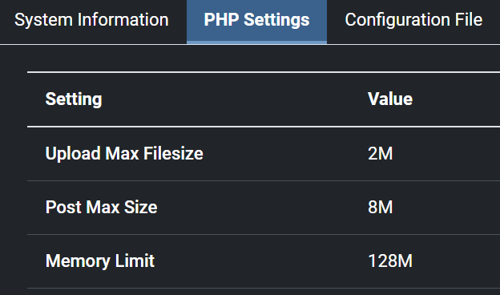
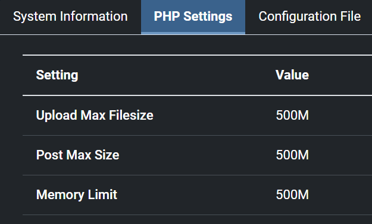

This article aims to answer the following situation: *I'm using a Docker image to run my website and I should modify the php.ini file; how do I do this?*

A real-world example is: you've followed my article <Link to="/blog/docker-joomla">Create your Joomla website using Docker</Link> and everything is working fine. The website is running and you wish, using the Joomla administration web interface, upload a big file to your site. But, then, you get an error *The selected file cannot be transferred because it is larger than the maximum upload size allowed*.

<!-- truncate -->

One of the easiest ways to do is to create a `.ini` file on your disk and share the file with your container.

Most probably, you'll have a `compose.yaml` file, please edit the file.

For the illustration, below you'll find a copy of the simplest `compose.yaml` file you can retrieve in my <Link to="/blog/docker-joomla">Create your Joomla website using Docker</Link> blog post. *You can have yours of course*. This is just for example.

<Snippet filename="compose.yaml" source="./files/compose.yaml" />

## Step one - Update your yaml file

The solution is to add the `volumes` line if not yet present in your file and, the most important one, the line for *overriding* the `php.ini` file like below:

<Snippet filename="compose.yaml" source="./files/compose.part2.yaml" />

## Step two - Create your own php.ini file

The second things to do is to create a file called `php.ini` in the same folder of your `compose.yaml` where you'll define your variables; f.i.

<Snippet filename="php.ini" source="./files/php.ini" />

So, now, your folder contains at least two files:

<Terminal>
$ pwd
/tmp/joomla

$ ls -alh
Permissions Size User       Group      Date Modified    Name
drwxr-xr-x     - christophe christophe 2023-11-04 09:32  .
drwxrwxrwt     - christophe christophe 2023-11-04 09:32 ..
.rw-r--r--   325 christophe christophe 2023-11-04 09:32 compose.yaml
-rw-r--r--     1 christophe christophe 2023-12-22 19:51 php.ini
</Terminal>

## Step three - Restart your container

This done, just run `docker compose down ; docker compose up --detach` in your terminal to stop your current container(s) and restart it/them.

Now, when restarting, Docker will take into account your latest changes and update accordingly the `php.ini` file that is present in Docker.

