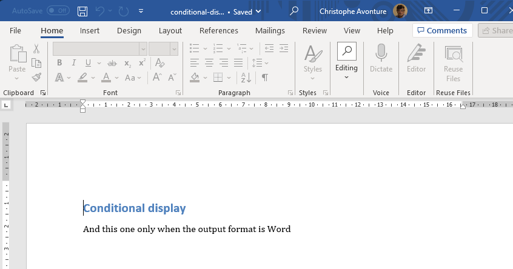
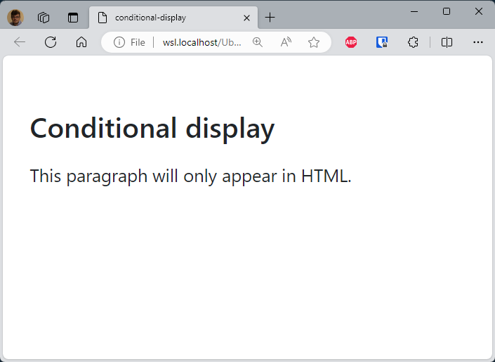
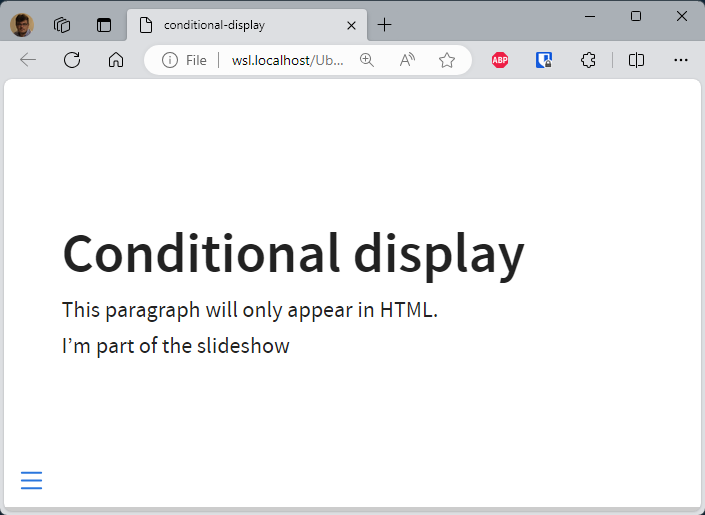
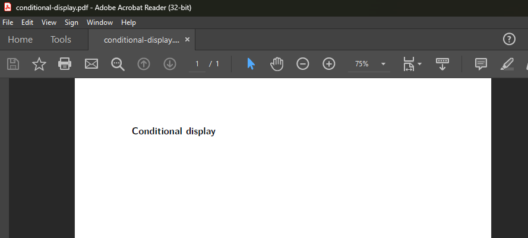

Like me, you've definitely abandoned Microsoft Word, PowerPoint and friends and do everything in Markdown. Like me, you use the same markdown file to generate your documentation in `html`, `pdf`, `docx`, `pptx`, `revealjs`, ... as required situation by situation.

My personal use case is the following one: I've a single, sometimes big, `readme.md` file for the documentation of a tool I've created. In this document, I could display f.i. tables containing several columns that could be wide. This won't be a problem if I display the documentation as an HTML document, since we have a horizontal scrollbar in the browser to navigate from left to right. But when I generate a PDF, the table will *explode* the width of my PDF page and the result will be awful.

Same idea when, if my output is an HTML page, I can easily display a listing of a few dozen lines of my source code, for example, to illustrate a feature. On the other hand, if I display it as a slideshow, this will be counterproductive, since the slide will be huge and not very effective.

And, if my goal is to generate a slideshow, the last part of my documentation will be a *Thank you for listening! Do you have any questions?* chapter. And that one should certainly not be part of the `docx` / `pdf` / `html` output. Just for the `revealjs` display.

<!-- truncate -->

<AlertBox variant="info" title="Docker image with Quarto">
If you don't have yet a Docker image with Quarto, read this article <Link to="/blog/docker-quarto">Running Quarto Markdown in Docker</Link>.
</AlertBox>

## content-visible when

The syntax is very easy since we need to use the special tag `:::` to delimit an area in the file and then use a special filter called `content-visible`. Get in-depth syntax on the [official documentation](https://quarto.org/docs/authoring/conditional.html)

Let's see in action; create a simple markdown file (`conditional-display.md`) on your disk and call quarto using `quarto render conditional-display.md --to xxx` and replace `xxx` by f.i. `docx`, `pdf`, `html`, `revealjs`, ...

<Snippet filename="conditional_display.md">

```markdown
# Conditional display

::: {.content-visible when-format="html"}
This paragraph will only appear in HTML.
:::

::: {.content-visible when-format="docx"}
And this one only when the output format is Word
:::

::: {.content-visible when-format="revealjs"}
I'm part of the slideshow
:::
```

</Snippet>

When rendering the markdown sample here above to Word, we'll have the title and the paragraph `when-format="docx"`:



For `when-format="html"`, too, only the title and one paragraph:



For `when-format="revealjs"`, it's a little bit smarter since revealjs is an HTML document:



And since we don't have any paragraph only conditional ones, when converting to PDF, we just have the title.



The `when-format="xxx"` is thus working exactly as expected.

<AlertBox variant="info" title="`.content-hidden`">
The exact opposite can be done using `.content-hidden`, see [documentation](https://quarto.org/docs/authoring/conditional.html#content-hidden).
</AlertBox>
