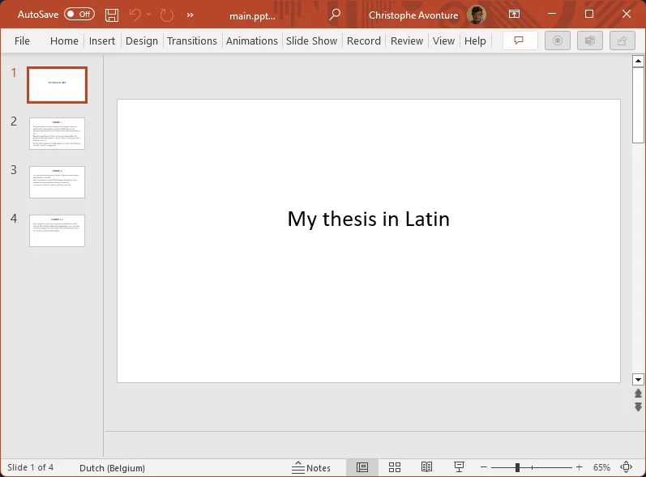
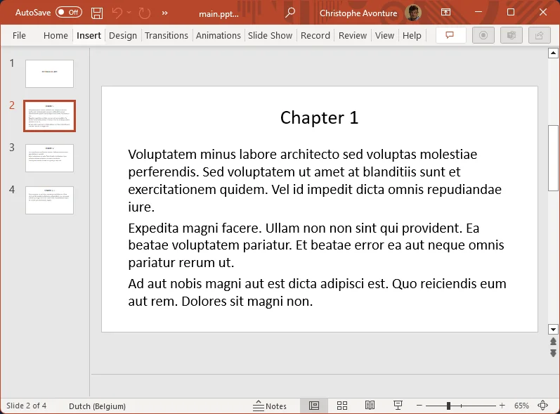
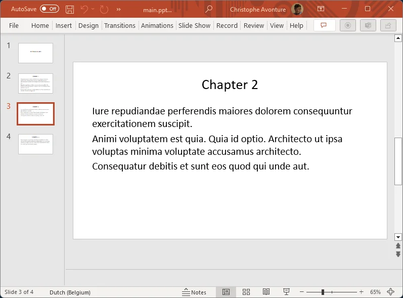
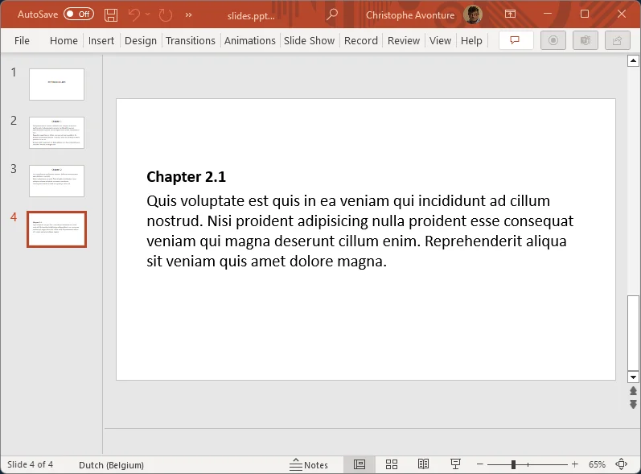

Quarto can convert a markdown file to a revealjs HTML slideshow but, too, can create a `pptx` file that you can open and play in Microsoft PowerPoint.

In this article, we'll create a `pptx` file from our markdown documentation.

<!-- truncate -->

<AlertBox variant="info" title="Docker image with Quarto">
If you don't have yet a Docker image with Quarto, read this article <Link to="/blog/docker-quarto">Running Quarto Markdown in Docker</Link>.

</AlertBox>

## Syntax

The official documentation of Quarto for rendering PowerPoint slides can be found on [https://quarto.org/docs/presentations/powerpoint.html](https://quarto.org/docs/presentations/powerpoint.html).

Let's start and create our `slides.md` file:

<Snippet filename="slides.md">

```markdown
---
title: "My thesis in Latin"
---

## Chapter 1
<!-- cspell:disable -->
Voluptatem minus labore architecto sed voluptas molestiae perferendis. Sed voluptatem ut amet at blanditiis sunt et exercitationem quidem. Vel id impedit dicta omnis repudiandae iure.

Expedita magni facere. Ullam non non sint qui provident. Ea beatae voluptatem pariatur. Et beatae error ea aut neque omnis pariatur rerum ut.

Ad aut nobis magni aut est dicta adipisci est. Quo reiciendis eum aut rem. Dolores sit magni non.

## Chapter 2

Iure repudiandae perferendis maiores dolorem consequuntur exercitationem suscipit.

Animi voluptatem est quia. Quia id optio. Architecto ut ipsa voluptas minima voluptate accusamus architecto.

Consequatur debitis et sunt eos quod qui unde aut.

---

### Chapter 2.1

Quis voluptate est quis in ea veniam qui incididunt ad cillum nostrud. Nisi proident adipisicing nulla proident esse consequat veniam qui magna deserunt cillum enim. Reprehenderit aliqua sit veniam quis amet dolore magna.

```

</Snippet>

Now, run the conversion using `quarto render slides.md --to pptx`

And you'll obtain this:









You'll find a lot of tips and tricks on the [official documentation page](https://quarto.org/docs/presentations/powerpoint.html).

<AlertBox variant="info" title="Did you know you can generate an online slideshow easily?">
Instead of running `quarto render slides.md --to pptx` and get a PowerPoint *offline* file, just run `quarto render slides.md --to revealjs` and enjoy your slideshow in your browser. Copy files to the internet and everyone can consult your great work.

</AlertBox>
