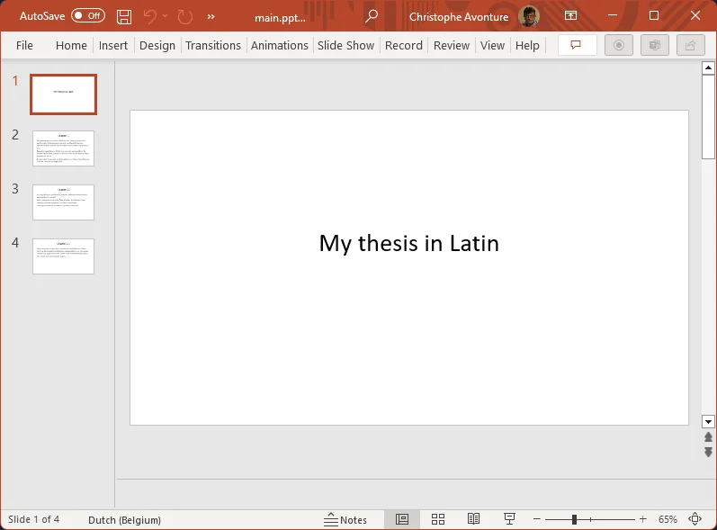
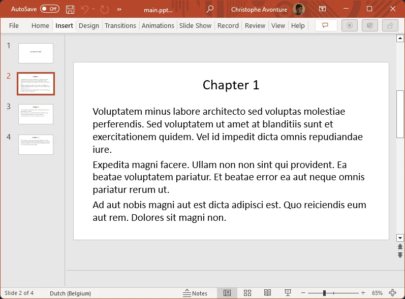
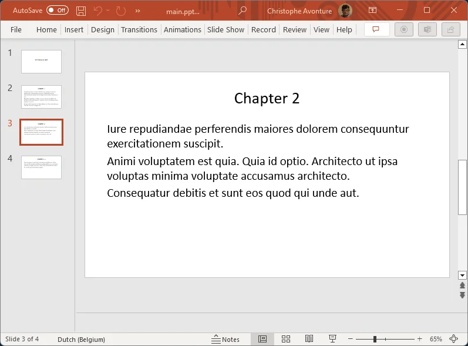
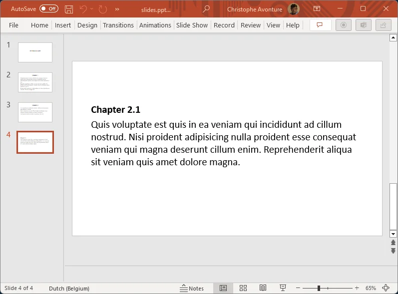

<TLDR>
This article shows how to convert a Markdown file into a PowerPoint `.pptx` deck with `quarto render slides.md --to pptx`, where level-2 headings become slide titles and a `---` line starts a new section — noting the same source can instead be rendered to an online reveal.js slideshow with `--to revealjs`.
</TLDR>

Quarto can convert a markdown file to <Link to="/blog/quarto-revealjs-tips">a revealjs HTML slideshow</Link> but can also create a `pptx` file that you can open and play in Microsoft PowerPoint.

In this article, we'll create a `pptx` file from our markdown documentation.

<!-- truncate -->

## From Markdown to PowerPoint in one command

Take a plain Markdown file called `slides.md` and run:

<Terminal typewriter>
$ quarto render slides.md --to pptx
</Terminal>

Open the `.pptx` that comes out, and this is your first slide:



The rule is worth remembering because it's the whole syntax: **every `##` heading becomes a slide title, and a `---` line starts a new slide**. Your document structure *is* your slide structure.

## The source file

Here is the `slides.md` that produced the deck — the content is filler, the structure is what matters:

<Snippet filename="slides.md">

```markdown
---
title: "My thesis in Latin"
---

## Chapter 1
<!-- cspell:disable -->
Voluptatem minus labore architecto sed voluptas molestiae perferendis.

Expedita magni facere. Ullam non non sint qui provident.

## Chapter 2

Iure repudiandae perferendis maiores dolorem consequuntur exercitationem suscipit.

---

### Chapter 2.1

Quis voluptate est quis in ea veniam qui incididunt ad cillum nostrud.

```

</Snippet>

And the three remaining slides it generates:







You'll find a lot of tips and tricks on the [official documentation page](https://quarto.org/docs/presentations/powerpoint.html).

<AlertBox variant="info" title="Docker image with Quarto">
If you don't have yet a Docker image with Quarto, read this article <Link to="/blog/docker-quarto">Running Quarto Markdown in Docker</Link>.

</AlertBox>

## Conclusion

The nice thing here isn't that Quarto makes PowerPoint files — it's that your documentation and your slide deck become the same file. Update a chapter, re-render, and the presentation is up to date. No copy/paste into a slide editor, no two versions of the same content drifting apart.

And the very same `slides.md` renders as an online slideshow: run `quarto render slides.md --to revealjs` instead, put the result on a web server, and everyone can consult your work from a browser. See <Link to="/blog/quarto-revealjs-tips">Quarto - revealjs tips</Link> for what you can do with it.
