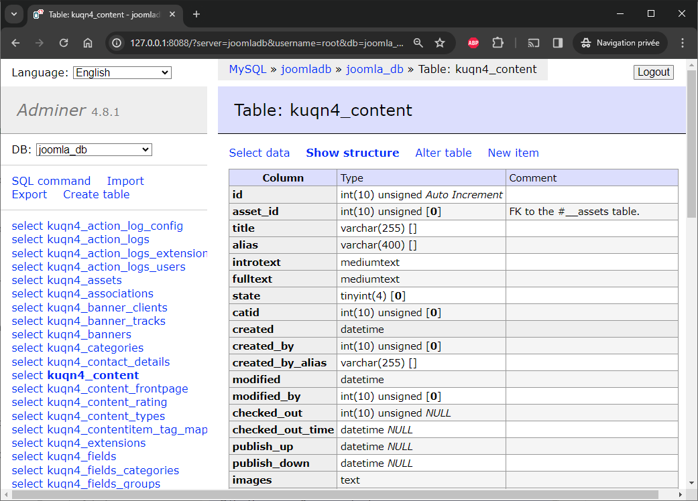
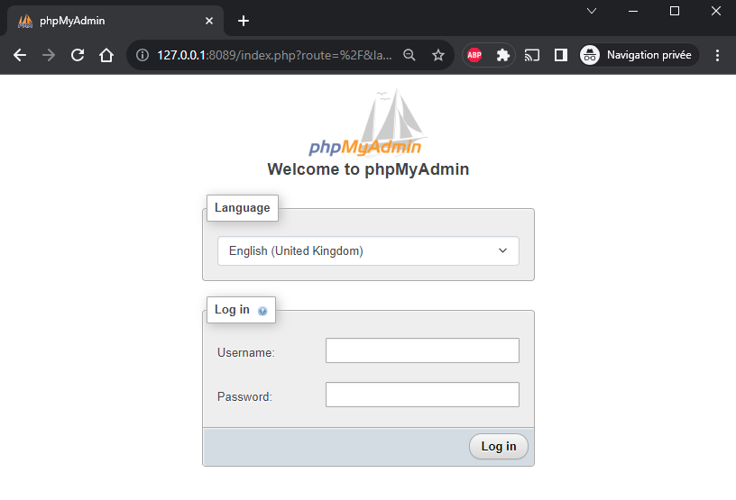
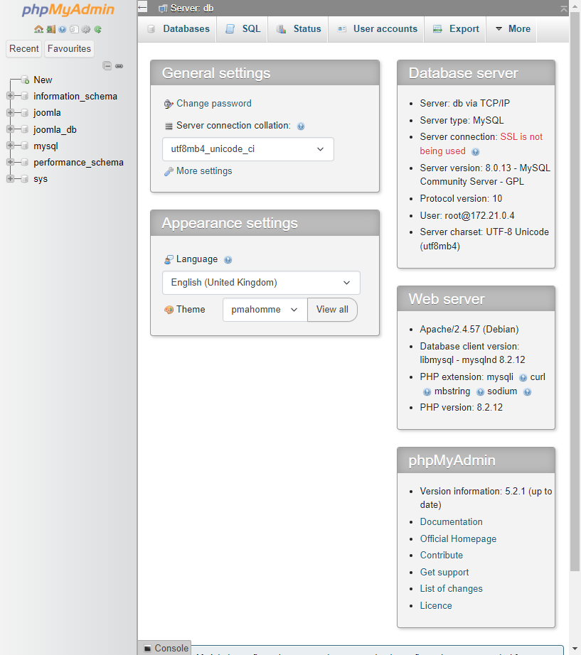

You've a dockerized application and one of its container is a MariaDB, MySQL or PostgreSQL service.

Your need is to start a web database management interface like [Adminer](https://hub.docker.com/_/adminer/), [pgadmin](https://hub.docker.com/r/dpage/pgadmin4/) or [phpmyadmin](https://hub.docker.com/_/phpmyadmin) and be able to access your tables and your records.

This can be done in just one command line instruction.

<!-- truncate -->

Before to be able to start the command, you should provide a few information:

* you should know the **name of the docker container** to connect and
* you should know the **name of the used network**.

## Retrieve the list of our containers

We'll use `docker container list` to get the list of containers, we just want to get the image name and the container name.

**For illustration purpose**, here is the output on my machine right now:

<Terminal>
$ {`docker container list --all --format "table {{.Image}}\t{{.Names}}"`}
IMAGE                        NAMES
mysql:8.0.13                 joomla-joomladb-1
joomla:5.0.1-php8.2-apache   joomla-joomla-1
</Terminal>

For our example, we want to connect to the MySQL 8.x `joomla-joomladb-1` container.

The second thing to determine is the name of the network used by that container. We'll use `docker inspect` here (read my article <Link to="/blog/docker-inspect">Docker inspect - Retrieve network's information</Link>).

<Terminal>
$ docker inspect joomla-joomladb-1 | jq -r '.[0].NetworkSettings.Networks'
</Terminal>

```json
{
  # highlight-next-line
  "joomla_default": {
    "IPAMConfig": null,
    "Links": null,
    "Aliases": [
      "joomla-joomladb-1",
      "joomladb",
      "8bd385bf14c4"
    ],
    [ ... ]
  }
}
```

The name of the network used by `joomla-joomladb-1` is thus `joomla_default` as you can see in the returned JSON string.

## Run Adminer

The command line to start is something like

<Terminal>
$ {`docker run -d --rm --name adminer --network <network_name> --link <container-name>:db -p 8088:8080 adminer`}
</Terminal>

and thus, with values from our example,

<Terminal>
$ docker run -d --rm --name adminer --network joomla_default --link joomla-joomladb-1:db -p 8088:8080 adminer
</Terminal>

The flag `--network` should thus be set to the name of the used network and `--link` is a two part value, the name of the container to connect followed by `:db`.

:::tip Use your own port using the `-p` flag
In the example, we'll make adminer available on port `8088`. Don't hesitate to use any other free ones.
:::

Since we've defined port `8088` in our command above, just go to `http://127.0.0.1:8088` to get access to the Adminer web interface.

* `System`: select the used database service,
* `Server`: should be set to the name of the database service inside your Docker container,
* `Username`: has to be initialized to the name of the database user,
* `Password`: associated password,
* `Database`: can stay empty to get all, initialize it to the name of the database to open otherwise.

To retrieve the name of the server, it's the name of the service as defined in your `compose.yaml` file but you can retrieve it also using this command: `docker inspect joomla-joomladb-1 | grep com.docker.compose.service`. Just replace `joomla-joomladb-1` by the name of your container.

:::tip Using parametrized hyperlink
If you already know some of these values, you can provide them in a link, like `http://127.0.0.1:8088?server=joomladb&username=root&db=joomla_db`.
:::



## Run pgadmin

:::info pgadmin is only for PostgreSQL databases
:::

## Run phpmyadmin

For phpmyadmin, the command line to start is something like

<Terminal>
$ {`docker run -d --rm --name phpmyadmin --network <network_name> --link <container-name>:db -p 8089:80 phpmyadmin`}
</Terminal>

and thus, with values from our example,

<Terminal>
$ docker run -d --rm --name phpmyadmin --network joomla_default  --link joomla-joomladb-1:db -p 8089:80 phpmyadmin
</Terminal>

To open phpmyadmin, start your browser and navigate to `http://127.0.0.1:8089` since we have defined port `8089` here.




