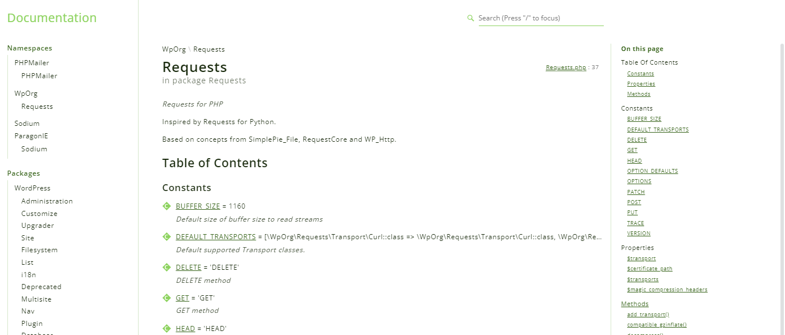

You've a PHP codebase and you wish hop, hop, two strokes of the teaspoon, generate a documentation site without any headaches.

Simple! [phpDocumentor](https://docs.phpdoc.org/) do it for you and since a Docker image exists; you can do this almost by running just one command.

<!-- truncate -->

## Some preparation work

<AlertBox variant="note" title="Skip this step if you already have a PHP codebase somewhere on your disk" />

For the illustration, please start a Linux shell and run `mkdir -p /tmp/wordpress && cd $_`.

Then run `curl -LOJ --silent --output wordpress https://github.com/WordPress/wordpress-develop/archive/refs/tags/6.4.2.zip` to download WordPress v6.4.2.  You'll get a file called `wordpress-develop-6.4.2.zip` on your disk.

Unzip it by running `unzip wordpress-develop-6.4.2.zip && rm wordpress-develop-6.4.2.zip` and now, you'll have a folder called `wordpress-develop-6.4.2` so please jump in it `cd wordpress-develop-6.4.2`.

## Run phpDocumentor

[phpDocumentor](https://docs.phpdoc.org/) requires a configuration file. We'll create it.

Please create a new file called `phpunit.xml` with this content, in your project's directory:

<Snippet filename="phpunit.xml" source="./files/phpunit.xml" />

The configuration job is already finished.

To create the phpDocumentation, simply run `docker run -it --rm -u $(id -u):$(id -g) -v .:/data phpdoc/phpdoc:3`.

That command will scan the project's codebase (here, the folder `src`) and will create a new directory called `.phpdoc` where the documentation will be saved.

<AlertBox variant="info" title="WSL2 - Windows">
If you're running under WSL2, to get access to the documentation, just run `powershell.exe .phpdoc/index.html` file to start the documentation. Read the <Link to="/blog/wsl-powershell">Starting the default associated Windows program on WSL</Link> or <Link to="/blog/wsl-windows-explorer">Open your Linux folder in Windows Explorer</Link> for more information.

</AlertBox>

The phpDocumentor website will looks like this:

