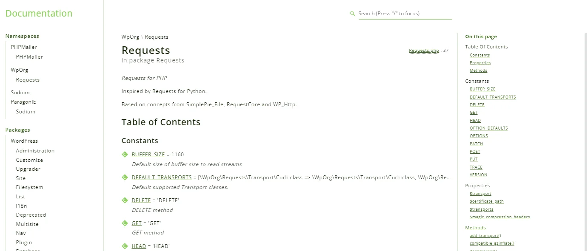

<TLDR>
This article shows how to generate a browsable documentation site for a PHP codebase (using WordPress core as the example) with zero local install: a `phpdoc.xml` config file plus a single `docker run ... phpdoc/phpdoc:3` command scans the `src` folder and outputs a full HTML documentation site to `.phpdoc/index.html`.
</TLDR>

You've got a PHP codebase and you wish — hop, hop, two shakes of a lamb's tail — to generate a documentation site without any headaches.

Simple! [phpDocumentor](https://docs.phpdoc.org/) does it for you, and since a Docker image exists, you can do almost all of this by running just one command.

<!-- truncate -->

## One command, a full documentation website

From the root of your PHP project, run:

<Terminal typewriter>
$ docker run -it --rm -u $(id -u):$(id -g) -v .:/data phpdoc/phpdoc:3
</Terminal>

And here is what lands in the `.phpdoc` folder — this one was generated from the WordPress codebase:

A browsable site with the namespaces, the classes, their methods and the docblocks you wrote. Nothing was installed on your machine: phpDocumentor, PHP and every dependency live inside the image, which disappears with the container thanks to `--rm`.

## The configuration file

[phpDocumentor](https://docs.phpdoc.org/) requires a configuration file to know what to scan and where to write. Please create a new file called `phpdoc.xml` with this content, in your project's directory:

<Snippet filename="phpdoc.xml" source="./files/phpdoc.xml" />

That's what tells the command above to scan the `src` folder and to create the `.phpdoc` directory where the documentation will be saved.

<AlertBox variant="info" title="WSL2 - Windows">
If you're running under WSL2, to get access to the documentation, just run `powershell.exe .phpdoc/index.html` file to start the documentation. Read the <Link to="/blog/wsl-powershell">Starting the default associated Windows program on WSL</Link> or <Link to="/blog/wsl-windows-explorer">Open your Linux folder in Windows Explorer</Link> for more information.

</AlertBox>

For the illustration above, I used the WordPress codebase. Please start a Linux shell and run `mkdir -p /tmp/wordpress && cd $_`.

Then run `curl -L --silent -o wordpress-develop-6.4.2.zip https://github.com/WordPress/wordpress-develop/archive/refs/tags/6.4.2.zip` to download WordPress v6.4.2.  You'll get a file called `wordpress-develop-6.4.2.zip` on your disk.

Unzip it by running `unzip wordpress-develop-6.4.2.zip && rm wordpress-develop-6.4.2.zip` and now, you'll have a folder called `wordpress-develop-6.4.2` so please jump in it `cd wordpress-develop-6.4.2`.

## Conclusion

One `docker run`, one XML file, and any PHP codebase — yours, or one you've just inherited — becomes a documentation site you can browse. The interesting part isn't the generation itself, it's that the quality of the output is a direct mirror of the docblocks in the code: run it on a project once and you immediately see where the documentation effort actually went.

Bash has no phpDocumentor equivalent, which is why I wrote my own; see <Link to="/blog/linux-generate-documentation-from-bash-scripts">Linux - Generate documentation from Bash scripts</Link>. And for documentation that isn't extracted from code at all, there's <Link to="/blog/quarto-industrialisation">Quarto - How I Built a Self-Documenting Ecosystem for 50+ Projects</Link>.
