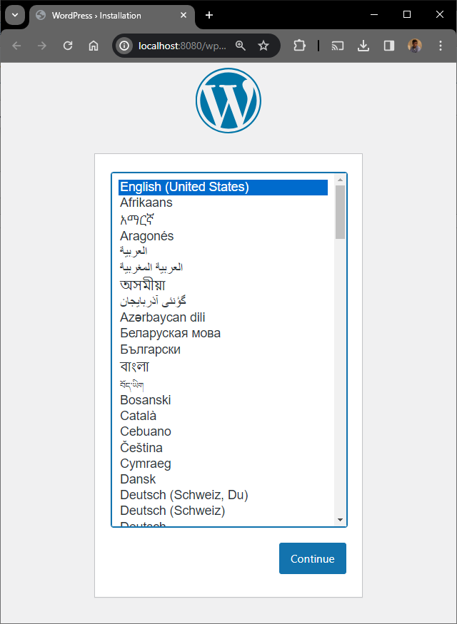
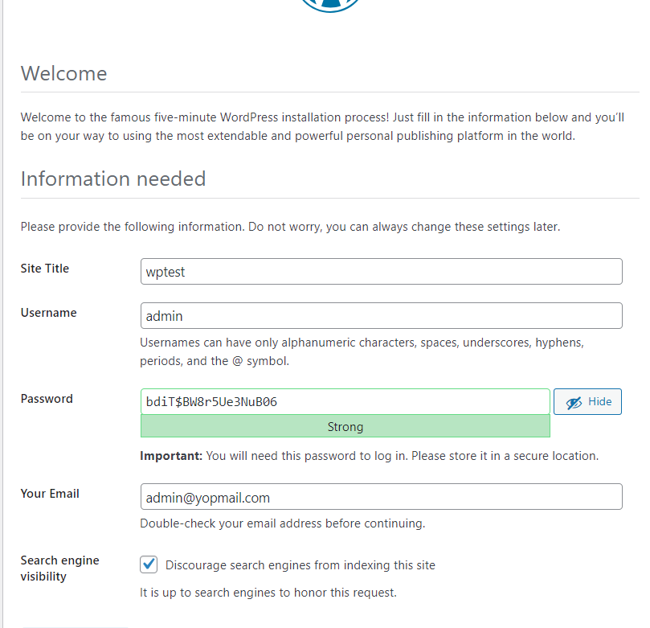
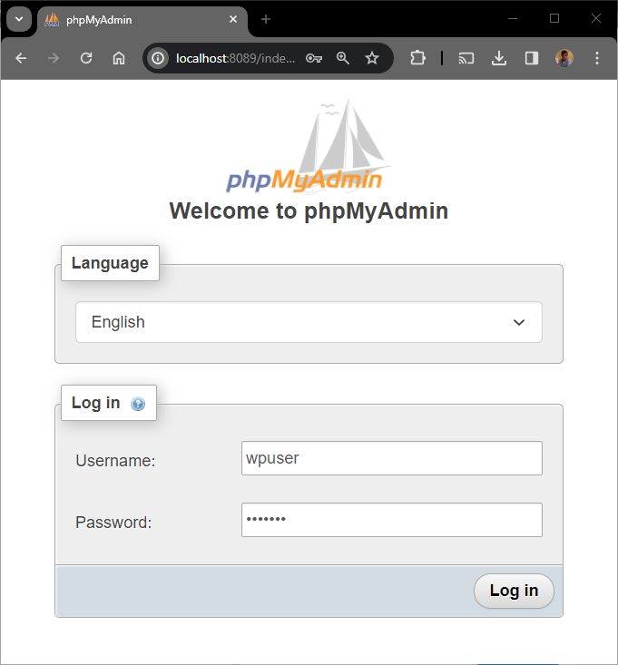

Do you think it's possible to run a new WordPress site in just three commands?  Impossible, isn't it. Well, in fact, yes, it's possible.

Let's take a look...

<!-- truncate -->

In the <Link to="/blog/docker-joomla">Create your Joomla website using Docker</Link> article, we learned that if we need more than one Docker service (php/apache as well as mysql), we need to have a `compose.yaml` file. It's true and it's the easiest way to manage the application.

But we can run Docker containers by hand and, in that case, no such file is needed. We'll learn this technique in this article.

## First step, we need a network

Using a network will allow containers to communicate with each other.

<AlertBox variant="caution" title="You need a network, don't skip">
As soon as you've two or more containers, you need a network.

</AlertBox>

We'll create our. Please copy/paste the command below in a terminal (DOS or Linux) and run it.

<Terminal>
$ docker network create wordpress
</Terminal>

## Second step, we need a database container

For this article, I propose to use MySQL 8.x or, if you prefer it, MariaDB 11.x. Select the one you prefer and execute the command in a terminal.

For MySQL 8.x:

<Terminal>
$ docker run -d --name db_wordpress --hostname db_wordpress --network wordpress -e MYSQL_RANDOM_ROOT_PASSWORD=1 -e MYSQL_DATABASE=wordpress -e MYSQL_USER=wpuser -e MYSQL_PASSWORD=example mysql:8.0.13
</Terminal>

For MariaDB:

<Terminal>
$ docker run -d --name db_wordpress --hostname db_wordpress --network wordpress -e MYSQL_RANDOM_ROOT_PASSWORD=1 -e MYSQL_DATABASE=wordpress -e MYSQL_USER=wpuser -e MYSQL_PASSWORD=example mariadb:11.2.2
</Terminal>

Once started by Docker, the MySQL / MariaDB container will create an empty database called `wordpress`, a user called `wpuser` and his password will be `example` (as defined by our variables `MYSQL_DATABASE`, `MYSQL_USER` and `MYSQL_PASSWORD`). The container will be named `db_wordpress` (as defined by `--hostname`).

## Third step, we need WordPress

And now, we need a second container for WordPress itself. I propose to use the latest version on that time:

<Terminal>
$ docker run -d --name app_wordpress --hostname app_wordpress --network wordpress -p 8080:80 -e WORDPRESS_DB_HOST=db_wordpress -e WORDPRESS_DB_NAME=wordpress -e WORDPRESS_DB_USER=wpuser -e WORDPRESS_DB_PASSWORD=example wordpress:6.4.2-php8.2-apache
</Terminal>

The following command will run WordPress in an Apache container and making the site available on `http://127.0.0.1:8080`.

As you can see, we don't need to pay attention to the `wp-config.php` file since we are setting environment variables in our `docker run` command.

<AlertBox variant="info" title="Error establishing a database connection">
If you get `Error establishing a database connection`, please wait a little before refreshing the web page. It means MySQL / Maria wasn't yet ready to handle the connection.

</AlertBox>

## Optional, start phpmyadmin

As we've seen in the [Using Adminer, pgadmin or phpmyadmin to access your Docker database container](docker-adminer-pgadmin-phpmyadmin) article, we can access to a database container using f.i. phpmyadmin. To do this, just run the following command in a terminal:

<Terminal>
$ docker run -d --rm --network wordpress --name phpmyadmin -e PMA_HOST=db_wordpress -p 8089:80 phpmyadmin
</Terminal>

By surfing to `http://127.0.0.1:8089`, you can connect to the database. Credentials to use for the connection are `wpuser` / `example`.

## Remove containers

If you wish to stop and remove containers after usage, you can run the following bloc of instructions in a Linux terminal:

<Terminal>
$ docker rm $(docker stop $(docker ps -a -q --filter="name=app_wordpress"))

$ docker rm $(docker stop $(docker ps -a -q --filter="name=db_wordpress"))

$ docker network rm wordpress

</Terminal>

Or, by hand, go to your `Docker Desktop` interface, click on the `containers` tab and remove the containers manually.

## Conclusion

As introduced, we just need three commands to create, from nihil, a new wordpress site on our disk. This just in seconds (depends on the speed of your computer). Easy no?

<Terminal>
$ docker network create wordpress

$ docker run -d --name db_wordpress --hostname db_wordpress --network wordpress -e MYSQL_RANDOM_ROOT_PASSWORD=1 -e MYSQL_DATABASE=wordpress -e MYSQL_USER=wpuser -e MYSQL_PASSWORD=example mysql:8.0.13

$ docker run -d --name app_wordpress --hostname app_wordpress --network wordpress -p 8080:80 -e WORDPRESS_DB_HOST=db_wordpress -e WORDPRESS_DB_NAME=wordpress -e WORDPRESS_DB_USER=wpuser -e WORDPRESS_DB_PASSWORD=example wordpress:6.4.2-php8.2-apache
</Terminal>