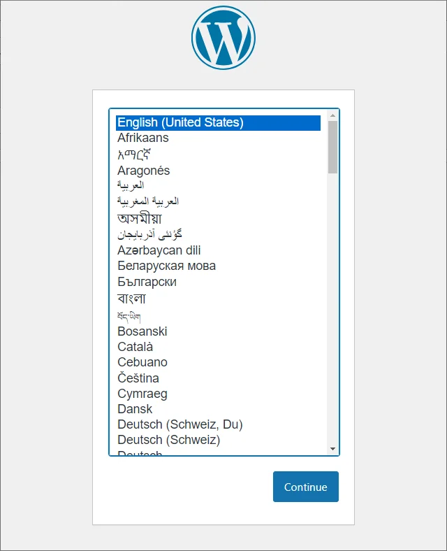
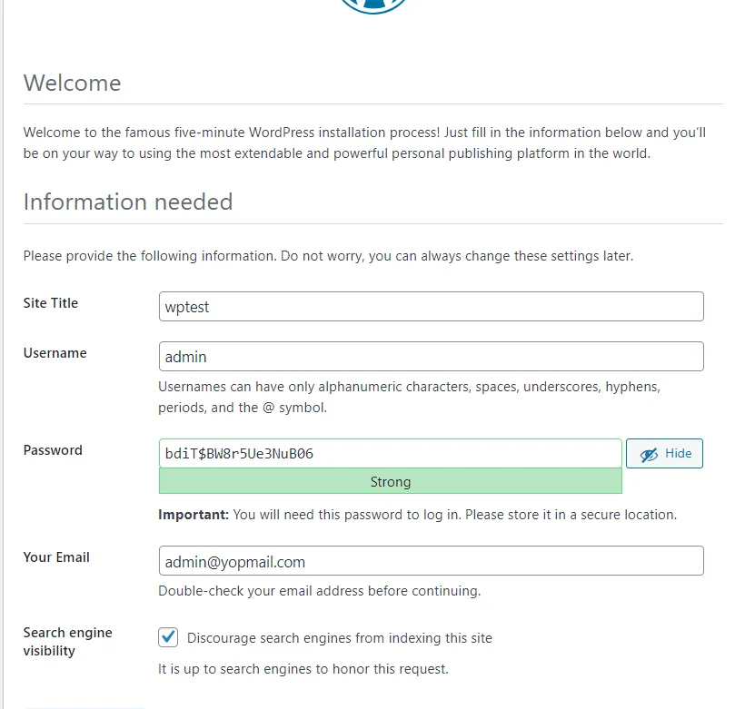
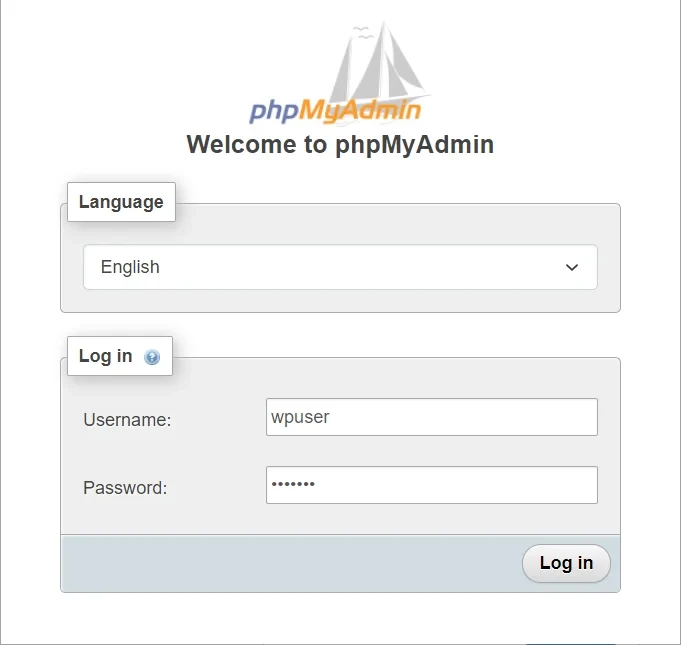

<TLDR>
This article spins up a full WordPress site using plain `docker run` commands instead of `compose.yaml`: create a shared network, start a MySQL/MariaDB container with the WordPress database and user pre-configured via environment variables, then start the WordPress container itself pointing at that database — three commands to a working site at `http://127.0.0.1:8080`, plus an optional phpMyAdmin container for database access.
</TLDR>

Do you think it's possible to run a new WordPress site in just three commands? Impossible, isn't it? Well, in fact, yes, it's possible.

Let's take a look...

<!-- truncate -->

## Three commands, one WordPress site

Here they are, in full:

<Terminal typewriter source="./files/terminal-1.txt" />

Surf to `http://127.0.0.1:8080` and WordPress greets you with its installation wizard:

<AlertBox variant="info" title="Error establishing a database connection">
If you get `Error establishing a database connection`, please wait a little before refreshing the web page. It means MySQL / Maria wasn't yet ready to handle the connection.

</AlertBox>

No `compose.yaml`, no `wp-config.php` to edit: a shared network lets the two containers talk to each other, and every setting WordPress needs is passed as an environment variable on the command line.

In the <Link to="/blog/docker-joomla">Create your Joomla website using Docker</Link> article, we learned that as soon as we need more than one Docker service (php/apache as well as mysql), we need a `compose.yaml` file. It's true and it's the easiest way to manage the application in the long run — but for a throwaway site, running the containers by hand works just as well. Let's look at those three commands one by one.

## First step, we need a network

Using a network will allow containers to communicate with each other (see <Link to="/blog/docker-network-and-extra-hosts">Using Docker network and the extra_hosts property</Link> for the details).

<AlertBox variant="caution" title="You need a network, don't skip">
As soon as you've two or more containers, you need a network.

</AlertBox>

We'll create our network. Please copy/paste the command below in a terminal (DOS or Linux) and run it.

<Terminal typewriter>
$ docker network create wordpress
</Terminal>

## Second step, we need a database container

For this article, I propose to use MySQL 8.x or, if you prefer it, MariaDB 11.x. Select the one you prefer and execute the command in a terminal.

For MySQL 8.x:

<Terminal typewriter>
$ docker run -d --name db_wordpress --hostname db_wordpress --network wordpress -e MYSQL_RANDOM_ROOT_PASSWORD=1 -e MYSQL_DATABASE=wordpress -e MYSQL_USER=wpuser -e MYSQL_PASSWORD=example mysql:8.4
</Terminal>

For MariaDB:

<Terminal typewriter>
$ docker run -d --name db_wordpress --hostname db_wordpress --network wordpress -e MYSQL_RANDOM_ROOT_PASSWORD=1 -e MYSQL_DATABASE=wordpress -e MYSQL_USER=wpuser -e MYSQL_PASSWORD=example mariadb:11.4
</Terminal>

Once started by Docker, the MySQL / MariaDB container will create an empty database called `wordpress`, a user called `wpuser` and his password will be `example` (as defined by our variables `MYSQL_DATABASE`, `MYSQL_USER` and `MYSQL_PASSWORD`). The container will be named `db_wordpress` (as defined by `--hostname`).

## Third step, we need WordPress

And now, we need a second container for WordPress itself. I propose to use the latest version available at that time:

<Terminal typewriter>
$ docker run -d --name app_wordpress --hostname app_wordpress --network wordpress -p 8080:80 -e WORDPRESS_DB_HOST=db_wordpress -e WORDPRESS_DB_NAME=wordpress -e WORDPRESS_DB_USER=wpuser -e WORDPRESS_DB_PASSWORD=example wordpress:php8.3-apache
</Terminal>

That command runs WordPress in an Apache container and makes the site available at `http://127.0.0.1:8080` — the screen shown at the beginning of this article.

The `-p 8080:80` flag is the only one about your host machine: change `8080` if that port is already taken. All the others describe how WordPress reaches the database container, by its `--hostname`, over the `wordpress` network.

## Optional, start phpmyadmin

As we've seen in the <Link to="/blog/docker-adminer-pgadmin-phpmyadmin">Using Adminer, pgadmin or phpmyadmin to access your Docker database container</Link> article, we can access a database container using f.i. phpMyAdmin. To do this, just run the following command in a terminal:

<Terminal typewriter>
$ docker run -d --rm --network wordpress --name phpmyadmin -e PMA_HOST=db_wordpress -p 8089:80 phpmyadmin
</Terminal>

By surfing to `http://127.0.0.1:8089`, you can connect to the database. Credentials to use for the connection are `wpuser` / `example`.

## Remove containers

If you wish to stop and remove containers after usage, you can run the following bloc of instructions in a Linux terminal:

<Terminal typewriter source="./files/terminal-2.txt" />

Or, by hand, go to your `Docker Desktop` interface, click on the `containers` tab and remove the containers manually.

## Conclusion

As introduced, we just need three commands to create, from scratch, a new WordPress site on our disk. This takes just seconds (depending on the speed of your computer). Easy, no?

Keep in mind that everything here lives inside the containers: the day you run the removal commands above, the site is gone. If you want it to survive, the next thing to add is a <Link to="/blog/docker-volume">volume</Link>.
