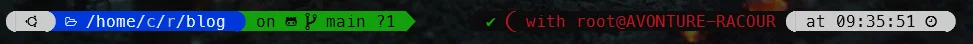

<TLDR>
This article shows how to try the Powerlevel10k Zsh prompt theme risk-free using a disposable Alpine Docker container (a one-liner from the official README): everything — git, zsh, nano, the theme, and its config wizard — runs entirely in RAM and disappears on `exit`, letting you decide whether to install it for real before touching your actual machine.
</TLDR>

When you're working with Linux (also working with WSL thus), there are many ways to personalize your prompt. One of the simplest solutions is to use [Powerlevel10k](https://github.com/romkatv/powerlevel10k) and its wizard.

In this article we're going to use a Docker container just to: *test and discard*. You'll see exactly what the prompt looks like, play with the wizard, and leave your own machine untouched.

The tip comes from [https://github.com/romkatv/powerlevel10k/blob/master/README.md](https://github.com/romkatv/powerlevel10k/blob/master/README.md#try-it-in-docker)

<!-- truncate -->

## What Powerlevel10k looks like

Here is my own prompt, once the wizard has run:

Read it from left to right: the current folder, then the git branch (`main`) with `?1` telling me one file is modified and not committed, then — on the right side — a green check for the previous command, the `root@AVONTURE-RACOUR` identity I'm connected as, and the time the command finished.

All of that, permanently, without typing `git status` or `whoami`. That's the pitch; the rest of this article is about trying it without touching your machine.

## Try it without installing anything

By running the single command below, you'll download a very small Linux Alpine image then start some initializations like installing `git`, `nano`, `zsh`, ... The Powerlevel10k repository will be downloaded from Github and its wizard will be started.

<Terminal typewriter source="./files/terminal-1.txt" />

Answer the wizard's questions, play with the result, and decide if you want to adopt it or not.

<AlertBox variant="note" title="Everything is done in RAM; nothing on your disk">
Running the `docker run` command here above will download a Docker Alpine Linux image on your disk (less than 7 MB) then will install binaries inside the running container so, by leaving the container using the `exit` command, nothing will stay on your disk. Ideal for testing.

</AlertBox>

## Why I kept it

- When an instruction is finished, the new prompt displays the time taken by the instruction, useful when you're trying to optimize a command,
- On the right, you can see immediately if the instruction has failed, with a red display and the error code (`exitcode`),
- It integrates nicely with <Link to="/blog/windows-terminal">Windows Terminal</Link> if you're on WSL, and with the modular setup described in <Link to="/blog/modular-zsh-workflow">Beyond the Monolith - Organizing Your ZSH Workflow Like a Pro</Link>,
- And, of course, the visual aspect, which is pretty cool.

And also, because I work in Docker containers on a daily basis, using Powerlevel10k locally gives me a strong visual indication to remind me at all times whether I'm local or in a container.

## Conclusion

The nice thing about this sandbox is that the decision costs you nothing: you type one command, you look at the prompt for two minutes, and you type `exit`. Whatever you answered to the wizard disappears with the container.

If you liked what you saw, do it for real: <Link to="/blog/zsh-install">How to install Oh-My-ZSH</Link> covers the on-disk installation (Oh-My-Zsh first, then Powerlevel10k), and the official [installation guide](https://github.com/romkatv/powerlevel10k#installation) has the details for every other setup.
