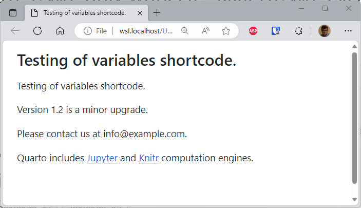
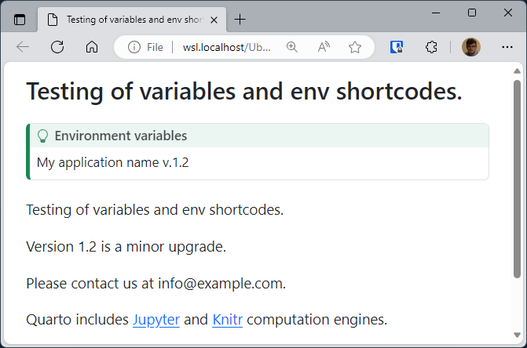

My use case is: I need to write some technical, long, documentation where I need to provide some information like IP addresses of used servers, some paths to the application, configuration folders, ...

The *normal way to do this* is to just put information directly in the documentation and to make sure to update every occurrence in case of changes during the lifecycle of the application.

The best way is probably to use an external file where information are stored in a key-value form and, during the rendering process of Quarto, replace short codes by values.

<!-- truncate -->

:::tip Docker image with Quarto
If you don't have yet a Docker image with Quarto, read this article <Link to="/blog/docker-quarto">Running Quarto Markdown in Docker</Link>.
:::

You can find the official documentation on [https://quarto.org/docs/authoring/variables.html](https://quarto.org/docs/authoring/variables.html).

## Variables

Here is how to proceed:

1. First, it's mandatory, you should have a file called `_quarto.yml` in the same directory as the file (let's say `documentation.md`) you will convert using Quarto. *Note: that file can be empty (see [https://github.com/quarto-dev/quarto-cli/issues/2918](https://github.com/quarto-dev/quarto-cli/issues/2918) for more information on this).*
2. Then you should create a file called `_variables.yml` with your key-values and, finally,
3. You need to have your markdown file.

So, `_quarto.yml` can stay empty. His presence is just to tell to Quarto the markdown file is part of a project.

Here is an example of what can be a `_variables.yml` content:

<Snippet filename="_variables.yml">

```yaml
version: 1.2

email:
  info: info@example.com
  support: support@example.com

engine:
  jupyter: "[Jupyter](https://jupyter.org)"
  knitr: "[Knitr](<https://yihui.name/knitr>)"
```

</Snippet>

And here is a markdown example (file `documentation.md`):

<Snippet filename="documentation.md">

```markdown
---
title: Testing of variables short code.
---



Version  is a minor upgrade.

Please contact us at .

Quarto includes  and
 computation engines.
```

</Snippet>

As you can see, the short code is something like `` or ``.

`meta` is for metadata of the document like his title and `var` to retrieve information's from `_variables.yml`.

By running `quarto preview documentation.md --to html`, you'll get this:



This solution is perfect when you want to isolate the "static" content of your documentation from variables, i.e. anything that is subject to regular change or would be repeated in several places in your document.

## Environment variables

You can too retrieve environment variables using `` but, there, you should first load these variables in case of need.

For instance, you can have a `.env` file like this:

<Snippet filename=".env">

```ini
APPLICATION_NAME=My application name
VERSION_NUMBER=1.2
```

</Snippet>

Then, before calling the Quarto rendering process, you should load the file. Since I'm using Docker, I do this like this:

<Terminal>
$ docker run --rm -it -v .:/input -w /input --env-file .env cavo789/quarto quarto preview documentation.md --to html
</Terminal>

Here is the content of `documentation.md`:

<Snippet filename="documentation.md">

```markdown
---
title: Testing of variables and env short codes.
---

:::{.callout-tip}
## Environment variables
 v.
:::



Version  is a minor upgrade.

Please contact us at .

Quarto includes  and
 computation engines.
```

</Snippet>

I'm thus using `--env-file .env` in the `docker run` instruction so Docker will load my variables and make them available in the container. Quarto can then access them.



This solution is even better if you have an application such as Laravel, and therefore already have such an .env file. As a result, you reuse the same values for both the application and the documentation.
