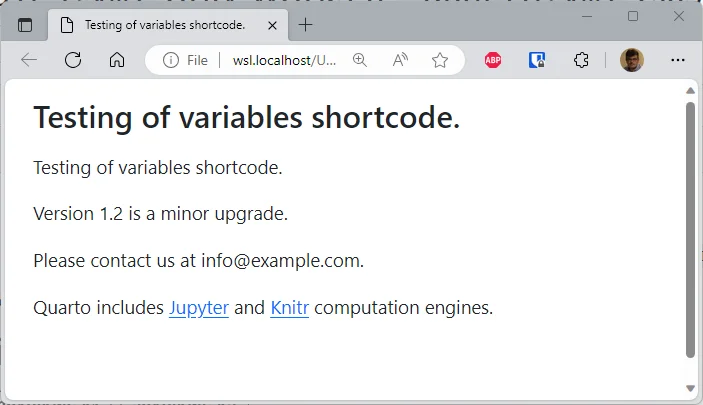
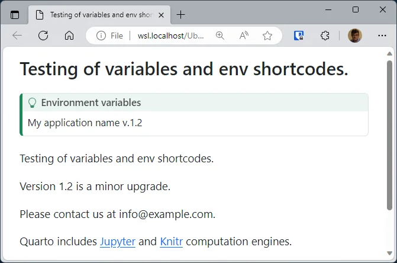

<TLDR>
This article shows how to avoid hardcoding recurring values (IPs, paths, emails) in Quarto documentation by storing them in a `_variables.yml` file and referencing them with `` short codes, or via `` for document metadata. It also covers reading values from an `.env` file with ``, loaded through `--env-file` when rendering Quarto in Docker.
</TLDR>

My use case is: I need to write some long, technical documentation where I need to provide some information like IP addresses of used servers, some paths to the application, configuration folders, ...

The *normal way to do this* is to just put information directly in the documentation and to make sure to update every occurrence in case of changes during the lifecycle of the application.

The best way is probably to use an external file where information is stored in a key-value form and, during the rendering process of Quarto, replace short codes by values.

<!-- truncate -->

## What Quarto variables do for you

You write this in your Markdown source:

```markdown
Version  is a minor upgrade.

Please contact us at .
```

And this is what Quarto renders:



The version number and the email address now live in one single file. Change them there, re-render, and every page of the documentation is up to date — including the twenty places you'd have forgotten.

All it takes: a `_variables.yml` holding your key-values, a `_quarto.yml` (which may be empty), and the `` / `` short codes in your text.

## Setting it up

<AlertBox variant="info" title="Docker image with Quarto">
If you don't have yet a Docker image with Quarto, read this article <Link to="/blog/docker-quarto">Running Quarto Markdown in Docker</Link>.

</AlertBox>

You can find the official documentation on [https://quarto.org/docs/authoring/variables.html](https://quarto.org/docs/authoring/variables.html).

Here is how to proceed:

<StepsCard
  variant="steps"
  steps={[
    "First, it's mandatory, you should have a file called `_quarto.yml` in the same directory as the file (let's say `documentation.md`) you will convert using Quarto. *Note: that file can be empty (see [https://github.com/quarto-dev/quarto-cli/issues/2918](https://github.com/quarto-dev/quarto-cli/issues/2918) for more information on this).*",
    "Then you should create a file called `_variables.yml` with your key-values and, finally,",
    "You need to have your markdown file.",
  ]}
/>

So, `_quarto.yml` can stay empty. Its presence is just to tell Quarto the markdown file is part of a project.

Here is an example of what can be a `_variables.yml` content:

<Snippet filename="_variables.yml" source="./files/_variables.yml" />

And here is a markdown example (file `documentation.md`):

<Snippet filename="documentation.md">

```markdown
---
title: Testing of variables short code.
---



Version  is a minor upgrade.

Please contact us at .

Quarto includes  and
 computation engines.
```

</Snippet>

As you can see, the short code is something like `` or ``.

`meta` is for metadata of the document like its title and `var` to retrieve information from `_variables.yml`.

Render it with `quarto preview documentation.md --to html` and you get the page shown at the beginning of this article.

## Environment variables

You can also retrieve environment variables using `` but, there, you should first load these variables in case of need.

For instance, you can have a `.env` file like this:

<Snippet filename=".env" source="./files/.env" />

Then, before calling the Quarto rendering process, you should load the file. Since I'm using Docker, I do this like this:

<Terminal typewriter>
$ docker run --rm -it -v .:/input -w /input --env-file .env cavo789/quarto quarto preview documentation.md --to html
</Terminal>

Here is the content of `documentation.md`:

<Snippet filename="documentation.md">

```markdown
---
title: Testing of variables and env short codes.
---

:::{.callout-tip}
## Environment variables

 v.
:::



Version  is a minor upgrade.

Please contact us at .

Quarto includes  and
 computation engines.

```

</Snippet>

I'm thus using `--env-file .env` in the `docker run` instruction so Docker will load my variables and make them available in the container. Quarto can then access them.



This solution is even better if you have an application such as Laravel, and therefore already have such an .env file. As a result, you reuse the same values for both the application and the documentation.

## Conclusion

Variables are the right tool when what repeats itself is a *value*: a version number, an IP, a support address, a path. They cost two files and pay for themselves the first time a server is renamed.

When what repeats itself is a whole page structure rather than a value, variables are no longer enough — that's where <Link to="/blog/quarto-mustache">Using Mustache templating with Quarto</Link> takes over.
