# Some tips and tricks for Quarto when rendering as a reveal.js slideshow


The [Quarto reveal.js documentation](https://quarto.org/docs/reference/formats/presentations/revealjs.html) is the best place to find instructions for creating impeccable reveal.js presentations.

In this article, we'll take a quick look at a few tips and tricks to make your reveal.js presentations even better.

<!-- truncate -->

:::tip Docker image with Quarto
If you don't have yet a Docker image with Quarto, read this article [Running Quarto Markdown in Docker](/blog/docker-quarto).
:::

## Working with slides

### Create a title slide

The [title slide](https://quarto.org/docs/presentations/revealjs/advanced.html#title-slide) is the first one of your presentation. You can add such slide with a few yaml lines:

```markdown
---
title: "My Slide Show"
title-slide-attributes:
  data-background-image: ./img/background.jpg
  data-background-size: cover
  data-background-opacity: "0.9"
---
# Slide 1

# Slide 2

# Slide 3
```

The slideshow will have four slides, the first one will be the title-slide.

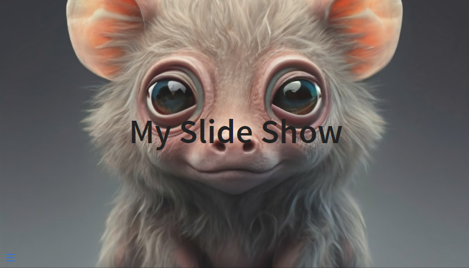

### Display a logo top left on the first slide, then bottom right

The example below illustrates the need: on your first slide, you want to make your logo much more visible than on the other slides.

To achieve this, on the first slide displayed, your logo will be displayed at the top left with a certain size, whereas when you change slides, the logo will be positioned at the bottom right and will be much smaller.

Here is a visual example:

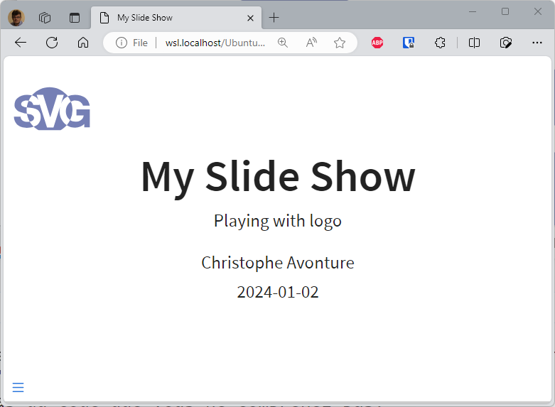

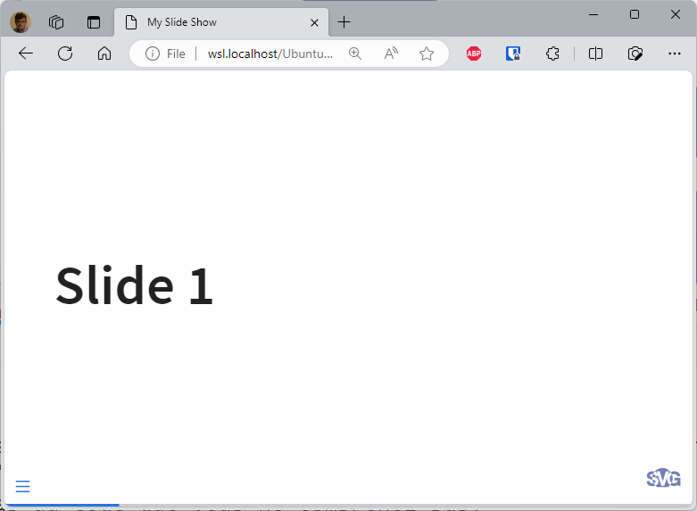

To do this, we'll need to add a custom JavaScript and custom CSS.

Create a new folder called `assets` and, in that folder, a file called `style.css` and a second called `custom.js`.

In `assets/style.css`, copy/paste the following code:

```css
.reveal .slide-logo-bottom-right {
    bottom: 0 !important;
    left: unset !important;
    height: 100% !important;
    max-height: 2.2rem !important;
    right: 12px !important;
}

.slide-logo-max-size {
    bottom: unset !important;
    left: 12px;
    height: 100px !important;
    max-height: unset !important;
    right: unset !important;
    top: 5px;
}

.reveal .slide-logo {
    display: block;
    max-width: unset !important;
    position: fixed;
    width: 100x !important;
}
```

In `assets/custom.js`, copy/paste the following code:

```JavaScript
// The script below will ensure the logo is displayed top left
// in his full size (probably on the first slide; title-slide)
// then as soon as a different slide is displayed, the logo will
// be displayed bottom right with a smaller size.

function updateLogoSizePosition(event) {
    if (event.currentSlide.matches('#title-slide')) {
    var elements = document.querySelectorAll(".slide-logo");
    [].forEach.call(elements, function(elem) {
        elem.classList.remove("slide-logo-bottom-right");
        elem.classList.add("slide-logo-max-size");
    });
    } else {
    var elements = document.querySelectorAll(".slide-logo");
    [].forEach.call(elements, function(elem) {
        elem.classList.add("slide-logo-bottom-right");
        elem.classList.remove("slide-logo-max-size");
    });
    }
};

window.addEventListener("load", (event) => {
    // Make sure the logo has his full size when the slideshow
    // is loaded (i.e. apply the slide-logo-max-size css class)
    var elements = document.querySelectorAll(".slide-logo");
    [].forEach.call(elements, function(elem) {
    elem.classList.remove("slide-logo-bottom-right");
    elem.classList.add("slide-logo-max-size");
    });

    Reveal.on("slidechanged", function(event) {
    updateLogoSizePosition(event);
    });
});
```

Now, use them in your `slides.md` like this:

```markdown
---
title: "My Slide Show"
subtitle: "Playing with logo"
author: "Christophe Avonture"
date: last-modified
lang: "en"

format:
  revealjs:
    logo: images/my-logo.svg
    css: assets/style.css
    resources: images
    header-includes: |
      <script src="assets/custom.js" type="application/javascript"></script>
---
```

As you can see above, the JavaScript code is injected in your presentation using the `header-includes` directive. For the stylesheet, the `css` directive is used (*there is no `js:` directive unfortunately*).

*To run this example, run `quarto render slides.md --to revealjs`.*

### Adding a background image to a slide

A background, a title and some style:

```markdown
# Merry Christmas {background-image="images/winter.jpg" style="text-align: center; background-color: #cfb0f399; color: #210753;"}
```

*To run this example, run `quarto render slides.md --to revealjs`.*

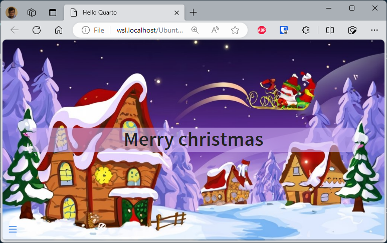

#### Background-size contain or cover

Sometimes the image display isn't what you'd like; this is the case when the image is too large and/or the slide too narrow.

The illustration below shows this: the photo of the sloth is far too large and you can't see the whole thing.

This can be corrected by using the attribute `background-size`. When not mentioned (as for the first slide below), the default value is `cover` (see [https://developer.mozilla.org/en-US/docs/Web/CSS/background-size](https://developer.mozilla.org/en-US/docs/Web/CSS/background-size) to get more information).

You can ask the browser to resize the image so it's fully displayed. This is the behavior when `background-size` is set to `contain`.

```markdown
## {background-image="images/2024.jpg"}

## {background-image="images/2024.jpg" background-size="contain"}
```

*To run this example, run `quarto render slides.md --to revealjs`.*

The slide below is using `cover` and, no, not really attractive.


The second slide is using `contain` and, at least, we can see what the sloth was trying to tell us.

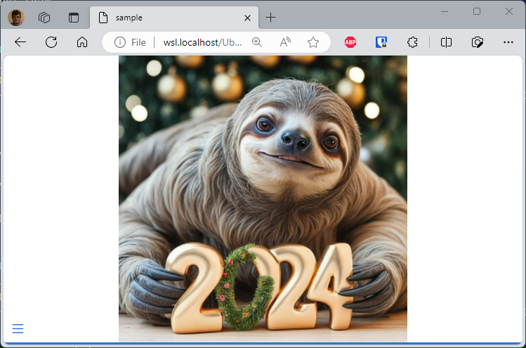

### Using emoji

It's simple, just add the following entry to your YAML front matter.

```yaml
---
from: markdown+emoji
---
```

Then you can add emoji by just typing the code like `:wave:` or `:raised_hands:`.

You can find a full list on [https://gist.github.com/rxaviers/7360908](https://gist.github.com/rxaviers/7360908).


### Big text

The `r-fit-text` class ([official doc](https://quarto.org/docs/presentations/revealjs/advanced.html#fit-text)) will give the maximum size to your content i.e.

```markdown
#

::: {.r-fit-text}
Big Text
:::
```

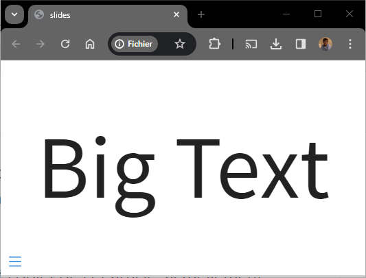

### Stretch

The `r-stretch` class ([official doc](https://quarto.org/docs/presentations/revealjs/advanced.html#stretch)) is my preferred one.

Consider the example below:

```markdown
# Slide 1

Here is an image:

{.r-stretch}

Some text after the image.
```

This will generate this slide:

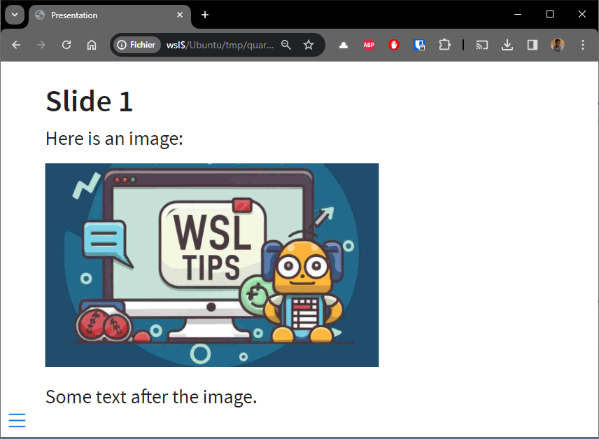

Adding a lot of more text / paragraphs will give this new slide:

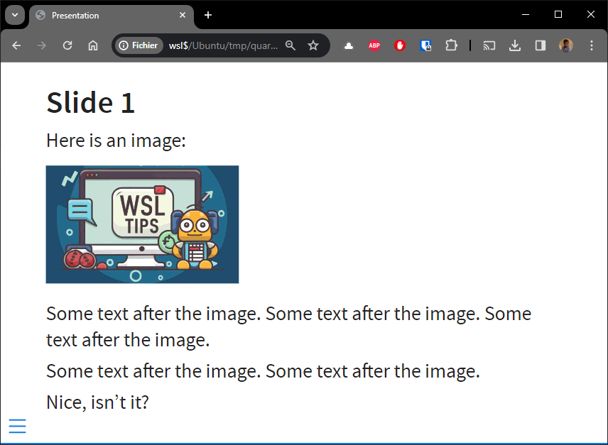

The image height will be resized automatically so both text and images can be displayed on the same slide. If you have less text, the height of the image will be bigger, smaller otherwise. Without to have to manually resize the image on the disk. Very useful.

### Show an image on key press

Using `::: {.fragment .fade-up}` to define a content area, you are asking reveal.js to show its content only the next key sequence.

```markdown
# It's a candy dog

::: {style="font-size: 2em; color: #75AADB;"}
Would you like to see a candy dog?
:::

::: {.fragment .fade-up}

:::
```

*To run this example, run `quarto render slides.md --to revealjs`.*

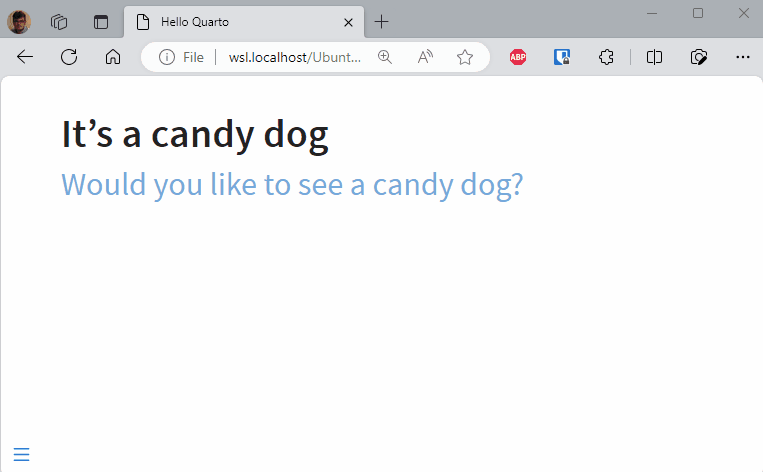

### Creating columns

You can use `columns` to divide your slide:

```markdown
##

::: columns
::: {.column width="70%"}

:::

::: {.column width="30%"}


:::
:::
```

*To run this example, run `quarto render slides.md --to revealjs`.*

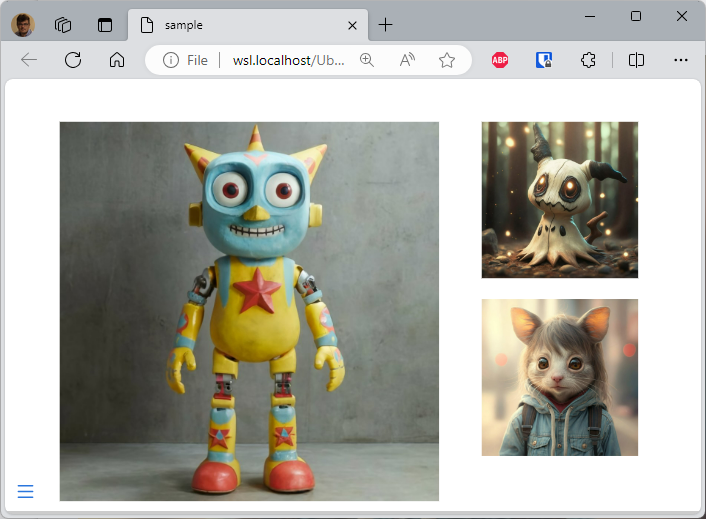

#### Four quadrants

The example below comes from [https://mine.quarto.pub/hello-quarto/#/quarto-highlights](https://mine.quarto.pub/hello-quarto/#/quarto-highlights), a reveal.js slideshow made using Quarto.

The idea is to split the slides in four parts and display content clockwise, starting with the top-left dial.

```markdown
::: columns
::: {.column width="5%"}
:::

::: {.column width="40%"}
::: bulletbox
::: {.fragment .fade-in-then-semi-out}
{width="450px"}
:::
:::
:::

::: {.column width="5%"}
:::

::: {.column width="40%"}
::: bulletbox
::: {.fragment .fade-in-then-semi-out}
{width="450px"}
:::
:::
:::

::: {.column width="5%"}
:::
:::

::: columns
::: {.column width="5%"}
:::

::: {.column width="40%"}
::: bulletbox
::: {.fragment .fade-in-then-semi-out}
{width="450px"}
:::
:::
:::

::: {.column width="5%"}
:::

::: {.column width="40%"}
::: bulletbox
::: {.fragment .fade-in-then-semi-out}
{width="450px"}
:::
:::
:::

::: {.column width="5%"}
:::
:::
```

*To run this example, run `quarto render slides.md --to revealjs`.*


### Creating our own shortcode, easily

I like to be able to write `==Important text==` and, for a revealjs presentation, transform this text automatically to `<mark>Important text</mark>` so I can easily add a custom CSS to it.

First, create a `assets/custom.js` if not yet present and copy/paste the following code:

```javaScript
window.addEventListener("load", (event) => {
    // This function will search for shortcode like "==IpsoLorem==" 
    // i.e. a portion of text between two equal sign and will replace it
    // to "<mark>IpsoLorem</mark>" so we can then use CSS to highlight
    // that portion.
    Reveal.on("slidechanged", function (event) {
        var re = /==([^=]*)==/;
        event.currentSlide.innerHTML = event.currentSlide.innerHTML.replace(new RegExp(re, "g"), "<mark>$1</mark>");
    } );
});
```

In your YAML front matter, add this:

```markdown
---
format:
  revealjs:
    header-includes: |
      <script src="assets/custom.js" type="application/javascript"></script>
---
```

And now, when the slideshow will be played, a custom JavaScript code will replace on-the-fly each fragment with `==xxxx==` and replace with `<mark>xxx</mark>`.

## CSS

### Using inline css

You can apply styles to inline text by creating spans using `[]` to surround the text you want to style and `{}` to define the style you want to apply.

```markdown
# Inline style

To draw attention to a specific part of the text, you might want to make it [red]{style="color: red;"} with a [yellow background]{style="background-color: yellow;"}; [like this]{style="color: red; background-color: yellow;"}.
```

*To run this example, run `quarto render slides.md --to revealjs`.*

This is correctly rendered in HTML:


### Use a custom css

Use the YAML header block for this.

```markdown
---
pagetitle: "Using my custom css"
format:
  revealjs:
    theme: custom.css
---
##

{style="width:400px;"}
```

*To run this example, run `quarto render slides.md --to revealjs`.*

Now, create the `custom.css` file in the same folder as your markdown one and, for instance, set the slide background to yellow:

```css
/*-- scss:defaults --*/
.reveal {
    background-color: rgb(224, 226, 98);
}
```


### Hide image caption

By default, revealjs will display the caption of the image below it. You can hide it by using this stylesheet:

```css
.reveal p.caption {
  display: none;
}
```

### Callout can be stylized

A callout is a special div like below:

```markdown
## Customize your terminal

:::{.callout-note}
## Notice
Skip this part if you do not want to customize your terminal right now
:::

As you can see on the image below, we can customize the terminal:
```

In revealjs, personally, I find that the rendering takes up too much space compared to the content of my slide. So I use css to hide the title:


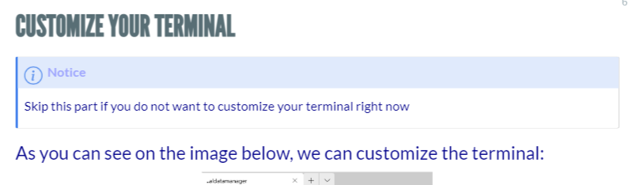

```css
.reveal .callout-title {
    display: none;
}
```

## Navigation

### Vertical slides

There are three types of navigation: `linear` (default one), `vertical` or `grid` ([official doc](https://quarto.org/docs/presentations/revealjs/advanced.html#vertical-slides)).

If you use vertical or grid navigation, you should structure your slides using level 1 headings for the horizontal axis and level 2 headings for the vertical axis.

In a normal, `linear` navigation, reaveljs will show each slide, whatever the key the user is pressing on his keyboard. In a `linear` navigation, as author, you are sure that your visitor will see each of them.

In a `vertical` or `grid` navigation, it's just like you're showing the chapter's title and if the user press the <kbd>down</kbd> or <kbd>space</kbd>key, he will jump in the chapter (and this *vertically*). But if he is pressing the <kbd>right</kbd> key he'll skip it and go to the next chapter.

The `navigation-mode` in the yaml header allows you to enable `vertical` mode, below an example:

```markdown
---
title: "Presentation"
format:
  revealjs:
    navigation-mode: vertical
---

# Slide 1

## Slide 1.1

# Slide 2

## Slide 2.1

## Slide 2.2

## Slide 2.3
```


:::tip Press <kbd>esc</kbd> key
The <kbd>esc</kbd> key allow you to see the structure of your revealjs slideshow.
:::

### Define a name for your slide

By default, reveal.js will generate a slug from the title so you can reference the slide in a URL.

Consider the following example:

```markdown
## Elit ad fugiat proident culpa sint

Elit ad fugiat proident culpa sint qui id pariatur nostrud ullamco velit irure tempor culpa. Laborum occaecat ea tempor voluptate duis pariatur proident ea. Aute adipisicing ut ullamco exercitation nisi nulla sint. Reprehenderit tempor quis non cupidatat.

## Cillum do et commodo minim ullamco elit culpa

Occaecat minim eu veniam laborumanim. Nostrud duis eiusmod ut amet velit commodo. Aliqua laborum cillum officia culpa quis duis enim cillum esse duis excepteur cillum do qui. Veniam dolore enim qui labore proident. Minim ipsum nisi Lorem cillum proident labore cupidatat aliqua pariatur. Nisi id magna incididunt et culpa.
```

*To run this example, run `quarto render slides.md --to revealjs`.*

The generated URL for the first slide will be `http://[...]index.html#/elit-ad-fugiat-proident-culpa-sint` and, for the second slide, `http://[...]index.html#/cillum-do-et-commodo-minim-ullamco-elit-culpa`.

To define the name yourself, just add `{#}` followed by the slug you desire.

```markdown
<!-- highlight-next-line -->
## Elit ad fugiat proident culpa sint {#intro}

Elit ad fugiat proident culpa sint qui id pariatur nostrud ullamco velit irure tempor culpa. Laborum occaecat ea tempor voluptate duis pariatur proident ea. Aute adipisicing ut ullamco exercitation nisi nulla sint. Reprehenderit tempor quis non cupidatat.

<!-- highlight-next-line -->
## Cillum do et commodo minim ullamco elit culpa {#chapter1}

Occaecat minim eu veniam laborumanim. Nostrud duis eiusmod ut amet velit commodo. Aliqua laborum cillum officia culpa quis duis enim cillum esse duis excepteur cillum do qui. Veniam dolore enim qui labore proident. Minim ipsum nisi Lorem cillum proident labore cupidatat aliqua pariatur. Nisi id magna incididunt et culpa.
```

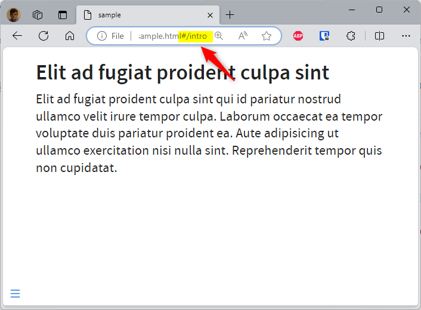

But, pay attention to the slide's menu (bottom left): perhaps it's also good to define a suitable name there.

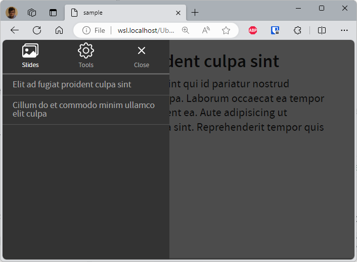

To do this, set the `data-menu-title` attribute; f.i.:

```markdown
<!-- highlight-next-line -->
## Elit ad fugiat proident culpa sint {#intro data-menu-title="Introduction"}

<!-- highlight-next-line -->
## Cillum do et commodo minim ullamco elit culpa {#chapter1 data-menu-title="Chapter 1"}
```

### Show slide number

To only show the current slide number, you can use `slide-number: true` but, if you also want the total number of slides, you should use `slide-number: c/t` :

```yaml
format:
  revealjs:
    slide-number: c/t
```

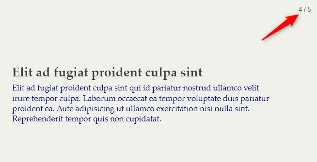

You can retrieve more informations [here](https://quarto.org/docs/presentations/revealjs/presenting.html#slide-numbers).

## Misc

### Using speaker notes

You can write messages in your presentation that will not be displayed when the slideshow is played, but only as a second screen when the presenter wishes.

The example below illustrate this. The way to insert such presenter's notes is by using the `::: notes` block.

```markdown
##

::: columns
::: {.column width="70%"}

:::

::: {.column width="30%"}


:::
:::

::: notes
On the left side, you have ... and, on the right side, the first image is ....

The second image has been ...
:::

##


```

*To run this example, run `quarto render slides.md --to revealjs`.*

So, in the example above, we'll have two slides. By pressing the <kbd>s</kbd> touch on the keyboard (<span style={{color: 'blue'}}>s for speakers</span>) a new window will be displayed.

When you have two screens, on the first you'll display your presentation without the notes (left screen below) and on the second you'll display the notes (right screen below).

If you share your screen through a tool like Teams or Zoom, same thing; you share the screen where the presentation is displayed (the first one) and keep the notes only for you.


As you can see on the image above, the speaker notes are displaying valuable information as the elapsed time since the start of the presentation, the current time and the next slide to make your transition easier.
