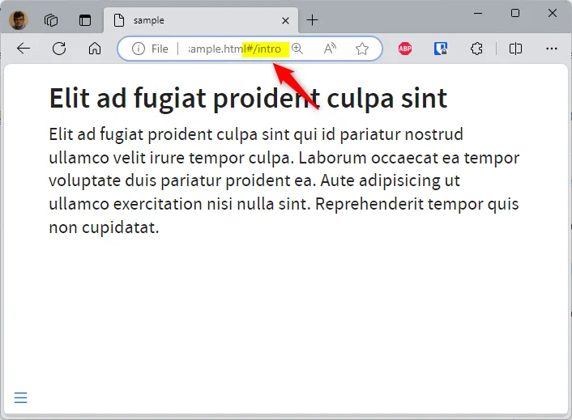
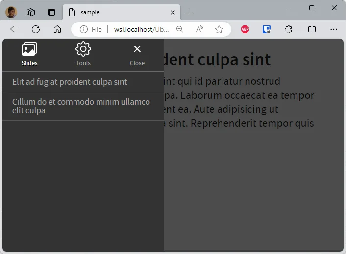

The [Quarto reveal.js documentation](https://quarto.org/docs/reference/formats/presentations/revealjs.html) is the best place to find instructions for creating impeccable reveal.js presentations.

In this article, we'll take a quick look at a few tips and tricks to make your reveal.js presentations even better.

<!-- truncate -->

<AlertBox variant="info" title="Docker image with Quarto">
If you don't have yet a Docker image with Quarto, read this article <Link to="/blog/docker-quarto">Running Quarto Markdown in Docker</Link>.

</AlertBox>

## Working with slides

### Create a title slide

The [title slide](https://quarto.org/docs/presentations/revealjs/advanced.html#title-slide) is the first one of your presentation. You can add such slide with a few yaml lines:

<Snippet filename="slides.md" source="./files/slides_1.txt" />

The slideshow will have four slides, the first one will be the title-slide.


### Display a logo top left on the first slide, then bottom right

The example below illustrates the need: on your first slide, you want to make your logo much more visible than on the other slides.

To achieve this, on the first slide displayed, your logo will be displayed at the top left with a certain size, whereas when you change slides, the logo will be positioned at the bottom right and will be much smaller.

Here is a visual example:


To do this, we'll need to add a custom JavaScript and custom CSS.

Create a new folder called `assets` and, in that folder, a file called `style.css` and a second called `custom.js`.

In `assets/style.css`, copy/paste the following code:

<Snippet filename="assets/style.css" source="./files/style.css" />

In `assets/custom.js`, copy/paste the following code:

<Snippet filename="assets/custom.js" source="./files/custom.js" />

Now, use them in your `slides.md` like this:

<Snippet filename="slides.md" source="./files/slides_2.txt" />

As you can see above, the JavaScript code is injected in your presentation using the `header-includes` directive. For the stylesheet, the `css` directive is used (*there is no `js:` directive unfortunately*).

*To run this example, run `quarto render slides.md --to revealjs`.*

### Adding a background image to a slide

A background, a title and some style:

<Snippet filename="slides.md" source="./files/slides_3.txt" />

*To run this example, run `quarto render slides.md --to revealjs`.*


#### Background-size contain or cover

Sometimes the image display isn't what you'd like; this is the case when the image is too large and/or the slide too narrow.

The illustration below shows this: the photo of the sloth is far too large and you can't see the whole thing.

This can be corrected by using the attribute `background-size`. When not mentioned (as for the first slide below), the default value is `cover` (see [https://developer.mozilla.org/en-US/docs/Web/CSS/background-size](https://developer.mozilla.org/en-US/docs/Web/CSS/background-size) to get more information).

You can ask the browser to resize the image so it's fully displayed. This is the behavior when `background-size` is set to `contain`.

<Snippet filename="slides.md" source="./files/slides_4.txt" />

*To run this example, run `quarto render slides.md --to revealjs`.*

The slide below is using `cover` and, no, not really attractive.


The second slide is using `contain` and, at least, we can see what the sloth was trying to tell us.


### Slide-level

The slide level is an important configuration item ([official documentation](https://pandoc.org/MANUAL.html#structuring-the-slide-show)).

If we look at the markdown below, how many slides will we have? Two or three? The first is for the title, the second for `Technologies and tools`, but will `Apache` be a separate slide or not?

<Snippet filename="slides.md" source="./files/slides_5.txt" />

In fact, it depends on the `slide-level` setting. By default, `slide-level` is equal to `2` and then, the result will be:


We've two slides. On the second slide, we can see our `Apache` heading 3 as a text on `Technologies and tools`.

If you want a slide to be created for each level 2 and level 3 (or higher) title, you need to set this with slide-level.

<Snippet filename="slides.md" source="./files/slides_6.txt" />

And the result will give:


### Using emoji

It's simple, just add the following entry to your YAML front matter.

```yaml
---
from: markdown+emoji
---
```

Then you can add emoji by just typing the code like `:wave:` or `:raised_hands:`.

You can find a full list on [https://gist.github.com/rxaviers/7360908](https://gist.github.com/rxaviers/7360908).

### Big text

The `r-fit-text` class ([official doc](https://quarto.org/docs/presentations/revealjs/advanced.html#fit-text)) will give the maximum size to your content i.e.

<Snippet filename="slides.md" source="./files/slides_7.txt" />


### Stretch

The `r-stretch` class ([official doc](https://quarto.org/docs/presentations/revealjs/advanced.html#stretch)) is my preferred one.

Consider the example below:

<Snippet filename="slides.md" source="./files/slides_8.txt" />

This will generate this slide:


Adding a lot of more text / paragraphs will give this new slide:


The image height will be resized automatically so both text and images can be displayed on the same slide. If you have less text, the height of the image will be bigger, smaller otherwise. Without to have to manually resize the image on the disk. Very useful.

### Show an image on key press

Using `::: {.fragment .fade-up}` to define a content area, you are asking reveal.js to show its content only the next key sequence.

<Snippet filename="slides.md" source="./files/slides_9.txt" />

*To run this example, run `quarto render slides.md --to revealjs`.*


### Creating columns

You can use `columns` to divide your slide:

<Snippet filename="slides.md">

```markdown
##

::: columns
::: {.column width="70%"}

:::

::: {.column width="30%"}


:::
:::
```

</Snippet>

*To run this example, run `quarto render slides.md --to revealjs`.*


#### Four quadrants

The example below comes from [https://mine.quarto.pub/hello-quarto/#/quarto-highlights](https://mine.quarto.pub/hello-quarto/#/quarto-highlights), a reveal.js slideshow made using Quarto.

The idea is to split the slides in four parts and display content clockwise, starting with the top-left dial.

<Snippet filename="slides.md">

```markdown
::: columns
::: {.column width="5%"}
:::

::: {.column width="40%"}
::: bulletbox
::: {.fragment .fade-in-then-semi-out}
{width="450px"}
:::
:::
:::

::: {.column width="5%"}
:::

::: {.column width="40%"}
::: bulletbox
::: {.fragment .fade-in-then-semi-out}
{width="450px"}
:::
:::
:::

::: {.column width="5%"}
:::
:::

::: columns
::: {.column width="5%"}
:::

::: {.column width="40%"}
::: bulletbox
::: {.fragment .fade-in-then-semi-out}
{width="450px"}
:::
:::
:::

::: {.column width="5%"}
:::

::: {.column width="40%"}
::: bulletbox
::: {.fragment .fade-in-then-semi-out}
{width="450px"}
:::
:::
:::

::: {.column width="5%"}
:::
:::
```

</Snippet>

*To run this example, run `quarto render slides.md --to revealjs`.*


### Creating our own short code, easily

I like to be able to write `==Important text==` and, for a revealjs presentation, transform this text automatically to `<mark>Important text</mark>` so I can easily add a custom CSS to it.

First, create a `assets/custom.js` if not yet present and copy/paste the following code:

<Snippet filename="assets/custom.js" source="./files/custom.part2.js" />

In your YAML front matter, add this:

<Snippet filename="slides.md" source="./files/slides_12.txt" />

And now, when the slideshow will be played, a custom JavaScript code will replace on-the-fly each fragment with `==xxxx==` and replace with `<mark>xxx</mark>`.

## CSS

### Using inline css

You can apply styles to inline text by creating spans using `[]` to surround the text you want to style and `{}` to define the style you want to apply.

<Snippet filename="slides.md" source="./files/slides_13.txt" />

*To run this example, run `quarto render slides.md --to revealjs`.*

This is correctly rendered in HTML:


### Use a custom css

Use the YAML header block for this.

<Snippet filename="slides.md" source="./files/slides_14.txt" />

*To run this example, run `quarto render slides.md --to revealjs`.*

Now, create the `custom.css` file in the same folder as your markdown one and, for instance, set the slide background to yellow:

<Snippet filename="custom.css" source="./files/custom.css" />


### Hide image caption

By default, revealjs will display the caption of the image below it. You can hide it by using this stylesheet:

<Snippet filename="custom.css" source="./files/custom.part2.css" />

### Callout can be stylized

A callout is a special div like below:

<Snippet filename="slides.md" source="./files/slides_15.txt" />

In revealjs, personally, I find that the rendering takes up too much space compared to the content of my slide. So I use css to hide the title:


<Snippet filename="custom.css" source="./files/custom.part3.css" />

## Navigation

### Vertical slides

There are three types of navigation: `linear` (default one), `vertical` or `grid` ([official doc](https://quarto.org/docs/presentations/revealjs/advanced.html#vertical-slides)).

If you use vertical or grid navigation, you should structure your slides using level 1 headings for the horizontal axis and level 2 headings for the vertical axis.

In a normal, `linear` navigation, revealjs will show each slide, whatever the key the user is pressing on his keyboard. In a `linear` navigation, as author, you are sure that your visitor will see each of them.

In a `vertical` or `grid` navigation, it's just like you're showing the chapter's title and if the user press the <kbd>down</kbd> or <kbd>space</kbd>key, he will jump in the chapter (and this *vertically*). But if he is pressing the <kbd>right</kbd> key he'll skip it and go to the next chapter.

The `navigation-mode` in the yaml header allows you to enable `vertical` mode, below an example:

<Snippet filename="slides.md" source="./files/slides_16.txt" />


<AlertBox variant="info" title="Press <kbd>esc</kbd> key">
The <kbd>esc</kbd> key allow you to see the structure of your revealjs slideshow.

</AlertBox>

### Define a name for your slide

By default, reveal.js will generate a slug from the title so you can reference the slide in a URL.

Consider the following example:

<Snippet filename="slides.md" source="./files/slides_17.txt" />

*To run this example, run `quarto render slides.md --to revealjs`.*

The generated URL for the first slide will be `http://[...]index.html#/elit-ad-fugiat-proident-culpa-sint` and, for the second slide, `http://[...]index.html#/cillum-do-et-commodo-minim-ullamco-elit-culpa`.

To define the name yourself, just add `{#}` followed by the slug you desire.

<Snippet filename="slides.md" source="./files/slides_18.txt" />



But, pay attention to the slide's menu (bottom left): perhaps it's also good to define a suitable name there.



To do this, set the `data-menu-title` attribute; f.i.:

<Snippet filename="slides.md" source="./files/slides_19.txt" />

### Show slide number

To only show the current slide number, you can use `slide-number: true` but, if you also want the total number of slides, you should use `slide-number: c/t` :

<Snippet filename="slides.md" source="./files/slides_20.txt" />


You can retrieve more information [here](https://quarto.org/docs/presentations/revealjs/presenting.html#slide-numbers).

## Misc

### Using speaker notes

You can write messages in your presentation that will not be displayed when the slideshow is played, but only as a second screen when the presenter wishes.

The example below illustrate this. The way to insert such presenter's notes is by using the `::: notes` block.

<Snippet filename="slides.md" source="./files/slides_21.txt" />

*To run this example, run `quarto render slides.md --to revealjs`.*

So, in the example above, we'll have two slides. By pressing the <kbd>s</kbd> touch on the keyboard (<span style={{color: 'blue'}}>s for speakers</span>) a new window will be displayed.

When you have two screens, on the first you'll display your presentation without the notes (left screen below) and on the second you'll display the notes (right screen below).

If you share your screen through a tool like Teams or Zoom, same thing; you share the screen where the presentation is displayed (the first one) and keep the notes only for you.


As you can see on the image above, the speaker notes are displaying valuable information as the elapsed time since the start of the presentation, the current time and the next slide to make your transition easier.
