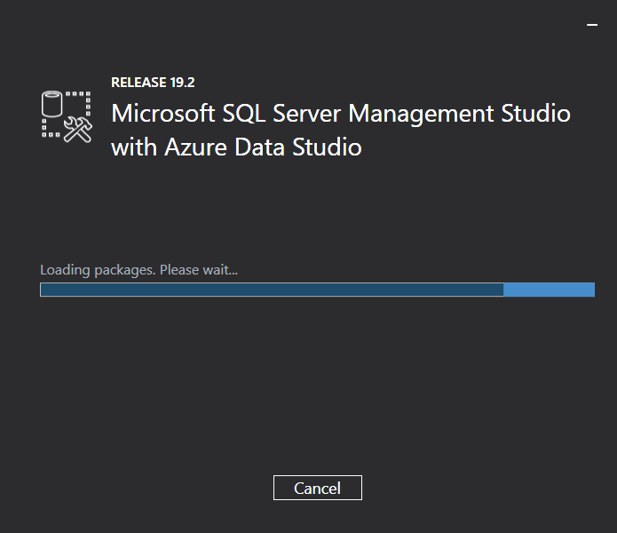
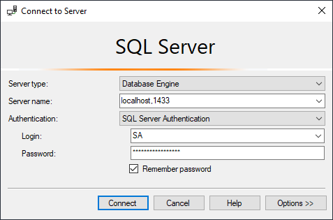
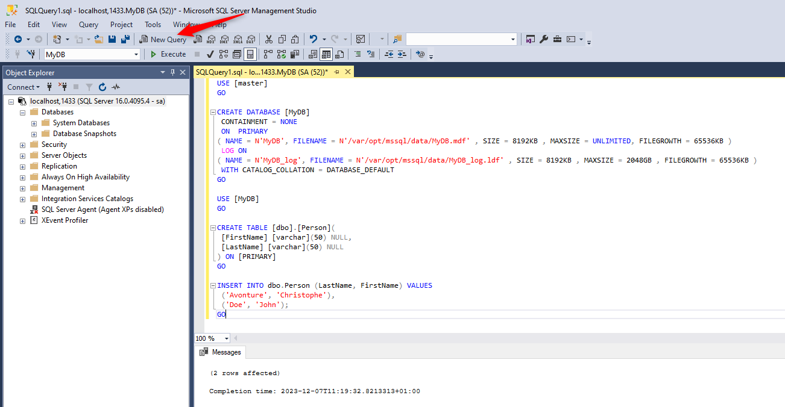
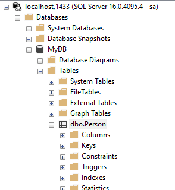

And yes, nothing less. We're going to install a **Microsoft SQL Server 2022** on our machine, install **SQL Server Management Studio** too and we'll have fun with a small PowerShell script; all with Docker, of course.

<!-- truncate -->

The official Microsoft SQL Server Docker repository can be retrieved on [https://hub.docker.com/_/microsoft-mssql-server](https://hub.docker.com/_/microsoft-mssql-server).

First, we'll download and run an instance of SQL Server 2022 by running the following instruction:

<Terminal>
$ docker run -e "ACCEPT_EULA=Y" -e "SA_PASSWORD=2Secure*Password2" -p 1433:1433 --name sqlserverdb -h mysqlserver -d mcr.microsoft.com/mssql/server:2022-latest
</Terminal>

With the above command, we'll accept the terms of the *End-User License Agreement* and we're setting the password of the user `SA` to `2Secure*Password2`.

The port that we'll use on our host is port `1433` (mapped to the port `1433` of the container), our SQL Server instance will be called `sqlserverdb`(intern name used by Docker) and we'll name our host `mysqlserver`.

We can check the list of running containers thanks to docker container list:

<Terminal>
$ docker container list

[...] IMAGE                                       [...] NAMES
[...] mcr.microsoft.com/mssql/server:2022-latest  [...] sqlserverdb
</Terminal>

:::info The output above has been simplified
For clarity, the output of `docker container list` has been simplified here above; not all columns were mentioned in the article.
:::

Now, if you don't have **SQL Server Management Studio** (also called **SSMS**) yet on your machine, please download it for free from [https://learn.microsoft.com/en-us/sql/ssms/download-sql-server-management-studio-ssms?view=sql-server-ver16](https://learn.microsoft.com/en-us/sql/ssms/download-sql-server-management-studio-ssms?view=sql-server-ver16).

Start the installation program and wait until it's installed on your machine.



Start now SSMS (you'll find it in your `Start` Windows menu):


Use the value below for the authentication:

* Server name: `localhost,1433`
* Authentication: `SQL Server Authentication`
* Login: `SA`
* Password: `2Secure*Password2`

:::info Why these values?
`1443` is the port number we've declared in our `docker run` instruction, the default *admin* user is `SA` and the password has been initialized earlier to `2Secure*Password2` (see the `SA_PASSWORD` environment variable in our `docker run` command.)
:::



Click on the `Connect` button and then, SSMS will be connected to your Docker instance. Now it's time to create our database.

## Create the database, the table and add some records

Once connected on SSMS, run the following query for creating a sample `MyDB` database, create a table called `dbo.Person` and add some records.

To do this, click on the `New Query` button (or press <kbd>CTRL</kbd>-<kbd>N</kbd>), paste the SQL below and then click on the `Execute` button (or press <kbd>F5</kbd>).



<Snippet filename="create_db.sql">

```sql
USE [master]
GO

CREATE DATABASE [MyDB]
 CONTAINMENT = NONE
 ON  PRIMARY
( NAME = N'MyDB', FILENAME = N'/var/opt/mssql/data/MyDB.mdf' , SIZE = 8192KB , MAXSIZE = UNLIMITED, FILEGROWTH = 65536KB )
 LOG ON
( NAME = N'MyDB_log', FILENAME = N'/var/opt/mssql/data/MyDB_log.ldf' , SIZE = 8192KB , MAXSIZE = 2048GB , FILEGROWTH = 65536KB )
 WITH CATALOG_COLLATION = DATABASE_DEFAULT
GO

USE [MyDB]
GO

CREATE TABLE [dbo].[Person](
 [FirstName] [varchar](50) NULL,
 [LastName] [varchar](50) NULL
) ON [PRIMARY]
GO

INSERT INTO dbo.Person (LastName, FirstName) VALUES
 ('Avonture', 'Christophe'),
 ('Doe', 'John');
GO
```

</Snippet>

Congratulations, you've created a `MyDB` database with a `dbo.Person` table:



:::tip Think to refresh the `Object Explorer`
If, after having fired the query, you don't see yet your database in the `Object Explorer` pane, think to refresh it. Click anywhere in the pane and press <kbd>F5</kbd> or, right-click on the `localhost, 1433` top-item and select `Refresh` in the contextual menu.
:::

## Write a PowerShell script and connect to the database

*Probably not the best way to query a SQL Server database, based on an example found on Stack Overflow...*

As an example, we'll create a DOS PowerShell script called `connect.ps1` to illustrate how to query our new database:

<Snippet filename="connect.ps1">

```powershell
$SqlServer = 'localhost,1433';
$SqlDatabase = 'MyDB';

$SqlConnectionString = 'Data Source={0};Initial Catalog={1};User Id=SA;Password=2Secure*Password2;' -f $SqlServer, $SqlDatabase;
$SqlQuery = "SELECT FirstName, LastName FROM dbo.Person ORDER BY LastName;";

$SqlConnection = New-Object -TypeName System.Data.SqlClient.SqlConnection -ArgumentList $SqlConnectionString;

$SqlCommand = $SqlConnection.CreateCommand();
$SqlCommand.CommandText = $SqlQuery;

$SqlConnection.Open();
$SqlDataReader = $SqlCommand.ExecuteReader();

Write-Host "Here is the content of dbo.Person"
Write-Host "---------------------------------"
Write-Host ""

while ($SqlDataReader.Read()) {
    Write-Host $SqlDataReader['LastName'] $SqlDataReader['FirstName'];
}

$SqlConnection.Close();
$SqlConnection.Dispose();

Write-Host ""
```

</Snippet>

Please start a DOS or a PowerShell console and run this command: `powershell -executionpolicy bypass -File .\connect.ps1`.


Now we've validated that your database is functional and accessible. It's now up to you to make this example your own!
