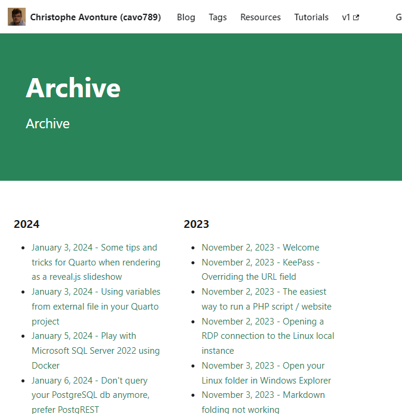
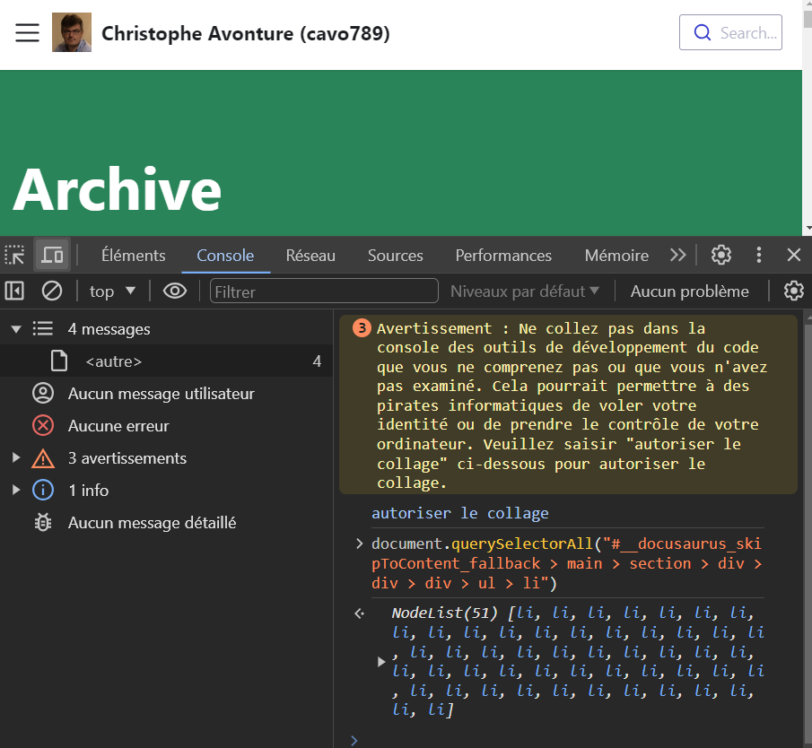

<!-- cspell:ignore autoriser,collage -->


Docusaurus didn't provide an easy way to retrieve the number of blog posts but there is well a trick.

There is an automatic page called `archive` like <Link to="/blog/archive/">/blog/archive/</Link>.

On that page, all blog posts are displayed by year and months. With a `document.querySelectorAll` console instruction it's possible to make the count as suggested on [https://github.com/facebook/docusaurus/discussions/9712](https://github.com/facebook/docusaurus/discussions/9712)

<!-- truncate -->



Once the archive page has been displayed, press <kbd>F12</kbd> to start the **Developer console**.

Click on the `Console` tab then, in the right bottom part, copy/paste the instruction below.

```js
document.querySelectorAll("#__docusaurus_skipToContent_fallback > main > section > div > div > div > ul > li")
```

The first time, the console will notify you that you should allow pasting (in French *autoriser le collage*). Please type it.

Then copy/paste again.

The `document.querySelectorAll` instruction will retrieve every bullet i.e. the list of posts. You'll immediately see the number, in my case, as illustrated below, `51`:


