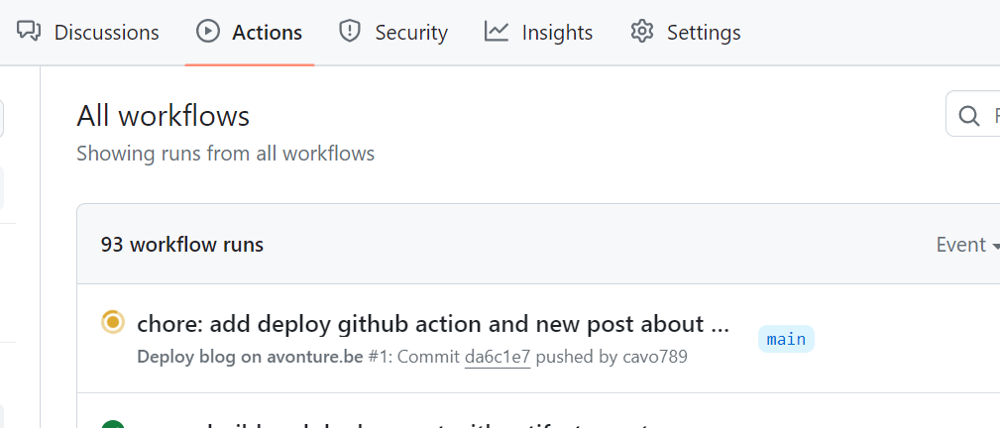
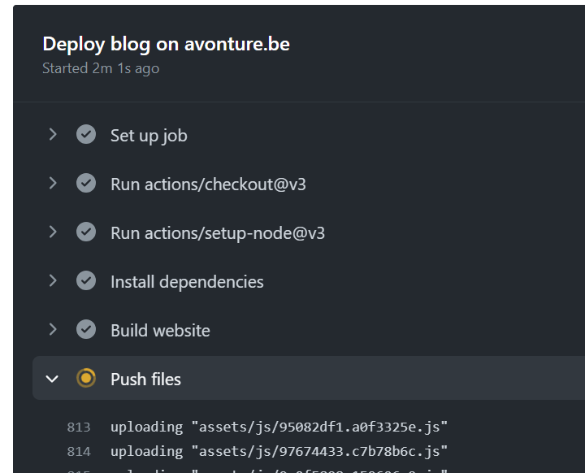

The last two months, I was using a FTP automation script to deploy the blog on my FTP server.

This way of doing things worked fine but had several inherent problems, the most important of which was that I had to run the script manually (from my computer).

If I modified an article directly from the Github interface or from another computer (where WinSCP was not installed, for example), there was no deployment.

By using Github actions, this problem no longer exists. With each push, the blog will be updated.

<!-- truncate -->

To enable `GitHub actions`, we first need to create a file in the folder `.github/workflows`. Mine will be named `deploy.yml` with this content:

```yaml
name: Deploy blog on avonture.be

on:
  push:
    branches:
      - main

permissions:
  contents: write

jobs:
  deploy:
    name: Deploy blog on avonture.be
    runs-on: ubuntu-latest
    steps:
      - uses: actions/checkout@v3
      - uses: actions/setup-node@v3
        with:
          node-version: 18
          cache: yarn

      - name: Install dependencies
        run: yarn install --frozen-lockfile
      - name: Build website
        run: yarn build

      - name: Push files
        uses: SamKirkland/FTP-Deploy-Action@v4.3.4
        with:
          # See https://github.com/SamKirkland/FTP-Deploy-Action for allowed settings
          server: ${{ secrets.ftp_server }}
          username: ${{ secrets.ftp_login }}
          password: ${{ secrets.ftp_password }}
          # We need to deploy the build folder from GitHub to our FTP; not everything (f.i. don't need node_modules)
          local-dir: ./build/
```

As you can see, I need three secrets, `${{ secrets.ftp_server }}`, `${{ secrets.ftp_login }}` and `${{ secrets.ftp_password }}`.

:::tip Make sure to use a restricted FTP user
Don't use a too privileged user. Create a new one, just for your blog and having access to only the output folder (like `/var/www/html/public`) where your blog should be deployed.
:::

I need to create them in my Settings page for my repository: `https://github.com/cavo789/blog/settings/secrets/actions` i.e. `Settings` -> `Secrets and variables` -> `Actions`.

In the `Repository secrets` area, I have clicked on the `New repository secret` button and create the first one: `FTP_LOGIN` and provide the login. Same thing with the two other secrets.

This done, I can push my local changes (the `.github/workflows/deploy.yml`) to github using `git add .github/workflows/deploy.yml && git commit -m "chore: add deploy github action" && git push`.

Once pushed to github, the page `https://github.com/cavo789/blog/actions` will show my action and I can see it's now running.



By clicking on the running action, details of each steps is displayed and I can easily follow:



After a given time period (actually four minutes), the action was successfully completed and the blog updated.
