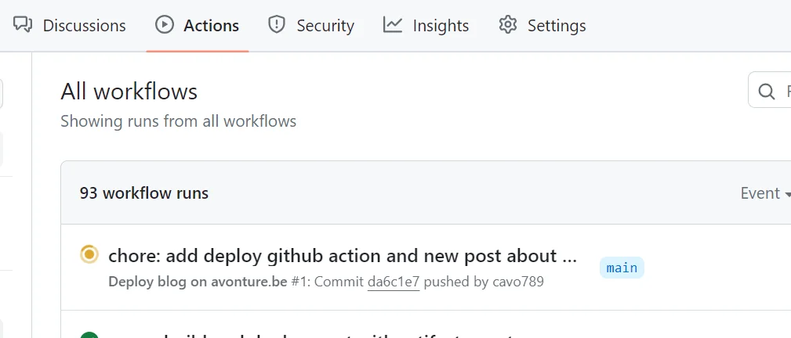
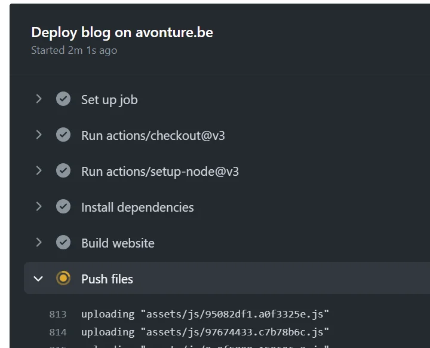

<TLDR>
This article explains how to replace manual FTP deployment scripts with a GitHub Actions workflow that automatically deploys the blog on every push. It covers creating the `.github/workflows/deploy.yml` file, storing FTP credentials as repository secrets, and using a restricted FTP user scoped only to the deployment output folder.
</TLDR>

For the last two months, I was using an FTP automation script (<Link to="/blog/winscp-synchronize-both">WinSCP in synchronize mode</Link>) to deploy the blog on my FTP server, as described in <Link to="/blog/site-creation">Site creation</Link>.

This way of doing things worked fine but had several inherent problems, the most important of which was that I had to run the script manually (from my computer).

If I modified an article directly from the GitHub interface or from another computer (where WinSCP was not installed, for example), there was no deployment.

By using GitHub Actions, this problem no longer exists. With each push, the blog will be updated.

<!-- truncate -->

<AlertBox variant="important" title="FTP works, but it is no longer what I use">
Everything below still runs, and it is a perfectly reasonable starting point if FTP is all your
hosting offers. It is not, however, what deploys this blog today: FTP sends your password in clear
text and moves the site one file at a time. If your host gives you SSH access, jump to
[the SSH/rsync version](#why-i-moved-to-ssh) at the end of this article.
</AlertBox>

## What a deployment looks like now

I push a commit — from my laptop, from another machine, or straight from the GitHub web editor — and the page `https://github.com/cavo789/blog/actions` shows this on its own:

By clicking on the running action, the details of each step are displayed and I can easily follow along:

Four minutes later, the action is green and the blog is up to date online. I haven't opened an FTP client, and I haven't been anywhere near the machine where WinSCP is installed.

## Three ingredients

A workflow file committed in the repository, three repository secrets holding the FTP credentials, and an FTP user restricted to the deployment folder. That's the entire setup — no runner to host, no service to subscribe to.

## Setting it up

To enable `GitHub actions`, we first need to create a file in the folder `.github/workflows`. Mine will be named `deploy.yml` with this content:

<Snippet filename=".github/workflows/deploy.yml" source="./files/deploy.yml" />

As you can see, I need three secrets, `${{ secrets.ftp_server }}`, `${{ secrets.ftp_login }}` and `${{ secrets.ftp_password }}`.

<AlertBox variant="info" title="Make sure to use a restricted FTP user">
Don't use an overly privileged user. Create a new one, just for your blog, with access to only the output folder (like `/var/www/html/public`) where your blog should be deployed.

</AlertBox>

I need to create them in my Settings page for my repository: `https://github.com/cavo789/blog/settings/secrets/actions` i.e. `Settings` -> `Secrets and variables` -> `Actions`.

In the `Repository secrets` area, I have clicked on the `New repository secret` button and create the first one: `FTP_LOGIN` and provide the login. Same thing with the two other secrets.

This done, I can push my local changes (the `.github/workflows/deploy.yml`) to GitHub using `git add .github/workflows/deploy.yml && git commit -m "chore: add deploy github action" && git push`.

## Why I Moved to SSH

Three things about this setup bothered me enough to eventually replace it, and none of them are
about GitHub Actions — they are all about FTP as a transport.

**The credentials travel in clear text.** Plain FTP has no encryption. The password, and every byte
of the site, cross the network readable by anything sitting in between. FTPS (explicit TLS on the
same port) fixes that and costs one line of configuration, so if you stay on FTP, at least use it.

**One file at a time.** FTP opens a separate data connection per file. On a site of a few thousand
files, the overhead dominates: the transfer spends its time negotiating rather than sending. That is
the four minutes you saw earlier — almost none of it is actual data.

**A third party sits between the key and the server.** The action doing the transfer is code I do
not control, and I hand it my credentials on every run. That is a reasonable trade for the
convenience, but it is a trade, and it is worth making consciously.

The replacement uses `rsync` over SSH: encrypted by default, one connection for the whole site, and
only the files whose content actually changed cross the wire.

## Conclusion

What disappeared here isn't a technology, it's a habit: the little WinSCP script I had to remember to run, from the one computer where it was installed. Publishing is now a side effect of pushing, which is something I do anyway.

Deployment is not the only thing worth automating on GitHub; <Link to="/blog/github-profile-last-blogposts">Automate your GitHub README with your latest blog posts</Link> uses the same mechanism to keep my profile page up to date.
