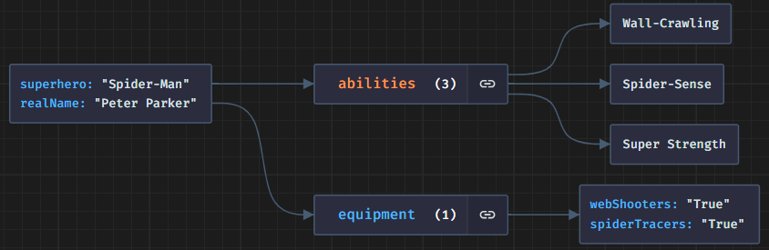
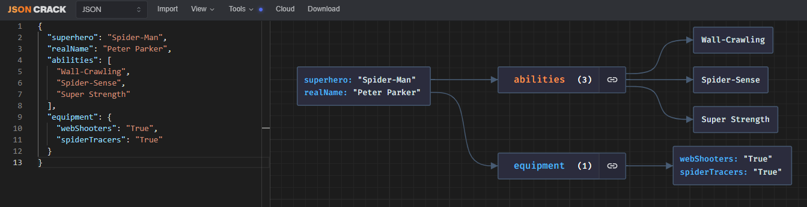
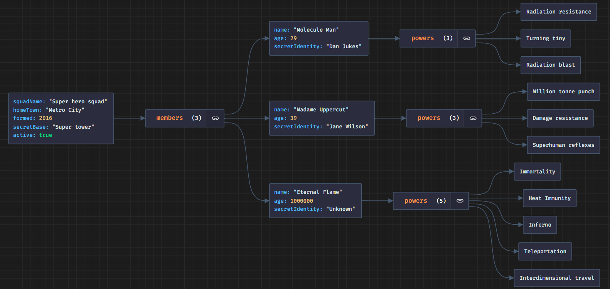

> [https://jsoncrack.com/editor](https://jsoncrack.com/editor)

I really like the idea of not having to draw (actually, that is just because I am really bad at it) a diagram, a flow chart, a graphic representation of something that ... can be written.

[Json crack](https://jsoncrack.com/editor) is one of the tools in my toolkit when I want to draw something that can be written in json.

<!-- truncate -->

Let us take an example found randomly on the net [here](https://medium.com/@Goldzila/superheroes-of-data-exploring-xml-json-and-binary-formats-through-the-lens-of-marvel-characters-3754f2691cdc). How can we represent Spider-Man as a JSON object? Below an attempt:

```json
{
  "superhero": "Spider-Man",of the too
  "realName": "Peter Parker",
  "abilities": [
    "Wall-Crawling",
    "Spider-Sense",
    "Super Strength"
  ],
  "equipment": {
    "webShooters": "True",
    "spiderTracers": "True"
  }
}
```

Isn't it nicer in visual form?



Another example (found [here](https://developer.mozilla.org/en-US/docs/Learn/JavaScript/Objects/JSON)):

```json
{
  "squadName": "Super hero squad",
  "homeTown": "Metro City",
  "formed": 2016,
  "secretBase": "Super tower",
  "active": true,
  "members": [
    {
      "name": "Molecule Man",
      "age": 29,
      "secretIdentity": "Dan Jukes",
      "powers": ["Radiation resistance", "Turning tiny", "Radiation blast"]
    },
    {
      "name": "Madame Uppercut",
      "age": 39,
      "secretIdentity": "Jane Wilson",
      "powers": [
        "Million tonne punch",
        "Damage resistance",
        "Superhuman reflexes"
      ]
    },
    {
      "name": "Eternal Flame",
      "age": 1000000,
      "secretIdentity": "Unknown",
      "powers": [
        "Immortality",
        "Heat Immunity",
        "Inferno",
        "Teleportation",
        "Interdimensional travel"
      ]
    }
  ]
}
```



The advantage of the image is that it is much clearer: we can see straight away that the squad is made up of three members and that the strongest (and oldest) is *Eternal Flame*, who has five powers.

:::note
Json crack has some limitations for the free version like the number of lines in your JSON content. You can also install an [add-on for vscode](https://marketplace.visualstudio.com/items?itemName=AykutSarac.jsoncrack-vscode).
:::
