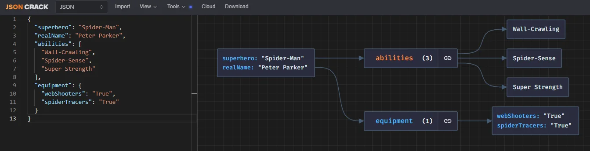
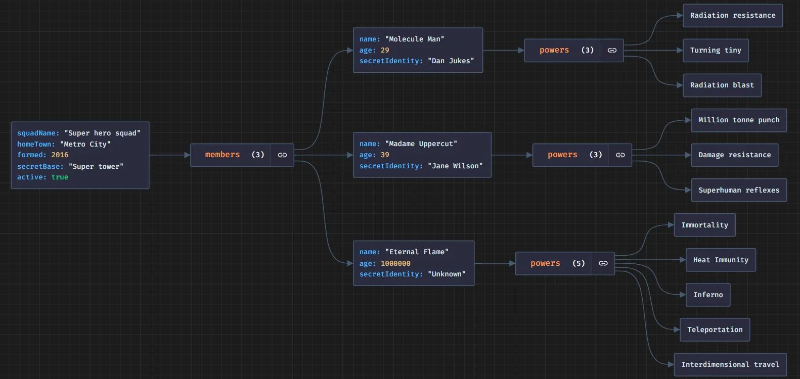

<TLDR>
This article presents JSON Crack, a free online tool that renders JSON content as an interactive mind map/diagram instead of raw nested text, making complex structures much easier to read at a glance. It shows two example JSON files rendered as visual trees and mentions the free version's line-count limitation along with a VSCode extension alternative.
</TLDR>

> [https://jsoncrack.com/editor](https://jsoncrack.com/editor)

I really like the idea of not having to draw (actually, that is just because I am really bad at it) a diagram, a flow chart, a graphic representation of something that ... can be written.

[JSON Crack](https://jsoncrack.com/editor) is one of the tools in my toolkit when I want to draw something that can be written in JSON. *It sits next to <Link to="/blog/docker-mindmap">Markmap</Link> (same idea, but from Markdown) and <Link to="/blog/docker-diagram-as-code">the diagram-as-code tools</Link> in general.*

*When you just need to read the JSON rather than visualize it, <Link to="/blog/json-lint">JSON - Online linter</Link> and <Link to="/blog/linux-jq">`jq`</Link> do the job.*

<!-- truncate -->

Let's take an example found randomly on the net [superheroes](https://medium.com/@Goldzila/superheroes-of-data-exploring-xml-json-and-binary-formats-through-the-lens-of-marvel-characters-3754f2691cdc). How can we represent Spider-Man as a JSON object? Below an attempt:

<Snippet filename="superheroes.json" source="./files/superheroes.json" />

Isn't it nicer in visual form?

Another example (found [here](https://developer.mozilla.org/en-US/docs/Learn/JavaScript/Objects/JSON)):

<Snippet filename="superheroes.json" source="./files/superheroes.part2.json" />

The advantage of the image is that it is much clearer: we can see straight away that the squad is made up of three members and that the strongest (and oldest) is *Eternal Flame*, who has five powers.

<AlertBox variant="note">
JSON Crack has some limitations for the free version like the number of lines in your JSON content. You can also install an [add-on for vscode](https://marketplace.visualstudio.com/items?itemName=AykutSarac.jsoncrack-vscode).

</AlertBox>

Other JSON tools worth knowing about: <Link to="/blog/json-faker">generating fake JSON data</Link> and <Link to="/blog/json-lint">linting/validating your JSON files</Link>.
