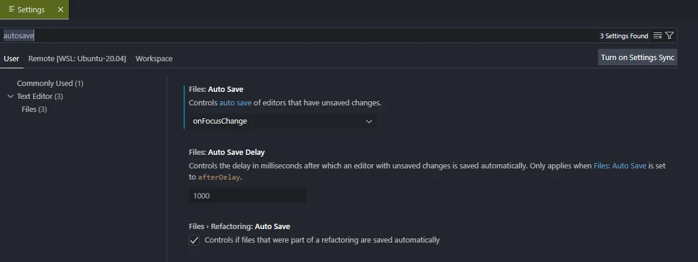

How many times have you modified a file in vscode (and forgotten to save the modification) in order to refresh it from your web page, run the script from your console, etc., and then thought *Oh no, damn, it still doesn't work*?

And it can take several minutes and back and forth before, damned, silly me, I didn't save my modification.

And even more so when you've done a Search&Replace in several files; some having been saved and others not.

Let's see how to avoid this.

<!-- truncate -->

It's really easy: press <kbd>CTRL</kbd>-<kbd>,</kbd> (comma) to show the settings page and start to type `autosave`.

The concerned settings will be displayed and set `Files: Auto save` on `onFocusChange`.

Or, you can also simply add the following line in your `settings.json` file:

<Snippet filename="settings.json" source="./files/settings.json" />

<AlertBox variant="info" title="You're using a versioning system, right?">
Some people don't like this feature and say *I want to be aware when I save something* (in case I do something stupid eh) but, oh, there's a versioning system like Git isn't there? So if you do something stupid, just don't save the changes and/or do a `revert`.

If you're one of these people, try out the autosave function for a few days, and you'll see that it brings undeniable comfort.

</AlertBox>
