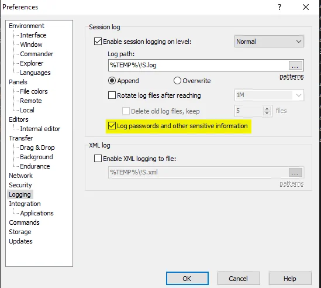

More than once I've found myself in the situation where I've got a site saved in the [WinSCP](https://winscp.net/) configuration where I've saved the password and, um, gosh, what was it?

Did you know WinSCP provide an option to show you, in plain text, a stored password?

<!-- truncate -->

To do this, just go to the `Preferences` menu then go to `Logging` and check *Log passwords and other sensitive information*.

Click on `Ok` and double-click on your site so you'll indeed make a connection.

Start a Windows Explorer and go to your `%TEMP%` directory. Sort on the last-modified date/time. You should retrieve a file having the same name as your session and having `.log` as file extension.

<AlertBox variant="highlyImportant" title="Don't forget to remove the file and uncheck the box">
Please return to the `preferences` - `Logging` page and uncheck the box. You don't want this to happen every time.
</AlertBox>
