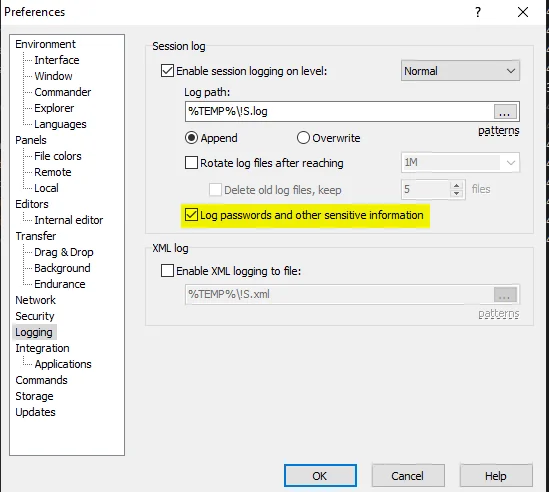

<TLDR>
This article shows how to recover a forgotten WinSCP password by temporarily enabling "Log passwords and other sensitive information" in the Logging preferences, reconnecting to the site so it's written to the session log in `%TEMP%`, then reading the plain-text password from that log — with a reminder to disable logging and delete the log file afterward.
</TLDR>

More than once I've found myself in the situation where I've got a site saved in the [WinSCP](https://winscp.net/) configuration where I've saved the password and, um, gosh, what was it?

*The real cure is to stop typing passwords at all: <Link to="/blog/connect-using-ssh-to-your-hosting-server">How to connect to your hosting server using SSH</Link> sets up key-based authentication, and <Link to="/blog/keepass-overriding-url">KeePass - Overriding the URL field</Link> opens WinSCP with the right credentials straight from your vault.*

Did you know WinSCP provides an option to show you, in plain text, a stored password?

<!-- truncate -->

To do this, just go to the `Preferences` menu then go to `Logging` and check *Log passwords and other sensitive information*.

Click on `Ok` and double-click on your site so you'll indeed make a connection.

Start a Windows Explorer and go to your `%TEMP%` directory. Sort on the last-modified date/time. You should retrieve a file having the same name as your session and having `.log` as file extension.

<AlertBox variant="highlyImportant" title="Don't forget to remove the file and uncheck the box">
Please return to the `preferences` - `Logging` page and uncheck the box. You don't want this to happen every time.
</AlertBox>

Fighting with PuTTY instead? See <Link to="/blog/putty-no-supported-authentication-methods">Fatal error was starting Putty after having saved settings</Link>. And if you'd rather stop relying on stored passwords altogether, <Link to="/blog/linux-ssh-scp">SSH - Launch a terminal on your session without having to authenticate yourself</Link> shows how to switch to key-based authentication.
