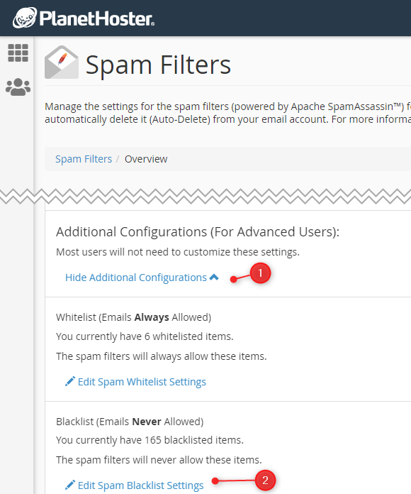

# Exterminate them all, fight spam directly at your host company


If your web host company offers you a cpanel access, you will find there access to a tool called *SpamAssassin*.

There, you've two main options: the *Spam filter* and a *White list*.

Using the first one, you can define email patterns like `*@hair.com` which mean: immediately kill those emails on the server. The second one is just the opposite f.i. `*@my-own-company.com` saying that you trust that domain.

:::tip PlanetHoster - N0C
If you're hosted by PlanetHoster on the N0C infrastructure, please read [Exterminate them all, fight spam directly at PlanetHoster - N0C](/blog/planethoster-n0c-spam) instead.
:::

<!-- truncate -->

My personal use case is even if I don't like shortcuts on my desktop, I've well one for `https://(my_host_company)/xxxxx/mail/spam/index.html#/blacklist` i.e. a direct access to the page where I can add my spam filters. And it works quite well.



But, did you know there is another way to do this?

Using your FTP client, go to your user's home directory. If your host has SpamAssassin enabled, you'll see a folder called `.spamassassin` and, in that folder, a file called `user_prefs`. Open that file.

That file can look like this:

```text
blacklist_from *.hr
blacklist_from *.rest
blacklist_from *.ru
blacklist_from *.su

blacklist_from *@hair.com

whitelist_from *@avonture.be
whitelist_from *@my-own-company.com
```

As you can expect, you'll find two rules: `blacklist_from` and `whitelist_from` with the pattern you've filled in the SpamAssassin web interface of your hosting company:

:::tip Spam Filters location
You can manipulate entries one by one using the web interface too. Go to your cPanel, search for `Spam Filters` and click on `Additional Configurations (For Advanced Users)`.
:::

You can now manipulate the list with f.i. vscode and sort it alphabetically, simplify rules, remove duplicated entries (after refactoring), ...

I really like fighting against spam directly at my host company because, otherwise, I get spams on all my machines (my different computers and my smartphone) and, on my smartphone I click on *This is a spam* I only ever teach my smartphone to delete this email, not my other machines... And I only identify that sender (like *<buy-it@hair.com>*); I'll continue to get from any other emails account like `really-but-it@hair.com`.
