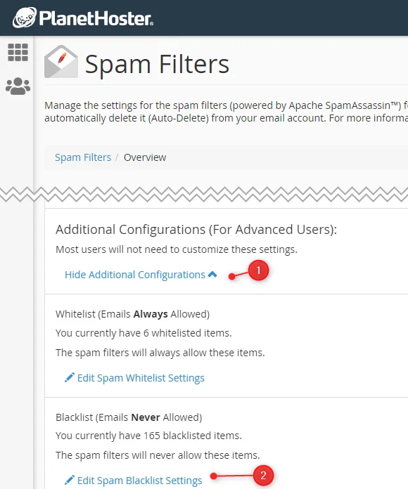

<TLDR>
This article shows how to fight spam at the source using cPanel's SpamAssassin: defining blacklist and whitelist domain patterns through the web interface, or editing the `.spamassassin/user_prefs` file directly over FTP to manage `blacklist_from`/`whitelist_from` rules in bulk, sorted and deduplicated.
</TLDR>

If your web host company offers you cPanel access, you will find a tool called *SpamAssassin* there.

There, you have two main options: the *Spam filter* and a *White list*.

Using the first one, you can define email patterns like `*@hair.com` which means: immediately kill those emails on the server. The second one is just the opposite, f.i. `*@my-own-company.com` saying that you trust that domain.

<AlertBox variant="info" title="PlanetHoster - N0C">
If you're hosted by PlanetHoster on the N0C infrastructure, please read <Link to="/blog/planethoster-n0c-spam">Exterminate them all, fight spam directly at PlanetHoster - N0C</Link> instead.

</AlertBox>

<!-- truncate -->

My personal use case: even if I don't like shortcuts on my desktop, I do have one for `https://(my_host_company)/xxxxx/mail/spam/index.html#/blacklist` i.e. direct access to the page where I can add my spam filters. And it works quite well.

*Clicking through a web interface doesn't scale, though. <Link to="/blog/planethoster-n0c-spam-roundcube-action">Exterminate them all, kill spam using GitHub Actions</Link> generates the rules from a JSON list and deploys them automatically.*

But, did you know there is another way to do this?

Using your FTP client, go to your user's home directory. If your host has SpamAssassin enabled, you'll see a folder called `.spamassassin` and, in that folder, a file called `user_prefs`. Open that file.

That file can look like this:

<Snippet filename=".spamassassin/user_prefs" source="./files/user_prefs" />

As you can expect, you'll find two rules: `blacklist_from` and `whitelist_from` with the pattern you've filled in the SpamAssassin web interface of your hosting company:

<AlertBox variant="info" title="Spam Filters location">
You can manipulate entries one by one using the web interface too. Go to your cPanel, search for `Spam Filters` and click on `Additional Configurations (For Advanced Users)`.

</AlertBox>

You can now manipulate the list with f.i. VSCode and sort it alphabetically, simplify rules, remove duplicated entries (after refactoring), ...

I really like fighting against spam directly at my host company because, otherwise, I get spam on all my machines (my different computers and my smartphone) and, on my smartphone, when I click on *This is spam*, I only ever teach my smartphone to delete this email, not my other machines... And I only identify that sender (like `<buy-it@hair.com>`); I'll continue to get spam from any other email account like `really-but-it@hair.com`.

The fight doesn't stop there — next up, <Link to="/blog/planethoster-n0c-spam">fighting spam directly at PlanetHoster - N0C</Link>.
