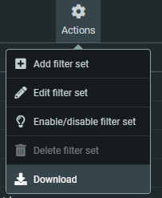

<!-- cspell:ignore allof,fileinto -->


A few days ago, I've published a post about how to <Link to="/blog/cpanel-spam">fight against spam if you've a cpanel</Link>. If you're hosted on the N0C infrastructure of PlanetHoster; it will not work.

After having some discussion with us, they've said that SpamAssassin is managed by them (PH) and no more accessible to us (clients). We can't anymore create our own rules like explained on the post I've mentioned above.

Ok, so, here is how to deal with spam at PlanetHoster - N0C platform.

<!-- truncate -->

## You need to use RoundCube for the filtering

PlanetHoster support has told me that we need to use the RoundCube mail client found in their PH hosting (direct link: [https://mg.n0c.com/email/accounts](https://mg.n0c.com/email/accounts)).

:::important You are not forced to use RoundCube as your email client.
Rules defined in RoundCube will be executed at server level even if you don't open it. If your mail client is *it doesn't matter which one*, the RoundCube rules will be executed.
:::

The official documentation of PH is, in English : [https://kb.n0c.com/en/knowledge-base/redirecting-emails-with-a-filter-in-roundcube-2/](https://kb.n0c.com/en/knowledge-base/redirecting-emails-with-a-filter-in-roundcube-2/) or, in French, [https://kb.n0c.com/knowledge-base/creation-et-redirection-de-tous-les-courriels-avec-un-filtre-dans-roundcube/#marche-a-suivre](https://kb.n0c.com/knowledge-base/creation-et-redirection-de-tous-les-courriels-avec-un-filtre-dans-roundcube/#marche-a-suivre)

Then click on the mail icon at the right of one of your accounts and you'll, normally, start RoundCube.

In the right side of the screen, click on the `Settings` icon then `Filters` and finally on the `Create` button in the top right part of the screen.

Fill in the screen with your own rule; like for identifying all emails coming from `*.su` (Soviet Union) as spam:


:::note In my case, all the emails coming from .su can only be unsolicited emails.
:::

Once saved, you can create other rules.

## Too many manual actions

We all agree that to get to the 'Save' button we had to click at least 13 times, if not more. And if we wanted to create a second rule, we'd have to click at least 8 times. No, that's really not possible.

If needed click again on the `Settings` menu then `Filters`. Now that you've at least one rule, click on the `Actions` button you'll see in the top part of the screen and there you'll find a `Download` action.



Open the downloaded file and you'll get something like this:

```none
# rule:[Identify as spam: *.su]
if allof (header :contains "from" "*.su")
{
    fileinto "spam";
}
```

This syntax is called `Sieve` (get more info on [wiki](https://en.wikipedia.org/wiki/Sieve_(mail_filtering_language))).

The syntax is quite easy, no? In fact, we can reproduce it with some loop in PHP, Bash, Python or *whatever your preferred language*.

There is one variable and it's `*.su`. So, if I want to block also `.india` (too, because I don't have any contact with India), I just need to code some loop with an array having two entries and I'll get:

```none
# rule:[Identify as spam: *.india]
if allof (header :contains "from" "*.india")
{
    fileinto "spam";
}
# rule:[Identify as spam: *.su]
if allof (header :contains "from" "*.su")
{
    fileinto "spam";
}
```

## Where to put our file

Once you've a correctly formatted .sieve file (think to save it for Linux i.e. `CR` and not `CRLF`), you need to copy the file on your host, using a FTP client most probably.

The location is, in the root directory of my FTP, in folder `/mail/DOMAIN.TLD/ACCOUNT/sieve`  (for me, `DOMAIN.TLD` is `avonture.be` and `ACCOUNT` is `christophe`) then, I don't know why, the path is doubled (so, for me, it's `/mail/avonture.be/christophe/mail/avonture.be/christophe/sieve`).

In that folder, you'll find a file `roundcube.sieve`.

:::tip Create a first rule if the path didn't exists yet
Just in case of you didn't find that specific path or file, just go to RoundCube and create a filter manually as we see in the previous chapter. Then go back to your FTP, the file should now be there.
:::

## Stay in touch

As you know me, I can't be satisfied with a manual solution. Going to RoundCube and creating a filter requires 13 actions. Ouch.

As we've seen, with a bit of programming, it's possible to automate the creation of the `roundcube.sieve` file.

I've started programming such a little script in Linux bash that will take a JSON file as input (as shown below) and write the `roundcube.sieve` file.

<Snippet filename="roundcube.sieve">

```json
{
    "patterns": [
      "*.india",
      "*.ru",
      "*.su",
      "*@newsletter.*",
      "newsletter@*"
      "newsletters-noreply@*",
      "newsletters@*",
}
```

</Snippet>

The code, in proof-of-concept mode, is already written (see below), but it needs to be refined and, above all, its execution automated.

Give me some time to do this and as soon as it's done, I'll publish my solution.

<Snippet filename="script.sh">

```bash
#!/usr/bin/env bash

clear

if [ ! -f patterns.json ]; then
    echo "Please create a patterns.json file."
    echo "Run 'cp patterns.json.dist patterns.js' to use an example."
    exit 1
fi

rm -f roundcube.sieve && touch roundcube.sieve

cat patterns.json \
    | jq '.patterns[]' \
    | sort \
    | while read -r pattern; do \
        # Trim quotes
        pattern=$(echo "$pattern" | tr -d '"')
        # Read the spam.template file, make the replace and append in file roundcube.sieve
        sed "s/{{ pattern }}/${pattern}/g" spam.template >>roundcube.sieve; \
    done

echo "File roundcube.sieve has been created. Now, you've to publish it on your FTP."
```

</Snippet>

:::tip
The article <Link to="/blog/planethoster-n0c-spam-roundcube-action">Exterminate them all, kill spam using GitHub Actions</Link> is now written; don't hesitate to read it.
:::

## Special thanks

For this blog post, I would like to thank [Marc Dechèvre](https://www.woluweb.be/) because Marc has identified the .sieve file and where to save it via FTP. Thank you maestro 👏.
