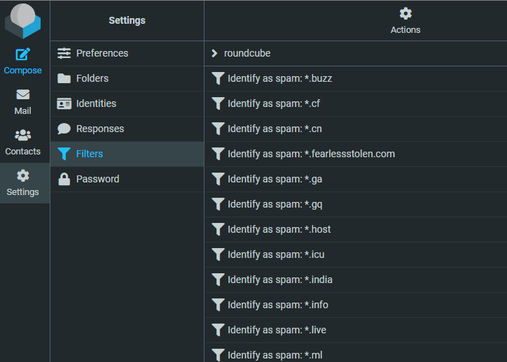

In previous articles, I explained how to fight against spam if you've a [cpanel](/blog/cpanel-spam) or [PlanetHoster's N0C infrastructure](/blog/planethoster-n0c-spam).

What if we automated as many things as possible?

In the [PlanetHoster's N0C infrastructure](/blog/planethoster-n0c-spam) article , I showed that you need to write rules for RoundCube to identify sources of spam and remove them. These rules have to be created from the RoundCube interface and, well, ok, that's not optimized at all.

Let's look at how to do as little as possible and still be a hardcore spam fighter.

<!-- truncate -->

## The idea

As already explained, RoundCube is using a sieve file to store your rules. Such file can look like this:

```text
# rule:[Identify as spam: *.su]
if allof (header :matches "from" "*.su")
{
    fileinto "spam";
}
```

And, therefore, the objective is simple and obvious: we're going to create a little script that only needs two things.

1. a list of values, e.g. domain names to be blocked
2. a sieve template

## Our action plan

1. We'll create a directory and jump in it: `mkdir ~/sieve-generator && cd $_`,
2. We'll create our JSON file,
3. We'll create our sieve template,
4. We'll create our script, in Bash (but you can do this in any language)
5. We'll create a repository on GitHub and push our code there
6. And we'll finally set up GitHub Actions to automate the build and deploy process.

### Create

Please run `mkdir ~/sieve-generator && cd $_` to create the `sieve-generator` in your home directory and jump in it.

### Storing the list of values in a JSON file

Please create a file called `patterns.json` with this content:

```json
{
  "spam": [
    "*.buzz",
    "*.cf",
    "*.cn",
    "*.ga",
    "*.gq",
    "*.host",
    "*.icu",
    "*.india",
    "*.info",
    "*.live",
    "*.ml",
    "*.net",
    "*.online",
    "*.ru",
    "*.su",
    "*.tk",
    "*.top",
    "*.ua",
    "*.us",
    "*.wang",
    "*.xyz"
  ]
}
```

### Create our template

Please create a file called `spam.template` with this content:

```text
# rule:[Identify as spam: {{ pattern }}]
if allof (header :matches "from" "{{ pattern }}")
{
 fileinto "spam";
}

```

:::caution Please keep the last empty line
The last line of the `spam.template` file has to be an empty line so the file should have 6 lines, not 5.
:::

### Create the generation script

Please create a file called `generate.sh` with this content:

```bash
#!/usr/bin/env bash

clear

if [ ! -f patterns.json ]; then
    echo "Please create a patterns.json file."
    echo "Run 'cp patterns.json.dist patterns.js' to use an example."
    exit 1
fi

if [ ! -f spam.template ]; then
    echo "Please create a spam.template file. Below an example of what you can put in it:"
    echo ""
    echo "# rule:[Identify as spam: {{ pattern }}]"
    echo "if allof (header :matches \"from\" \"{{ pattern }}\")"
    echo "{"
 echo "  fileinto \"spam\";"
    echo "}"
    echo ""
    exit 1
fi

# File to create
outFile="${PWD}/build/roundcube.sieve"

[ ! -d "$(dirname "${outFile}")" ] && mkdir "$(dirname "${outFile}")"

rm -f "${outFile}" && touch "${outFile}"

cat patterns.json \
    | jq '.spam[]' \
    | sort \
    | while read -r pattern; do \
        # Trim quotes
        pattern=$(echo "$pattern" | tr -d '"')
        # Read the spam.template file, make the replace and append in file roundcube.sieve
        sed "s/{{ pattern }}/${pattern}/g" spam.template >>"${outFile}"; \
    done

echo "File "${outFile}" has been created."
```

Also run `chmod +x generate.sh` to make it executable.

At this stage, you've thus three files in your folder:

* `generate.sh`,
* `patterns.json` and
* `spam.template`

In your console, run `./generate.sh` and if everything is running fine, you'll get a message like `File /home/xxx/sieve-generator/build/roundcube.sieve has been created.`.

If you get an error about `jq` please install it by running: `sudo apt-get update && sudo apt-get install jq` then start `./generate.sh` again.

So now, you should have a new folder called `build` where the file `roundcube.sieve` has been created. Open the file and check his content. It'll start with:

```text
# rule:[Identify as spam: *.buzz]
if allof (header :matches "from" "*.buzz")
{
  fileinto "spam";
}
# rule:[Identify as spam: *.cf]
if allof (header :matches "from" "*.cf")
{
  fileinto "spam";
}
# rule:[Identify as spam: *.cn]
if allof (header :matches "from" "*.cn")
{
  fileinto "spam";
}
```

Congratulations: you've successfully created your anti-spam generator.

#### At this stage, you can deploy the file to your FTP

If you wish to validate the `roundcube.save` file, you can start your FTP client, go to your N0C server (hosted by PlanetHoster), go to the folder `/mail/DOMAIN.TLD/ACCOUNT/sieve` (refers to the article [PlanetHoster's N0C infrastructure](/blog/planethoster-n0c-spam) if needed).

Push the file there, on your host.

Now, go to your web email account (direct link: [https://mg.n0c.com/email/accounts](https://mg.n0c.com/email/accounts)) and start RoundCube. Open your account, click on `Settings` then `Filters` and tadaaa...



:::note I've already added more spams domain for my own account
If you don't have the same list of filters; it's absolutely normal.
:::

### Create your own Github repository

:::info Skip this chapter if you don't want full automation
:::

In order to be able to create automation using Github Actions, first, we need to create a Github repository.

I'll suppose you already have a Github account and you know how to use Github.

Go to [https://github.com/new](https://github.com/new) and create a new **private** repository (it's free).

Then just copy/paste the example given by Github; something like:

```bash
echo "# Sieve generator" >> README.md
git init
git add README.md
git commit -m "first commit"
git branch -M main
git remote add origin XXXXXXXXXXXX     '<-- put here your own path
git push -u origin main
```

Now push the other files:

```bash
git add .
git commit -m "Initial upload"
git push
```

Back to github, you'll obtain a repo like this one:


So, now, each time you'll update the list of domains (in the `patterns.json` file), our objective is to ask Github to run itself the `./generate.sh` script to generate the `build/roundcube.sieve` file.

And, too, to publish the new file to your FTP account so, to put it simply: you modify the JSON file on your computer and RoundCube receives the new rules automatically, just a few seconds later.

### Adding Github Actions

:::info Skip this chapter if you don't want full automation
:::

Go back to your computer, jump back in the `~/sieve-generator` folder and create a new file called `.github/workflows/build_and_deploy.yaml`.

Here is the content for that new file:

```yaml
name: Create roundcube.sieve and deploy

on:
  push:
    branches:
      - main

  workflow_dispatch:
    inputs:
      version:
        type: string
        required: false
        description: 'Version of jq to install'
        default: '1.7'
      force:
        type: boolean
        required: false
        description: 'Do not check for existing jq installation before continuing.'
        default: false

permissions:
  contents: write

jobs:
  deploy:
    name: Create roundcube.sieve and deploy
    runs-on: ubuntu-latest
    steps:
      - uses: actions/checkout@v3

      - name: 'Setup jq'
        uses: dcarbone/install-jq-action@v2
        with:
          version: '${{ inputs.version }}'
          force: '${{ inputs.force }}'

      - name: 'Build'
        run: |
          ./generate.sh

      - name: Push files
        uses: SamKirkland/FTP-Deploy-Action@v4.3.4
        with:
          server: ${{ secrets.ftp_server }}
          username: ${{ secrets.ftp_login }}
          password: ${{ secrets.ftp_password }}
          local-dir: ./build/
```

I won't go into detail about this file, but this ask Github to:

1. Install JQ on his server,
2. Run the `generate.sh` script and thus build the `build/roundcube.sieve` file
3. Use FTP-Deploy-Action to push the file on your server.

As you can see, there are three `secrets`.

Back to your browser, go to your Github repository you've created in the previous chapter.

Click on `Settings` then `Secrets and variables` and finally, click on `Actions`


Click on the green button `New repository secret` and create the first one called `FTP_SERVER` (seems to be in uppercase). Put there the name of your FTP server like `node99-xx.N0c.com` (get the name from your *My planethoster* page).

You'll need to add two new secrets `FTP_LOGIN` and `FTP_PASSWORD` but, before, create a new FTP user.

Go to [https://mg.n0c.com/files/ftp-accounts](https://mg.n0c.com/files/ftp-accounts) and create a new user. Use a very explicit name like `deploy_spam_roundcube_xxx` and define a very strong password (30 chars or more).

Restrict the path for that user to, exactly, where the sieve file is located on your FTP. As said in [PlanetHoster's N0C infrastructure](/blog/planethoster-n0c-spam), for me, it's `/mail/avonture.be/christophe/mail/avonture.be/christophe/sieve`. Make sure to find the path for you.

:::note
In case the `sieve` folder didn't exists yet, the best way to create it, I think, is to manually create a filter in Roundcube. Here is the [official PlanetHoster documentation](https://kb.n0c.com/en/knowledge-base/redirecting-emails-with-a-filter-in-roundcube-2/).
:::

Ok, so, now, you've a new FTP login, his very secure password and being able to, only, connect to your sieve folder.

Copy the login and the password in the Github secrets page.

You'll then have this:


## Everything is now in place for automation

If you've followed the Github chapters, now, everything is set up.

Back to your computer and edit the `patterns.json` file and add a new pattern, f.i. `newsletters@*`.

Push the change to Github (`git add . ; git commit -m "chore: new pattern" ; git push`).

Just for the curiosity, go to Github - Actions tabs:


If you've configured everything correctly, you should get this:


## Conclusion

From now on, all you have to do is copy/paste the email addresses you receive spam from, see if you can standardise them as much as possible (by using the asterisk like in `newsletter@*`) and then copy/paste them into the JSON file that you just have to upload to Github.

Et voilà!
