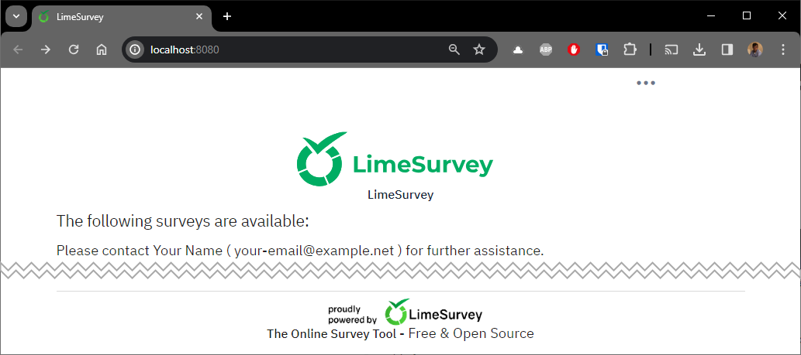
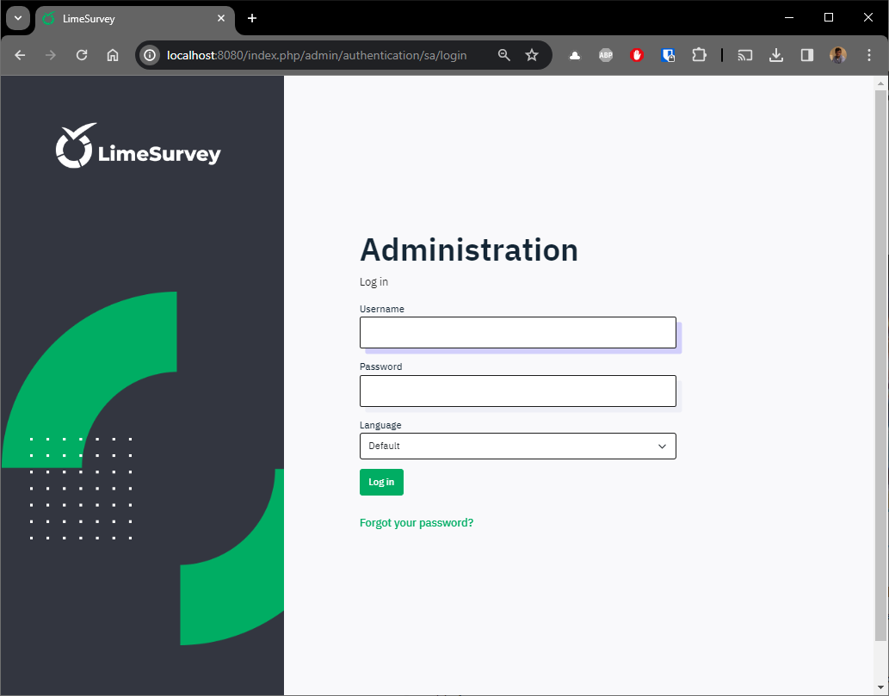
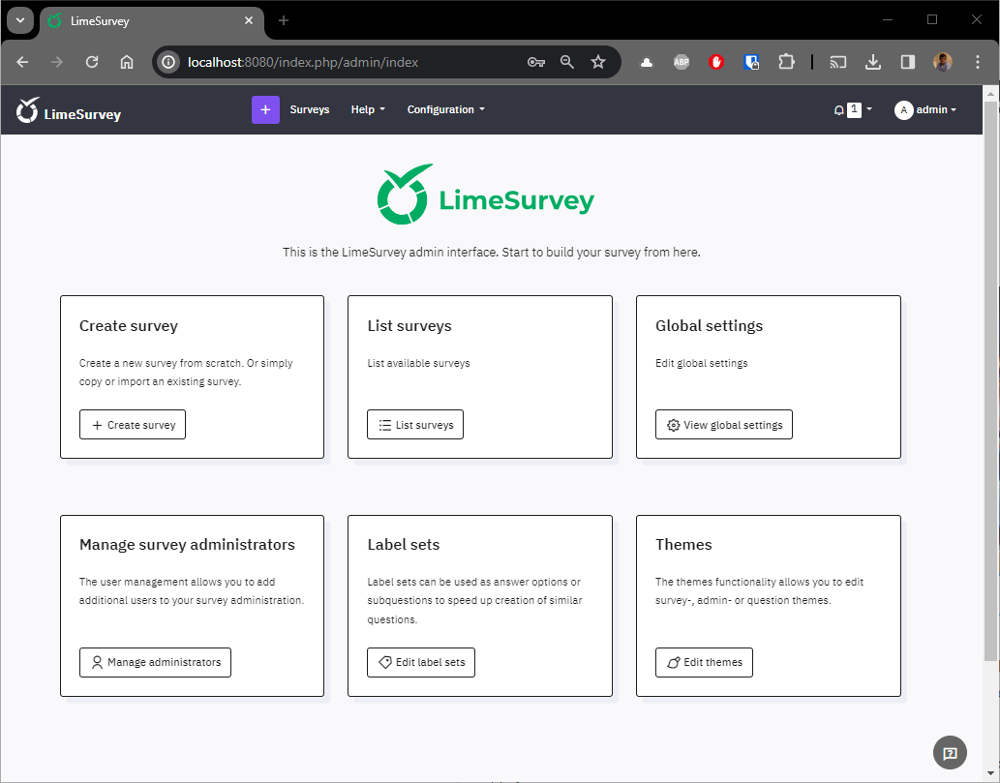

LimeSurvey is an open-source survey tool that allows users to create and conduct surveys online. It is a powerful and intuitive tool that can be used by everyone.

Once again, it's easy to play with it and create a sandbox site to take a look on all his features; thanks to Docker.

To do this, we'll use the [https://github.com/martialblog/docker-limesurvey](https://github.com/martialblog/docker-limesurvey) Docker image.

<!-- truncate -->

## Let's play

Please start a Linux shell and run `mkdir -p /tmp/limesurvey && cd $_` to create a folder called `limesurvey` in your Linux temporary folder and jump in it.

Please then create a `docker-compose.yml` file in that folder with this content:

```yaml
version: '3.9'

name: limesurvey

services:
  limesurvey-app:
    image: docker.io/martialblog/limesurvey:latest
    container_name: limesurvey-app
    restart: always
    environment:
      - DB_TYPE=mysql
      - DB_HOST=limesurvey-db
      - DB_NAME=limesurvey
      - DB_USERNAME=admin
      - DB_PASSWORD=admin
      - ADMIN_USER=admin
      - ADMIN_PASSWORD=admin
      - ADMIN_NAME=admin
      - ADMIN_EMAIL=admin@example.com
    ports:
      - 8080:8080
    depends_on:
      - limesurvey-db

  limesurvey-db:
    image: docker.io/mysql:latest
    container_name: limesurvey-db
    environment:
      - MYSQL_USER=admin
      - MYSQL_PASSWORD=admin
      - MYSQL_ROOT_PASSWORD=root
      - MYSQL_DATABASE=limesurvey
```

Now, simply run the following command to download (only the first time) required images (LimeSurvey and MySQL) and create the two containers:

```bash
docker compose up --detach
```

Once everything has been downloaded and started, you can check you've well two containers by running the following command:

```bash
❯ docker container list

[...] IMAGE                         [...] NAMES
[...] martialblog/limesurvey:latest [...] limesurvey-app
[...] mysql:latest                  [...] limesurvey-db
```

:::info The output above has been simplified
For clarity, the output of `docker container list` has been simplified here above; not all columns were mentioned in the article.
:::

Please wait **one or two minutes** more (depending on your machine), time needed by LimeSurvey to f.i. connect to the database container and create his database.

Go to `http://localhost:8080` and while you got an error like `ERR_CONNECTION_REFUSED`, please wait and try again. When it's ready, you should see the default LimeSurvey welcome page.

:::tip Look at the logs
If you think that you've waited already a long time and it seems something is going wrong, run `docker compose logs -f` to get access to the logs. If there is a fatal error, you can see it there. If you see `nc: connect to limesurvey-db (xxxxx) port 3306 (tcp) failed: Connection refused`, it's normal, the LimeSurvey container is trying to connect to the database server and that one isn't yet ready, just wait a few more.

**You should see, in the logs, something like `[core:notice] [pid 1] AH00094: Command line: 'apache2 -D FOREGROUND'` when LimeSurvey is ready (meaning that the web server is ready to handle connections).**

Press <kbd>CTRL</kbd>-<kbd>C</kbd> to stop listening to the logs.
:::

:::tip Using service_healthy will preserve from such errors, see the example at the end of this post
:::

When LimeSurvey is ready, you'll see the following page on `http://localhost:8080`:



Go to `http://localhost:8080/admin` to start the administration interface. The credentials to use are `admin` / `admin` (as defined in the `docker-compose.yml` file, see variables `ADMIN_USER` and `ADMIN_PASSWORD`).



You're now ready to start and play with LimeSurvey on your machine.



## Using volumes

The `docker-compose.yml` file provided above didn't use any volumes: when you stop running containers, your work will be lost and LimeSurvey will be restarted without any configuration / surveys just like a full reset.

Perhaps, if you want to test LimeSurvey over several days and keep your configuration items, your surveys, then you will want to keep your work. To do this, you need to use volumes.

Here is an updated `docker-compose.yml` file to ask Docker to use self-managed volumes.

```yaml
version: '3.9'

name: limesurvey

services:
  limesurvey-app:
    image: docker.io/martialblog/limesurvey:latest
    container_name: limesurvey-app
    restart: always
    environment:
      - DB_TYPE=mysql
      - DB_HOST=limesurvey-db
      - DB_NAME=limesurvey
      - DB_USERNAME=admin
      - DB_PASSWORD=admin
      - ADMIN_USER=admin
      - ADMIN_PASSWORD=admin
      - ADMIN_NAME=admin
      - ADMIN_EMAIL=admin@example.com
    // highlight-next-line
    volumes:
      // highlight-next-line
      - limesurvey:/var/www/html/upload/surveys
    ports:
      - 8080:8080
    depends_on:
      - limesurvey-db

  limesurvey-db:
    image: docker.io/mysql:latest
    container_name: limesurvey-db
    // highlight-next-line
    volumes:
      // highlight-next-line
      - data:/var/lib/mysql
    environment:
      - MYSQL_USER=admin
      - MYSQL_PASSWORD=admin
      - MYSQL_ROOT_PASSWORD=root
      - MYSQL_DATABASE=limesurvey

// highlight-next-line
volumes:
  // highlight-next-line
  limesurvey:
  // highlight-next-line
  data:
```

:::tip Want to learn more about volumes?
In that case, please read this blog post: [Using volumes with Docker, use cases](/blog/docker-volumes)
:::

## Download an old version

You know what? It's really easy to download an old version.

Let's imagine the following situation: you need to intervene on an old installation of LimeSurvey. For the example, let's say you need to install a plugin of some kind but, obviously, before doing so on a production site, you're going to get your hands dirty locally. So you need to download the same version as the production version.

Earlier in this article, we saw that we can easily download the 'latest' version. 

Let's start again, but this time for a specific version. By looking at the production site, you see f.i. version `3.22.6+200219`.

In our `docker-compose.yml`, we then need to replace `image: docker.io/martialblog/limesurvey:latest` by something else but what? A valid tag for sure. Go to [https://hub.docker.com/r/martialblog/limesurvey/tags](https://hub.docker.com/r/martialblog/limesurvey/tags) and, in the `Filter Tags` area, type `3.22.6`, our production version thus. We'll get three images but just one for `apache` (indeed, we wish to use the Docker image having both PHP and Apache). Bingo, now we know our line will be `image: docker.io/martialblog/limesurvey:3.22.6_200219-apache`.

The second part is how to be sure which lines I've to put in the yaml file. For this, just go to [https://github.com/martialblog/docker-limesurvey/releases/tag/](https://github.com/martialblog/docker-limesurvey/releases/tag/) and try to find the same release. Here it's: [https://github.com/martialblog/docker-limesurvey/releases/tag/3.22.6%2B200219](https://github.com/martialblog/docker-limesurvey/releases/tag/3.22.6%2B200219).

Click on the `Source code (zip)` for instance to download the archive and open it. From the archive, retrieve the `docker-compose.yml` file and pay attention to how the file is configured.

For instance, we can see the version of MySQL used then was `mysql:5.7` (so, use the same to avoid conflicts).

Our `docker-compose.yml` will then become:

```yaml
version: '3.9'

name: limesurvey

services:
  limesurvey-app:
    image: docker.io/martialblog/limesurvey:3.22.6_200219-apache
    container_name: limesurvey-app
    restart: always
    environment:
      - DB_TYPE=mysql
      - DB_HOST=limesurvey-db
      - DB_NAME=limesurvey
      - DB_USERNAME=limesurvey
      - DB_PASSWORD=secret
      - ADMIN_USER=admin
      - ADMIN_PASSWORD=admin
      - ADMIN_NAME=admin
      - ADMIN_EMAIL=admin@example.com
    ports:
      - 8080:80
    depends_on:
      limesurvey-db:
        condition: service_healthy

  limesurvey-db:
    image: mysql:5.7
    container_name: limesurvey-db
    environment:
      - MYSQL_USER=limesurvey
      - MYSQL_PASSWORD=secret
      - MYSQL_ROOT_PASSWORD=secret
      - MYSQL_DATABASE=limesurvey
    healthcheck:
      test: ["CMD", "mysqladmin" ,"ping", "-h", "localhost"]
      timeout: 10s
      retries: 10
```

:::tip Using service_healthy
I've used the `depends_on` property for the `limesurvey-app` service and I've specified `condition: service_healthy`. This is a very cool feature: LimeSurvey, the PHP application, won't start before the database layer is running. Since LimeSurvey has to access the database, we just want to avoid some connectivity errors like *`nc: connect to limesurvey-db (xxxxx) port 3306 (tcp) failed: Connection refused`* or things like that.
:::

Just run `docker compose up --detach` and surf to `http://localhost:8080` and, congratulations, you've a local LimeSurvey v3.22.6 website.
