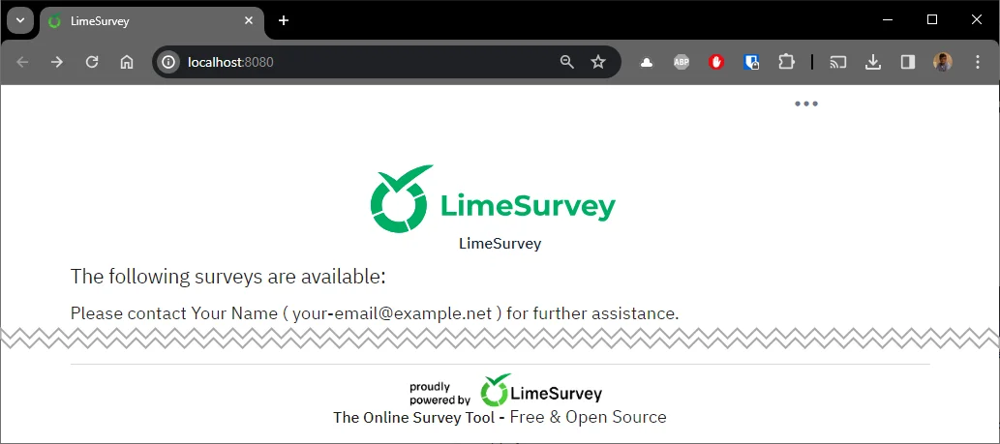
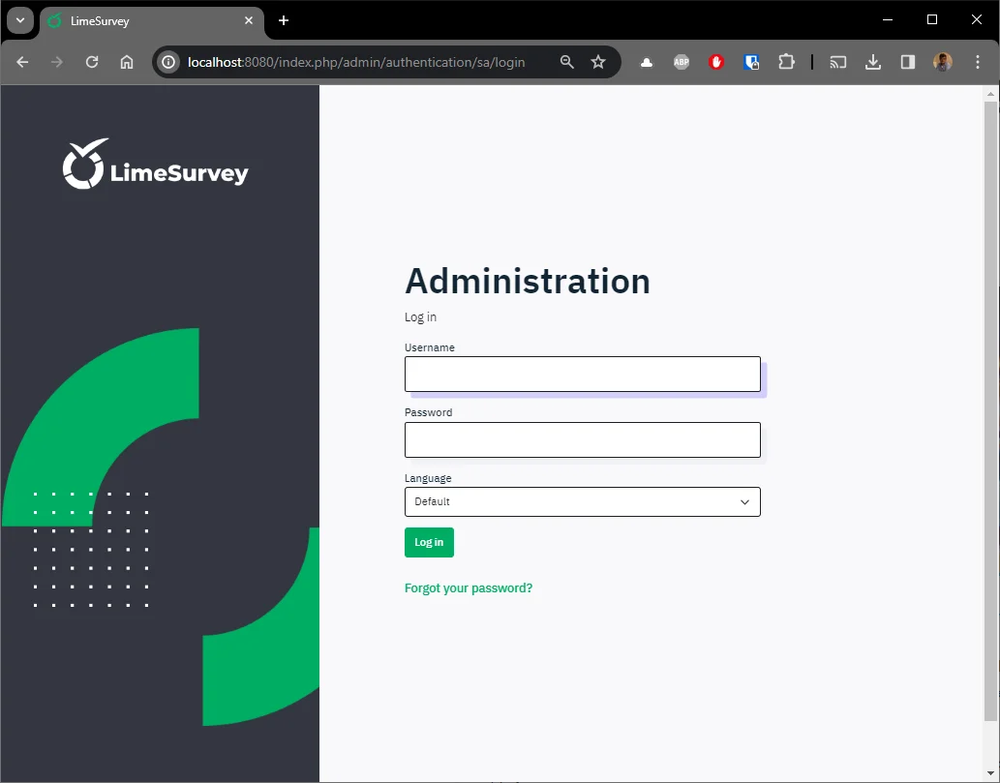
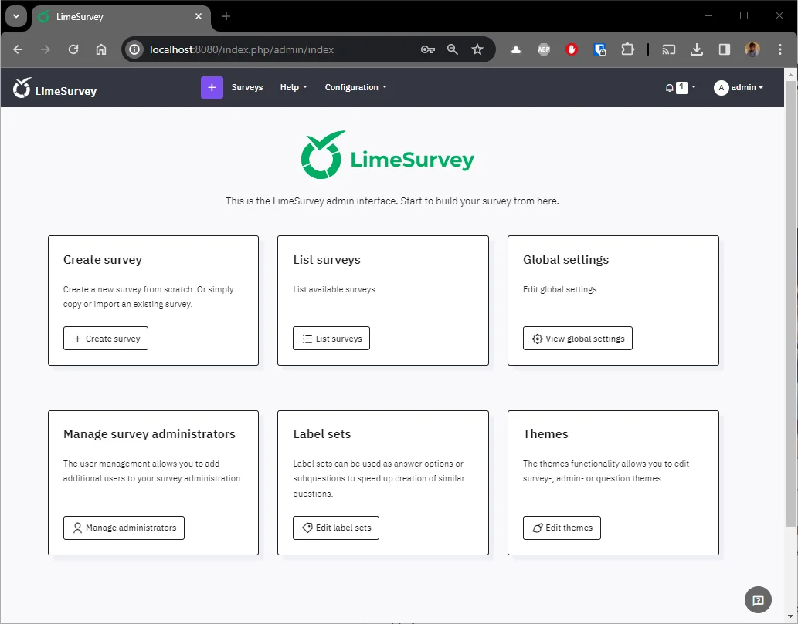

LimeSurvey is an open-source survey tool that allows users to create and conduct surveys online. It is a powerful and intuitive tool that can be used by everyone.

Once again, it's easy to play with it and create a sandbox site to take a look at all its features; thanks to Docker.

To do this, we'll use the [https://github.com/martialblog/docker-limesurvey](https://github.com/martialblog/docker-limesurvey) Docker image.

<!-- truncate -->

## Let's play

Please start a Linux shell and run `mkdir -p /tmp/limesurvey && cd $_` to create a folder called `limesurvey` in your Linux temporary folder and jump in it.

Please then create a `compose.yaml` file in that folder with this content:

<Snippet filename="compose.yaml" source="./files/compose.yaml" />

Now, simply run the following command to download (only the first time) required images (LimeSurvey and MySQL) and create the two containers:

<Terminal typewriter>
$ docker compose up --detach
</Terminal>

Once everything has been downloaded and started, you can check you have two containers by running the following command:

<Terminal typewriter>
$ docker container list

[...] IMAGE                         [...] NAMES
[...] martialblog/limesurvey:latest [...] limesurvey-app
[...] mysql:8.4                     [...] limesurvey-db
</Terminal>

<AlertBox variant="info" title="The output above has been simplified">
For clarity, the output of `docker container list` has been simplified here above; not all columns were mentioned in the article.

</AlertBox>

The `service_healthy` condition in the compose file ensures LimeSurvey won't start until MySQL is ready, which eliminates the connectivity errors you might have read about in older tutorials. Still, please wait **one or two minutes** (depending on your machine) for LimeSurvey to initialize its database tables.

Go to `http://localhost:8080` and if you see `ERR_CONNECTION_REFUSED`, wait a little longer and refresh. When it's ready, you should see the default LimeSurvey welcome page.

<AlertBox variant="info" title="Look at the logs">
If you have been waiting a long time and something seems wrong, run `docker compose logs -f` to inspect the logs. You should see `[core:notice] [pid 1] AH00094: Command line: 'apache2 -D FOREGROUND'` when LimeSurvey is ready, meaning the web server is up and accepting connections.

Press <kbd>CTRL</kbd>-<kbd>C</kbd> to stop following the logs.
</AlertBox>

When LimeSurvey is ready, you'll see the following page on `http://localhost:8080`:

Go to `http://localhost:8080/admin` to start the administration interface. The credentials to use are `admin` / `admin` (as defined in the `compose.yaml` file, see variables `ADMIN_USER` and `ADMIN_PASSWORD`).

You're now ready to start and play with LimeSurvey on your machine.

## Using volumes

The `compose.yaml` file provided above didn't use any volumes: when you stop running containers, your work will be lost and LimeSurvey will be restarted without any configuration / surveys just like a full reset.

Perhaps, if you want to test LimeSurvey over several days and keep your configuration items, your surveys, then you will want to keep your work. To do this, you need to use volumes.

Here is an updated `compose.yaml` file to ask Docker to use self-managed volumes.

<Snippet filename="compose.yaml" source="./files/compose.part2.yaml" />

<AlertBox variant="info" title="Want to learn more about volumes?">
In that case, please read this blog post: <Link to="/blog/docker-volumes">Using volumes with Docker, use cases</Link>
</AlertBox>

## Download an old version

You know what? It's really easy to download an old version.

Let's imagine the following situation: you need to intervene on an old installation of LimeSurvey. For the example, let's say you need to install a plugin of some kind but, obviously, before doing so on a production site, you're going to get your hands dirty locally. So you need to download the same version as the production version.

Earlier in this article, we saw that we can easily download the 'latest' version.

Let's start again, but this time for a specific version. By looking at the production site, you see f.i. version `3.22.6+200219`.

In our `compose.yaml`, we then need to replace `image: docker.io/martialblog/limesurvey:latest` by something else but what? A valid tag for sure. Go to [https://hub.docker.com/r/martialblog/limesurvey/tags](https://hub.docker.com/r/martialblog/limesurvey/tags) and, in the `Filter Tags` area, type `3.22.6`, our production version thus. We'll get three images but just one for `apache` (indeed, we wish to use the Docker image having both PHP and Apache). Bingo, now we know our line will be `image: docker.io/martialblog/limesurvey:3.22.6_200219-apache`.

The second part is how to be sure which lines I need to put in the yaml file. For this, just go to [https://github.com/martialblog/docker-limesurvey/releases/tag/](https://github.com/martialblog/docker-limesurvey/releases/tag/) and try to find the same release. Here it's: [https://github.com/martialblog/docker-limesurvey/releases/tag/3.22.6%2B200219](https://github.com/martialblog/docker-limesurvey/releases/tag/3.22.6%2B200219).

Click on the `Source code (zip)` for instance to download the archive and open it. From the archive, retrieve the `compose.yaml` file and pay attention to how the file is configured.

For instance, we can see the version of MySQL used then was `mysql:5.7` (so, use the same to avoid conflicts).

Our `compose.yaml` will then become:

<Snippet filename="compose.yaml" source="./files/compose.part3.yaml" />

<AlertBox variant="danger" title="MySQL 5.7 is end-of-life">
MySQL 5.7 reached end of life in October 2023 and no longer receives security patches. This configuration is intentional here because it mirrors an old production environment. **Never use `mysql:5.7` for anything other than local reproduction of a legacy setup.**
</AlertBox>

Just run `docker compose up --detach` and surf to `http://localhost:8080` and, congratulations, you have a local LimeSurvey v3.22.6 website.
