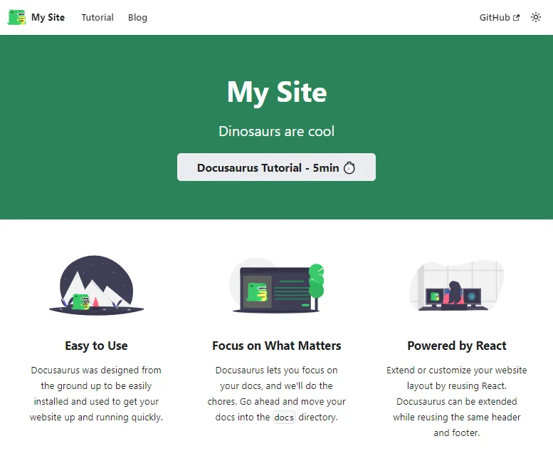
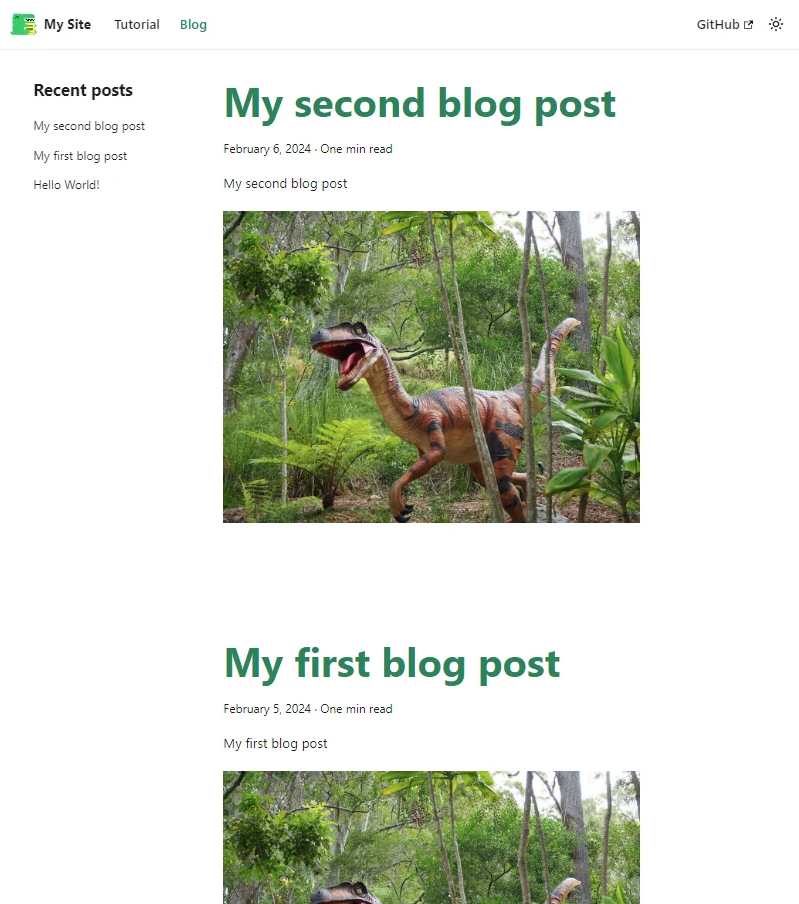
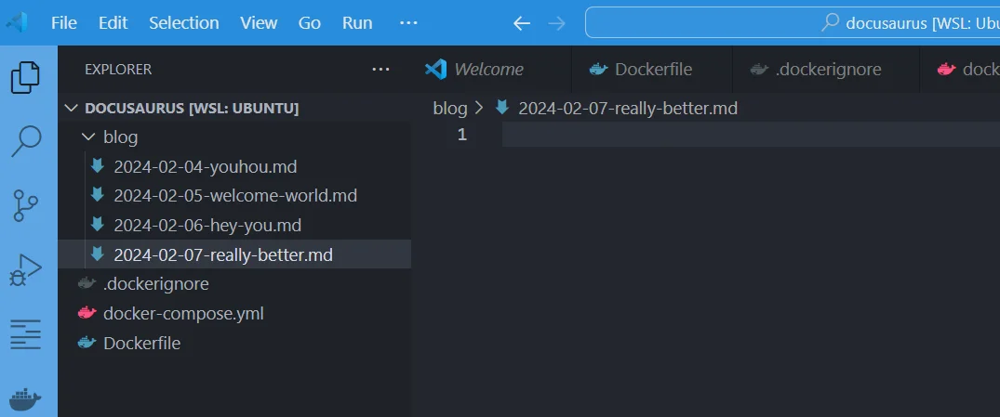
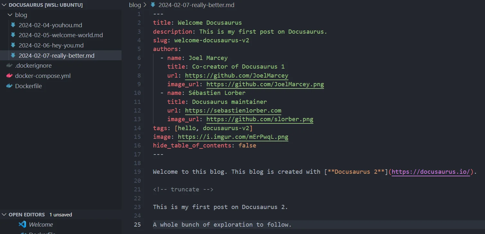
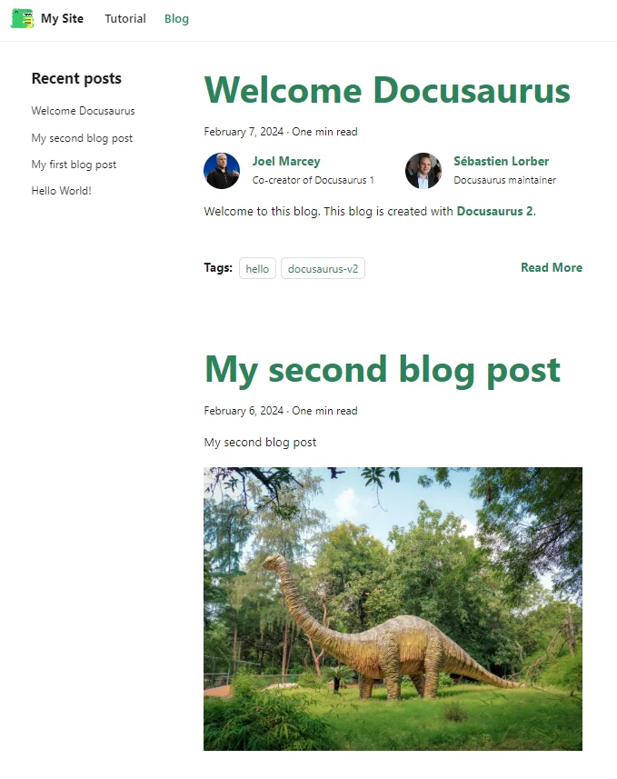

<TLDR>
This guide explains how to run Docusaurus using Docker to avoid local Node.js dependencies. You'll learn to create a custom Dockerfile, set up a `compose.yaml` for development with hot-reloading, and manage your blog content within a containerized environment.
</TLDR>

As you know, this blog is powered by [Docusaurus](https://docusaurus.io/).

I'm writing blog posts in Markdown files (one post = one `.md` file) and Docusaurus will convert them into HTML pages.

In this first article, we're going to learn how to install Docusaurus... ouch, sorry, not install Docusaurus as we're going to use Docker to simplify our lives.

<!-- truncate -->

## Create your own Docusaurus image

Create a temporary directory by running `mkdir /tmp/docusaurus && cd $_`.

This done, start your preferred editor and open the folder. On my side, I'm using Visual Studio Code so I'll just run `code .` in my Linux console.

### Create a Dockerfile file

In your project directory (so `/tmp/docusaurus`), create a file called `Dockerfile` with this content:

<Snippet filename="/tmp/docusaurus/Dockerfile" source="./files/Dockerfile" />

#### Dockerfile - explanations line by line

- Line 1: we'll use Node.js v22 LTS in its alpine version,
- Line 2: the `RUN npx create-docusaurus@latest /app classic && chown -R node:node /app` command will install the latest version of Docusaurus (in the `/app` folder) and make sure the folder is owned by our `node` user,
- Line 3: from now, we'll do everything using the `node` user,
- Line 4: `/app` will be the default working directory in the image,
- Line 5: the `cd /app && yarn install` command will jump in the folder and will install node dependencies,
- Line 6: `COPY . .` will copy everything from your project's directory (on your host) into the Docker image (in folder `/app` since that one is the default working directory) and
- Line 7: the command `CMD ["yarn", "start", "--host", "0.0.0.0"]` will run `yarn start --host 0.0.0.0` which is the instruction to run Docusaurus, make the *transparent* conversion from Markdown pages to HTML and will render the website on the default port (which is port `3000`).

### Create a .dockerignore file

We've seen here above the `COPY . .` command which instructs to copy everything from our project's directory from our local computer to the Docker image but, in fact, no, we don't need to copy everything.

In the Docker image, we don't need to have such folders like `build` or `node_modules` neither files like `.gitignore` or some others. We don't need them because they will be created in Docker (`node_modules` is created using the `yarn install` command so no need to lose time to copy that folder).

But, also, we don't need to copy folders like `blog`, `pages`, `static`, ... since these folders have to stay on our computer and just *synchronized* with the running Docker container (so no need to put them in the image at this stage).

So, please create a `.dockerignore` file with this content:

<Snippet filename=".dockerignore" source="./files/.dockerignore" />

### Create a compose.yaml file

The third file to create is `compose.yaml` with this content:

<Snippet filename="compose.yaml" source="./files/compose.yaml" />

As you can see, we need to have a folder called `blog` on our machine and we'll synchronize that folder inside the Docker container. Our `blog` folder will be *mounted* in folder `/app/blog` in the container (if the concept of volumes is new to you, read <Link to="/blog/docker-volume">Share data between your running Docker container and your computer</Link>).

### Create simple blog items

Just to have a bit of content, let's create a few articles automatically.

Please run the following commands to create three Markdown files (our posts) in the `blog` folder:

<Terminal typewriter source="./files/terminal-1.txt" />

So if you take the time to look at what we've now in our `/tmp/docusaurus` folder, here is the list of files / folders:

```tree expanded=true showJSX=false debug=false title="/tmp/docusaurus"
.
├── .dockerignore
├── Dockerfile
├── blog
│   ├── 2024-02-04-welcome-world.md
│   ├── 2024-02-05-my-first-post.md
│   └── 2024-02-06-my-second-post.md
└── compose.yaml

```

<AlertBox variant="info" title="`tree` is not part of core Linux installation">
Just in case you're interested by the `tree` utility and don't have yet, simply run `sudo apt-get update && sudo apt-get install tree` to install it. This step is optional.

</AlertBox>

### Run Docusaurus

At this stage of the tutorial, you've all required files and a few blog posts so, let's start everything:

<Terminal typewriter>
$ docker compose up --detach --build
</Terminal>

After a few minutes (only the first time), your Docusaurus Docker image will be created and a container will be started.

Your blog is now accessible on your computer here: `http://localhost:3000`.

<AlertBox variant="info" title="Which port number to use?">
The port number is the one you've mentioned in the `compose.yaml` file in line `3000:3000`.

If you wish another port like `3002` f.i., just edit the yaml file and replace `3000:3000` with `3002:3000` and rerun the `docker compose up --detach` command.

</AlertBox>

<BrowserWindow url="http://localhost:3000">
  
</BrowserWindow>

And if we click on the `Blog` menu, we can see our posts:

<BrowserWindow url="http://localhost:3000/blog">
  
</BrowserWindow>

<AlertBox variant="info" title="Chronology of blog posts">
As you can see, the default ordering follows chronological order: the last blog item we've created (`2024-02-06-my-second-post.md`) is the first one in the list.

</AlertBox>

For this tutorial, images come from `unsplash.com` but with a theme: dinosaurs. *If you refresh the page, you'll get new images.*

### Improved look & feel

We'll create a file on our computer, in our `blog` folder. I'm using VS Code so I jump into my editor, go to the `blog` folder and create a new file, let's say: `2024-02-07-really-better.md`



For ease of use, go to this tutorial: [https://docusaurus.io/docs/blog#adding-posts](https://docusaurus.io/docs/blog#adding-posts).

Copy/paste the `2019-09-05-hello-docusaurus.md` example to your `2024-02-07-really-better.md` file.

<BrowserWindow url="http://localhost:3000/blog/2019-09-05-hello-docusaurus.md">
  
</BrowserWindow>

Just go back to your browser and refresh the page (press <kbd>F5</kbd>). Your new post is there!

<BrowserWindow url="http://localhost:3000/blog/2024-02-07-really-better.md">
  
</BrowserWindow>

## Stop and restart

Since the `blog` folder is stored on your computer, we can stop the blog and start it again without losing anything.

To illustrate this, we can run `docker compose stop && docker compose rm --force` to stop and kill the container. Then run `docker compose up --detach --build` to rebuild it. By surfing back to `http://localhost:3000`, as you'll see, you've still your blog with your latest changes. Nothing was lost.

## What's next?

The setup above is a *development* one: your content stays on your host and is mounted in the container. Two follow-up articles go further:

- <Link to="/blog/docusaurus-docker-own-blog">Running your own blog with Docusaurus and Docker</Link> — turning this playground into your real blog and
- <Link to="/blog/docker-docusaurus-prod">Encapsulate an entire Docusaurus site in a Docker image</Link> — building a self-contained image ready to be deployed.
