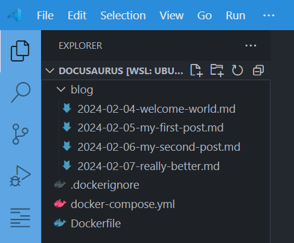
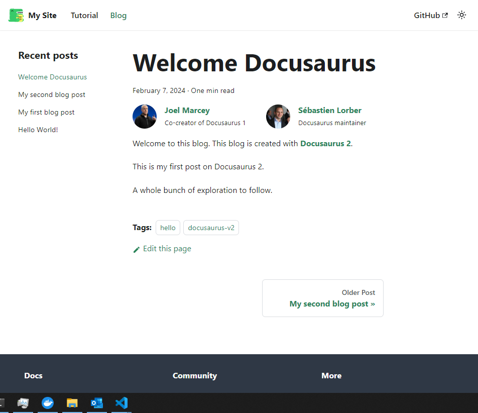
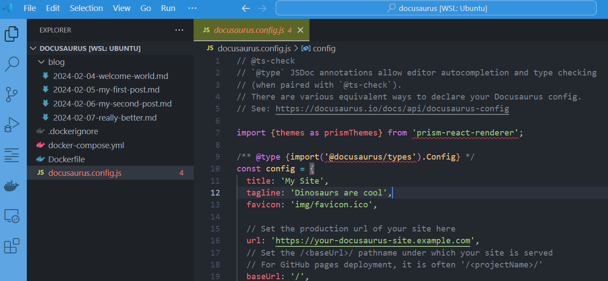
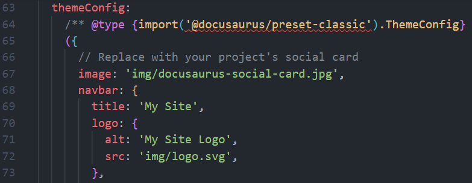
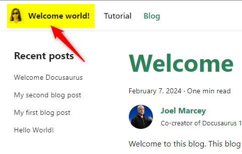
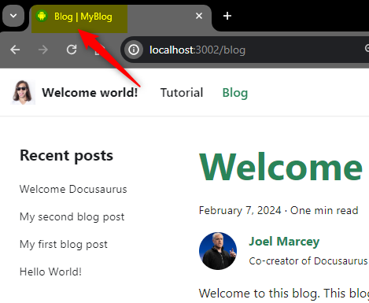

:::caution This is the second part of the [Running Docusaurus with Docker](/blog/docusaurus-docker/)
This article continues where [Running Docusaurus with Docker](/blog/docusaurus-docker/) left off. Make sure to read it first and to create required files first.
:::

So you've created your own blog using Docker and Docusaurus. By following steps explained in the [Running Docusaurus with Docker](/blog/docusaurus-docker/) article, now, you've a blog with the list of articles stored on your machine; in a `blog` folder.

Let's go further.

<!-- truncate -->

In the previous article, we've created a folder on your disk; we'll reuse it.

Please run `cd /tmp/docusaurus` to jump in it, then open the folder using your editor (I'll run `code .` on my side).

In Visual Studio Code, you should see this (if not, read and run commands from the first article):



And by running `docker compose up --detach --build` to start the blog, you'll get this screen:



## Customize the name, title, icons and URL of your site

Right now, we can see *My Site* in the top left of the screen.

There is a very important file in Docusaurus, i.e. `docusaurus.config.js` ([https://docusaurus.io/docs/api/docusaurus-config](https://docusaurus.io/docs/api/docusaurus-config)).

We need to adjust the file to meet our wishes.

:::caution We need the file on our computer
Ok, now, a very important concept: we need to keep a copy of everything we've to update on our computer.

To copy a file from our container on our disk, the command to use is `docker compose cp <service-name>:/file/path/within/container /host/path/to/copy/file/to`
:::

So, to copy the `docusaurus.config.js` file on your disk, you've to run `docker compose cp blog:/app/docusaurus.config.js /tmp/docusaurus/docusaurus.config.js` (replace `/tmp/docusaurus` with the folder name where you've created your blog, on your hard disk).

Once the copy has been done, you can retrieve the file in your editor:



And the second thing we need to do to allow us to update the file and reflect changes in our Docker container is to mount the file.

Please edit your `docker-compose.yml` file and add the line below highlighted:

```yaml
name: my_docusaurus_blog

services:
  blog:
    build: .
    ports:
      - 3000:3000
    user: 1000:1000
    volumes:
      - ./blog:/app/blog
      //highlight-next-line
      - ./docusaurus.config.js:/app/docusaurus.config.js
```

We're almost done, we need to recreate our container so we'll run `docker compose up --detach` again.

By refreshing the web page, we'll not see any change but ... please update the `docusaurus.config.js` file now.

So, open `docusaurus.config.js` and search for `themeConfig` then, there, for the `navbar` node.

You'll find something like this:



Change the tex to what you wish, f.i.

```js
navbar: {
  title: 'Welcome world!',
  logo: {
    alt: 'It\'s a photo of me ... or not',
    src: 'https://i.pravatar.cc/300',
  },
}
```

Just save and refresh your browser and you'll get:



:::tip You've learned a very important concept!
When you wish to be able to update a file present in a container; you need to get the file on your disk (1) and, then, synchronize the file between your computer and the container (2).

For the first thing, the command to use is `docker compose cp` followed by the name of the container (just look at your `docker-compose.yml` file, it's the name of the service) then you need to say where the file is stored in the container and where to copy it on your disk. That's why we've used `docker compose cp blog:/app/docusaurus.config.js docusaurus.config.js` to do this.

The second thing is to allow changes done in that copied file to be reflected between your host and the container and this is why we've updated the list of `volumes` in the `docker-compose.yml` file. So, now, changes done on your disk or done by the container will be synchronized both sides.
:::

Next step, still in file `docusaurus.config.js`, look for the `title`, `favicon` and `url`, then initialize them to your own values; f.i.

```javascript
const config = {
  title: 'MyBlog',
  favicon: 'https://www.iconarchive.com/download/i75799/martz90/circle/android.ico',
  url: 'https://yoursite.com',

  // ...
};
```



:::tip Just refresh
You don't need to restart the `docker up` command this time, just press <kbd>F5</kbd> to see your changes directly in your browser.
:::

:::important Read the official documentation
You can do a lot more when updating the `docusaurus.config.js` file; please refer to the official documentation [https://docusaurus.io/docs/api/docusaurus-config](https://docusaurus.io/docs/api/docusaurus-config).
:::

## The src/pages folder

The `src/pages` folder contain files like `index.md` that will be translated to `index.html` (your homepage thus). You can also create a file called `tutorial.md` (which will be `tutorial.html`) and create a menu entry in your navigation bar with `/tutorial.html` for the target.

You have to copy the folder from the container to your host and, as you've already seen it. Please run the command below to copy the folder on your host:

```bash
docker compose cp blog:/app/src src
```

You need to update your `docker-compose.yml` file and add the line below highlighted:

```yaml
name: my_docusaurus_blog

services:
  blog:
    build: .
    ports:
      - 3000:3000
    user: 1000:1000
    volumes:
      - ./blog:/docusaurus/blog
      - ./docusaurus.config.js:/docusaurus/docusaurus.config.js
      //highlight-next-line
      - ./src:/docusaurus/src
```

## The static folder

That folder contains files to will be copied to your root directory when you deploy your blog. So this is the perfect place to put, f.i. a `.htaccess` or a `robots.txt` file.

:::tip Real use case
On my side, I use that the static folder to store my common images (the ones I use multiple times). So I've created a folder `static/img` on my own blog. That folder will thus be copied to the `/img` (directly under the root) on my server. Accessing images in my articles will then be easy, the source will be something like `/img/image_name.ext`.
:::

Please run the command below to copy the folder on your host:

```bash
docker compose cp blog:/app/static static
```

And update your `docker-compose.yml` file like this:

```yaml
name: my_docusaurus_blog

services:
  blog:
    build: .
    ports:
      - 3000:3000
    user: 1000:1000
    volumes:
      - ./blog:/docusaurus/blog
      - ./docusaurus.config.js:/docusaurus/docusaurus.config.js
      - ./src:/docusaurus/src
      //highlight-next-line
      - ./static:/docusaurus/static
```

## You now have the basics

Just continue your journey, surf to [https://docusaurus.io/docs](https://docusaurus.io/docs) and read the documentation.

Also find inspiration in the *Docusaurus Site Showcase*: [https://docusaurus.io/showcase](https://docusaurus.io/showcase).

The keyboard is yours! Don't delay, start writing your blog now!
