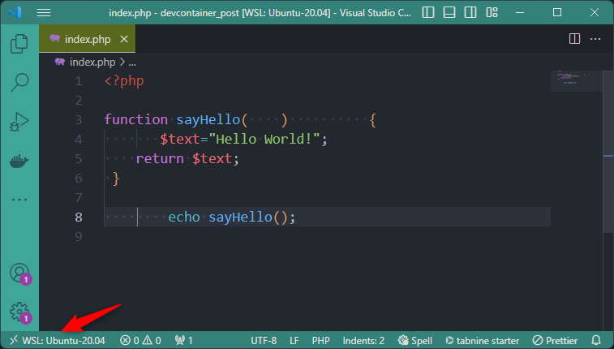

* *Updated 2024-02-23, install Rector automatically*
* *Updated 2024-02-29, install [Error Lens](https://marketplace.visualstudio.com/items?itemName=usernamehw.errorlens) and [Code Spell Checker](https://marketplace.visualstudio.com/items?itemName=streetsidesoftware.code-spell-checker)*

:::info Don't want to read this long article
So jump to [Install a PHP Docker environment in a matter of seconds](/blog/php-devcontainer)
:::

Let's imagine one of the following situations:

1. You are working with several people on the same PHP project and you notice that one or other person does not comply with your quality criteria when it comes to the layout of the code. You like to use four spaces for indentation, you want the brace that marks the start of a function to be on the line, you don't want to see any more useless spaces at the end of the line, ... and damned! you notice that some people don't care about this.

2. You are working alone on a project and don't want to lose time to configure your VSCode experience. You wish to start very quickly with a lot of tools already installed in VSCode so you can put your focus to the code, not the editor.

The ultimate solution: using a `devcontainer` in VSCode.

By using a **devcontainer**, you (and your team colleague) will use a preinstalled environment and everyone will have exactly the same. You'll save yourself a lot of time by not having to configure your system, and you'll be able to start coding straight away, supported by a range of quality analysis tools.

<!-- truncate -->

:::tip Download the project
This article is written in the form of a step-by-step tutorial. If you don't want to take the time to create the configuration files yourself and download them directly, please run the commands below in a Linux console. You'll then get all the files and every time the tutorial below tells you to create a file, you'll already have it.

```bash
mkdir /tmp/devcontainer_php && cd $_
curl -LOJ --silent https://github.com/cavo789/php_devcontainer/archive/refs/tags/1.0.0.tar.gz
tar -xzvf php_devcontainer-1.0.0.tar.gz --strip-components 1 && rm -f php_devcontainer-1.0.0.tar.gz
```

:::note Download the very latest version
The php_devcontainer repository will evolve over time. If you wish to download the latest version and not the use frozen for this article, please use the following commands and not the ones of here above:

```bash
mkdir /tmp/devcontainer_php && cd $_
curl -LOJ --silent https://github.com/cavo789/php_devcontainer/archive/refs/heads/main.tar.gz
tar -xzvf php_devcontainer-main.tar.gz --strip-components 1 && rm -f php_devcontainer-main.tar.gz
```

:::

:::

## 1. Create the project

Let's start immediately a new project by creating a temporary directory by running `mkdir /tmp/devcontainer_php && cd $_`.

Since we'll create a few files, please run `code .` to start Visual Studio Code (aka *VSCode*).

Create a new file called `index.php` with the PHP code below:

```php
<?php

function sayHello(    )          {
       $text="Hello World!";
    return $text;
 }

        echo sayHello();
```


:::note Pay attention to extra whitespace
On the screen capture here above, you can see *dots* to illustrate spaces and you can see there are a lot of spaces here and there and there are just unneeded.
:::

As you have noticed, VSCode saved our file as it was: **with a layout that was just disgusting**. Remember that, and we'll see that VSCode can do much better than that.

We can run that script in a browser by running `docker run -d -p 80:80 -u $(id -u):$(id -g) -v .:/var/www/html php:8.2-apache` (read [The easiest way to run a PHP script / website](/blog/docker-php-run-script-or-website) post if a refresh is needed).

As you can expect, the script is running fine:


:::danger Stop reading here if ...
... you're one of those people who thinks *The script works, doesn't it? So why all the noise?*, **please turn off your computer and promise never to touch a single line of code again**. Even if the code *work* ... it stinks.
:::

In this article we'll learn how to configure Visual Studio Code to comes with preinstalled extensions and configured for your targeting version of PHP (would be 8.2 but you can change this very easily).

:::important The technique we'll use is called devcontainer.
**A devcontainer is a pre-configured, isolated development environment running in a Docker container, offering consistent tools and settings across different machines.**
:::

## 2. Install first the ms-azuretools.vscode-docker VSCode extension

In VSCode, please press <kbd>CTRL</kbd>+<kbd>SHIFT</kbd>+<kbd>X</kbd> to open the `Extensions` pane and search for the Microsoft Docker extension called `ms-azuretools.vscode-docker` and if you don't have it yet, please install and enable it.

## 3. Create the devcontainer.json file

The next step is to create a folder called `.devcontainer` and, there, a file called `devcontainer.json` with the content below.

In the rest of this article, we'll come back to this file.

```json
{
    "name": "php_devcontainer",
    "build": {
        "dockerfile": "Dockerfile",
        "args": {
            "PHP_VERSION": "8.2",
            "COMPOSER_VERSION": "2.5.5",
            "PHPCSFIXER_INSTALL": "true",
            "PHPCSFIXER_VERSION": "3.46.0",
            "PHPCBF_INSTALL": "true",
            "PHPCBF_VERSION": "3.7.2"
        }
    },
    "workspaceMount": "source=${localWorkspaceFolder},target=/var/www/html,type=bind",
    "workspaceFolder": "/var/www/html",
    "remoteUser": "docker",
    "customizations": {
        "vscode": {
            "settings": {
                "[php]": {
                    "editor.formatOnSave": true,
                    "editor.defaultFormatter": "junstyle.php-cs-fixer"
                },
                "editor.codeActionsOnSave": {
                    "source.fixAll": true
                },
                "editor.formatOnSave": true,
                "editor.renderWhitespace": "all",
                "files.autoSave": "onFocusChange",
                "files.eol": "\n",
                "files.insertFinalNewline": true,
                "files.trimTrailingWhitespace": true,
                "intelephense.environment.phpVersion": "8.2",
                "intelephense.telemetry.enabled": false,
                "php-cs-fixer.config": "/var/www/html/.config/.php-cs-fixer.php",
                "php-cs-fixer.executablePath": "/usr/local/bin/php-cs-fixer.phar",
                "php-cs-fixer.onsave": true,
                "php-cs-fixer.rules": "@PSR12",
                "php.validate.executablePath": "/usr/local/bin/php",
                "phpsab.executablePathCBF": "/usr/local/bin/phpcbf.phar",
                "phpsab.executablePathCS": "/usr/local/bin/phpcs.phar",
                "phpsab.fixerEnable": true,
                "phpsab.snifferShowSources": true,
                "phpsab.standard": "/var/www/html/.config/phpcs.xml",
                "telemetry.telemetryLevel": "off",
                "terminal.integrated.profiles.linux": {
                    "bash": {
                        "path": "/bin/bash",
                        "icon": "terminal-bash"
                    }
                },
                "terminal.integrated.defaultProfile.linux": "bash"
            },
            "extensions": [
                "bmewburn.vscode-intelephense-client",
                "junstyle.php-cs-fixer",
                "ms-azuretools.vscode-docker",
                "ValeryanM.vscode-phpsab",
                "zobo.php-intellisense"
            ]
        }
    },
    "postCreateCommand": "composer require rector/rector --dev"
}
```

## 4. Create the Dockerfile file

Please continue and create a second file called `Dockerfile` with this content:

```dockerfile
ARG PHP_VERSION=8.2

ARG COMPOSER_HOME="/var/cache/composer"
ARG COMPOSER_VERSION=2.5.5

ARG PHPCSFIXER_INSTALL=true
ARG PHPCSFIXER_VERSION=3.46.0

ARG PHPCBF_INSTALL=true
ARG PHPCBF_VERSION=3.7.2

ARG TIMEZONE="Europe/Brussels"

ARG OS_USERID=1000
ARG OS_USERNAME="docker"

FROM composer:${COMPOSER_VERSION} as composer_base

FROM php:${PHP_VERSION}-fpm

ARG TIMEZONE
ENV TZ=${TIMEZONE}

ARG PHPCSFIXER_INSTALL
ARG PHPCSFIXER_VERSION

RUN set -e -x \
    && if [ "$PHPCSFIXER_INSTALL" = "true" ] ; then \
    printf "\e[0;105m%s\e[0;0m\n" "Install php-cs-fixer.phar ${PHPCSFIXER_VERSION}" \
    && curl -L https://github.com/PHP-CS-Fixer/PHP-CS-Fixer/releases/download/v${PHPCSFIXER_VERSION}/php-cs-fixer.phar -o /usr/local/bin/php-cs-fixer.phar \
    && chmod +x /usr/local/bin/php-cs-fixer.phar ; \
    fi

ARG PHPCBF_INSTALL
ARG PHPCBF_VERSION

RUN set -e -x \
    && if [ "$PHPCBF_INSTALL" = "true" ] ; then \
    printf "\e[0;105m%s\e[0;0m\n" "Install phpcbf.phar ${PHPCBF_VERSION}" \
    && curl -L https://github.com/squizlabs/PHP_CodeSniffer/releases/download/${PHPCBF_VERSION}/phpcbf.phar -o /usr/local/bin/phpcbf.phar \
    && chmod +x /usr/local/bin/phpcbf.phar \
    && curl -L https://github.com/squizlabs/PHP_CodeSniffer/releases/download/${PHPCBF_VERSION}/phpcs.phar -o /usr/local/bin/phpcs.phar \
    && chmod +x /usr/local/bin/phpcs.phar ; \
    fi

ARG COMPOSER_HOME
ENV COMPOSER_HOME=${COMPOSER_HOME}

RUN set -e -x \
    && mkdir -p "${COMPOSER_HOME}/cache/files" \
    && mkdir -p "${COMPOSER_HOME}/cache/vcs" \
    && chmod -R 777 "${COMPOSER_HOME}"

COPY --from=composer_base /usr/bin/composer /usr/bin/composer

ARG OS_USERID
ARG OS_USERNAME

RUN set -e -x \
    && useradd --password '' -G www-data,root -u ${OS_USERID} -l -d "/home/${OS_USERNAME}" "${OS_USERNAME}" \
    && mkdir -p "/home/${OS_USERNAME}" \
    && chown -R "${OS_USERNAME}":"${OS_USERNAME}" "/home/${OS_USERNAME}"

RUN set -e -x \
    && printf "\e[0;105m%s\e[0;0m\n" "Install Linux binaries" \
    && apt-get update -yqq \
    && apt-get install -y --no-install-recommends curl libzip-dev zip unzip \
    && docker-php-ext-install zip \
    && docker-php-source delete \
    && apt-get clean \
    && rm -rf /tmp/* /var/list/apt/*

WORKDIR /var/www/html
```

## 5. Reopen in the container

So, we've now three files: a disgusting `index.php`, `.devcontainer/devcontainer.json` and `.devcontainer/Dockerfile`.

What we will do now is to *jump* in a Docker container. Take a look at the bottom left of your screen:



You'll see something like, in my case, `WSL: Ubuntu-20.04`. *It can be different on your computer depending on your operating system.* What VSCode says here is *I'm coding on my machine*.

Click on that status or, as an alternative way, press <kbd>CTRL</kbd>+<kbd>SHIFT</kbd>+<kbd>P</kbd> to open the *Command Palette* and then search for `Reopen in Container` and press <kbd>Enter</kbd>.


Visual Studio Code will do a lot of stuff and, the first time, it can take a few minutes.


## 6. Working in the container

Now the magic happens: please reopen the so badly formatted `index.php` file and save the file **without any changes**. Just press <kbd>CTRL</kbd>+<kbd>S</kbd> and tadaaa 🎉🎉🎉


:::tip How is this possible?
This because we taught VSCode to use a specific formatter for our PHP file and we told him to format the file each time it's saved. And do you know where we did it? In our `.devcontainer/devcontainers.json` and `.devcontainer/Dockerfile` files, of course!

**This is why we're working in a Devcontainer!** We've done the configuration once and for all, so all we have to do is reuse it, whatever the PHP project.
:::

### The first tool we've used here is PHP-CS-Fixer

When we save a file in VSCode, we have configured a *formatter* which will adapt the layout of the file according to the rules we have determined. For example, the number of spaces for indentation or the fact that braces must be aligned (and many other things). That tool is [PHP-CS-Fixer](https://github.com/PHP-CS-Fixer/PHP-CS-Fixer).

But let's understand when `PHP-CS-Fixer` was installed...

Please reopen your `.devcontainer/devcontainer.json` file and look at the highlighted lines below:

```json
{
    // ...
    "build": {
        "dockerfile": "Dockerfile"
    },
    // ...
    "customizations": {
        "vscode": {
            "settings": {
                //highlight-next-line
                "[php]": {
                    //highlight-next-line
                    "editor.formatOnSave": true,
                    //highlight-next-line
                    "editor.defaultFormatter": "junstyle.php-cs-fixer"
                },
                // ...
                //highlight-next-line
                "files.autoSave": "onFocusChange",
                // ...
                //highlight-next-line
                "php-cs-fixer.config": "/var/www/html/.config/.php-cs-fixer.php",
                //highlight-next-line
                "php-cs-fixer.executablePath": "/usr/local/bin/php-cs-fixer.phar",
                //highlight-next-line
                "php-cs-fixer.onsave": true,
                //highlight-next-line
                "php-cs-fixer.rules": "@PSR12",
                //...
            },
            "extensions": [
                // ...
                //highlight-next-line
                "junstyle.php-cs-fixer",
            ]
        }
    }
}
```

So, we're asking VSCode to, for PHP files, run a `formatter` when the file is saved and the tool to use for the formatting is `junstyle.php-cs-fixer`. Look directly at the end, in the `extensions` section, we instruct VSCode to install that extension.

We also instruct VSCode to automatically saved the file as soon as the focus changes i.e. for instance, if we select another file, if we click elsewhere (no more in the editor), ...

Finally, `junstyle.php-cs-fixer` requires some settings that we need to initialize like f.i. `php-cs-fixer.executablePath`.

Right now, you can think: *Wait a minute, I don't have the `/usr/local/bin/php-cs-fixer.phar` file on my computer.* And you are probably right but think again: are you coding *on your computer* or are you *inside a Docker container*?

By running VSCode in a container, you're *no more* on your machine.

And now, you need to take a look on the third file we've created: `Dockerfile`.

Please reopen the `.devcontainer/Dockerfile` file and look at the highlighted lines below:

```dockerfile
// highlight-next-line
ARG PHP_VERSION=8.2

// ...

// highlight-next-line
ARG PHPCSFIXER_INSTALL=true
// highlight-next-line
ARG PHPCSFIXER_VERSION=3.46.0

// ...

// highlight-next-line
FROM php:${PHP_VERSION}-fpm

// ...

// highlight-next-line
ARG PHPCSFIXER_INSTALL
// highlight-next-line
ARG PHPCSFIXER_VERSION

// highlight-next-line
RUN set -e -x \
    // highlight-next-line
    && if [ "$PHPCSFIXER_INSTALL" = "true" ] ; then \
    // highlight-next-line
    printf "\e[0;105m%s\e[0;0m\n" "Install php-cs-fixer.phar ${PHPCSFIXER_VERSION}" \
    // highlight-next-line
    && curl -L https://github.com/PHP-CS-Fixer/PHP-CS-Fixer/releases/download/v${PHPCSFIXER_VERSION}/php-cs-fixer.phar -o /usr/local/bin/php-cs-fixer.phar \
    // highlight-next-line
    && chmod +x /usr/local/bin/php-cs-fixer.phar ; \
    // highlight-next-line
    fi

// ...
```

That file will instruct VSCode to download a `php:8.2-fpm` Docker image and to install `PHP-CS-Fixer` (since `PHPCSFIXER_INSTALL` has been set to `true`).

The version `3.46.0` of the `PHP-CS-Fixer` executable will be downloaded and stored, in the Docker image, as `usr/local/bin/php-cs-fixer.phar`. This is why, in our `devcontainer.json` we can write `"php-cs-fixer.executablePath": "/usr/local/bin/php-cs-fixer.phar",`, because we've already downloaded and installed the executable.

:::tip Need to check?
Still in VSCode, open a terminal by pressing <kbd>CTRL</kbd>+<kbd>´</kbd> and, in the prompt, type `ls -l /usr/local/bin`. As you can see, `php-cs-fixer.phar` is well there. *It was installed downloaded and installed by VSCode when you've jump in the container.*


:::

#### PHP-CS-FIXER - Configuration file

The `.devcontainer/devcontainer.json` file also contains this line: `"php-cs-fixer.config": "/var/www/html/.config/.php-cs-fixer.php"`.

So, we can have our own configuration file for `PHP-CS-Fixer` (with our own rules) and that file has to be created in a folder called `.config` and should be named `.php-cs-fixer.php`.

Let's try and this time we'll make sure all our PHP files will have a header block with our copyright or license information or anything else.

In VSCode, please create the `.config` folder and there the `.php-cs-fixer.php` file with this content:

```php
<?php

$finder = PhpCsFixer\Finder::create()
    ->in('.')
    ->exclude([
        '.config', '.devcontainer', '.git', 'node_modules','vendor'
    ]);

$header = file_get_contents(__DIR__ . '/licenseHeader.txt');

$config = new PhpCsFixer\Config();

return $config->setRules(
    [
        '@PSR12' => true,
        'header_comment' => [
            'header'       => rtrim($header, "\r\n"),
            'location'     => 'after_declare_strict',
            'comment_type' => 'PHPDoc',
        ],
    ]
)
    ->setCacheFile('/tmp/.php-cs-fixer.cache')
    ->setIndent('    ')
    ->setLineEnding("\n")
    ->setFinder($finder);

```

Please also create a second file called `licenseHeader.txt` file with the content you wish, f.i.:

```text
This program is free software: you can redistribute it and/or modify
it under the terms of the GNU General Public License as published by
the Free Software Foundation, either version 3 of the License, or
(at your option) any later version.

This program is distributed in the hope that it will be useful, but
WITHOUT ANY WARRANTY; without even the implied warranty of MERCHANTABILITY
or FITNESS FOR A PARTICULAR PURPOSE. See the GNU General Public License
for more details.

You should have received a copy of the GNU General Public License along
with this program. If not, see <https://www.gnu.org/licenses/>.
```

Now, please reopen your `index.php` file and just press <kbd>CTRL</kbd>+<kbd>S</kbd> to save the file again and tadaaa...


As you can see, when formatting the file, `PHP-CS-Fixer` will also, now, injects our header.

:::tip Lots of options are explained here
Please go to [https://mlocati.github.io/php-cs-fixer-configurator](https://mlocati.github.io/php-cs-fixer-configurator) or [https://github.com/FriendsOfPHP/PHP-CS-Fixer](https://github.com/FriendsOfPHP/PHP-CS-Fixer) to learn more about the php-cs-fixer configuration file options.
:::

#### PHP-CS-FIXER - Fix all files at once

One step further: is it possible to run `PHP-CS-Fixer` not just on the file being edited in VSCode but on all files in your repository. **Yes, of course.**

In VSCode, please press <kbd>CTRL</kbd>+<kbd>´</kbd> (or click on the `View` menu then `Terminal`) to open a terminal. Make sure you're in the `/var/www/html` folder (run `cd /var/www/html` if needed) and run the following command:

```bash
/usr/local/bin/php-cs-fixer.phar fix --config /var/www/html/.config/.php-cs-fixer.php .
```

This will run `PHP-CS-Fixer` on all your codebase (`.`). If you want to exclude some folders, open the `.config/.php-cs-fixer.php` file and update the `exclude` array.

### The second set of tools is PHPCBF and PHPCS

Our `Dockerfile` container was configured to download and install [PHP_CodeSniffer](https://github.com/squizlabs/PHP_CodeSniffer) tools called `phpcbf` and `phpcs`.

`phpcbf` is a `Code beautifier` tool: just like `PHP-CS-Fixer`, `phpcbf` will make some minor changes to your files accordingly to enabled rules.

For instance, please update your `index.php` script with this content:

```php
<?php

function sayHello($firstname)
{
    if($firstname == "") {
        $text = "Hello World!";
    }else{
        $text = "Hello " . $firstname;
    }

    return $text;
}

echo sayHello();
```

What's wrong with this syntax? Almost nothing but ... the standard (`PSR12`) ask to put one space after the `if` keyword and one space before and after `else`.

:::note PHP-CS-Fixer will be called when you save the file
Did you've noticed? You have copied/pasted the script below where there were no spaces before and after the `else` keyword. But as soon as you save the file, boum, the file is refactored by `PHP-CS-Fixer` and, among other things, spaces have been added before and after `else` but not for `if`. This is because, actually, there is not ONE MAGIC TOOL for everything. Sometimes `PHP-CS-Fixer` can't make some changes but `PHPCBF` well or the opposite.
:::

Like for `PHP-CS-Fixer`, we already have installed `PHPCBF` and `PHPCS` in our container. See your `.devcontainer/devcontainer.json` file:

```json
{
    // ..
    "customizations": {
        "vscode": {
            "settings": {
                // ...
                // highlight-next-line
                "phpsab.executablePathCBF": "/usr/local/bin/phpcbf.phar",
                // highlight-next-line
                "phpsab.executablePathCS": "/usr/local/bin/phpcs.phar",
                // highlight-next-line
                "phpsab.fixerEnable": true,
                // highlight-next-line
                "phpsab.snifferShowSources": true,
                // highlight-next-line
                "phpsab.standard": "/var/www/html/.config/phpcs.xml",
                // ...
            },
            "extensions": [
                // ...
                // highlight-next-line
                "ValeryanM.vscode-phpsab",
                // ...
            ]
        }
    }
}
```

And the two executables `/usr/local/bin/phpcbf.phar` and `/usr/local/bin/phpcs.phar` have been downloaded thanks to your `Dockerfile`. Just take a look if needed.

#### PHPCS and PHPCBF - Configuration file

In VSCode, please create in the `.config` folder a file called `phpcs.xml` file with this content:

```xml
<?xml version="1.0"?>
<ruleset name="MyRules">
    <arg name="colors" />
    <arg name="extensions" value="php" />
    <arg value="s" />
    <arg value="p" />
    <rule ref="PSR12" />
</ruleset>
```

Now, since we have defined our coding standard (`PSR12` here), just display the `index.php` script again:


Open a terminal by pressing <kbd>CTRL</kbd>+<kbd>´</kbd> (or by clicking on the `View` menu then `Terminal`) and run this command:

```bash
/usr/local/bin/phpcs.phar --standard=/var/www/html/.config/phpcs.xml /var/www/html/index.php
```

And you'll get this output:

```text
FILE: /var/www/html/index.php
------------------------------------------------------------------------------------------------------------------------------------------------------------------------------------------------
FOUND 1 ERROR AND 1 WARNING AFFECTING 2 LINES
------------------------------------------------------------------------------------------------------------------------------------------------------------------------------------------------
  1 | WARNING | [ ] A file should declare new symbols (classes, functions, constants, etc.) and cause no other side effects, or it should execute logic with side effects, but should not do
    |         |     both. The first symbol is defined on line 18 and the first side effect is on line 29. (PSR1.Files.SideEffects.FoundWithSymbols)
 20 | ERROR   | [x] Expected 1 space(s) after IF keyword; 0 found (Squiz.ControlStructures.ControlSignature.SpaceAfterKeyword)
------------------------------------------------------------------------------------------------------------------------------------------------------------------------------------------------
PHPCBF CAN FIX THE 1 MARKED SNIFF VIOLATIONS AUTOMATICALLY
------------------------------------------------------------------------------------------------------------------------------------------------------------------------------------------------

```

There is one warning and one error concerning *coding convention violation* and the nice thing is **phpcbf can fix some.**.

Now, run almost the same command but no more `phpcs` (to detect violations) but `phpcbf` (to fix them -the ones that can be fixed automatically-).

```bash
/usr/local/bin/phpcbf.phar --standard=/var/www/html/.config/phpcs.xml /var/www/html/index.php
```

You'll get this:

```text
PHPCBF RESULT SUMMARY
----------------------------------------------------------------------
FILE                                                  FIXED  REMAINING
----------------------------------------------------------------------
/var/www/html/index.php                               1      1
----------------------------------------------------------------------
A TOTAL OF 1 ERROR WERE FIXED IN 1 FILE
----------------------------------------------------------------------
```

And, indeed, if you look at your PHP script, now, there is a space after the `if` keyword.

#### PHPCS and PHPCBF - All files at once

You've probably already understood the syntax. Just use the `.` to scan the entire codebase:

1. To fix violations, run `/usr/local/bin/phpcbf.phar  --standard=/var/www/html/.config/phpcs.xml .`
2. To scan remaining violations, run `/usr/local/bin/phpcs.phar  --standard=/var/www/html/.config/phpcs.xml .`.

### The third tool is SonarLint

Here too, SonarLint was already installed in our Docker container thanks our `.devcontainer/devcontainer.json` file:

```json
{
    // ...
    "customizations": {
        "vscode": {
            "extensions": [
                // ...
                // highlight-next-line
                "sonarsource.sonarlint-vscode",
                // ...
            ]
        }
    }
}
```

:::note It's only a VSCode extension
SonarLint don't need external tool; it's a stand-alone VSCode extension so no need to foresee something in our `Dockerfile`.
:::

So, please reopen the `index.php` file you've and now pay attention to the `echo sayHello()` line:

```php
<?php

function sayHello($firstname)
{
    if ($firstname == "") {
        $text = "Hello World!";
    } else {
        $text = "Hello " . $firstname;
    }

    return $text;
}

echo sayHello();
```


Move the mouse cursor on the `sayHello()` variable and get extra information from SonarLint as a popup. You can, too, press <kbd>CTRL</kbd>+<kbd>SHIFT</kbd>+<kbd>M</kbd> to show the `Problems` pane (or menu `View` then `Problems`) to get the list of every SonarLint problems encountered in the current file and, too, in any file you'll open from now.


One solution would be to update the prototype of `sayHello` like this: `function sayHello($firstname = "")`.

:::important SonarLint prevents bugs!
Unlike the tools we've seen here above, it's no longer about formatting, **but about alerting the developer to potential bugs and fatal errors as they write their code.**
:::

### The fourth tool is Intelephense

Next to `SonarLint`, there is also `Intelephense` who will also detect a certain number of potential bugs.

In the previous example; when the prototype was `function sayHello($firstname)`, `Intelephense` was also alerting the developer about the missing parameter.

```php
<?php

function sayHello($firstname)
{
    if($firstname == "") {
        $text = "Hello World!";
    } else {
        $text = "Hello " . $firstname;
    }

    return $text;
}

echo sayHello();
```


:::important We need several tools
This example illustrates this point: to date, in February 2024, we still have to juggle with several extensions and tools to achieve clean, bug-free code.
:::

### The best for last, the fifth tool is Rector

Rector is a tremendous application to scan and automatically upgrade your codebase to a given version of PHP and this means, too, to inspect how you're coding.

Perhaps you're still using a way of programming that's worthy of PHP 5.4 but unworthy of a modern developer who's up to date with the latest developments.

:::tip Rector is my private coach
I really LOVE Rector since he'll help me to learn new features of PHP. When I run it on any of my codebase, I can see where I can improve my code by refactoring some part and do better.

**I REALLY LOVE RECTOR.**
:::

This time, we'll need to install Rector for our project and for this, we'll follow the official documentation: [https://github.com/rectorphp/rector?tab=readme-ov-file#install](https://github.com/rectorphp/rector?tab=readme-ov-file#install) but ... it's already done in our `.devcontainer/devcontainer.json` file.

If you reopen it, take a look on the `postCreateCommand` node:

```json
{
    // ...
    "customizations": {
        // ...
    },
    //highlight-next-line
    "postCreateCommand": "composer require rector/rector --dev"
}
```

Rector will be added to the `composer.json` file (and the file will be created if not yet present).

:::tip `Composer` has been installed in our `Dockerfile`
If you're thinking *Yes, but I haven't installed composer...*, well, it's wrong. We installed it in our container. See again your `.devcontainer/Dockerfile` if needed.
:::

#### Rector - configuration file

:::caution Skip this chapter if you have already downloaded the configuration files
:::

The second step in the installation guide asks us to run the command below. When prompted, please answer `yes` to create your `rector.php` configuration file.

```bash
vendor/bin/rector
```

Finally, open the `rector.php` configuration file and update it like this:

```php
<?php

declare(strict_types=1);

use Rector\Config\RectorConfig;

return RectorConfig::configure()
    ->withSkip(
        [
            '.config', '.devcontainer', '.git', 'node_modules','vendor'
        ]
    )
    ->withPhpSets(php82: true)
    ->withPreparedSets(codeQuality: true, deadCode: true, typeDeclarations: true);
```

:::important Tell to Rector which PHP version you use
Rector will suggest you changes but to do this, he needs to know which version of PHP you're running. Indeed, Rector won't suggest you a PHP 8.2 syntax f.i. if you're still running on an older version (see [PHP Version Features](https://getrector.com/documentation/php-version-features)).
:::

:::tip On my side, I prefer to put all configuration files in a .config folder
You've noticed that Rector has created his configuration file in the root directory of your project. I prefer to move it to the `.config` folder.
:::

#### Run Rector

To illustrate what Rector can do, please edit the `index.php` with this content, once again:

```php
<?php

function sayHello($firstname = "")
{
    if($firstname == "") {
        $text = "Hello World!";
    } else {
        $text = "Hello " . $firstname;
    }

    return $text;
}

echo sayHello();
```

In a terminal, run `vendor/bin/rector process index.php --dry-run --config .config/rector.php` as we did before.


Take a look on the image here above. In red, your current code and, yes, we knew that, didn't we, the code quality is poor.

Indeed, one concept in clean code approach is to avoid using the `if ... else ...` conditional statement. Most probably, we don't need `else` (see [https://phpmd.org/rules/cleancode.html#elseexpression](https://phpmd.org/rules/cleancode.html#elseexpression)).

Rector suggests removing completely the `if .. else ...` expression and to use a [ternary expression](https://github.com/rectorphp/rector/blob/main/docs/rector_rules_overview.md#simplifyifelsetoternaryrector). And, also, to directly return the value instead of using a dummy `$text` variable.

And that's correct, we can write `return $firstname == "" ? "Hello World!" : "Hello " . $firstname;` to get the exact same thing.

And if you think it's over, you're wrong. Rector now look at our function parameter and understand it's a string so he'll suggest to [add a type hint](https://github.com/rectorphp/rector/blob/main/docs/rector_rules_overview.md#strictstringparamconcatrector) and, too, to [add a return type](https://github.com/rectorphp/rector/blob/main/docs/rector_rules_overview.md#returntypefromstrictscalarreturnexprrector) for the same reason.

Since we've analyzed the suggestions of Rector and we agree with, please rerun the same command but, this time, without, the `--dry-run` flag.

```bash
vendor/bin/rector process index.php --config .config/rector.php
```

Rector has updated our `index.php` file! **Now, our function is just one line and no more seven. Nice improvement!**

Our new, improved, code is now:

```php
<?php

function sayHello(string $firstname = ""): string
{
    return $firstname == "" ? "Hello World!" : "Hello " . $firstname;
}

echo sayHello();
```

Rector is **absolutely brilliantly powerful**. Learn more about it by reading carefully his documentation site: [https://getrector.com/documentation/](https://getrector.com/documentation/).

:::tip The programmer has the last word, but for how much longer?
We can do one more improvement by extracting the `Hello` prefix. Rector has not yet see this but until when?

```php
<?php

function sayHello(string $firstname = ""): string
{
    return "Hello " . ($firstname == "" ? "World!" : $firstname);
}

echo sayHello();
```

:::

#### Rector - All files at once

Back in your terminal and run the command below to scan your entire codebase.

```bash
vendor/bin/rector process . --dry-run --config .config/rector.php
```

##### Dry-run means no changes are made, just displayed

When running Rector using `vendor/bin/rector process . --dry-run --config .config/rector.php`, no files will be rewritten. Rector will only suggest changes.

If you allow Rector to make changes to your files, run `vendor/bin/rector process . --config .config/rector.php` instead but, here, you need to be sure it's OK.

:::tip Code versioning using f.i. GitHub
If you're using a code versioning system, you can push your actual codebase to Github, create a new branch like for instance `refactoring` then run Rector safely on your disk. If something should be broken, you can always retrieve your source before any changes.
:::

### And we can add more tools

There are still several code analysis tools for PHP:

* [phpstan](https://phpstan.org/),
* [psalm](https://psalm.dev/),
* [PHP Copy/Paste Detector](https://github.com/sebastianbergmann/phpcpd),
* [PHP Magic Number Detector](https://github.com/povils/phpmnd),
* ...

You can certainly also add them to your container.

### Extensions

Some extensions will be automatically installed:

* [bmewburn.vscode-intelephense-client](https://marketplace.visualstudio.com/items?itemName=bmewburn.vscode-intelephense-client) - PHP code intelligence for Visual Studio Code,
* [junstyle.php-cs-fixer](https://marketplace.visualstudio.com/items?itemName=junstyle.php-cs-fixer) - PHP CS Fixer extension for VS Code, php formatter, php code beautify tool, format html,
* [ms-azuretools.vscode-docker](https://marketplace.visualstudio.com/items?itemName=ms-azuretools.vscode-docker) - Makes it easy to create, manage, and debug containerized applications,
* [sonarsource.sonarlint-vscode](https://marketplace.visualstudio.com/items?itemName=sonarsource.sonarlint-vscode) - Linter to detect & fix coding issues locally in JS/TS, Python, PHP, Java, C, C++, C#, Go, IaC. Use with SonarQube & SonarCloud for optimal team performance.,
* [streetsidesoftware.code-spell-checker](https://marketplace.visualstudio.com/items?itemName=streetsidesoftware.code-spell-checker) - Spelling checker for source code,
* [usernamehw.errorlens](https://marketplace.visualstudio.com/items?itemName=usernamehw.errorlens) - Improve highlighting of errors, warnings and other language diagnostics,
* [ValeryanM.vscode-phpsab](https://marketplace.visualstudio.com/items?itemName=ValeryanM.vscode-phpsab) - PHP Sniffer & Beautifier for Visual Studio Code and
* [zobo.php-intellisense](https://marketplace.visualstudio.com/items?itemName=zobo.php-intellisense) - Advanced Autocompletion and Refactoring support for PHP
