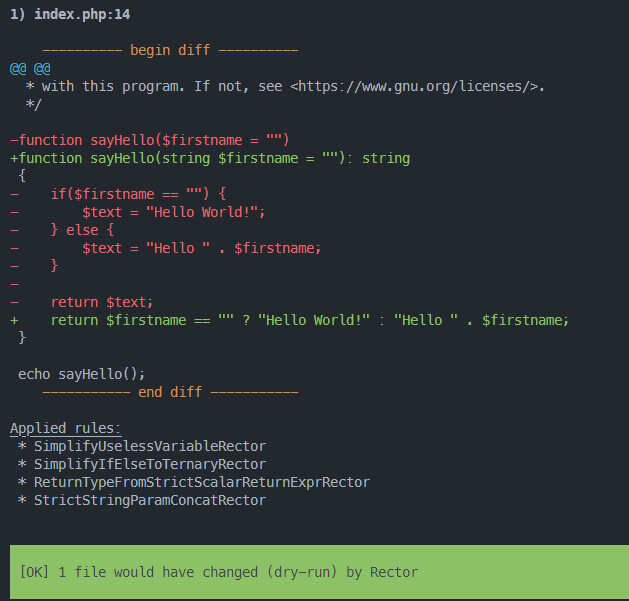

If there was only one, it would be [Rector](https://github.com/rectorphp/rector). **Rector is extremely powerful and brilliant and, you know what, it's free!**

Rector is a tremendous application to scan and automatically upgrade your codebase to a given version of PHP and this means, too, to inspect how you're coding.

Rector will look at every line of code, every loop, every conditional test, every function, every class in a PHP source code and suggest improvements.

In this role, it will not only detect improvements to my code (like a static analysis tool) but, and this is the biggest advantage for me, it will show me how I can become a better developer.

**I REALLY LOVE RECTOR 💕**

<!-- truncate -->

:::tip Rector can be downloaded on GitHub
Don't wait and install [Rector](https://github.com/rectorphp/rector)
:::

Like a lot of people, I learned PHP on my own and that was at the time of PHP 5. Like a lot of people, I certainly picked up some bad habits and because it's impossible to keep up with every evolution of the language, my skills don't increase at the same time as the language.

So, perhaps, I'm still using *old-fashioned* syntax like doing a simple `if ... then ... else` when in fact it's not useful. Maybe I'm going to use a variable to store a value when it's absolutely useless.

Let's take a look at a very simple example (`sayHello.php`):

```php
<?php

function sayHello($firstname = '')
{
    if ($firstname == '') {
        $text = 'Hello World!';
    } else {
        $text = 'Hello ' . $firstname;
    }

    return $text;
}

echo sayHello('Christophe');
```

Simple and effective, isn't it?  And, above all, the code is perfectly functional and well written, respecting all the layout conventions.

:::info I'm an excellent developer. Thank you and goodbye.
Well, in fact, **I was an excellent developer** but I stopped being one ten years ago.
:::

What's wrong with my code?

* `$firstname` is a string no? So why not write `string $firstname`?,
* since PHP 7.x, there is a thing called `ternary operator`; you didn't know that?,
* Using the `ternary operator`; the `$text` variable becomes useless and
* the function is returning a string (the `$text` variable) but the prototype of the function didn't mention this. So why not write `function sayHello($firstname = ''): string`

:::success I'll lend you my friend, my coach, Rector
:::

## Install Rector

When you use composer to manage dependencies in your project, just run `composer require rector/rector --dev` in a console. This will install Rector as a dev-dependency (which is pretty good).

The next thing is to create a configuration file. You can use a standard one (to do this just run `vendor/bin/rector` and the file will be created) or create yours.

I suggest creating a `rector.php` file in your project with this content:

```php
<?php

declare(strict_types=1);

use Rector\Config\RectorConfig;

return RectorConfig::configure()
    ->withSkip(
        [
            '.git', 'node_modules','vendor'
        ]
    )
    ->withPhpSets(php82: true)
    ->withPreparedSets(codeQuality: true, deadCode: true, typeDeclarations: true);
```

For simplicity, create the `rector.php` file in your project's root directory.

## Run Rector

Call your friend, your coach, by just running `vendor/bin/rector process sayHello.php --dry-run rector.php`.



Let's take a look on the command:

* `vendor/bin/rector`: this is the executable to start,
* `process`: the action to run, it's always `process`,
* `sayHello.php`: the file to scan. You can type `.` for your entire project or f.i. `app` when `app` is a folder,
* `--dry-run`: ask Rector to, only, show suggestions and not to update the file and
* `rector.php`: this is the name of our configuration file.

So running `vendor/bin/rector process sayHello.php --dry-run rector.php` is just like to ask **Hey my friend and coach, please take a look to my sayHello.php script and show me how I can improve my syntax and be a better programmer.**  And Rector does it; quickly and without judgment.

He'll show you the changes **he could make**, automatically, and explain why he thinks it's better.

## Applied rules

Take a look on the `Applied rules:` section at the end of the screen capture; here are the rules with a link to their explanations:

* [SimplifyIfElseToTernaryRector](https://github.com/rectorphp/rector/blob/main/docs/rector_rules_overview.md#simplifyifelsetoternaryrector)
* [SimplifyUselessVariableRector](https://github.com/rectorphp/rector/blob/main/docs/rector_rules_overview.md#simplifyuselessvariablerector)
* [ReturnTypeFromStrictScalarReturnExprRector](https://github.com/rectorphp/rector/blob/main/docs/rector_rules_overview.md#returntypefromstrictscalarreturnexprrector)
* [StrictStringParamConcatRector](https://github.com/rectorphp/rector/blob/main/docs/rector_rules_overview.md#strictstringparamconcatrector)

### SimplifyIfElseToTernaryRector

Using the `ternary operator`, we can often replace a `if then else` structure with a one-line test; the `ternary operator`.

```diff
function sayHello($firstname = '')
{
-    if ($firstname == '') {
-        $text = 'Hello World';
-     } else {
-        $text = 'Hello ' . $firstname;
-     }
// highlight-next-line
+    $text = $firstname == '' ? 'Hello World' : 'Hello ' . $firstname;
     return $text;
}
```

### SimplifyUselessVariableRector

I think everyone will agree: storing the value in variable `$text` then returned the variable is useless and it's just pollution.

```diff
function sayHello($firstname = '')
-    $text = $firstname == '' ? 'Hello World' : 'Hello ' . $firstname;
-    return $text;
// highlight-next-line
+    return $firstname == '' ? 'Hello World' : 'Hello ' . $firstname;
};
```

### ReturnTypeFromStrictScalarReturnExprRector

When the return type can be derived (here, Rector understand we're returning a string) then the function prototype can be adapted in this way.

```diff
class SomeClass
{
-    public function sayHello($firstname = '')
// highlight-next-line
+    public function sayHello($firstname = ''): string
    {
        return $firstname == '' ? 'Hello World' : 'Hello ' . $firstname;
    }
}
```

### StrictStringParamConcatRector

When a parameter is a string but not type as a string, Rector see it and suggest updating the prototype as such:

```diff
class SomeClass
{
-    public function sayHello($firstname = ''): string
// highlight-next-line
+    public function sayHello(string $firstname = ''): string
    {
        return $firstname == '' ? 'Hello World' : 'Hello ' . $firstname;
    }
}
```

## Final code

So, back to our console, running `vendor/bin/rector process sayHello.php --dry-run rector.php` will show me, in the console, the new *refactored* version of my code:

```php
<?php

function sayHello(string $firstname = ''): string
{
    return 'Hello ' . ($firstname == '' ? 'World!' : $firstname);
}

echo sayHello();
```

:::important Am I happy with this? Oh yes!!!
Yes, I'm very happy and proud to see how my code is now better and easier to read.

Yes, I'm happy to have learned something and, now, I'll no more use a temporary variable or think to use the ternary operator.

Yes, I'm very grateful to Rector for teaching me these new approaches and making me a better programmer.
:::

## Last thing, make the change

Now that we've taken the time to analyze the rules that could be applied and that we think are perfectly adequate, it's time to start refactoring for real: simply remove the `--dry-run` flag and, thus, the final command to run is: `vendor/bin/rector process sayHello.php rector.php`.

You know what? **I LOVE RECTOR 💕**

Imagine what it could do for my entire project if I run `vendor/bin/rector process . --dry-run rector.php`.

## Learn more

Please visit [https://getrector.com/](https://getrector.com/) and learn more about rules and how to configure the `rector.php` for your project.

There are more than 400 rules right now; see all of them here: [https://getrector.com/documentation/rules-overview](https://getrector.com/documentation/rules-overview)
