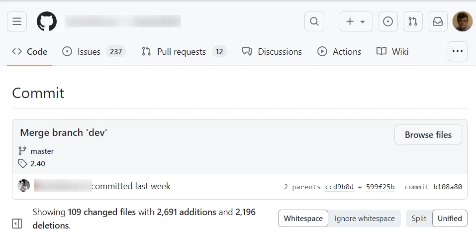
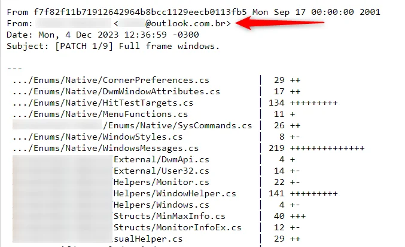

<TLDR>
This article shows three ways to find a GitHub user's email address when it isn't public on their profile: using the [emailaddress.github.io](https://emailaddress.github.io/) web tool, querying the public events API at `api.github.com/users/xxxxxx/events/public`, or appending `.patch` to a commit URL to reveal the committer's email — noting this only works if the user hasn't set their email to private.
</TLDR>

You'd like to get in touch with a GitHub user but, e.g., you don't want to post your question as an issue because, e.g., it's not about a specific repository but more generic.

As a result, the problem can be translated into *How to find the email address linked to a GitHub account*.

Recently, I had this need in order to contact someone with a [Docusaurus](https://docusaurus.io/) blog offering a feature that I couldn't find documented on the web. Their blog wasn't on GitHub, but their other repos were.

<AlertBox variant="note" title="It isn't always possible to retrieve the associated email.">
Indeed, GitHub provides, among other things, an option to make the email private on the user settings page.

</AlertBox>

<!-- truncate -->

## Using web interface

Such a tool exists on the web, like [https://emailaddress.github.io/](https://emailaddress.github.io/). Just copy/paste there and, perhaps, the system will return any used emails associated with this account.

## Using parametrized URL

GitHub provides, in its public API, the list of public events for a given user.

You can retrieve the email using the following URL: `https://api.github.com/users/xxxxxx/events/public`. Just replace `xxxxxx` with the GitHub username whose email you wish to retrieve.

## Based on a last commit

The first thing is, for sure, to go to a public repository maintained by this person and to find a commit, any commit in fact, that they've made.

On the main page of the repo, locate f.i. the last commit ID they've made:

Click on the ID and you'll get a new web page with a URL like f.i. `https://github.com/<USERNAME>/<REPONAME>/commit/<LONG_COMMIT_ID>`. Edit the URL and just append the `.patch` suffix to it (so now, the URL should be `https://github.com/<USERNAME>/<REPONAME>/commit/<LONG_COMMIT_ID>.patch`).

Before the suffix was added, this is what the page looked like:

And once added:

As you can see, the email address associated with the GitHub account used to send the commit is now displayed.
