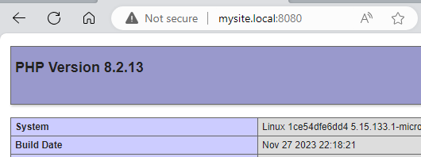

<!-- cspell:ignore allnodes,allrouters,localnet,mcastprefix -->


When you're running a Docker container on a different network than the standard one (called `bridge`) and **you wish to run a second container that needs to access the first container, you need to run the second container on the same network.**

Let's say, you're running a MySQL database on a network called `my_network` and you wish to be able start a second container like [phpMyAdmin](https://hub.docker.com/_/phpmyadmin) and get access to the database, then you need to use the `--network` CLI option when running the second container using `docker run`.

Now, imagine the first container is a web application and the second container should be able to access his web page and, too, reusing the same alias?

<!-- truncate -->

## Some preparation work

:::note Skip this step if you already have a dedicated network and his running container
If you don't already have a running web application on his own network, please follow this step.
:::

Please start a Linux shell and run `mkdir -p /tmp/network && cd $_` to create a folder called `network` in your Linux temporary folder and jump in it.

Please then create a `index.php` file in that folder with this content:

<Snippet filename="index.php">

```php
<?php

phpinfo();
```

</Snippet>

Here is the content of your current directory:

<Terminal>
$ pwd
/tmp/network

$ ls -alh
total 920K
drwxr-xr-x  2 christophe christophe 4.0K Feb 20 18:15 .
drwxrwxrwt 23 root       root       908K Feb 20 18:15 ..
-rw-r--r--  1 christophe christophe   18 Feb 20 18:15 index.php
</Terminal>

Since we need a Docker network, please create one:

<Terminal>
$ docker network create my_network
1df43879fbfc2b328bf36f9205c68168e45a88cea481bc244fab94ff04486da7
</Terminal>

And run the script using `docker run -d -p 8080:80 -u ${UID}:${GID} -v "$PWD":/var/www/html --network my_network php:8.2-apache`.

That command will run a Apache container and we can surf to our local website using `http://127.0.0.1:8080`


## Creating our second container

Now, we can create a second container and just try to `curl` our website.

Please create a file called `Dockerfile` with the content below. We'll use a very small Linux image and we'll install `curl` in the image.

<Snippet filename="Dockerfile">

```docker
FROM alpine:3.14

RUN apk update && apk add curl
```

</Snippet>

And a second file called `compose.yaml` with this content:

<Snippet filename="compose.yaml">

```yaml
services:
  my_second_container:
    build:
      context: .
```

</Snippet>

To make things clear, here is the content of our current directory:

<Terminal>
$ ls -alh
total 920K
drwxr-xr-x  2 christophe christophe 4.0K Feb 20 18:15 .
drwxrwxrwt 23 root       root       908K Feb 20 18:15 ..
-rw-r--r--  1 christophe christophe   18 Feb 20 18:25 Dockerfile
-rw-r--r--  1 christophe christophe   18 Feb 20 18:25 compose.yaml
-rw-r--r--  1 christophe christophe   18 Feb 20 18:15 index.php
</Terminal>

We need to create our image. To do this, simply run `docker compose build`.

Then we'll start an interactive bash shell in our second container and we'll try to access to our local website:

<Terminal>
$ docker compose run -it --rm --entrypoint /bin/sh my_second_container

$ curl http://127.0.0.1:8080
curl: (7) Failed to connect to 127.0.0.1 port 8080 after 0 ms: Couldn't connect to server
</Terminal>

:::danger It's not working... **as expected**
We can confirm our container is not able to access to our local site `http://127.0.0.1:8080` while, that website is well configured. If you exit the container and try to refresh the website, it's working well.
:::

### We need to run the second container on the same network

:::tip Retrieve the network used by a container
In case you don't know the name of the used network, simply run `docker inspect xxxx` where `xxxx` is the name of the container. You'll get a JSON answer with a `Networks` entry. To get more information, please read the <Link to="/blog/docker-inspect">Docker inspect - Retrieve network's information</Link> article.
:::

Please edit your `compose.yaml` file like this:

<Snippet filename="compose.yaml">

```yaml
services:
  my_second_container:
    build:
      context: .
    //highlight-next-line
    networks:
      //highlight-next-line
      - my_network

//highlight-next-line
networks:
  //highlight-next-line
  my_network:
    //highlight-next-line
    external: true
```

</Snippet>

:::tip To be able to access to a dockerized application, containers should be fired on the same network
It is impossible for a container running on, f.i., the `bridge` (default) network to access to a container running on another network. This is a protection against unwanted access. *Replace `my_network` by yours if you've a different one.*
:::

### We need to find the IP of the network

But, there is something else to do now: we need to obtain the **Gateway IP address of the network.**

Back on your machine (not from inside the container), please run:

<Terminal>
$ {`docker network inspect -f '\{\{json .IPAM.Config}}' 'my_network'`}
[\{"Subnet":"172.20.0.0/16","Gateway":"172.20.0.1"}]
</Terminal>

The IP we need is `172.20.0.1` (`Gateway`) as illustrated above.

### Try again

Now, we can try again, please start an interface shell once more. It'll still not work with the local `127.0.0.1` IP but well, now, using the **Gateway IP address of the network**:

<Terminal>
$ docker compose run -it --rm --entrypoint /bin/sh my_second_container

$ curl http://127.0.0.1:8080
curl: (7) Failed to connect to 127.0.0.1 port 8080 after 0 ms: Couldn't connect to server
$ curl http://172.20.0.1:8080
</Terminal>

```html
<!DOCTYPE html PUBLIC "-//W3C//DTD XHTML 1.0 Transitional//EN" "DTD/xhtml1-transitional.dtd">
<html xmlns="http://www.w3.org/1999/xhtml"><head>
<style type="text/css">
body {background-color: #fff; color: #222; font-family: sans-serif;}
pre {margin: 0; font-family: monospace;}
```

:::success Now it's working
And now, since we've started the second container on the same network, it works.
:::

### Extra use case - aliases

And now the final part, imagine you've defined an alias in the hosts file (for Windows, in file `C:\Windows\System32\drivers\etc\hosts`).

Imagine you've create an alias like:

<Snippet filename="C:\Windows\System32\Drivers\etc\hosts">

```ini
127.0.0.1 localhost
// highlight-next-line
127.0.0.1 mysite.local
```

</Snippet>

and thus, on your host, you're not using `http://127.0.0.1:8080` but `http://mysite.local:8080`



If we try to access it from inside the second container, it didn't work:

<Terminal>
$ docker compose run -it --rm --entrypoint /bin/sh my_second_container

$ curl http://my_site.local:8080
curl: (6) Could not resolve host: my_site.local
</Terminal>

And **this is normal** since `my_site.local` is an alias defined on your host machine; not in the container:

<Terminal>
$ docker compose run -it --rm --entrypoint /bin/sh my_second_container

$ cat /etc/hosts
127.0.0.1       localhost
::1     localhost ip6-localhost ip6-loopback
fe00::0 ip6-localnet
ff00::0 ip6-mcastprefix
ff02::1 ip6-allnodes
ff02::2 ip6-allrouters
172.20.0.3      5e9e2debaf79
</Terminal>

The last thing we need to do in this case is to edit our `compose.yaml` file and add the `extra_hosts` property:

<Snippet filename="compose.yaml">

```yaml
services:
  my_second_container:
    build:
      context: .
    networks:
      - my_network
    //highlight-next-line
    extra_hosts:
      //highlight-next-line
      - "my_site.local:172.20.0.1"

networks:
  my_network:
    external: true
```

</Snippet>

Now, we can jump in the container for the last time, check the `/etc/hosts` file, we can now see our alias and thus, by running `curl http://mysite.local:8080` it will work.

<Terminal>
$ docker compose run -it --rm --entrypoint /bin/sh my_second_container

$ cat /etc/hosts

127.0.0.1       localhost
::1     localhost ip6-localhost ip6-loopback
fe00::0 ip6-localnet
ff00::0 ip6-mcastprefix
ff02::1 ip6-allnodes
ff02::2 ip6-allrouters
172.20.0.1      my_site.local

$ curl http://my_site.local:8080
</Terminal>

```html
<!DOCTYPE html PUBLIC "-//W3C//DTD XHTML 1.0 Transitional//EN" "DTD/xhtml1-transitional.dtd">
<html xmlns="http://www.w3.org/1999/xhtml"><head>
<style type="text/css">
body {background-color: #fff; color: #222; font-family: sans-serif;}
pre {margin: 0; font-family: monospace;}
[...]
```

## Conclusion

1. To be able to access to a dockerized application from inside a second Docker container, both should be fired on the same network and
2. To be able to reuse the same alias on the host and inside a Docker container, we need to use the `extra_hosts` property to ask Docker to create these aliases automatically for us in the `/etc/hosts` file.
