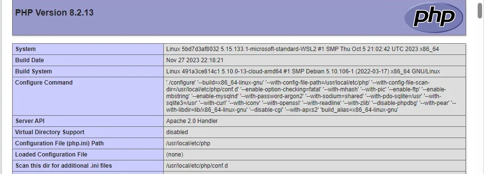
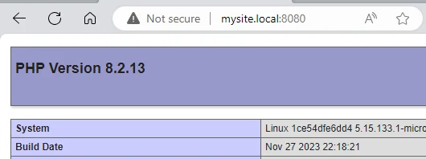

<!-- cspell:ignore allnodes,allrouters,localnet,mcastprefix -->


<TLDR>
This article explains why one Docker container can't reach another unless both run on the same Docker network, walking through creating a shared network, finding its gateway IP with `docker network inspect`, and connecting a second container to it via `compose.yaml`. It also shows how to reuse a host-side hosts-file alias inside a container with the `extra_hosts` property.
</TLDR>

When you're running a Docker container on a different network than the standard one (called `bridge`) and **you wish to run a second container that needs to access the first container, you need to run the second container on the same network.**

Let's say, you're running a MySQL database on a network called `my_network` and you wish to be able start a second container like [phpMyAdmin](https://hub.docker.com/_/phpmyadmin) (see <Link to="/blog/docker-adminer-pgadmin-phpmyadmin">Using Adminer, pgadmin or phpmyadmin to access your Docker database container</Link>) and get access to the database, then you need to use the `--network` CLI option when running the second container using `docker run`.

Now, imagine the first container is a web application and the second container should be able to access its web page and, too, reuse the same alias?

<!-- truncate -->

## The two-line fix

Here is the whole answer, at the top of the article rather than at the end. Add `extra_hosts` to the service that needs to reach your host alias:

<Snippet filename="compose.yaml" source="./files/compose.part3.yaml" />

Jump into the container and look at what Docker did with it:

<Terminal typewriter source="./files/terminal-1.txt" />

```html
<!DOCTYPE html PUBLIC "-//W3C//DTD XHTML 1.0 Transitional//EN" "DTD/xhtml1-transitional.dtd">
<html xmlns="http://www.w3.org/1999/xhtml"><head>
<style type="text/css">
body {background-color: #fff; color: #222; font-family: sans-serif;}
pre {margin: 0; font-family: monospace;}
[...]
```

The alias `my_site.local` is now a real line in the container's `/etc/hosts`, and `curl http://my_site.local:8080` returns the page served by the *other* container.

## Why it works

- **Both containers must share a network.** A container on the default `bridge` network simply cannot reach a container running on another one — that's a protection, not a bug.
- **`172.20.0.1` is the gateway of that network**, i.e. the address from which containers see your host machine. It's the value we'll retrieve with `docker network inspect` further down.
- **Your host's hosts file is invisible from inside a container.** `extra_hosts` is the way to re-declare the alias where the container can see it: Docker writes the line into `/etc/hosts` at startup.

The rest of this article builds the whole scenario from scratch, including the two failures you'd hit on the way.

## Some preparation work

<AlertBox variant="note" title="Skip this step if you already have a dedicated network and its running container">
If you don't already have a running web application on its own network, please follow this step.

</AlertBox>

Please start a Linux shell and run `mkdir -p /tmp/network && cd $_` to create a folder called `network` in your Linux temporary folder and jump in it.

Please then create a `index.php` file in that folder with this content:

<Snippet filename="index.php" source="./files/index.php" />

Here is the content of your current directory:

<Terminal typewriter source="./files/terminal-5.txt" />

Since we need a Docker network, please create one:

<Terminal typewriter>
$ docker network create my_network
1df43879fbfc2b328bf36f9205c68168e45a88cea481bc244fab94ff04486da7
</Terminal>

And run the script using `docker run -d -p 8080:80 -u $(id -u):$(id -g) -v "$PWD":/var/www/html --network my_network php:8.2-apache`.

That command will run an Apache container and we can surf to our local website using `http://127.0.0.1:8080`



## Creating our second container

Now, we can create a second container and just try to `curl` our website.

Please create a file called `Dockerfile` with the content below. We'll use a very small Linux image and we'll install `curl` in the image.

<Snippet filename="Dockerfile" source="./files/Dockerfile" />

And a second file called `compose.yaml` with this content:

<Snippet filename="compose.yaml" source="./files/compose.yaml" />

To make things clear, here is the content of our current directory:

<Terminal typewriter source="./files/terminal-4.txt" />

We need to create our image. To do this, simply run `docker compose build`.

Then we'll start an interactive bash shell in our second container and we'll try to access our local website:

<Terminal typewriter>
$ docker compose run -it --rm --entrypoint /bin/sh my_second_container

$ curl http://127.0.0.1:8080
curl: (7) Failed to connect to 127.0.0.1 port 8080 after 0 ms: Couldn't connect to server
</Terminal>

## When it doesn't work (and why)

<AlertBox variant="danger" title="It's not working... **as expected**">
We can confirm our container is not able to access our local site `http://127.0.0.1:8080` while that website is well configured. If you exit the container and try to refresh the website, it's working well.

</AlertBox>

### We need to run the second container on the same network

<AlertBox variant="info" title="Retrieve the network used by a container">
In case you don't know the name of the used network, simply run `docker inspect xxxx` where `xxxx` is the name of the container. You'll get a JSON answer with a `Networks` entry. To get more information, please read the <Link to="/blog/docker-inspect">Docker inspect - Retrieve network's information</Link> article.

</AlertBox>

Please edit your `compose.yaml` file like this:

<Snippet filename="compose.yaml" source="./files/compose.part2.yaml" />

*Replace `my_network` by yours if you've a different one.*

### We need to find the IP of the network

But, there is something else to do now: we need to obtain the **Gateway IP address of the network.**

Back on your machine (not from inside the container), please run:

<Terminal typewriter>
$ {`docker network inspect -f '\{\{json .IPAM.Config}}' 'my_network'`}
[\{"Subnet":"172.20.0.0/16","Gateway":"172.20.0.1"}]
</Terminal>

The IP we need is `172.20.0.1` (`Gateway`) as illustrated above.

### Try again

Now, we can try again, please start an interface shell once more. It'll still not work with the local `127.0.0.1` IP but well, now, using the **Gateway IP address of the network**:

<Terminal typewriter source="./files/terminal-3.txt" />

```html
<!DOCTYPE html PUBLIC "-//W3C//DTD XHTML 1.0 Transitional//EN" "DTD/xhtml1-transitional.dtd">
<html xmlns="http://www.w3.org/1999/xhtml"><head>
<style type="text/css">
body {background-color: #fff; color: #222; font-family: sans-serif;}
pre {margin: 0; font-family: monospace;}
```

## Extra use case - aliases

And now the final part, imagine you've defined an alias in the hosts file (for Windows, in file `C:\Windows\System32\drivers\etc\hosts`).

Imagine you've created an alias like:

<Snippet filename="C:\Windows\System32\Drivers\etc\hosts" source="./files/C:\Windows\System32\Drivers\etc\hosts" />

and thus, on your host, you're not using `http://127.0.0.1:8080` but `http://mysite.local:8080`



If we try to access it from inside the second container, it doesn't work:

<Terminal typewriter>
$ docker compose run -it --rm --entrypoint /bin/sh my_second_container

$ curl http://my_site.local:8080
curl: (6) Could not resolve host: my_site.local
</Terminal>

And **this is normal** since `my_site.local` is an alias defined on your host machine; not in the container:

<Terminal typewriter source="./files/terminal-2.txt" />

The last thing we need to do in this case is to edit our `compose.yaml` file and add the `extra_hosts` property — the two lines shown at the very beginning of this article, now with the gateway IP we retrieved above. Jump in the container one last time, `cat /etc/hosts`, and the alias is there: `curl http://my_site.local:8080` works.

## Conclusion

The alias you've been typing for months in your browser is a host-machine thing. Nothing carries it into a container, and nothing tells you that's the problem — you just get `Could not resolve host` and start doubting your network. Two lines of `extra_hosts` pointing at the network gateway close the gap, and your `compose.yaml` now documents that dependency for whoever clones the project next.

When everything looks correctly configured and the connection still fails, <Link to="/blog/docker-networking-troubleshooting">Troubleshooting for Docker containers - Accessing the other one</Link> walks through the diagnosis layer by layer.
