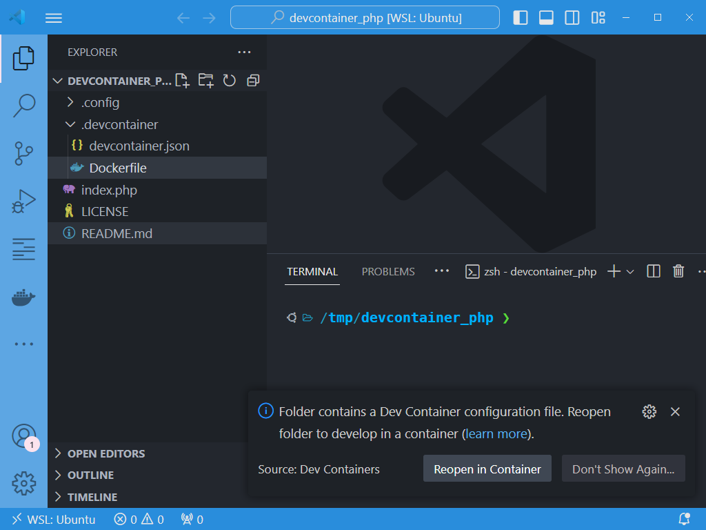

This article is the very short and straightforward version of <Link to="/blog/vscode-devcontainer">PHP development in a devcontainer with preinstalled code quality tools</Link>. If you just want to follow a very few steps and get your PHP environment, this article is for you.

<StepsCard
  title="By following steps describe in this article, you'll obtain"
  variant="steps"
  steps={[
    'A Docker PHP environment so you can code using vscode,',
    'The PHP `composer` package manager installed,',
    'A few static analysis tool like `php-cs-fixer`, `phpcs`, `phpcbf`, `sonarlint` and `Rector` installed',
    'A devcontainer ready-to-use environment.',
  ]}
/>

Just follow the guide...

:::important The aim of this article is to create a development environment (aka devcontainer)
Please refers to my other articles about <Link to="/blog/tags/docker">Docker</Link> to see how to Dockerize the application and be able to run the application using <Link to="/blog/tags/apache">Apache</Link> and a database service like <Link to="/blog/tags/postgresql">PostgreSQL</Link>.
:::

<!-- truncate -->

## You have nothing and wish to create a fully new project

### 1. Install the php_devcontainer skeleton

For this blog article, I'll create a temporary folder in `/tmp/devcontainer_php`. Don't hesitate to update the path to something like `~/my_project` to match your need.

<Terminal>
$ mkdir /tmp/devcontainer_php && cd $_
$ curl -LOJ --silent https://github.com/cavo789/php_devcontainer/archive/refs/heads/main.tar.gz
$ tar -xzvf php_devcontainer-main.tar.gz --strip-components 1 && rm -f php_devcontainer-main.tar.gz
</Terminal>

:::note Download a specific version
If you don't want to download the latest version but a given one, specify the tags like: `curl -LOJ --silent https://github.com/cavo789/php_devcontainer/archive/refs/tags/1.0.0.tar.gz`.
:::

You've thus download code from my [https://github.com/cavo789/php_devcontainer](https://github.com/cavo789/php_devcontainer) repo in your folder.

### 2. Open VSCode

Start VSCode on your machine:

<Terminal>
$ cd /tmp/devcontainer_php
$ code .
</Terminal>

### 3. Switch to the Dev Container

VSCode will automatically suggest opening a Dev Container. Click on the `Reopen in Container` button.

.

If you don't have this popup, just press <kbd>CTRL</kbd>+<kbd>SHIFT</kbd>+<kbd>P</kbd> to open the **Command Palette** and search for `Dev Containers: Rebuild and Reopen in Dev Container` and click on it.

VSCode will now take a while to build the Docker image then start a Docker container before you can work. It can take a few minutes depending on the speed of your machine.

### You are ready to use tools

For instance, press <kbd>CTRL</kbd>+<kbd>ù</kbd> to open the **Terminal** pane and type there `/usr/local/bin/php-cs-fixer.phar fix --config /var/www/html/.config/.php-cs-fixer.php index.php` to run [PHP-CS-Fixer](https://github.com/PHP-CS-Fixer/PHP-CS-Fixer).

You can also run `/usr/local/bin/phpcbf.phar --standard=/var/www/html/.config/phpcs.xml /var/www/html/index.php` for reformating your code using [PHP_CodeSniffer](https://github.com/squizlabs/PHP_CodeSniffer).

You can run [Rector](https://github.com/rectorphp/rector) too by running `vendor/bin/rector process index.php --config .config/rector.php`.

As you can see, in just three actions you've downloaded and installed a functional PHP environment using Docker and VSCode.

## You already have an existing project

In a real-life use case, you already have a PHP project.

Start a terminal and open the folder where you've your codebase.

For this blog post, I'll download a very old learning Laravel codebase I've done years ago:

<Terminal>
$ cd /tmp
$ git clone https://github.com/cavo789/laravel_todos.git
</Terminal>

So, my project will be in folder `/tmp/laravel_todos`.

In my project folder, now, I'll run:

<Terminal>
$ cd /tmp/laravel_todos
$ curl -LOJ --silent https://github.com/cavo789/php_devcontainer/archive/refs/tags/1.0.0.tar.gz
$ tar -xzvf php_devcontainer-1.0.0.tar.gz --strip-components 1 && rm -f php_devcontainer-1.0.0.tar.gz
</Terminal>

This will download the PHP devcontainer files in my project.

I will run `code .` to open VSCode and like before, VSCode will suggests opening the folder in a Dev Container. Let's do this.

And voilà, I've Dockerized my PHP coding environment. In my case, I've made `Laravel Todos` in 2018, using PHP 7.1.3 and Laravel 5.x; an eternity then.

And like in the previous chapter, I can run the commands below to fix coding style issues and fixes all files in my repo:

<Terminal>
$ /usr/local/bin/php-cs-fixer.phar fix --config /var/www/html/.config/.php-cs-fixer.php .
$ /usr/local/bin/phpcbf.phar --standard=/var/www/html/.config/phpcs.xml .
</Terminal>

And I **will be able** to run Rector to refactor my entire codebase:

<Terminal>
$ composer require rector/rector --dev
$ vendor/bin/rector process . --config .config/rector.php
</Terminal>

but in my case, I can't right now because my Laravel Todos is an old one and I need first to make some changes to my `composer.json` file (upgrading PHP and Laravel versions first).
