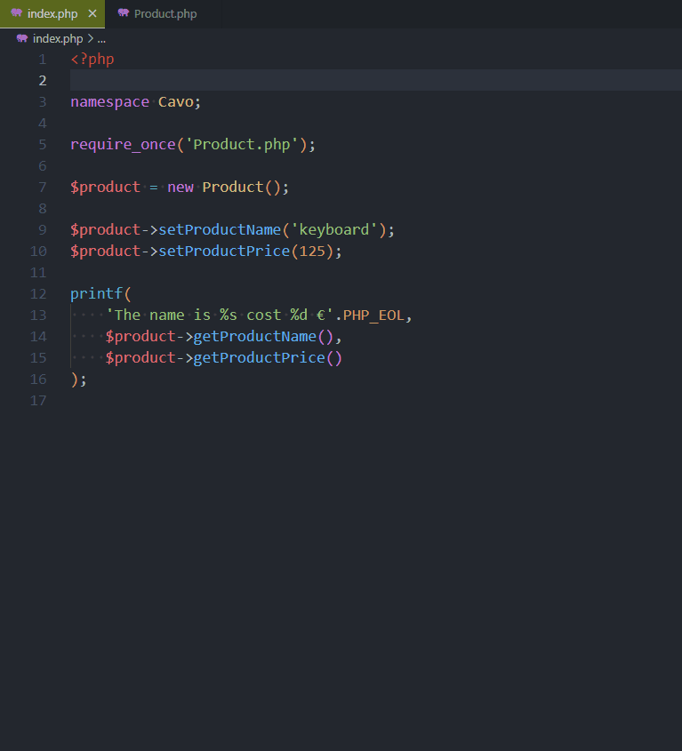
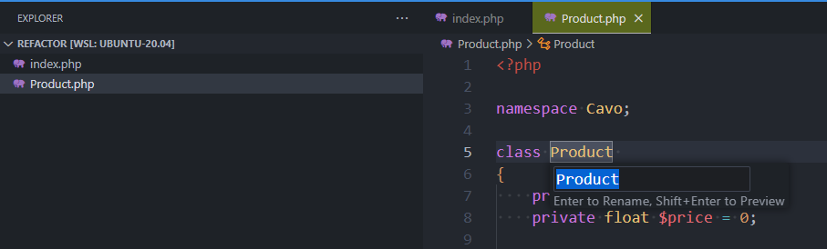
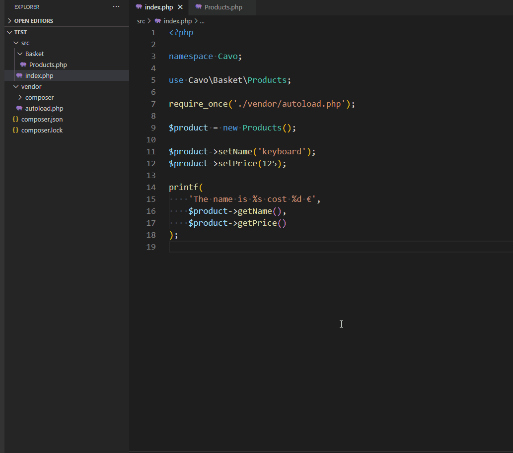
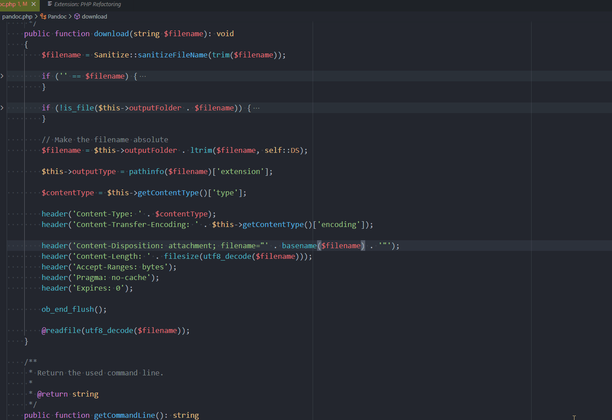

Currently, end of February 2024, there aren't many free refactoring extensions for PHP under VSCode. We'll take a look to [PHP Refactor Tool](https://marketplace.visualstudio.com/items?itemName=st-pham.php-refactor-tool) and [PHP Refactoring](https://marketplace.visualstudio.com/items?itemName=marsl.vscode-php-refactoring).

We'll learn how to rename a symbol, a class and, even better, how to extract a portion of a long method into a new one.

<!-- truncate -->

## Create sample files

For the demo, please start a Linux shell and run `mkdir -p /tmp/refactor && cd $_` to create a folder called `refactor` in your Linux temporary folder and jump in it.

Please create two php files. The first one will be called `index.php` and will contain this code:

```php
<?php

namespace Cavo;

require_once('Product.php');

$product = new Product();

$product->setProductName('keyboard');
$product->setProductPrice(125);

printf(
    'The name is %s cost %d €'.PHP_EOL,
    $product->getProductName(),
    $product->getProductPrice()
);
```

The second file `Product.php` will contain:

```php
<?php

namespace Cavo;

class Product
{
    private string $productName = '';
    private float $productPrice = 0;

    public function __construct(string $name='', float $price=0)
    {
        $this->setProductName($name);
        $this->setProductPrice($price);
    }

    public function getProductName(): string {
        return $this->productName;
    }

    public function setProductName(string $name): void {
        $this->productName = $name;
    }

    public function getProductPrice(): float {
        return $this->productPrice;
    }

    public function setProductPrice(float $price): void {
        $this->productPrice = $price;
    }
}
```

### Run the example

Run `docker run -it --rm -v "${PWD}":/project -w /project php:8.2 php index.php` to run our example in the console.

You'll get, as expected:

```bash
❯ docker run -it --rm -v "$PWD":/project -w /project php:8.2 php index.php

The name is keyboard cost 125 €
```

## Refactoring

Make sure `PHP Refactor Tool` is installed. Go to the list of extensions in VSCode (press <kbd>CTRL</kbd>-<kbd>SHIFT</kbd>-<kbd>X</kbd>) and search for `PHP Refactor Tool`. Install the one of `Son Tung PHAM` (the author).

### Rename a symbol

The illustration below is showing a sample `index.php` script using a class defined in `Product.php`.

Everything is working fine but, yeah, functions are called `getProductName` and `getProductPrice` and it's quite overqualified: our object is `$product` so, yes, `$product->getProductName()` and `$product->getProductPrice()` can be rewritten to `$product->getName()` and `$product->getPrice()`. The smaller the best.

So, we need to rename our functions.

By opening our `Product.php` file, we can do it manually but ... don't do this because you'll need to update every single file manually using your `Product` class and if you forgot just one use, your code will be broken.

The rename feature serves this objective. You just need to select a property like `productName` as illustrated in the animation, press <kbd>F2</kbd> and rename it.

Let's do it and see how it works:

1. Open the `Product.php` file, put the cursor on the word `productName` in line 7 `private string $productName = '';`,
2. Press <kbd>F2</kbd> (or choose Rename Symbol in the Command palette (press <kbd>CTRL</kbd>-<kbd>SHIFT</kbd>-<kbd>P</kbd>)) and type the new name f.i. `name` (instead of `productName`),
3. VSCode will display a small list at the top of the screen, just validate i.e. select `Update Getter name and Setter name`.
4. Do the same for `productPrice` and rename it to `price`.

The new `Product.php` file is now:

```php
<?php

namespace Cavo;

class Product
{
    private string $name = '';
    private float $price = 0;

    public function __construct(string $name='', float $price=0)
    {
        $this->setName($name);
        $this->setPrice($price);
    }

    public function getName(): string {
        return $this->name;
    }

    public function setName(string $name): void {
        $this->name = $name;
    }

    public function getPrice(): float {
        return $this->price;
    }

    public function setPrice(float $price): void {
        $this->price = $price;
    }
}
```

But the very cool thing is that `index.php` has been automatically updated. Open `index.php` and check:

```php
<?php

namespace Cavo;

require_once('Product.php');

$product = new Product();

$product->setName('keyboard');
$product->setPrice(125);

printf(
    'The name is %s cost %d €'.PHP_EOL,
    $product->getName(),
    $product->getPrice()
);
```

By running `docker run -it --rm -v "${PWD}":/project -w /project php:8.2 php index.php`, it's still working.

:::success You've refactored our code without breaking it. Congratulations!
:::

The same thing in pictures:



### Rename a class

For the example, reopen the `Product.php` file and, on line 5, put the cursor on the word `Product`. Press <kbd>F2</kbd> and rename to `Products` (plural form).

As we can expect, the class name has been updated but the filename too. And, once again, if you open the `index.php` file, you can see that `$product = new Product();` has been perfectly changed to `$product = new Products();`.



:::info You can also rename from index.php
Locate the `$product = new Product();` line in your `index.php` file. Put the cursor on the `Product` word, press <kbd>F2</kbd> and rename it. This work too i.e. the class will be updated too in `Products.php` (since the file has been renamed too). Nice!
:::



:::caution Don't rename the file
Renaming the file from the Explorer won't refactor the code. So, don't go to the `Explorer`, click on `Product.php` and rename it. This will not refactor the code. Avoid!
:::

### Extract to a new method

The third very nice method is the `Extract method` from [PHP Refactoring](https://marketplace.visualstudio.com/items?itemName=marsl.vscode-php-refactoring).

Consider the following example (the code isn't running, it's just for the illustration). Create a new file called `Pandoc.php` with this content:

```php
<?php

namespace Avonture;

class Pandoc
{
    public function download(string $filename): void
    {
        $filename = Sanitize::sanitizeFileName(trim($filename));

        if ('' == $filename) {
            throw new PandocFileNotSpecified();
        }

        if (!is_file($this->outputFolder . $filename)) {
            throw new PandocFileNotFound($filename);
        }

        // Make the filename absolute
        $filename = $this->outputFolder . ltrim($filename, self::DS);

        $this->outputType = pathinfo($filename)['extension'];

        $contentType = $this->getContentType()['type'];

        header('Content-Type: ' . $contentType);
        header('Content-Transfer-Encoding: ' . $this->getContentType()['encoding']);

        header('Content-Disposition: attachment; filename="' . basename($filename) . '"');
        header('Content-Length: ' . filesize(utf8_decode($filename)));
        header('Accept-Ranges: bytes');
        header('Pragma: no-cache');
        header('Expires: 0');

        ob_end_flush();

        @readfile(utf8_decode($filename));
    }
}
```

The `download` function didn't respect the single-responsibility concept. We've made a few initializations and assertions. Can we do better? Yes, we can extract the lines concerning the browser and create a new `sendToBrowser` function but instead of doing it manually, we'll use the `Extract` feature.

See the animation below:



:::tip Did you have noticed the use of input parameters?
In the lines we're moving, there are variables like `contentType` and `filename` that are not part of the new method. These variables are still local in our first, `download` method.

And, as you can see, during the creation of the new method, these two local variables have been added to the definition of the new function. Nice feature.
:::

## Other extensions

* 💀 😒 [PHP Refactor](https://marketplace.visualstudio.com/items?itemName=tintrinh.php-refactor) also exists but the last time it was updated by the author was in 2019, four years ago, and the extract feature isn't working fine; just move along.
* 💲😒 [PHP Tools for Visual Studio Code](https://marketplace.visualstudio.com/items?itemName=DEVSENSE.phptools-vscode) from **DEVSENSE** is a freemium addon (refactoring features are only in the paid version). The rename symbol feature is a paid one while it's free with [PHP Refactor Tool](https://marketplace.visualstudio.com/items?itemName=st-pham.php-refactor-tool). **Don't install `PHP Tools for Visual Studio Code` since, then, it'll override `PHP Refactor Tool` <kbd>F2</kbd> function and will breake it.** (see my issue [Devsense - All-In-One conflicts](https://github.com/st-pham/php-refactor-tool/issues/16))
