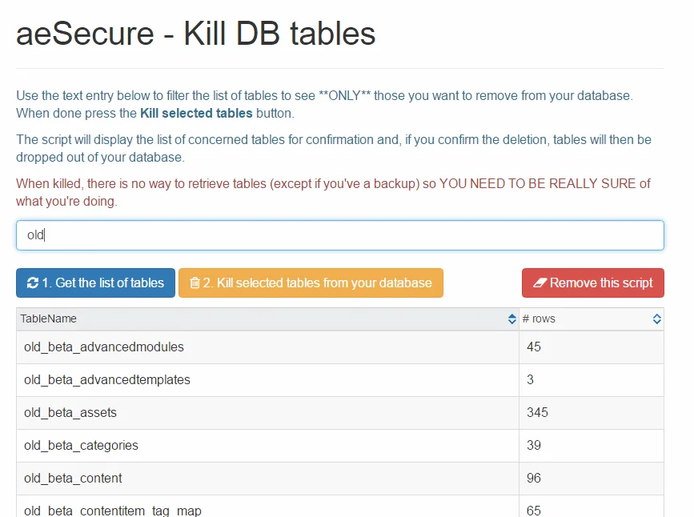

A recent [post](https://forum.joomla.fr/forum/joomla-4-x-aa/questions-g%C3%A9n%C3%A9rales-aa/2060596-deux-pr%C3%A9fixes-de-tables) on the Joomla French forum was asking for being able to delete tables present in the Joomla database; the ones using a given prefix like `old_` or something like that.

Indeed, from time to time, it can be useful to take a look on the list of tables in your database and perhaps, you'll find tables prefixed with f.i. `old_` or an old tool you've used years ago (using the correct prefix but with a component you've removed since like `joomla_oldcomp`).

Years ago, I've written such PHP utility, let's see how to use it.

<!-- truncate -->

1. Click on the link [https://github.com/cavo789/joomla_free/blob/master/src/kill_db_tables/kill_db_tables.php](https://github.com/cavo789/joomla_free/blob/master/src/kill_db_tables/kill_db_tables.php) to get a copy of my PHP utility,
2. Copy/download the script and using your FTP client, upload the script to your Joomla site, in the same directory as your `configuration.php` file. Name the script like, f.i., `delete_tables.php`,
3. Open your internet browser and go to the URL of your website and access to the `delete_tables.php` so f.i. `https://yoursite.com/delete_tables.php`
4. You'll get a screen like below. In the text field, just start to type your prefix and you'll get a list of tables using that prefix. Once you're sure, just click on the `Kill selected tables` button.
5. Finally, be sure to click on the `Remove this script` button since the script shouldn't stay there.

<AlertBox variant="highlyImportant" title="Make sure to click on `Remove this script`." />

<AlertBox variant="highlyImportant" title="Make sure you know what you're doing and to have a database backup, just in case." />
